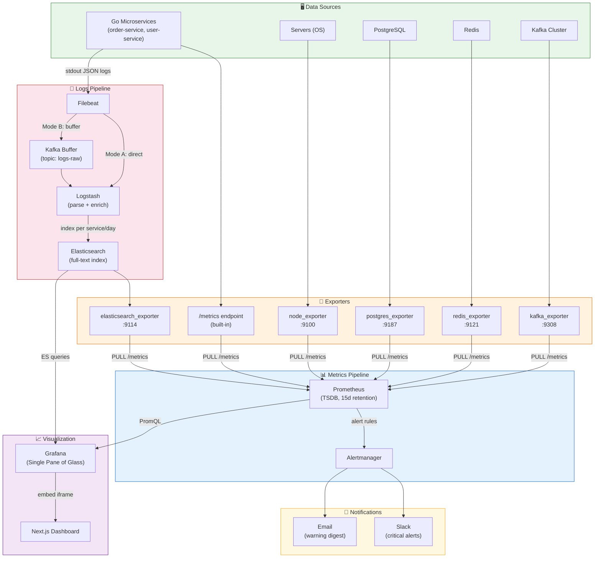
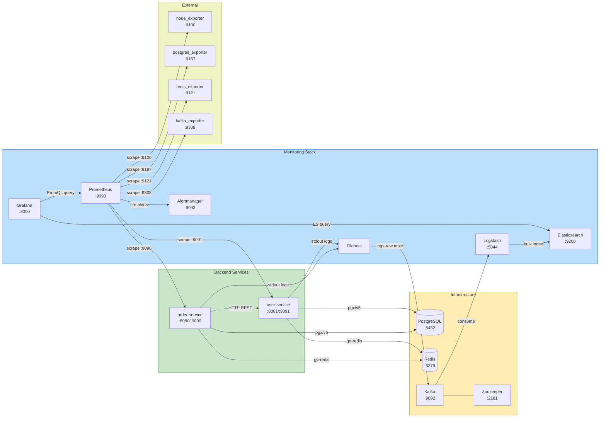
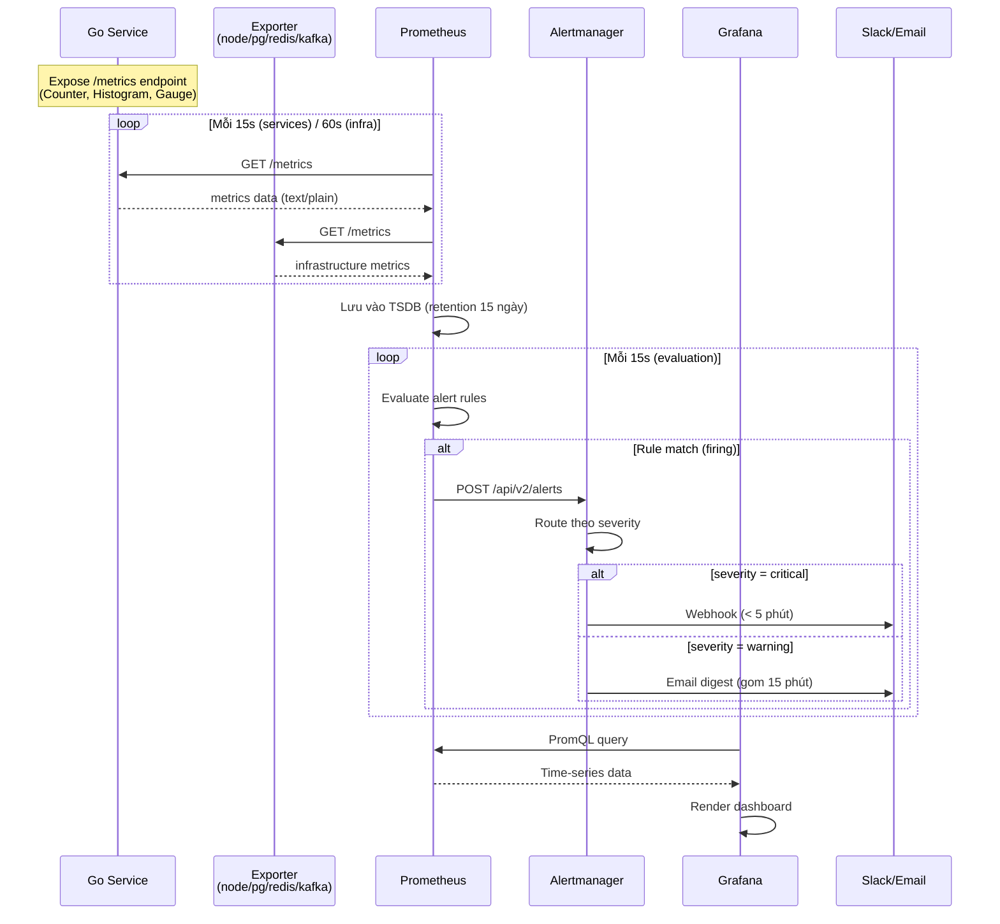
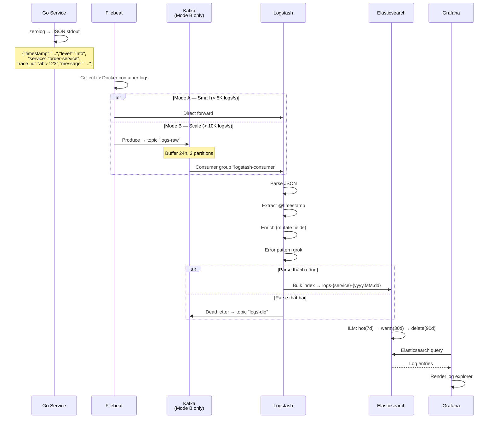
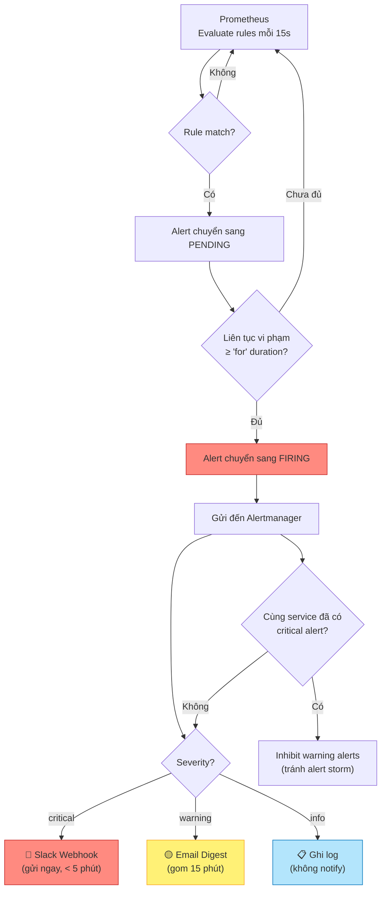
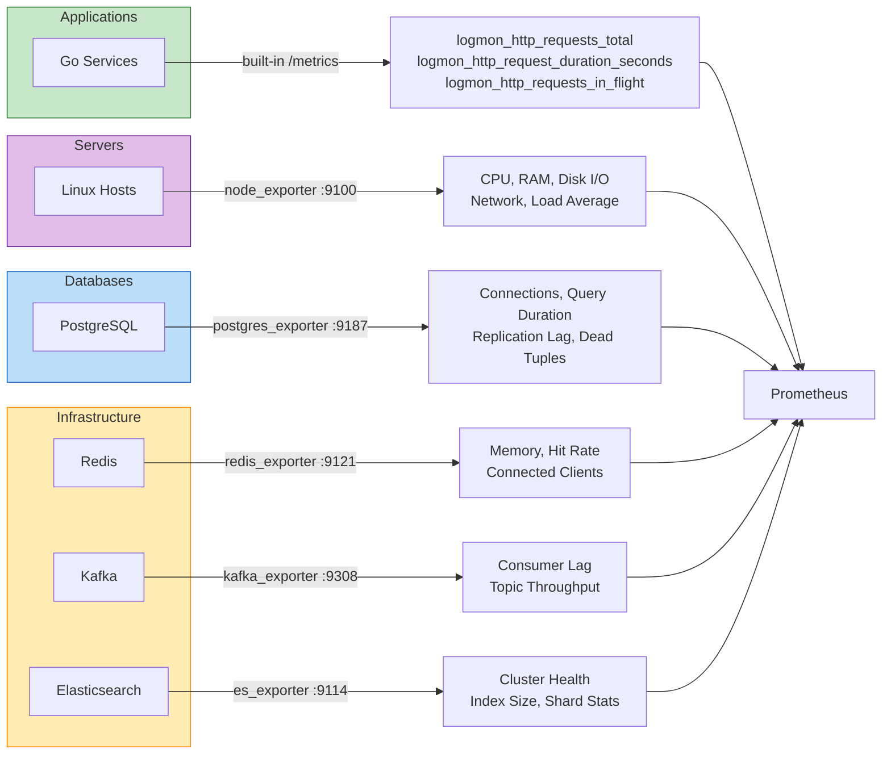
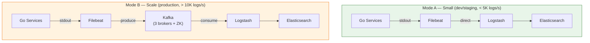

# Hệ Thống Logging & Monitoring (LogMon)

> **Dự án:** `logmon` — Logging & Monitoring Platform cho Microservices
> **Mục tiêu:** Thu thập, lưu trữ, trực quan hóa metrics & logs từ hệ thống microservices; cảnh báo tự động khi có sự cố
> **Cập nhật:** 2026-03-17

---

## 1. Tổng Quan Hệ Thống

LogMon là nền tảng observability tập trung, cung cấp khả năng:

- **Metrics Collection**: Thu thập số liệu hiệu suất (CPU, RAM, request rate, latency...) theo thời gian thực
- **Log Aggregation**: Tập trung logs từ tất cả microservices, parse & index để tìm kiếm nhanh
- **Alerting**: Phát hiện bất thường và thông báo qua Slack/Email
- **Visualization**: Dashboard tập trung cho DevOps, Developer, SRE

### Tech Stack

| Layer | Công nghệ | Vai trò |
|-------|-----------|---------|
| **Backend** | Go 1.22+, Gin, zerolog, prometheus/client_golang | Microservices với built-in observability |
| **Database** | PostgreSQL (pgx/v5) | Dữ liệu nghiệp vụ |
| **Metrics** | Prometheus (PULL model) + Exporters | Thu thập & lưu trữ time-series metrics |
| **Alerting** | Alertmanager | Định tuyến cảnh báo → Slack, Email |
| **Logs (Mode A)** | Filebeat → Logstash → Elasticsearch | Pipeline logs cho quy mô nhỏ |
| **Logs (Mode B)** | Filebeat → Kafka → Logstash → Elasticsearch | Pipeline logs cho quy mô lớn |
| **Message Buffer** | Apache Kafka | Buffer chống burst traffic cho log pipeline |
| **Visualization** | Grafana 10.4+ | Single pane of glass: metrics + logs + alerts |
| **Frontend** | Next.js 14+, TypeScript, TailwindCSS, shadcn/ui | Dashboard quản trị & monitoring |
| **Container** | Docker Compose (dev), Kubernetes (prod) | Orchestration |

---

## 2. Kiến Trúc Hệ Thống

> 
>
> Sơ đồ: [diagrams/01-system-architecture.mmd](diagrams/01-system-architecture.mmd)



---

## 3. Các Thành Phần & Giao Tiếp

> 
>
> Sơ đồ: [diagrams/02-component-communication.mmd](diagrams/02-component-communication.mmd)



### Giao thức giao tiếp

| Từ | Đến | Giao thức | Mô tả |
|----|-----|-----------|-------|
| Go Services | PostgreSQL | TCP (pgx/v5) | Kết nối database nghiệp vụ |
| Go Services | Redis | TCP (go-redis) | Cache & session |
| Service ↔ Service | HTTP REST | JSON over HTTP | Giao tiếp inter-service |
| Prometheus → Services | HTTP GET | Pull `/metrics` mỗi 15s | Thu thập metrics |
| Prometheus → Exporters | HTTP GET | Pull `/metrics` mỗi 60s | Thu thập infra metrics |
| Prometheus → Alertmanager | HTTP POST | Push alert khi rule match | Gửi cảnh báo |
| Filebeat → Kafka | TCP | Produce vào topic `logs-raw` | Đẩy logs vào buffer |
| Kafka → Logstash | TCP | Consumer group `logstash-consumer` | Consume logs |
| Logstash → Elasticsearch | HTTP | Bulk index API | Lưu logs đã parse |
| Grafana → Prometheus | HTTP | PromQL queries | Hiển thị metrics |
| Grafana → Elasticsearch | HTTP | ES queries | Hiển thị logs |

---

## 4. Luồng Dữ Liệu

### 4.1 Luồng Metrics (PULL Model)

> 
>
> Sơ đồ: [diagrams/03-metrics-flow.mmd](diagrams/03-metrics-flow.mmd)



**Đặc điểm:**
- **PULL model**: Prometheus chủ động kéo metrics, không cần service push
- **Backpressure tự nhiên**: Service quá tải → Prometheus chỉ scrape mỗi 15s, không tạo thêm load
- **Service discovery**: Prometheus biết service nào alive qua target `up/down`

### 4.2 Luồng Logs (PUSH Model)

> 
>
> Sơ đồ: [diagrams/04-logs-flow.mmd](diagrams/04-logs-flow.mmd)



**Đặc điểm:**
- **2 modes**: Mode A (direct) cho dev/staging, Mode B (Kafka buffer) cho production
- **Kafka buffer**: Chịu burst 100K+ msg/s, replay khi Logstash crash
- **ILM lifecycle**: Tự động quản lý vòng đời index (hot → warm → delete)

### 4.3 Luồng Alert

> 
>
> Sơ đồ: [diagrams/05-alert-flow.mmd](diagrams/05-alert-flow.mmd)



---

## 5. Data Sources & Exporters



| Data Source | Exporter | Port | Scrape Interval | Metrics chính |
|-------------|----------|------|-----------------|---------------|
| Go Services | Built-in `/metrics` | 9090-9091 | 15s | HTTP request rate, latency, errors, in-flight |
| Linux Hosts | `node_exporter` | 9100 | 60s | CPU, RAM, disk I/O, network, load average |
| PostgreSQL | `postgres_exporter` | 9187 | 60s | Connections, query duration, replication lag |
| Redis | `redis_exporter` | 9121 | 60s | Memory usage, hit rate, connected clients |
| Kafka | `kafka_exporter` | 9308 | 60s | Consumer lag, topic throughput, partition count |
| Elasticsearch | `elasticsearch_exporter` | 9114 | 60s | Cluster health, index size, shard stats |

---

## 6. Deployment Modes



| | Mode A — Small | Mode B — Scale |
|---|---|---|
| **Khi nào dùng** | Dev/staging, log < 5K msg/s | Production, log > 10K msg/s |
| **Pipeline** | Filebeat → Logstash → ES | Filebeat → Kafka → Logstash → ES |
| **Ưu điểm** | Đơn giản, ít resource | Chịu burst, replay khi crash |
| **Nhược điểm** | Logstash overload khi burst | Thêm Kafka + Zookeeper phải maintain |
| **Docker Compose** | `docker compose up` | `docker compose --profile scale up` |
| **Thành phần thêm** | Không | Kafka (3 brokers) + Zookeeper |

---

## 7. Cấu Trúc Dự Án

```
logmon/
├── backend/                                 ← Go Microservices
│   ├── cmd/
│   │   ├── orderservice/main.go             ← Order Service
│   │   └── userservice/main.go              ← User Service
│   ├── internal/
│   │   ├── middleware/
│   │   │   ├── logging.go                   ← Structured logging (zerolog)
│   │   │   ├── metrics.go                   ← Prometheus metrics
│   │   │   └── recovery.go                  ← Panic recovery
│   │   ├── logger/logger.go                 ← zerolog wrapper + trace_id
│   │   ├── metrics/
│   │   │   ├── registry.go                  ← Prometheus registry
│   │   │   └── collectors.go                ← Custom business metrics
│   │   ├── handler/                         ← HTTP handlers (Gin)
│   │   ├── service/                         ← Business logic
│   │   ├── repository/                      ← DB access (pgx)
│   │   └── model/                           ← Domain models
│   └── go.mod
│
├── infra/                                   ← Infrastructure-as-Code
│   ├── docker/docker-compose.yml            ← Full stack orchestration
│   ├── prometheus/
│   │   ├── prometheus.yml                   ← Scrape config
│   │   ├── rules/                           ← Alert rules
│   │   └── alertmanager.yml
│   ├── elk/
│   │   ├── filebeat/filebeat.yml
│   │   ├── logstash/pipeline/main.conf      ← Kafka → Parse → ES
│   │   └── elasticsearch/
│   │       ├── ilm-policy.json              ← Index Lifecycle Management
│   │       └── index-template.json
│   ├── kafka/topics.sh                      ← Topic creation
│   └── grafana/
│       ├── provisioning/
│       │   ├── datasources/datasources.yml
│       │   └── dashboards/dashboards.yml
│       └── dashboards/
│           ├── service-overview.json         ← Developer: request rate, errors
│           ├── logs-explorer.json            ← Developer: log search, trace_id
│           ├── infrastructure.json           ← DevOps: CPU/RAM/disk per host
│           ├── slo-dashboard.json            ← SRE: error budget, latency SLO
│           └── alerting-overview.json        ← All: active alerts, history
│
└── frontend/                                ← Next.js Monitoring Dashboard
    ├── app/
    │   ├── page.tsx                          ← Dashboard overview
    │   ├── services/page.tsx                 ← Service health
    │   ├── metrics/page.tsx                  ← Grafana embed
    │   ├── logs/page.tsx                     ← Log viewer
    │   └── alerts/page.tsx                   ← Alert management
    ├── components/                           ← Shared UI components
    ├── services/                             ← API client layer
    └── types/                               ← TypeScript definitions
```

---

## 8. Chi Tiết Thành Phần

### 8.1 Backend — Go Microservices

**Kiến trúc Layered:**
```
HTTP Request → middleware/ → handler/ → service/ → repository/ → PostgreSQL
                  ↓
             logging.go (trace_id, JSON log)
             metrics.go (Counter, Histogram)
             recovery.go (panic → 500)
```

**Middleware Chain (thứ tự bắt buộc):**

| # | Middleware | Chức năng |
|---|-----------|-----------|
| 1 | `recovery.go` | Catch panics, log stack trace, trả HTTP 500 |
| 2 | `logging.go` | Inject trace_id (UUID), log request/response, duration |
| 3 | `metrics.go` | Record `http_requests_total`, `http_request_duration_seconds` |
| 4 | `auth (JWT)` | Verify token |
| 5 | `handler` | Business endpoint |

**Prometheus Metrics:**

| Metric | Type | Labels | Mô tả |
|--------|------|--------|-------|
| `logmon_http_requests_total` | Counter | method, path, status | Tổng số HTTP requests |
| `logmon_http_request_duration_seconds` | Histogram | method, path | Phân bố thời gian xử lý |
| `logmon_http_requests_in_flight` | Gauge | — | Số request đang xử lý |

**Structured Log Format (zerolog → JSON stdout):**
```json
{
  "timestamp": "2026-03-17T10:00:00Z",
  "level": "info",
  "service": "order-service",
  "trace_id": "abc-123-def-456",
  "method": "POST",
  "path": "/api/orders",
  "status": 201,
  "duration_ms": 45,
  "message": "request completed",
  "caller": "handler/order.go:42"
}
```

### 8.2 Prometheus

- **Model**: PULL — scrape `/metrics` endpoint định kỳ
- **Scrape interval**: 15s (services), 60s (infrastructure exporters)
- **Storage**: Local TSDB, retention 15 ngày
- **Alert evaluation**: Mỗi 15s
- **Histogram buckets**: `0.005, 0.01, 0.025, 0.05, 0.1, 0.25, 0.5, 1, 2.5, 5, 10`

### 8.3 Alertmanager

| Cấu hình | Giá trị |
|-----------|---------|
| Critical → Slack | Webhook, gửi ngay (< 5 phút delay) |
| Warning → Email | Digest, gom 15 phút |
| Inhibition | Critical suppresses warning cùng service |
| Labels bắt buộc | `severity`, `service`, `runbook_url` |

### 8.4 ELK Stack

**Filebeat:**
- Input: Docker container logs (socket mount)
- Output: Kafka `logs-raw` (Mode B) hoặc Logstash trực tiếp (Mode A)
- Multiline: aggregate Go stack traces

**Logstash Pipeline:**
```
input { kafka { topic: "logs-raw" } }
  → filter { json → date → mutate → grok (errors) }
  → output { elasticsearch { index: "logs-%{service}-%{+yyyy.MM.dd}" } }
  → dead_letter { kafka { topic: "logs-dlq" } }
```

**Elasticsearch:**
- Index pattern: `logs-{service}-{yyyy.MM.dd}`
- ILM policy: hot (7 ngày) → warm (30 ngày) → delete (90 ngày)
- Shard size target: 10-50 GB/shard

### 8.5 Kafka (Log Buffer)

| Cấu hình | Giá trị |
|-----------|---------|
| Topics | `logs-raw` (input), `logs-dlq` (dead letter) |
| Partitions | 3 (match Logstash pipeline workers) |
| Retention | 24h (buffer, không phải archive) |
| Consumer group | `logstash-consumer` |
| Khi nào cần | Log volume > 10K msg/s, cần replay |
| Khi nào KHÔNG cần | Dev/staging, log < 5K msg/s |

### 8.6 Grafana

- **Single pane of glass**: Cả metrics (Prometheus) + logs (Elasticsearch)
- **Provisioned dashboards**: Auto-load từ JSON files (as-code)
- **Datasources**: Prometheus + Elasticsearch

**Dashboard per Persona:**

| Dashboard | Persona | Nội dung |
|-----------|---------|----------|
| `service-overview.json` | Developer | Request rate, error rate, p95 latency per service |
| `logs-explorer.json` | Developer | Log search, trace_id correlation, error patterns |
| `infrastructure.json` | DevOps | node_exporter metrics, container stats, disk usage |
| `slo-dashboard.json` | SRE | Error budget burn rate, latency SLO compliance |
| `alerting-overview.json` | All | Active alerts, alert history, silence management |

---

## 9. Quy Tắc Hệ Thống

### Logging

- Output: JSON to stdout (Filebeat collect)
- Fields bắt buộc: `timestamp` (ISO8601), `level`, `service`, `trace_id`, `message`
- HTTP logs thêm: `method`, `path`, `status`, `duration_ms`, `caller`
- **KHÔNG** log sensitive data (password, token, PII)
- **KHÔNG** log request/response body
- **KHÔNG** dùng `log.Println` / `fmt.Print` — chỉ dùng zerolog wrapper

### Metrics

- Naming: `snake_case`, prefix `logmon_`
- Counter phải có suffix `_total`
- **KHÔNG** dùng high-cardinality labels: `user_id`, `request_id`, `trace_id`, `session_id`
- Labels cho phép: `method`, `path`, `status_code`, `service`
- Mỗi service expose `/metrics` trên port riêng (API: 8080, metrics: 9090)

### Infrastructure

- Mọi Docker service phải có: healthcheck, resource limits, restart policy
- Network isolation: `app_net`, `monitoring_net`, `kafka_net`
- Dùng named volumes cho persistent data (ES, Prometheus, Kafka)
- Secrets qua environment variables, **KHÔNG** commit `.env`

### Alerting

- Mọi alert phải có: `severity`, `service`, `runbook_url`
- `for` duration: critical ≥ 1m, warning ≥ 5m
- **KHÔNG** alert trên raw counter — luôn dùng `rate()` hoặc `increase()`

---

## 10. Architecture Decisions

### ADR 001: Layered Architecture

Go services dùng Layered Architecture (middleware → handler → service → repository) thay vì DDD thuần. Domain observability đơn giản, không cần aggregate roots hay domain events.

### ADR 002: Kafka làm Log Buffer

Filebeat → Kafka → Logstash → ES. Kafka chịu burst 100K+ msg/s (Logstash chỉ 5-10K/s), hỗ trợ replay khi Logstash crash. Trade-off: thêm component phải maintain, delay tăng 1-5s.

### ADR 003: ELK thay vì Loki

Elasticsearch full-text search bất kỳ field trong JSON log. Loki chỉ index labels, query body bằng regex. ES hỗ trợ aggregation/analytics trên log data. Trade-off: ES cần 2GB+ RAM, storage đắt hơn.

### ADR 004: Prometheus PULL Model

PULL (scrape /metrics) thay vì PUSH (StatsD/InfluxDB). Backpressure tự nhiên, service discovery tự động, service chỉ cần expose HTTP endpoint. Dùng Pushgateway cho short-lived jobs (batch/cron).

### ADR 005: Grafana Single Pane thay vì Grafana + Kibana

Grafana 10.4+ hỗ trợ ES datasource tốt. 1 tool = 1 learning curve. Correlation: click metrics → jump logs cùng time range. Dashboard-as-code provisioned JSON.

### ADR 006: Exporters Strategy

Mỗi infrastructure component có dedicated exporter riêng. Chạy sidecar trong Docker Compose network. Port riêng, scrape config phân biệt job per exporter type.

### ADR 007: 2 Deployment Modes

Mode A (small, no Kafka) cho dev/staging. Mode B (with Kafka) cho production. Docker Compose profiles điều khiển: `--profile scale`.

---

## 11. Common Alert Patterns

| Alert | PromQL Expression | For | Severity |
|-------|-------------------|-----|----------|
| Service Down | `up{job="golang-services"} == 0` | 1m | critical |
| High Error Rate | `rate(logmon_http_requests_total{status=~"5.."}[5m]) / rate(logmon_http_requests_total[5m]) > 0.05` | 2m | critical |
| High Latency P95 | `histogram_quantile(0.95, rate(logmon_http_request_duration_seconds_bucket[5m])) > 1.0` | 5m | warning |
| Kafka Consumer Lag | `kafka_consumer_group_lag > 10000` | 5m | warning |
| ES Disk High | `elasticsearch_filesystem_data_used_percent > 85` | 10m | warning |
| PostgreSQL Connections | `pg_stat_activity_count > 80` | 5m | warning |

---

## 12. Personas & Use Cases

| Persona | Nhu cầu | Dashboard chính | Hành động |
|---------|---------|-----------------|-----------|
| **DevOps** | Infrastructure health, container status | `infrastructure.json` | Monitor CPU/RAM/disk, restart containers |
| **Developer** | Debug errors, trace requests | `service-overview.json` + `logs-explorer.json` | Search by trace_id, filter error logs |
| **SRE** | SLI/SLO tracking, incident response | `slo-dashboard.json` | Track error budget, manage on-call alerts |
