# Hệ Thống Logging & Monitoring (LogMon)

> **Dự án:** `logmon` — Logging & Monitoring Platform cho Microservices
> **Mục tiêu:** Thu thập, lưu trữ, trực quan hóa metrics & logs từ hệ thống microservices; cảnh báo tự động khi có sự cố
> **Cập nhật:** 2026-04-02

---

## 1. Tổng Quan Hệ Thống

LogMon là nền tảng observability tập trung, cung cấp **3 trụ cột observability** + alerting thông minh:

- **Metrics Collection**: Thu thập số liệu hiệu suất (CPU, RAM, request rate, latency...) theo thời gian thực, long-term storage qua Thanos
- **Log Aggregation**: Tập trung logs từ tất cả microservices, parse & index để tìm kiếm nhanh, hỗ trợ Log Search API
- **Distributed Tracing**: Theo dõi request xuyên suốt microservices qua OpenTelemetry + Jaeger, correlation traces ↔ logs ↔ metrics
- **Alerting**: Phát hiện bất thường, thông báo qua Slack/Email, silence, escalation, inhibition
- **Visualization**: Dashboard tập trung cho DevOps, Developer, SRE
- **Multi-tenancy**: Workspace isolation, RBAC cho teams sử dụng chung platform

### Tech Stack

| Layer | Công nghệ | Vai trò |
|-------|-----------|---------|
| **Backend** | Go 1.22+, Gin, zerolog, prometheus/client_golang | Microservices với built-in observability |
| **Database** | PostgreSQL (pgx/v5) | Dữ liệu nghiệp vụ |
| **Cache** | Redis (go-redis) | Session, cache read models, rate limiting |
| **Metrics** | Prometheus (PULL model) + Exporters | Thu thập & lưu trữ time-series metrics (15d local) |
| **Long-term Metrics** | Thanos (Sidecar + Store + Compactor) | Lưu trữ metrics dài hạn trên Object Storage (90d+) |
| **Tracing** | OpenTelemetry SDK + Collector → Jaeger | Distributed tracing, trace-to-log correlation |
| **Alerting** | Alertmanager | Định tuyến cảnh báo → Slack, Email |
| **Logs (Mode A)** | Filebeat → Logstash → Elasticsearch | Pipeline logs cho quy mô nhỏ |
| **Logs (Mode B)** | Filebeat → Kafka → Logstash → Elasticsearch | Pipeline logs cho quy mô lớn |
| **Message Buffer** | Apache Kafka | Buffer chống burst traffic cho log pipeline |
| **Visualization** | Grafana 10.4+ | Single pane of glass: metrics + logs + traces + alerts |
| **Frontend** | Next.js 14+, TypeScript, TailwindCSS, shadcn/ui | Dashboard quản trị & monitoring |
| **Object Storage** | MinIO (self-hosted) / S3 (cloud) | Long-term metrics (Thanos), ES snapshots, cold logs |
| **Container** | Docker Compose (dev), Kubernetes (prod) | Orchestration |

---

## 2. Kiến Trúc Hệ Thống

> 
>
> Sơ đồ: [diagrams/01-system-architecture.mmd](diagrams/01-system-architecture.mmd)

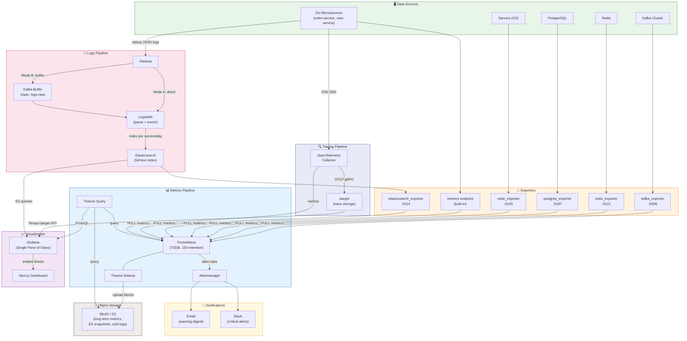

---

## 3. Các Thành Phần & Giao Tiếp

> 
>
> Sơ đồ: [diagrams/02-component-communication.mmd](diagrams/02-component-communication.mmd)

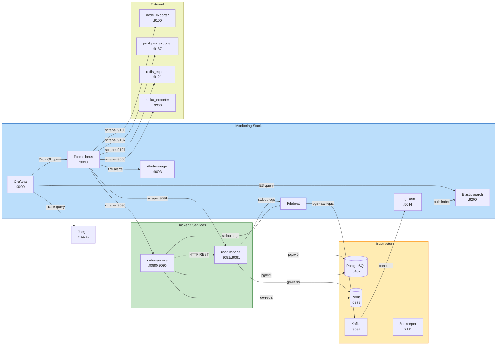

### Giao thức giao tiếp

| Từ | Đến | Giao thức | Mô tả |
|----|-----|-----------|-------|
| Go Services | PostgreSQL | TCP (pgx/v5) | Kết nối database nghiệp vụ |
| Go Services | Redis | TCP (go-redis) | Cache & session |
| Service ↔ Service | HTTP REST | JSON over HTTP + circuit breaker + retry (see Section 26) | Giao tiếp inter-service |
| Prometheus → Services | HTTP GET | Pull `/metrics` mỗi 15s | Thu thập metrics |
| Prometheus → Exporters | HTTP GET | Pull `/metrics` mỗi 60s | Thu thập infra metrics |
| Prometheus → Alertmanager | HTTP POST | Push alert khi rule match | Gửi cảnh báo |
| Filebeat → Kafka | TCP | Produce vào topic `logs-raw` | Đẩy logs vào buffer |
| Kafka → Logstash | TCP | Consumer group `logstash-consumer` | Consume logs |
| Logstash → Elasticsearch | HTTP | Bulk index API | Lưu logs đã parse |
| Go Services → OTel Collector | gRPC (OTLP) | Push spans (batch, non-blocking) | Gửi traces |
| OTel Collector → Jaeger | gRPC (OTLP) | Forward processed spans | Lưu traces |
| Thanos Sidecar → MinIO | HTTP (S3 API) | Upload TSDB blocks mỗi 2h | Long-term metrics |
| Grafana → Thanos Query | HTTP | PromQL queries (unified) | Hiển thị metrics (short + long-term) |
| Grafana → Elasticsearch | HTTP | ES queries | Hiển thị logs |
| Grafana → Jaeger | HTTP | Trace queries | Hiển thị traces |

---

## 4. Luồng Dữ Liệu

### 4.1 Luồng Metrics (PULL Model)

> 
>
> Sơ đồ: [diagrams/03-metrics-flow.mmd](diagrams/03-metrics-flow.mmd)

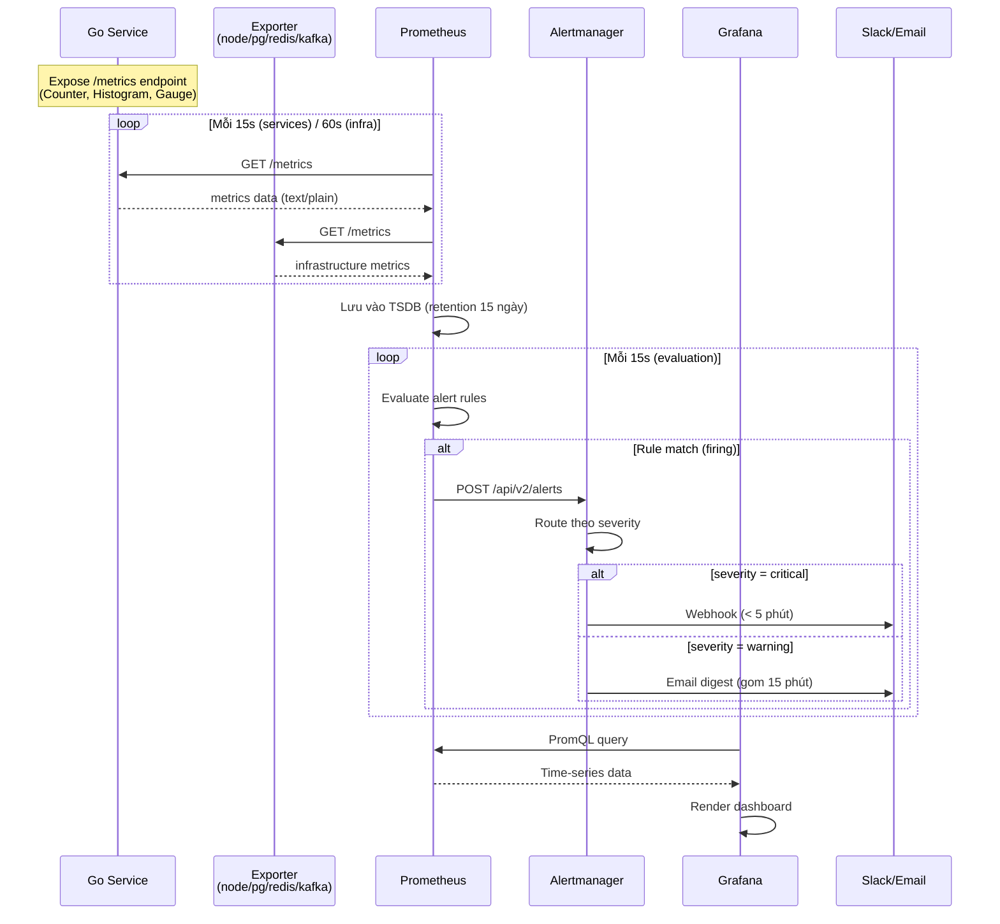

**Đặc điểm:**
- **PULL model**: Prometheus chủ động kéo metrics, không cần service push
- **Backpressure tự nhiên**: Service quá tải → Prometheus chỉ scrape mỗi 15s, không tạo thêm load
- **Service discovery**: Prometheus biết service nào alive qua target `up/down`

### 4.2 Luồng Logs (PUSH Model)

> 
>
> Sơ đồ: [diagrams/04-logs-flow.mmd](diagrams/04-logs-flow.mmd)

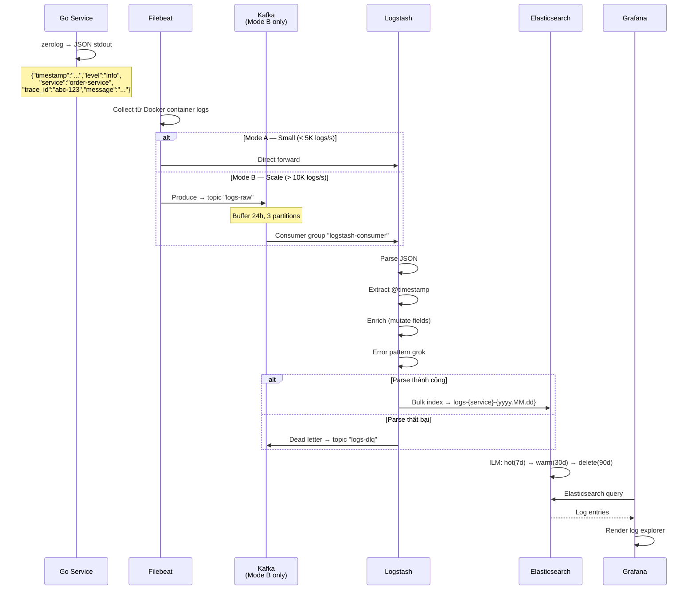

**Đặc điểm:**
- **2 modes**: Mode A (direct) cho dev/staging, Mode B (Kafka buffer) cho production
- **Kafka buffer**: Chịu burst 100K+ msg/s, replay khi Logstash crash
- **ILM lifecycle**: Tự động quản lý vòng đời index (hot → warm → delete)

### 4.3 Luồng Distributed Tracing (OpenTelemetry)

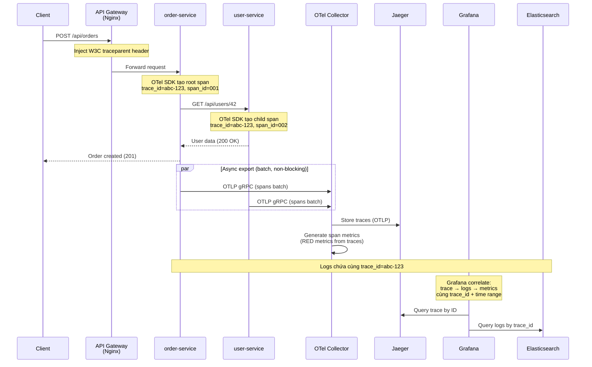

**Đặc điểm:**
- **W3C Trace Context**: Propagation chuẩn `traceparent` header giữa services
- **OTel SDK integration**: Auto-instrumentation cho Gin HTTP, pgx, go-redis — zero manual spans cho infrastructure
- **Batch export**: Non-blocking, gửi spans theo batch (5s interval / 512 spans) — không ảnh hưởng latency
- **Trace-to-Log correlation**: `trace_id` + `span_id` inject vào mọi log entry → click trace → xem logs liên quan
- **Span metrics**: OTel Collector tự động generate RED metrics (Rate, Error, Duration) từ traces → giảm manual instrumentation

**Log format mở rộng (thêm trace context):**
```json
{
  "timestamp": "2026-04-02T10:00:00Z",
  "level": "info",
  "service": "order-service",
  "trace_id": "abc-123-def-456",
  "span_id": "span-001",
  "parent_span_id": "",
  "method": "POST",
  "path": "/api/orders",
  "status": 201,
  "duration_ms": 45,
  "message": "request completed"
}
```

### 4.4 Luồng Alert

> 
>
> Sơ đồ: [diagrams/05-alert-flow.mmd](diagrams/05-alert-flow.mmd)

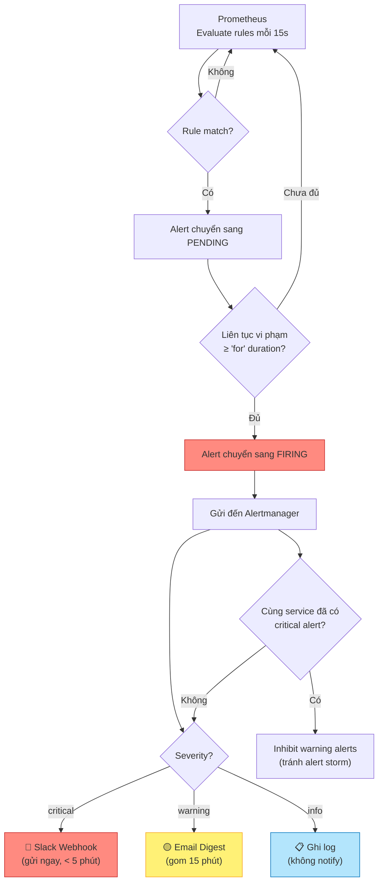

---

## 5. Data Sources & Exporters

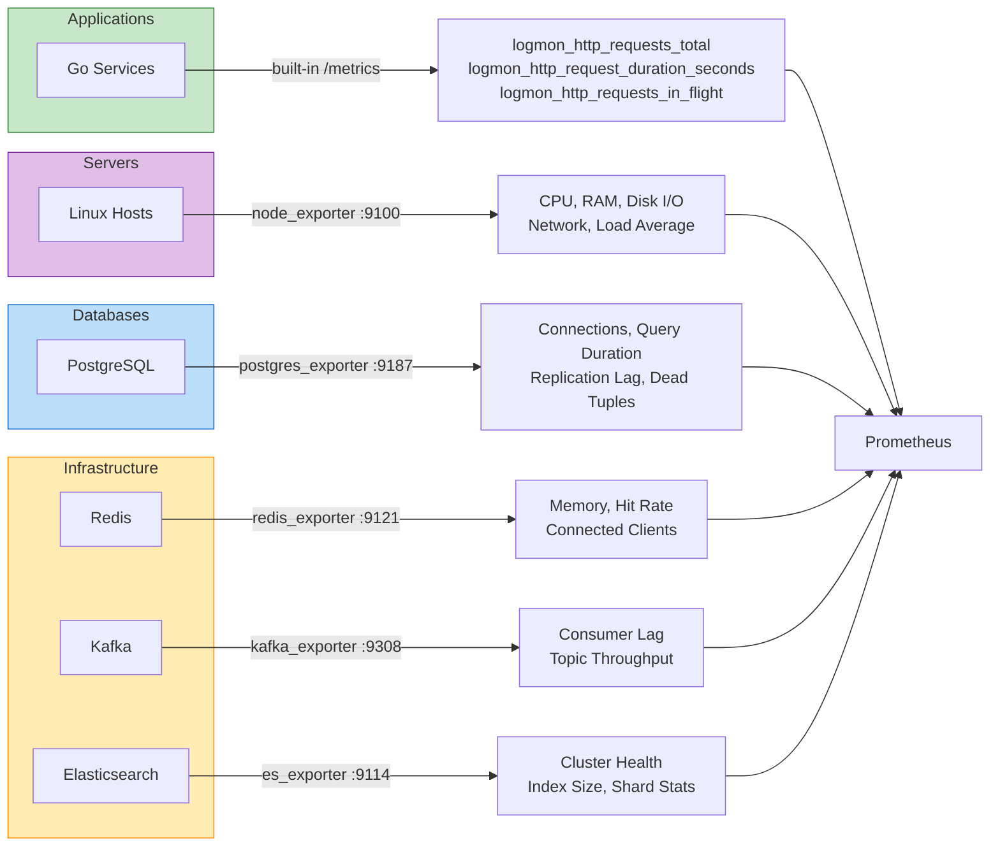

| Data Source | Exporter | Port | Scrape Interval | Metrics chính |
|-------------|----------|------|-----------------|---------------|
| Go Services | Built-in `/metrics` | 9090-9091 | 15s | HTTP request rate, latency, errors, in-flight |
| Linux Hosts | `node_exporter` | 9100 | 60s | CPU, RAM, disk I/O, network, load average |
| PostgreSQL | `postgres_exporter` | 9187 | 60s | Connections, query duration, replication lag |
| Redis | `redis_exporter` | 9121 | 60s | Memory usage, hit rate, connected clients |
| Kafka | `kafka_exporter` | 9308 | 60s | Consumer lag, topic throughput, partition count |
| Elasticsearch | `elasticsearch_exporter` | 9114 | 60s | Cluster health, index size, shard stats |

---

## 6. Deployment Modes

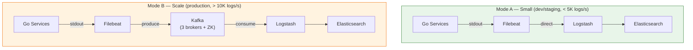

| | Mode A — Small | Mode B — Scale |
|---|---|---|
| **Khi nào dùng** | Dev/staging, log < 5K msg/s | Production, log > 10K msg/s |
| **Pipeline** | Filebeat → Logstash → ES | Filebeat → Kafka → Logstash → ES |
| **Tracing** | OTel Collector → Jaeger (in-memory) | OTel Collector → Jaeger (ES backend) |
| **Long-term Metrics** | Không (Prometheus local 15d) | Thanos → MinIO (1 year) |
| **Ưu điểm** | Đơn giản, ít resource (~8 GB RAM) | Chịu burst, replay, long-term storage |
| **Nhược điểm** | Không có long-term metrics, traces drop khi restart | Thêm Kafka + Thanos + MinIO phải maintain |
| **Docker Compose** | `docker compose up` | `docker compose --profile scale up` |
| **Thành phần thêm** | OTel Collector, Jaeger | + Kafka, Zookeeper, Thanos, MinIO |

---

## 7. Cấu Trúc Dự Án

### 7.1 Tổng Quan Kiến Trúc Backend

Backend áp dụng **2 mô hình kiến trúc** tùy theo complexity của mỗi Bounded Context:

| Bounded Context | Pattern | Lý do |
|-----------------|---------|-------|
| `order/` | **Clean Architecture** | CRUD-like, domain đơn giản |
| `user/` | **Clean Architecture** | CRUD-like, domain đơn giản |
| `alerting/` | **Clean Architecture + DDD + CQRS** | Business rules phức tạp: threshold, inhibition, routing, escalation |
| `slo/` | **Clean Architecture + DDD + CQRS** | Error budget calculation, burn rate, compliance tracking |
| `logpipeline/` | **Clean Architecture + DDD + CQRS** | Mode switching, DLQ retry, ILM policy management |
| `incident/` | **Clean Architecture + DDD + CQRS** | Incident lifecycle, on-call rotation, postmortem, MTTR tracking |
| `notification/` | **Clean Architecture** | Multi-channel notification delivery, templates, webhook management |
| `shared/` | **Shared Kernel** | Infrastructure concerns dùng chung (auth, tracing, resilience, eventbus) |

### 7.2 Cấu Trúc Thư Mục

```
logmon/
├── backend/                                    ← Go Backend
│   ├── cmd/
│   │   ├── orderservice/main.go                ← Order Service entry point
│   │   └── userservice/main.go                 ← User Service entry point
│   ├── internal/
│   │   │
│   │   ├── order/                              ── Clean Architecture ──
│   │   │   ├── domain/
│   │   │   │   ├── order.go                    ← Entity + business rules
│   │   │   │   ├── errors.go                   ← Domain-specific errors
│   │   │   │   └── value_objects.go            ← OrderID, Money, Status
│   │   │   ├── app/
│   │   │   │   ├── create_order.go             ← Use case
│   │   │   │   ├── cancel_order.go             ← Use case
│   │   │   │   └── get_order.go                ← Use case
│   │   │   ├── ports/
│   │   │   │   ├── repository.go               ← OrderRepository interface
│   │   │   │   └── cache.go                    ← OrderCache interface
│   │   │   └── adapters/
│   │   │       ├── http/handler.go             ← Gin HTTP handlers
│   │   │       ├── postgres/repo.go            ← pgx implementation
│   │   │       └── redis/cache.go              ← Redis cache implementation
│   │   │
│   │   ├── user/                               ── Clean Architecture ──
│   │   │   ├── domain/
│   │   │   │   ├── user.go                     ← Entity
│   │   │   │   └── errors.go                   ← Domain errors
│   │   │   ├── app/
│   │   │   │   ├── register_user.go            ← Use case
│   │   │   │   └── get_user.go                 ← Use case
│   │   │   ├── ports/
│   │   │   │   └── repository.go               ← UserRepository interface
│   │   │   └── adapters/
│   │   │       ├── http/handler.go             ← Gin HTTP handlers
│   │   │       └── postgres/repo.go            ← pgx implementation
│   │   │
│   │   ├── alerting/                           ── Clean Architecture + DDD + CQRS ──
│   │   │   ├── domain/
│   │   │   │   ├── alert_rule.go               ← Aggregate Root
│   │   │   │   ├── alert_instance.go           ← Entity (trạng thái alert)
│   │   │   │   ├── notification_channel.go     ← Value Object
│   │   │   │   ├── severity.go                 ← Value Object (critical/warning/info)
│   │   │   │   ├── silence.go                  ← Entity (silence window)
│   │   │   │   ├── events.go                   ← Domain Events
│   │   │   │   └── errors.go                   ← Domain errors
│   │   │   ├── app/
│   │   │   │   ├── command/                    ← Write side (CQRS)
│   │   │   │   │   ├── create_rule.go          ← Tạo alert rule mới
│   │   │   │   │   ├── update_rule.go          ← Cập nhật rule
│   │   │   │   │   ├── acknowledge_alert.go    ← Xác nhận đã thấy alert
│   │   │   │   │   ├── silence_alert.go        ← Tạm tắt alert
│   │   │   │   │   └── resolve_alert.go        ← Đánh dấu resolved
│   │   │   │   └── query/                      ← Read side (CQRS)
│   │   │   │       ├── active_alerts.go        ← Lấy alerts đang firing
│   │   │   │       ├── alert_history.go        ← Lịch sử alerts
│   │   │   │       └── rule_evaluation.go      ← Trạng thái evaluation
│   │   │   ├── ports/
│   │   │   │   ├── repository.go               ← AlertRuleRepository interface
│   │   │   │   ├── event_publisher.go          ← EventPublisher interface
│   │   │   │   ├── notifier.go                 ← Notifier interface
│   │   │   │   └── read_model.go               ← AlertReadModel interface (CQRS)
│   │   │   └── adapters/
│   │   │       ├── http/handler.go             ← Alert management API
│   │   │       ├── postgres/repo.go            ← Alert persistence
│   │   │       ├── prometheus/evaluator.go     ← Prometheus rule management
│   │   │       ├── slack/notifier.go           ← Slack webhook sender
│   │   │       └── email/notifier.go           ← Email sender
│   │   │
│   │   ├── slo/                                ── Clean Architecture + DDD + CQRS ──
│   │   │   ├── domain/
│   │   │   │   ├── slo.go                      ← Aggregate Root (SLO definition)
│   │   │   │   ├── error_budget.go             ← Value Object (remaining budget)
│   │   │   │   ├── burn_rate.go                ← Value Object (consumption speed)
│   │   │   │   ├── events.go                   ← Domain Events
│   │   │   │   └── errors.go                   ← Domain errors
│   │   │   ├── app/
│   │   │   │   ├── command/                    ← DefineSLO, RecalculateBudget
│   │   │   │   └── query/                      ← SLOCompliance, BudgetRemaining
│   │   │   ├── ports/
│   │   │   │   ├── repository.go               ← SLORepository interface
│   │   │   │   ├── metrics_reader.go           ← MetricsReader interface (query Prometheus)
│   │   │   │   └── read_model.go               ← SLOReadModel interface (CQRS)
│   │   │   └── adapters/
│   │   │       ├── http/handler.go
│   │   │       ├── postgres/repo.go
│   │   │       └── prometheus/reader.go        ← PromQL query adapter
│   │   │
│   │   ├── logpipeline/                        ── Clean Architecture + DDD + CQRS ──
│   │   │   ├── domain/
│   │   │   │   ├── pipeline.go                 ← Aggregate Root
│   │   │   │   ├── pipeline_mode.go            ← Value Object (ModeA/ModeB)
│   │   │   │   ├── index_lifecycle.go          ← Value Object (hot/warm/delete)
│   │   │   │   ├── dead_letter.go              ← Entity (DLQ entry)
│   │   │   │   ├── events.go                   ← Domain Events
│   │   │   │   └── errors.go                   ← Domain errors
│   │   │   ├── app/
│   │   │   │   ├── command/                    ← SwitchMode, RetryDLQ, UpdateILMPolicy
│   │   │   │   └── query/                      ← PipelineStatus, DLQCount, IndexStats
│   │   │   ├── ports/
│   │   │   │   ├── repository.go               ← PipelineRepository interface
│   │   │   │   ├── message_broker.go           ← MessageBroker interface
│   │   │   │   └── search_engine.go            ← SearchEngine interface
│   │   │   └── adapters/
│   │   │       ├── http/handler.go
│   │   │       ├── postgres/repo.go
│   │   │       ├── kafka/broker.go             ← Kafka producer/consumer
│   │   │       ├── elasticsearch/engine.go     ← ES index management
│   │   │       └── logstash/controller.go      ← Logstash pipeline control
│   │   │
│   │   ├── incident/                           ── Clean Architecture + DDD + CQRS ──
│   │   │   ├── domain/
│   │   │   │   ├── incident.go                 ← Aggregate Root (lifecycle state machine)
│   │   │   │   ├── timeline.go                 ← Entity (incident timeline events)
│   │   │   │   ├── postmortem.go               ← Entity (root cause, action items)
│   │   │   │   ├── severity.go                 ← Value Object (SEV1-SEV4)
│   │   │   │   ├── oncall.go                   ← Value Object (on-call schedule, rotation)
│   │   │   │   ├── events.go                   ← Domain Events
│   │   │   │   └── errors.go                   ← Domain errors
│   │   │   ├── app/
│   │   │   │   ├── command/                    ← CreateIncident, Triage, Assign, Resolve, SubmitPostmortem
│   │   │   │   └── query/                      ← OpenIncidents, IncidentDetail, MTTRMetrics, OnCallCurrent
│   │   │   ├── ports/
│   │   │   │   ├── repository.go               ← IncidentRepository interface
│   │   │   │   ├── oncall_store.go             ← OnCallStore interface
│   │   │   │   ├── event_publisher.go          ← EventPublisher interface
│   │   │   │   └── read_model.go               ← IncidentReadModel interface
│   │   │   └── adapters/
│   │   │       ├── http/handler.go             ← Incident management API
│   │   │       └── postgres/repo.go            ← Incident persistence
│   │   │
│   │   ├── notification/                       ── Clean Architecture ──
│   │   │   ├── domain/
│   │   │   │   ├── channel.go                  ← Entity (notification channel config)
│   │   │   │   ├── template.go                 ← Value Object (notification template)
│   │   │   │   └── errors.go
│   │   │   ├── app/
│   │   │   │   ├── send_notification.go        ← Use case: render template + dispatch
│   │   │   │   ├── manage_channel.go           ← CRUD channels
│   │   │   │   └── delivery_worker.go          ← Background worker: retry, backoff
│   │   │   ├── ports/
│   │   │   │   ├── repository.go               ← ChannelRepository interface
│   │   │   │   ├── sender.go                   ← NotificationSender interface
│   │   │   │   └── template_renderer.go        ← TemplateRenderer interface
│   │   │   └── adapters/
│   │   │       ├── http/handler.go             ← Channel management API
│   │   │       ├── postgres/repo.go            ← Channel persistence
│   │   │       ├── slack/sender.go             ← Slack webhook sender
│   │   │       ├── email/sender.go             ← SMTP email sender
│   │   │       ├── pagerduty/sender.go         ← PagerDuty Events API v2
│   │   │       ├── teams/sender.go             ← Microsoft Teams webhook
│   │   │       └── webhook/sender.go           ← Generic webhook sender
│   │   │
│   │   └── shared/                             ── Shared Kernel ──
│   │       ├── auth/middleware.go              ← JWT verification middleware
│   │       ├── errors/types.go                 ← Typed application errors
│   │       ├── logger/logger.go                ← zerolog wrapper + trace_id + span_id
│   │       ├── tracing/
│   │       │   ├── provider.go                 ← OTel TracerProvider setup
│   │       │   ├── propagation.go              ← W3C Trace Context propagation
│   │       │   └── middleware.go               ← Gin tracing middleware (auto-span)
│   │       ├── metrics/
│   │       │   ├── registry.go                 ← Prometheus registry
│   │       │   ├── collectors.go               ← Custom business metrics
│   │       │   └── middleware.go               ← Prometheus HTTP middleware
│   │       ├── middleware/
│   │       │   ├── logging.go                  ← Structured logging middleware
│   │       │   ├── recovery.go                 ← Panic recovery middleware
│   │       │   ├── workspace.go                ← Multi-tenancy workspace extraction
│   │       │   └── rbac.go                     ← Role-based access control
│   │       └── eventbus/
│   │           ├── bus.go                      ← In-process event bus interface
│   │           └── memory.go                   ← In-memory implementation
│   │
│   └── go.mod
│
├── infra/                                      ← Infrastructure-as-Code
│   ├── docker/docker-compose.yml               ← Full stack orchestration
│   ├── prometheus/
│   │   ├── prometheus.yml                      ← Scrape config
│   │   ├── rules/                              ← Alert rules
│   │   └── alertmanager.yml
│   ├── elk/
│   │   ├── filebeat/filebeat.yml
│   │   ├── logstash/pipeline/main.conf         ← Kafka → Parse → ES
│   │   └── elasticsearch/
│   │       ├── ilm-policy.json                 ← Index Lifecycle Management
│   │       └── index-template.json
│   ├── kafka/topics.sh                         ← Topic creation
│   ├── otel/
│   │   └── otel-collector.yml                  ← OTel Collector pipeline config
│   ├── jaeger/
│   │   └── jaeger.yml                          ← Jaeger configuration
│   ├── thanos/
│   │   ├── sidecar.yml                         ← Thanos Sidecar config
│   │   ├── store.yml                           ← Store Gateway config
│   │   ├── query.yml                           ← Query Frontend config
│   │   └── compactor.yml                       ← Compactor config
│   ├── minio/
│   │   └── init-buckets.sh                     ← Create buckets: thanos, es-snapshots, backups
│   ├── scripts/
│   │   ├── backup.sh                           ← Daily backup script (cron)
│   │   └── restore.sh                          ← Disaster recovery restore
│   └── grafana/
│       ├── provisioning/
│       │   ├── datasources/datasources.yml
│       │   └── dashboards/dashboards.yml
│       └── dashboards/
│           ├── service-overview.json            ← Developer: request rate, errors
│           ├── logs-explorer.json               ← Developer: log search, trace_id
│           ├── traces-explorer.json             ← Developer: trace search, latency breakdown
│           ├── infrastructure.json              ← DevOps: CPU/RAM/disk per host
│           ├── slo-dashboard.json               ← SRE: error budget, latency SLO
│           └── alerting-overview.json           ← All: active alerts, history
│
└── frontend/                                   ← Next.js Monitoring Dashboard
    ├── app/
    │   ├── page.tsx                             ← Dashboard overview
    │   ├── services/page.tsx                    ← Service health
    │   ├── metrics/page.tsx                     ← Grafana embed
    │   ├── logs/page.tsx                        ← Log viewer
    │   └── alerts/page.tsx                      ← Alert management
    ├── components/                              ← Shared UI components
    ├── services/                                ← API client layer
    └── types/                                   ← TypeScript definitions
```

---

## 8. Chi Tiết Thành Phần

### 8.1 Backend — Go Microservices

#### Tổng Quan Kiến Trúc

Backend áp dụng 2 mô hình kiến trúc tùy theo complexity:

| Mô hình | Áp dụng cho | Đặc điểm |
|---------|-------------|-----------|
| **Clean Architecture** | `order/`, `user/`, `notification/` | Domain đơn giản, CRUD-like. Layers: domain → app → ports → adapters |
| **Clean Arch + DDD + CQRS** | `alerting/`, `slo/`, `logpipeline/`, `incident/` | Business rules phức tạp. Thêm: Command/Query split, Domain Events, Aggregate Roots |

#### Layer Direction (strict, áp dụng cho TẤT CẢ BCs)

```
adapters → ports ← app → domain
```

- `domain/` không import gì ngoài Go standard library
- `app/` chỉ import `domain/` và `ports/`
- `ports/` chỉ chứa interfaces
- `adapters/` implement interfaces từ `ports/`
- Không cross-BC imports — giao tiếp qua domain events hoặc shared kernel

#### Clean Architecture (order, user)

```
HTTP Request
    ↓
shared/middleware/ (recovery → logging → metrics → auth)
    ↓
adapters/http/handler.go          ← Gin HTTP handler, gọi use case
    ↓
app/create_order.go               ← Use case, orchestrate domain logic
    ↓
domain/order.go                   ← Entity + business rules (pure Go)
    ↓
ports/repository.go               ← Interface (OrderRepository)
    ↓
adapters/postgres/repo.go         ← pgx implementation
    ↓
PostgreSQL
```

#### Clean Architecture + DDD + CQRS (alerting, slo, logpipeline)

```
HTTP Request
    ↓
shared/middleware/ (recovery → logging → metrics → auth)
    ↓
adapters/http/handler.go
    ↓
┌─────────── CQRS Split ───────────┐
│                                   │
│  WRITE (Command)                  │  READ (Query)
│  app/command/create_rule.go       │  app/query/active_alerts.go
│       ↓                          │       ↓
│  domain/alert_rule.go            │  ports/read_model.go
│  (Aggregate Root,                │  (AlertReadModel interface)
│   validate business rules,       │       ↓
│   emit Domain Events)            │  adapters/postgres/read_model.go
│       ↓                          │  (denormalized views, cache)
│  ports/repository.go             │
│       ↓                          │
│  adapters/postgres/repo.go       │
│       ↓                          │
│  ports/event_publisher.go        │
│       ↓                          │
│  shared/eventbus/bus.go          │
│       ↓                          │
│  Subscribers (cross-BC)          │
└───────────────────────────────────┘
```

**Domain Events Flow (cross-BC communication via Outbox Pattern — see Section 27):**
```
alerting/domain:
  AlertFired         → slo/app: RecordFailure
                     → incident/app: AutoCreateIncident (if critical, duration > 5m)
                     → notification/app: NotifyChannels
  AlertResolved      → slo/app: RecordRecovery
                     → incident/app: AutoResolveIncident
                     → notification/app: NotifyResolution

slo/domain:
  BudgetExhausted    → alerting/app: CreateCriticalAlert
                     → incident/app: AutoCreateIncident (SEV2)
                     → notification/app: NotifyBudgetWarning

logpipeline/domain:
  PipelineModeChanged → alerting/app: UpdatePipelineAlerts
  DLQThresholdExceeded → alerting/app: CreateWarningAlert

incident/domain:
  IncidentCreated    → notification/app: NotifyOnCall (escalation policy)
  IncidentAssigned   → notification/app: NotifyAssignee
  IncidentEscalated  → notification/app: NotifyNextLevel
  IncidentResolved   → slo/app: RecordRecovery
                     → notification/app: NotifyResolution
  PostmortemCompleted → notification/app: NotifyTeam
```

#### Bounded Context: Alerting (DDD + CQRS)

| DDD Concept | Implementation | Mô tả |
|-------------|---------------|-------|
| **Aggregate Root** | `AlertRule` | Quản lý vòng đời rule: create → evaluate → fire → resolve |
| **Entity** | `AlertInstance` | Một lần firing cụ thể (có trạng thái riêng) |
| **Entity** | `Silence` | Silence window (tạm tắt alert trong khoảng thời gian) |
| **Value Object** | `Severity` | critical / warning / info (immutable) |
| **Value Object** | `NotificationChannel` | Slack webhook URL / Email address |
| **Domain Event** | `AlertFired` | Emitted khi rule chuyển sang FIRING |
| **Domain Event** | `AlertResolved` | Emitted khi alert tự khỏi |
| **Domain Event** | `AlertAcknowledged` | Emitted khi engineer xác nhận đã thấy |

**CQRS Commands & Queries:**

| Side | Handler | Mô tả |
|------|---------|-------|
| Command | `CreateRule` | Tạo alert rule mới, validate PromQL expression |
| Command | `AcknowledgeAlert` | Engineer xác nhận đã thấy alert |
| Command | `SilenceAlert` | Tạm tắt notifications trong time window |
| Command | `ResolveAlert` | Đánh dấu alert đã resolved |
| Query | `ActiveAlerts` | Lấy tất cả alerts đang firing (read model, có thể cache) |
| Query | `AlertHistory` | Lịch sử alerts với filter (service, severity, time range) |
| Query | `RuleEvaluation` | Trạng thái evaluation của rules |

#### Bounded Context: SLO (DDD + CQRS)

| DDD Concept | Implementation | Mô tả |
|-------------|---------------|-------|
| **Aggregate Root** | `ServiceLevelObjective` | SLO definition (target, window, indicator) |
| **Value Object** | `ErrorBudget` | Budget remaining (calculated from SLI data) |
| **Value Object** | `BurnRate` | Tốc độ tiêu thụ error budget (1h, 6h, 24h windows) |
| **Domain Event** | `BudgetExhausted` | Budget còn 0% → trigger critical alert |
| **Domain Event** | `BurnRateExceeded` | Burn rate > threshold → early warning |

#### Bounded Context: LogPipeline (DDD + CQRS)

| DDD Concept | Implementation | Mô tả |
|-------------|---------------|-------|
| **Aggregate Root** | `Pipeline` | Pipeline configuration (mode, targets, filters) |
| **Value Object** | `PipelineMode` | ModeA (direct) / ModeB (Kafka buffer) |
| **Value Object** | `IndexLifecycle` | hot(7d) → warm(30d) → delete(90d) |
| **Entity** | `DeadLetter` | Failed log entry in DLQ (retryable) |
| **Domain Event** | `PipelineModeChanged` | Mode switch A↔B |
| **Domain Event** | `DLQThresholdExceeded` | DLQ count > threshold |

#### Middleware Chain (thứ tự bắt buộc, shared cho tất cả BCs)

| # | Middleware | Chức năng |
|---|-----------|-----------|
| 1 | `shared/middleware/recovery.go` | Catch panics, log stack trace, trả HTTP 500 |
| 2 | `shared/tracing/middleware.go` | OTel: extract/inject trace context, create request span |
| 3 | `shared/middleware/logging.go` | Inject trace_id + span_id, log request/response, duration |
| 4 | `shared/metrics/middleware.go` | Record `http_requests_total`, `http_request_duration_seconds` |
| 5 | `shared/auth/middleware.go` | Verify JWT token |
| 6 | `shared/middleware/workspace.go` | Extract workspace_id (multi-tenancy) |
| 7 | `shared/middleware/rbac.go` | Check user role within workspace |
| 8 | `adapters/http/handler.go` | Business endpoint (per BC) |

**Prometheus Metrics:**

| Metric | Type | Labels | Mô tả |
|--------|------|--------|-------|
| `logmon_http_requests_total` | Counter | method, path, status | Tổng số HTTP requests |
| `logmon_http_request_duration_seconds` | Histogram | method, path | Phân bố thời gian xử lý |
| `logmon_http_requests_in_flight` | Gauge | — | Số request đang xử lý |

**Structured Log Format (zerolog → JSON stdout):**
```json
{
  "timestamp": "2026-04-02T10:00:00Z",
  "level": "info",
  "service": "order-service",
  "workspace": "backend-team",
  "trace_id": "abc-123-def-456",
  "span_id": "span-001",
  "method": "POST",
  "path": "/api/orders",
  "status": 201,
  "duration_ms": 45,
  "message": "request completed",
  "caller": "adapters/http/handler.go:42"
}
```

### 8.2 Prometheus + Thanos (Long-term Metrics)

**Prometheus (short-term, 15 ngày):**
- **Model**: PULL — scrape `/metrics` endpoint định kỳ
- **Scrape interval**: 15s (services), 60s (infrastructure exporters)
- **Storage**: Local TSDB, retention 15 ngày
- **Alert evaluation**: Mỗi 15s
- **Histogram buckets**: `0.005, 0.01, 0.025, 0.05, 0.1, 0.25, 0.5, 1, 2.5, 5, 10`

**Thanos (long-term, 90+ ngày):**

| Component | Vai trò |
|-----------|---------|
| **Thanos Sidecar** | Chạy cạnh Prometheus, upload TSDB blocks → Object Storage mỗi 2h |
| **Thanos Store Gateway** | Serve queries từ Object Storage (MinIO/S3) |
| **Thanos Query** | Unified PromQL endpoint — query cả Prometheus local + Object Storage |
| **Thanos Compactor** | Downsampling (5m → 1h → 24h) + dedup blocks trên Object Storage |

```
Grafana → Thanos Query → ┬→ Prometheus (0-15 ngày, full resolution)
                          └→ Thanos Store → MinIO/S3 (15-90+ ngày, downsampled)
```

**Lý do cần Thanos**: SLO BC cần historical data 30-90 ngày để tính error budget meaningful. Prometheus local chỉ giữ 15 ngày → Thanos bridge gap này mà không tăng RAM Prometheus. Cost: MinIO storage ~$0.01/GB/month.

### 8.3 Alertmanager

| Cấu hình | Giá trị |
|-----------|---------|
| Critical → Slack | Webhook, gửi ngay (< 5 phút delay) |
| Warning → Email | Digest, gom 15 phút |
| Inhibition | Critical suppresses warning cùng service |
| Labels bắt buộc | `severity`, `service`, `runbook_url` |

### 8.4 ELK Stack

**Filebeat:**
- Input: Docker container logs (socket mount)
- Output: Kafka `logs-raw` (Mode B) hoặc Logstash trực tiếp (Mode A)
- Multiline: aggregate Go stack traces

**Logstash Pipeline:**
```
input { kafka { topic: "logs-raw" } }
  → filter { json → date → mutate → grok (errors) }
  → output { elasticsearch { index: "logs-%{service}-%{+yyyy.MM.dd}" } }
  → dead_letter { kafka { topic: "logs-dlq" } }
```

**Elasticsearch:**
- Index pattern: `logs-{service}-{yyyy.MM.dd}`
- ILM policy: hot (7 ngày) → warm (30 ngày) → delete (90 ngày)
- Shard size target: 10-50 GB/shard

### 8.5 Kafka (Log Buffer)

| Cấu hình | Giá trị |
|-----------|---------|
| Topics | `logs-raw` (input), `logs-dlq` (dead letter) |
| Partitions | 3 (match Logstash pipeline workers) |
| Retention | 24h (buffer, không phải archive) |
| Consumer group | `logstash-consumer` |
| Khi nào cần | Log volume > 10K msg/s, cần replay |
| Khi nào KHÔNG cần | Dev/staging, log < 5K msg/s |

### 8.6 Grafana

- **Single pane of glass**: Cả metrics (Thanos Query) + logs (Elasticsearch) + traces (Jaeger)
- **Provisioned dashboards**: Auto-load từ JSON files (as-code)
- **Datasources**: Thanos Query (PromQL) + Elasticsearch + Jaeger
- **Correlation**: Click metric spike → jump to logs/traces cùng time range + service

**Dashboard per Persona:**

| Dashboard | Persona | Nội dung |
|-----------|---------|----------|
| `service-overview.json` | Developer | Request rate, error rate, p95 latency per service |
| `logs-explorer.json` | Developer | Log search, trace_id correlation, error patterns |
| `traces-explorer.json` | Developer | Trace search, latency breakdown, service dependency graph |
| `infrastructure.json` | DevOps | node_exporter metrics, container stats, disk usage |
| `slo-dashboard.json` | SRE | Error budget burn rate, latency SLO compliance |
| `alerting-overview.json` | All | Active alerts, alert history, silence management |

### 8.7 Jaeger (Distributed Tracing)

| Cấu hình | Giá trị |
|-----------|---------|
| Protocol | OTLP gRPC (port 4317) |
| Storage backend | Elasticsearch (shared cluster, index prefix `jaeger-`) |
| Retention | 7 ngày (traces are high volume, lower retention than logs) |
| Sampling | Head-based, 10% default, 100% cho errors |
| UI | Jaeger UI (:16686) + Grafana Tempo datasource |

**OpenTelemetry Collector pipeline:**
```yaml
receivers:
  otlp:
    protocols:
      grpc:
        endpoint: 0.0.0.0:4317

processors:
  batch:
    timeout: 5s
    send_batch_size: 512
  tail_sampling:
    policies:
      - name: errors-always
        type: status_code
        status_code: {status_codes: [ERROR]}
      - name: slow-requests
        type: latency
        latency: {threshold_ms: 1000}
      - name: probabilistic-default
        type: probabilistic
        probabilistic: {sampling_percentage: 10}

exporters:
  otlp/jaeger:
    endpoint: jaeger:4317
    tls:
      insecure: true
  prometheus:
    endpoint: 0.0.0.0:8889
    namespace: span

service:
  pipelines:
    traces:
      receivers: [otlp]
      processors: [tail_sampling, batch]
      exporters: [otlp/jaeger]
    metrics:
      receivers: [otlp]
      processors: [batch]
      exporters: [prometheus]
```

### 8.8 Elasticsearch Cluster Sizing

| Scale | Nodes | RAM/Node | Disk/Node | Total Disk | Retention |
|-------|-------|----------|-----------|------------|-----------|
| **Small** (dev, < 5 services) | 1 node | 2 GB | 50 GB | 50 GB | 30 ngày |
| **Medium** (5-20 services) | 3 nodes | 4 GB | 200 GB | 600 GB | 90 ngày |
| **Large** (20+ services) | 5 nodes (3 hot + 2 warm) | 8 GB | 500 GB | 2.5 TB | 180 ngày |

**Best practices:**
- JVM heap: 50% RAM, max 32 GB (compressed oops limit)
- Shard size target: 10-50 GB/shard
- Replicas: 1 (medium), 2 (large) — 0 cho dev
- Hot/warm architecture: SSD cho hot nodes (0-7 ngày), HDD cho warm nodes (7-90 ngày)
- Index pattern: `logs-{service}-{yyyy.MM.dd}` (daily rotation)
- ILM policy: hot (7d) → warm (30d) → cold/S3 snapshot (90d) → delete (180d)

### 8.9 MinIO / Object Storage

| Vai trò | Dữ liệu | Retention |
|---------|----------|-----------|
| Thanos metrics | Prometheus TSDB blocks (downsampled) | 1 năm |
| ES snapshots | Elasticsearch index snapshots (cold tier) | 180 ngày |
| Audit logs | Immutable audit trail | 2 năm |

---

## 9. Quy Tắc Hệ Thống

> **Tham khảo:** [Uber Go Style Guide](https://github.com/uber-go/guide/blob/master/style.md), [SOLID Go Design — Dave Cheney](https://dave.cheney.net/2016/08/20/solid-go-design), [OWASP Go Secure Coding Practices](https://owasp.org/www-project-go-secure-coding-practices-guide/)

### 9.1 Go Code Style

**Naming:**
- Package names: lowercase, không underscore, không plural, **KHÔNG** dùng `common`, `util`, `helpers` (dùng `shared/` với sub-packages có tên rõ ràng)
- Exported error variables: prefix `Err` → `ErrAlertNotFound`
- Unexported globals: prefix `_` → `_defaultScrapeInterval`
- Error types: suffix `Error` → `NotFoundError`, `ValidationError`
- Enums bắt đầu từ 1 (không phải 0) trừ khi zero value có ý nghĩa:

```go
type Severity int
const (
    SeverityCritical Severity = iota + 1  // 1
    SeverityWarning                        // 2
    SeverityInfo                           // 3
)
```

**Import ordering (2 groups, ngăn cách bằng dòng trống):**
```go
import (
    "context"
    "fmt"

    "github.com/gin-gonic/gin"
    "github.com/yourorg/logmon/internal/alerting/domain"
)
```

**Function ordering trong file:**
1. Type definition
2. Constructor (`NewXYZ`)
3. Methods trên receiver (group theo receiver)
4. Plain utility functions cuối file

**Early return — giảm nesting:**
```go
// BAD
func (h *Handler) GetAlert(c *gin.Context) {
    id := c.Param("id")
    if id != "" {
        alert, err := h.query.Handle(ctx, GetAlertQuery{ID: id})
        if err == nil {
            c.JSON(200, alert)
        } else {
            c.JSON(500, gin.H{"error": "internal error"})
        }
    } else {
        c.JSON(400, gin.H{"error": "missing id"})
    }
}

// GOOD
func (h *Handler) GetAlert(c *gin.Context) {
    id := c.Param("id")
    if id == "" {
        c.JSON(400, gin.H{"error": "missing id"})
        return
    }
    alert, err := h.query.Handle(ctx, GetAlertQuery{ID: id})
    if err != nil {
        c.JSON(500, gin.H{"error": "internal error"})
        return
    }
    c.JSON(200, alert)
}
```

**Functional Options cho service configuration:**
```go
type Option func(*options)
type options struct {
    scrapeInterval time.Duration
    retentionDays  int
}

func WithScrapeInterval(d time.Duration) Option {
    return func(o *options) { o.scrapeInterval = d }
}

func NewPrometheusAdapter(addr string, opts ...Option) *PrometheusAdapter {
    o := options{scrapeInterval: 15 * time.Second, retentionDays: 15}
    for _, opt := range opts {
        opt(&o)
    }
    // ...
}
```

**Entry point — `run()` pattern:**
```go
func main() {
    if err := run(); err != nil {
        log.Fatal(err)
    }
}

func run() error {
    cfg, err := config.Load()
    if err != nil {
        return fmt.Errorf("load config: %w", err)
    }
    // wire dependencies, start server
    // defer cleanup
    return nil
}
```

**Performance (hot path only):**
- `strconv.Itoa()` thay vì `fmt.Sprint()` khi convert primitives
- Specify container capacity: `make(map[string]int, expectedSize)`, `make([]T, 0, expectedSize)`
- Chuyển `[]byte` một lần, tái sử dụng (không convert lặp lại trong loop)

### 9.2 Error Handling

**Decision matrix:**

| Cần match? | Message | Approach |
|------------|---------|----------|
| Không | Static | `errors.New("alert not found")` |
| Không | Dynamic | `fmt.Errorf("rule %s failed: %w", id, err)` |
| Có | Static | `var ErrAlertNotFound = errors.New("alert not found")` |
| Có | Dynamic | Custom error type `NotFoundError{ID: id}` |

**Error wrapping — dùng context ngắn gọn, không dùng "failed to":**
```go
// BAD: "failed to get alert: failed to query DB: connection refused"
return fmt.Errorf("failed to get alert: %w", err)

// GOOD: "get alert: query DB: connection refused"
return fmt.Errorf("get alert: %w", err)
```

**Wrap `%w` vs `%v`:**
- `%w` — khi caller CẦN match underlying error (preferred)
- `%v` — khi muốn ẨN implementation detail khỏi caller (dùng ở adapter boundary)

```go
// adapters/ — ẩn infrastructure errors, expose domain errors
func (r *PostgresAlertRepo) FindByID(ctx context.Context, id string) (*domain.AlertRule, error) {
    row := r.pool.QueryRow(ctx, query, id)
    var a alertModel
    if err := row.Scan(&a.ID, &a.Name); err != nil {
        if errors.Is(err, pgx.ErrNoRows) {
            return nil, domain.ErrAlertNotFound  // domain error, không wrap pgx
        }
        return nil, fmt.Errorf("scan alert %s: %v", id, err)  // %v: ẩn pgx detail
    }
    return a.toDomain(), nil
}
```

**Handle once — log HOẶC return, KHÔNG làm cả hai:**
```go
// BAD: duplicate logging
log.Printf("could not get alert %s: %v", id, err)
return err

// GOOD: wrap và return, để upstream xử lý
return fmt.Errorf("get alert %s: %w", id, err)

// GOOD: log và degrade (không return error)
if err := emitMetrics(); err != nil {
    log.Printf("emit metrics: %v", err)
    // continue without error
}
```

**Custom domain errors (cho match):**
```go
// domain/errors.go
var (
    ErrAlertNotFound   = errors.New("alert not found")
    ErrRuleInvalid     = errors.New("invalid alert rule")
    ErrBudgetExhausted = errors.New("error budget exhausted")
)

type ValidationError struct {
    Field   string
    Message string
}
func (e *ValidationError) Error() string {
    return fmt.Sprintf("validation: %s — %s", e.Field, e.Message)
}

// Caller
var ve *domain.ValidationError
if errors.As(err, &ve) {
    c.JSON(400, gin.H{"field": ve.Field, "error": ve.Message})
    return
}
```

**KHÔNG panic trong production code:**
```go
// BAD
panic("missing required config")

// GOOD
return fmt.Errorf("missing required config: %s", key)
```

Exception: `template.Must()` và similar chỉ trong program init.

### 9.3 Interface Design & SOLID Principles

> *"Accept interfaces, return structs."* — Jack Lindamood
> *"Require no more, promise no less."* — Jim Weirich

**Single Responsibility (SRP) — mỗi package có MỘT lý do để thay đổi:**
```
# GOOD — mỗi package = 1 bounded context hoặc 1 concern
internal/alerting/domain/     ← thay đổi khi business rules đổi
internal/alerting/adapters/   ← thay đổi khi infrastructure đổi
internal/shared/logger/       ← thay đổi khi logging strategy đổi

# BAD — SRP violations
internal/common/              ← thay đổi vì BẤT KỲ lý do gì
internal/utils/               ← junk drawer
internal/models/              ← mọi entity trong 1 package
```

**Interface Segregation (ISP) — interfaces nhỏ, focused:**
```go
// BAD — God interface, mọi consumer phải depend vào tất cả methods
type AlertRepository interface {
    FindByID(ctx context.Context, id string) (*AlertRule, error)
    FindByService(ctx context.Context, svc string) ([]*AlertRule, error)
    FindActive(ctx context.Context) ([]*AlertRule, error)
    Save(ctx context.Context, rule *AlertRule) error
    Delete(ctx context.Context, id string) error
    UpdateStatus(ctx context.Context, id string, s Status) error
}

// GOOD — segregated, mỗi consumer chỉ depend vào cái nó cần
type AlertFinder interface {
    FindByID(ctx context.Context, id string) (*AlertRule, error)
}

type AlertSaver interface {
    Save(ctx context.Context, rule *AlertRule) error
}

// Command handler chỉ cần Save
type CreateRuleHandler struct {
    alerts AlertSaver
}

// Query handler chỉ cần Find
type GetAlertHandler struct {
    alerts AlertFinder
}

// 1 struct concrete implement tất cả interfaces nhỏ
type PostgresAlertRepo struct { pool *pgxpool.Pool }
// satisfies AlertFinder, AlertSaver, etc. implicitly
```

**Dependency Inversion (DIP) — domain defines interfaces, infrastructure implements:**
```
Import direction (KHÔNG được vi phạm):

cmd/main.go          ← wiring, biết mọi concrete type
    |
    ├── app/command/  ← depend on ports/ interfaces ONLY
    │     ↓
    │   domain/       ← pure Go, zero infrastructure imports
    │
    └── adapters/     ← implement ports/ interfaces
          ↓
        ports/        ← interfaces defined by domain needs
```

**Verify interface compliance tại compile time:**
```go
// Đặt ở đầu file adapter — fail ngay khi build nếu thiếu method
var _ ports.AlertRuleRepository = (*PostgresAlertRepo)(nil)
var _ ports.Notifier = (*SlackNotifier)(nil)
var _ ports.MetricsReader = (*PrometheusReader)(nil)
```

**Không dùng pointer to interface:**
```go
// BAD — interface đã là reference type
func process(r *io.Reader) { }

// GOOD
func process(r io.Reader) { }
```

### 9.4 Concurrency

**Goroutine lifecycle — MỌI goroutine phải có cách stop VÀ cách wait:**
```go
// Prometheus scraper — background goroutine với lifecycle management
type Scraper struct {
    targets []string
    stop    chan struct{}
    done    chan struct{}
}

func NewScraper(targets []string) *Scraper {
    s := &Scraper{
        targets: targets,
        stop:    make(chan struct{}),
        done:    make(chan struct{}),
    }
    go s.run()
    return s
}

func (s *Scraper) run() {
    defer close(s.done)
    ticker := time.NewTicker(15 * time.Second)
    defer ticker.Stop()
    for {
        select {
        case <-ticker.C:
            s.scrapeAll()
        case <-s.stop:
            return
        }
    }
}

func (s *Scraper) Shutdown() {
    close(s.stop)
    <-s.done  // block cho đến khi goroutine exit
}
```

**Copy slices/maps tại API boundaries (ngăn mutation từ bên ngoài):**
```go
// BAD — caller có thể mutate internal state
func (s *AlertStore) GetActiveAlerts() []*AlertRule {
    s.mu.RLock()
    defer s.mu.RUnlock()
    return s.alerts  // caller gets reference to internal slice!
}

// GOOD — return copy
func (s *AlertStore) GetActiveAlerts() []*AlertRule {
    s.mu.RLock()
    defer s.mu.RUnlock()
    result := make([]*AlertRule, len(s.alerts))
    copy(result, s.alerts)
    return result
}
```

**Mutex patterns:**
```go
type AlertCache struct {
    mu     sync.RWMutex            // KHÔNG embed (ẩn Lock/Unlock khỏi callers)
    alerts map[string]*AlertRule
}

// KHÔNG dùng new(sync.Mutex) — zero value is ready to use
var mu sync.Mutex
```

**Channel sizes — chỉ 0 (unbuffered) hoặc 1:**
```go
events := make(chan domain.Event, 1)  // buffered size 1: OK
events := make(chan domain.Event)     // unbuffered: OK
events := make(chan domain.Event, 64) // BAD: cần lý do rất rõ ràng
```

**KHÔNG dùng goroutines trong `init()`** — expose objects với explicit lifecycle thay vì fire-and-forget.

### 9.5 Logging

- Output: JSON to stdout (Filebeat collect)
- Fields bắt buộc: `timestamp` (ISO8601), `level`, `service`, `trace_id`, `message`
- HTTP logs thêm: `method`, `path`, `status`, `duration_ms`, `caller`
- **KHÔNG** log sensitive data (password, token, PII, session token, API key)
- **KHÔNG** log request/response body
- **KHÔNG** dùng `log.Println` / `fmt.Print` — chỉ dùng zerolog wrapper từ `shared/logger/`
- **KHÔNG** dùng `log.Fatal` trong request handlers (gọi `os.Exit`, skip defer cleanup) — chỉ dùng trong `main()`

**Security logging — events BẮT BUỘC phải log:**
- Authentication attempts (cả success và failure)
- Authorization failures (access denied)
- Input validation failures
- System exceptions và unexpected state changes
- Admin function usage (tạo/xóa alert rules, thay đổi SLO)
- TLS connection failures

**Events KHÔNG ĐƯỢC log:**
- Passwords, session tokens, JWT tokens
- Database connection strings
- Encryption keys
- Full stack traces trong production (chỉ log ở DEBUG level)

### 9.6 Metrics

- Naming: `snake_case`, prefix `logmon_`
- Counter phải có suffix `_total`
- **KHÔNG** dùng high-cardinality labels: `user_id`, `request_id`, `trace_id`, `session_id`
- Labels cho phép: `method`, `path`, `status_code`, `service`
- Mỗi service expose `/metrics` trên port riêng (API: 8080, metrics: 9090)

### 9.7 Security (OWASP Go Secure Coding Practices)

**Input validation — validate TẤT CẢ input từ bên ngoài:**
```go
import "github.com/go-playground/validator/v10"

type CreateRuleRequest struct {
    Name       string `json:"name" validate:"required,min=3,max=100"`
    Expression string `json:"expression" validate:"required,min=1"`
    Severity   string `json:"severity" validate:"required,oneof=critical warning info"`
    ForDuration string `json:"for" validate:"required,min=2"`
}

var validate = validator.New()

func (h *Handler) CreateRule(c *gin.Context) {
    var req CreateRuleRequest
    if err := c.ShouldBindJSON(&req); err != nil {
        c.JSON(400, gin.H{"error": "invalid request body"})  // generic message
        return
    }
    if err := validate.Struct(req); err != nil {
        c.JSON(400, gin.H{"error": "validation failed"})  // KHÔNG expose field details
        return
    }
    // ...
}
```

**Authentication — bcrypt cho passwords, JWT cho sessions:**
```go
import "golang.org/x/crypto/bcrypt"

// Hash password (registration)
hash, err := bcrypt.GenerateFromPassword([]byte(password), bcrypt.DefaultCost)

// Verify password (login)
if bcrypt.CompareHashAndPassword([]byte(storedHash), []byte(password)) != nil {
    // GENERIC error: không nói rõ username hay password sai
    return ErrInvalidCredentials
}

// JWT cookie — TẤT CẢ flags đều quan trọng
cookie := &http.Cookie{
    Name:     "Auth",
    Value:    signedToken,
    HttpOnly: true,   // chặn JavaScript access (XSS protection)
    Secure:   true,   // HTTPS only
    SameSite: http.SameSiteStrictMode,
    Path:     "/",
    MaxAge:   1800,   // 30 phút
}
```

**SQL Injection prevention — LUÔN dùng parameterized queries:**
```go
// BAD — SQL injection
query := "SELECT * FROM alert_rules WHERE service = '" + service + "'"

// GOOD — parameterized (pgx dùng $1, $2, ...)
query := "SELECT id, name, expression FROM alert_rules WHERE service = $1"
rows, err := pool.Query(ctx, query, service)
```

**HTTP Security Headers:**
```go
func SecurityHeaders() gin.HandlerFunc {
    return func(c *gin.Context) {
        c.Header("Strict-Transport-Security", "max-age=63072000; includeSubDomains")
        c.Header("X-Content-Type-Options", "nosniff")
        c.Header("X-Frame-Options", "DENY")
        c.Header("Content-Type", "application/json; charset=utf-8")
        c.Next()
    }
}
```

**TLS configuration:**
```go
tlsConfig := &tls.Config{
    MinVersion:         tls.VersionTLS12,
    MaxVersion:         tls.VersionTLS13,
    InsecureSkipVerify: false,  // LUÔN false trong production
}
```

**Secrets management:**
- **KHÔNG** hardcode credentials, API keys, JWT secrets trong source code
- Load từ environment variables hoặc secrets manager
- **KHÔNG** commit `.env` files
- Dùng `crypto/rand` cho token generation (KHÔNG dùng `math/rand`)

```go
// BAD — predictable
import "math/rand"
token := rand.Intn(999999)

// GOOD — cryptographically secure
import "crypto/rand"
import "math/big"
n, _ := rand.Int(rand.Reader, big.NewInt(999999))
```

**Error messages to users — KHÔNG expose internal details:**
```go
// BAD — lộ stack trace, DB schema, internal paths
c.JSON(500, gin.H{"error": err.Error()})

// GOOD — generic message, log chi tiết internally
logger.Error().Err(err).Str("alert_id", id).Msg("failed to get alert")
c.JSON(500, gin.H{"error": "an internal error occurred"})
```

**Anti-patterns TUYỆT ĐỐI TRÁNH:**
- `unsafe` package trong production code
- `text/template` cho HTML output (dùng `html/template`)
- `InsecureSkipVerify: true` trong TLS config
- Ignore errors: `result, _ := doSomething()`
- `log.Fatal` trong request handlers

### 9.8 Testing

**Table-driven tests:**
```go
func TestAlertRule_Evaluate(t *testing.T) {
    tests := []struct {
        give        float64   // current metric value
        wantFiring  bool
        wantEvents  int
    }{
        {give: 0.01, wantFiring: false, wantEvents: 0},
        {give: 0.06, wantFiring: true, wantEvents: 1},   // > 5% threshold
        {give: 0.05, wantFiring: false, wantEvents: 0},  // exactly at threshold
    }

    rule := domain.NewAlertRule("high-error-rate", "> 0.05", domain.SeverityCritical)
    for _, tt := range tests {
        t.Run(fmt.Sprintf("value=%.2f", tt.give), func(t *testing.T) {
            events := rule.Evaluate(tt.give)
            require.Equal(t, tt.wantFiring, rule.IsFiring())
            require.Len(t, events, tt.wantEvents)
        })
    }
}
```

**Naming convention:** slice `tests`, each case `tt`, input prefix `give`, output prefix `want`.

**KHÔNG dùng mutable globals — inject dependencies:**
```go
// BAD — mutating global for testing
var _timeNow = time.Now

// GOOD — inject qua struct field
type RuleEvaluator struct {
    now func() time.Time   // injectable
}

func NewRuleEvaluator() *RuleEvaluator {
    return &RuleEvaluator{now: time.Now}
}

// In test:
eval := &RuleEvaluator{now: func() time.Time { return fixedTime }}
```

**Interface mocking (lợi ích của ports/):**
```go
// Unit test domain logic KHÔNG cần database
type mockAlertRepo struct {
    alerts map[string]*domain.AlertRule
}

func (m *mockAlertRepo) Save(ctx context.Context, rule *domain.AlertRule) error {
    m.alerts[rule.ID()] = rule
    return nil
}

func (m *mockAlertRepo) FindByID(ctx context.Context, id string) (*domain.AlertRule, error) {
    if a, ok := m.alerts[id]; ok {
        return a, nil
    }
    return nil, domain.ErrAlertNotFound
}

func TestCreateRule(t *testing.T) {
    repo := &mockAlertRepo{alerts: make(map[string]*domain.AlertRule)}
    handler := command.NewCreateRuleHandler(repo)
    err := handler.Handle(context.Background(), command.CreateRule{
        Name:       "high-error-rate",
        Expression: "rate(logmon_http_requests_total{status=~\"5..\"}[5m]) > 0.05",
        Severity:   "critical",
    })
    require.NoError(t, err)
    require.Len(t, repo.alerts, 1)
}
```

**Dùng `require.NoError` (không `assert.NoError`) cho setup steps** — fail immediately thay vì continue với state sai.

### 9.9 Infrastructure

- Mọi Docker service phải có: healthcheck, resource limits, restart policy
- Network isolation: `app_net`, `monitoring_net`, `kafka_net`
- Dùng named volumes cho persistent data (ES, Prometheus, Kafka)
- Secrets qua environment variables, **KHÔNG** commit `.env`

### 9.10 Alerting

- Mọi alert phải có: `severity`, `service`, `runbook_url`
- `for` duration: critical ≥ 1m, warning ≥ 5m
- **KHÔNG** alert trên raw counter — luôn dùng `rate()` hoặc `increase()`

---

## 10. Architecture Decisions

### ADR 001: Clean Architecture + DDD + CQRS (thay thế Layered Architecture)

**Status:** Supersedes original ADR 001 (Layered Architecture)

**Context:** Ban đầu chọn Layered Architecture đơn giản (middleware → handler → service → repository) vì cho rằng domain observability đơn giản. Tuy nhiên, khi phân tích sâu các yêu cầu của alerting (threshold, inhibition, routing, escalation), SLO (error budget calculation, burn rate), và log pipeline management (mode switching, DLQ retry) — đây là **real business logic**, không phải CRUD.

**Decision:**
- **`order/`, `user/`**: Clean Architecture (domain → app → ports → adapters). Domain đơn giản, không cần CQRS hay Domain Events.
- **`alerting/`, `slo/`, `logpipeline/`**: Clean Architecture + DDD + CQRS. Command/Query split cho read-heavy monitoring use cases. Domain Events cho cross-BC communication.
- **Layer rule**: `adapters → ports ← app → domain` (strict, one-way). Domain không import ngoài stdlib.

**Consequences:**
- (+) Domain logic testable không cần Docker/database (dùng in-memory adapters)
- (+) CQRS cho phép tối ưu read side riêng biệt (cache, materialized views) — phù hợp monitoring (read:write ~ 100:1)
- (+) Domain Events loose coupling giữa BCs — thêm notification channel không sửa alerting domain
- (+) Swap infrastructure dễ (Prometheus → VictoriaMetrics, Slack → PagerDuty) chỉ thêm adapter mới
- (-) Overhead: nhiều files hơn, cần discipline để maintain layer boundaries
- (-) Learning curve cho developers chưa quen DDD/CQRS

### ADR 002: Kafka làm Log Buffer

Filebeat → Kafka → Logstash → ES. Kafka chịu burst 100K+ msg/s (Logstash chỉ 5-10K/s), hỗ trợ replay khi Logstash crash. Trade-off: thêm component phải maintain, delay tăng 1-5s.

### ADR 003: ELK thay vì Loki

Elasticsearch full-text search bất kỳ field trong JSON log. Loki chỉ index labels, query body bằng regex. ES hỗ trợ aggregation/analytics trên log data. Trade-off: ES cần 2GB+ RAM, storage đắt hơn.

### ADR 004: Prometheus PULL Model

PULL (scrape /metrics) thay vì PUSH (StatsD/InfluxDB). Backpressure tự nhiên, service discovery tự động, service chỉ cần expose HTTP endpoint. Dùng Pushgateway cho short-lived jobs (batch/cron).

### ADR 005: Grafana Single Pane thay vì Grafana + Kibana

Grafana 10.4+ hỗ trợ ES datasource tốt. 1 tool = 1 learning curve. Correlation: click metrics → jump logs cùng time range. Dashboard-as-code provisioned JSON.

### ADR 006: Exporters Strategy

Mỗi infrastructure component có dedicated exporter riêng. Chạy sidecar trong Docker Compose network. Port riêng, scrape config phân biệt job per exporter type.

### ADR 007: 2 Deployment Modes

Mode A (small, no Kafka) cho dev/staging. Mode B (with Kafka) cho production. Docker Compose profiles điều khiển: `--profile scale`.

### ADR 008: CQRS cho Complex Bounded Contexts

**Context:** Monitoring systems có read:write ratio cực kỳ lệch (~100:1). Write side (metrics ingestion, alert firing) cần consistency và business rule validation. Read side (dashboards, log search, alert history) cần speed và flexibility.

**Decision:** Áp dụng CQRS cho `alerting/`, `slo/`, `logpipeline/`. Tách `app/command/` (write) và `app/query/` (read). Read side có thể dùng denormalized views, cache, hoặc read replicas mà không ảnh hưởng write side. KHÔNG áp dụng cho `order/`, `user/` vì read/write balanced và domain đơn giản.

**Consequences:**
- (+) Read side tối ưu riêng (cache active alerts, materialized SLO compliance views)
- (+) Write side focus vào domain logic purity
- (-) Eventual consistency giữa write và read models (chấp nhận được vì monitoring data inherently near-real-time)

### ADR 009: Domain Events cho Cross-BC Communication

**Context:** Khi alert firing, cần update SLO error budget, gửi notification, tạo incident. Direct coupling (alerting gọi SLO service trực tiếp) vi phạm BC boundaries và tạo circular dependency.

**Decision:** Cross-BC communication qua in-process domain events (shared/eventbus). Event publisher interface trong ports/ của mỗi BC. Synchronous in-process bus cho MVP, có thể evolve sang async (Kafka/NATS) khi cần scale.

**Consequences:**
- (+) BCs hoàn toàn độc lập — thêm/xóa subscriber không sửa publisher
- (+) Audit trail tự nhiên (log events)
- (+) Dễ evolve sang async messaging khi cần
- (-) Debugging event chains phức tạp hơn direct calls
- (-) Eventual consistency (cho synchronous bus thì không có vấn đề này)

---

## 11. Common Alert Patterns

| Alert | PromQL Expression | For | Severity |
|-------|-------------------|-----|----------|
| Service Down | `up{job="golang-services"} == 0` | 1m | critical |
| High Error Rate | `rate(logmon_http_requests_total{status=~"5.."}[5m]) / rate(logmon_http_requests_total[5m]) > 0.05` | 2m | critical |
| High Latency P95 | `histogram_quantile(0.95, rate(logmon_http_request_duration_seconds_bucket[5m])) > 1.0` | 5m | warning |
| Kafka Consumer Lag | `kafka_consumer_group_lag > 10000` | 5m | warning |
| ES Disk High | `elasticsearch_filesystem_data_used_percent > 85` | 10m | warning |
| PostgreSQL Connections | `pg_stat_activity_count > 80` | 5m | warning |

---

## 12. Personas & Use Cases

| Persona | Nhu cầu | Dashboard chính | Hành động |
|---------|---------|-----------------|-----------|
| **DevOps** | Infrastructure health, container status | `infrastructure.json` | Monitor CPU/RAM/disk, restart containers |
| **Developer** | Debug errors, trace requests | `service-overview.json` + `logs-explorer.json` | Search by trace_id, filter error logs |
| **SRE** | SLI/SLO tracking, incident response | `slo-dashboard.json` | Track error budget, manage on-call alerts |

---

## 13. Hướng Dẫn Deploy & DevOps Pipeline

### 13.1 Tổng Quan DevOps Pipeline

DevOps không phải là một "vị trí" mà là một **luồng công việc (workflow)** — từ viết code đến vận hành production. LogMon áp dụng DevOps Infinity Loop: **Plan → Code → Build → Test → Release → Deploy → Operate → Monitor → Plan...**

> 
>
> Sơ đồ: [diagrams/08-devops-pipeline.mmd](diagrams/08-devops-pipeline.mmd)

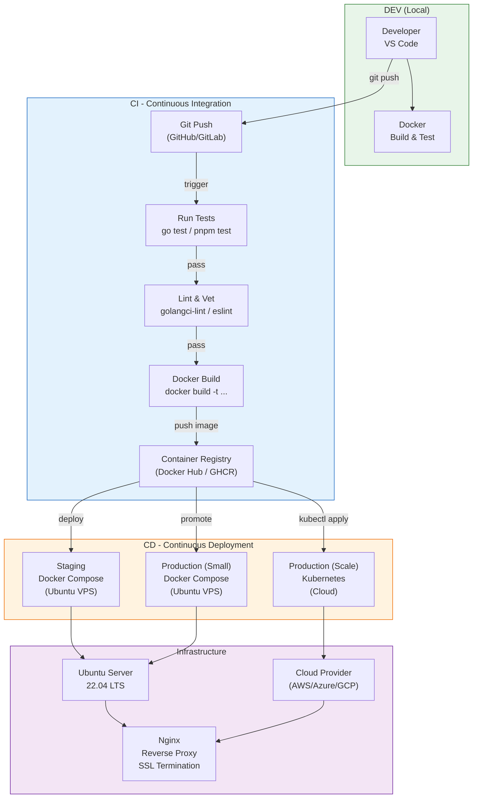

### 13.2 Các Tầng Hạ Tầng

| Tầng | Công nghệ | Vai trò trong LogMon |
|------|-----------|---------------------|
| **Hệ điều hành** | Ubuntu 22.04 LTS | Server chạy Docker, nhẹ, bảo mật, ecosystem lớn |
| **Web Server** | Nginx | Reverse proxy, SSL termination, load balancing |
| **Containerization** | Docker + Docker Compose | Đóng gói services, đảm bảo "build once, run anywhere" |
| **Orchestration** | Docker Compose (small) / K8s (scale) | Quản lý vòng đời containers |
| **CI/CD** | GitHub Actions / GitLab CI / Azure DevOps | Tự động test → build → deploy |
| **Cloud** | AWS / Azure / GCP (khi cần scale) | Compute, networking, managed services |

### 13.3 Luồng Deploy Chi Tiết

> 
>
> Sơ đồ: [diagrams/09-deploy-flow.mmd](diagrams/09-deploy-flow.mmd)

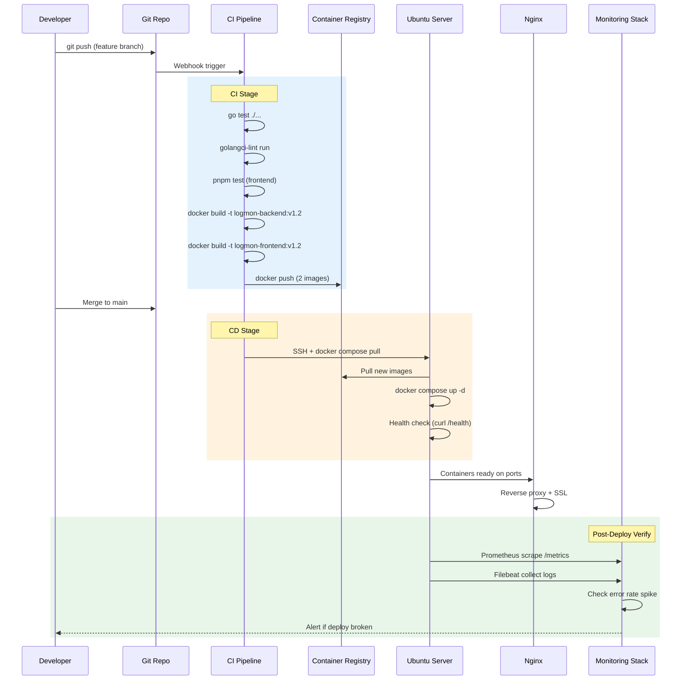

### 13.4 Nginx Reverse Proxy

> 
>
> Sơ đồ: [diagrams/10-nginx-architecture.mmd](diagrams/10-nginx-architecture.mmd)

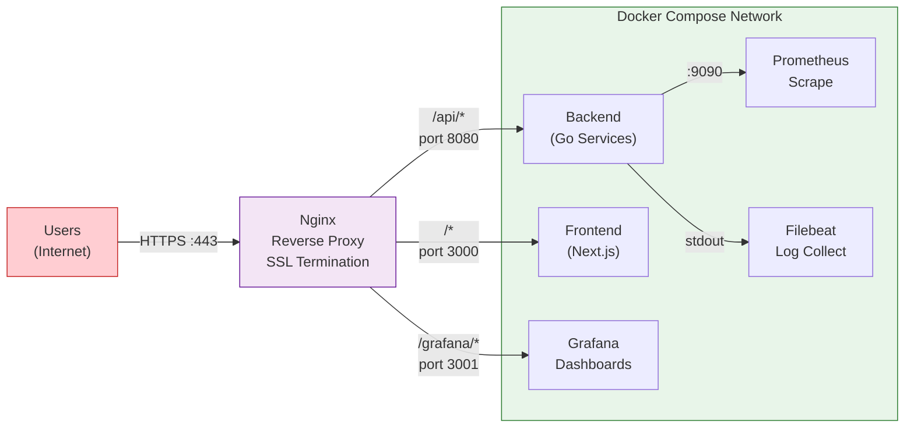

**Nginx config mẫu** (`/etc/nginx/sites-available/logmon`):

```nginx
server {
    listen 443 ssl http2;
    server_name logmon.example.com;

    ssl_certificate     /etc/letsencrypt/live/logmon.example.com/fullchain.pem;
    ssl_certificate_key /etc/letsencrypt/live/logmon.example.com/privkey.pem;

    # Frontend (Next.js)
    location / {
        proxy_pass http://localhost:3000;
        proxy_set_header Host $host;
        proxy_set_header X-Real-IP $remote_addr;
        proxy_set_header X-Forwarded-For $proxy_add_x_forwarded_for;
        proxy_set_header X-Forwarded-Proto $scheme;
    }

    # Backend API
    location /api/ {
        proxy_pass http://localhost:8080;
        proxy_set_header Host $host;
        proxy_set_header X-Real-IP $remote_addr;
        proxy_set_header X-Forwarded-For $proxy_add_x_forwarded_for;
        proxy_set_header X-Forwarded-Proto $scheme;
    }

    # Grafana (internal dashboards)
    location /grafana/ {
        proxy_pass http://localhost:3001/;
        proxy_set_header Host $host;
    }
}

# HTTP → HTTPS redirect
server {
    listen 80;
    server_name logmon.example.com;
    return 301 https://$server_name$request_uri;
}
```

### 13.5 Dockerfile

**Backend** (`backend/Dockerfile`):

```dockerfile
# Build stage
FROM golang:1.22-alpine AS builder
WORKDIR /app
COPY go.mod go.sum ./
RUN go mod download
COPY . .
RUN CGO_ENABLED=0 GOOS=linux go build -o /bin/service ./cmd/orderservice/

# Runtime stage
FROM alpine:3.19
RUN apk --no-cache add ca-certificates
COPY --from=builder /bin/service /bin/service
EXPOSE 8080 9090
HEALTHCHECK --interval=10s --timeout=3s --retries=3 \
    CMD wget -qO- http://localhost:8080/health || exit 1
ENTRYPOINT ["/bin/service"]
```

**Frontend** (`frontend/Dockerfile`):

```dockerfile
# Build stage
FROM node:20-alpine AS builder
WORKDIR /app
RUN corepack enable
COPY package.json pnpm-lock.yaml ./
RUN pnpm install --frozen-lockfile
COPY . .
RUN pnpm build

# Runtime stage
FROM node:20-alpine
WORKDIR /app
RUN corepack enable
COPY --from=builder /app/.next/standalone ./
COPY --from=builder /app/.next/static ./.next/static
COPY --from=builder /app/public ./public
EXPOSE 3000
HEALTHCHECK --interval=10s --timeout=3s --retries=3 \
    CMD wget -qO- http://localhost:3000/ || exit 1
CMD ["node", "server.js"]
```

### 13.6 CI/CD Pipeline (GitHub Actions)

```yaml
# .github/workflows/deploy.yml
name: Build & Deploy LogMon

on:
  push:
    branches: [main]
  pull_request:
    branches: [main]

env:
  REGISTRY: ghcr.io
  IMAGE_PREFIX: ghcr.io/${{ github.repository }}

jobs:
  # ── CI: Test & Build ──────────────────────────
  test-backend:
    runs-on: ubuntu-latest
    steps:
      - uses: actions/checkout@v4
      - uses: actions/setup-go@v5
        with:
          go-version: '1.22'
      - run: cd backend && go test ./...
      - run: cd backend && go vet ./...
      - run: cd backend && golangci-lint run

  test-frontend:
    runs-on: ubuntu-latest
    steps:
      - uses: actions/checkout@v4
      - uses: pnpm/action-setup@v4
      - uses: actions/setup-node@v4
        with:
          node-version: '20'
          cache: 'pnpm'
          cache-dependency-path: frontend/pnpm-lock.yaml
      - run: cd frontend && pnpm install --frozen-lockfile
      - run: cd frontend && pnpm test
      - run: cd frontend && pnpm build

  build-and-push:
    needs: [test-backend, test-frontend]
    if: github.ref == 'refs/heads/main'
    runs-on: ubuntu-latest
    permissions:
      contents: read
      packages: write
    steps:
      - uses: actions/checkout@v4
      - uses: docker/login-action@v3
        with:
          registry: ${{ env.REGISTRY }}
          username: ${{ github.actor }}
          password: ${{ secrets.GITHUB_TOKEN }}

      - name: Build & push backend
        uses: docker/build-push-action@v5
        with:
          context: ./backend
          push: true
          tags: ${{ env.IMAGE_PREFIX }}-backend:${{ github.sha }},${{ env.IMAGE_PREFIX }}-backend:latest

      - name: Build & push frontend
        uses: docker/build-push-action@v5
        with:
          context: ./frontend
          push: true
          tags: ${{ env.IMAGE_PREFIX }}-frontend:${{ github.sha }},${{ env.IMAGE_PREFIX }}-frontend:latest

  # ── CD: Deploy ────────────────────────────────
  deploy-staging:
    needs: build-and-push
    runs-on: ubuntu-latest
    environment: staging
    steps:
      - name: Deploy to staging server
        uses: appleboy/ssh-action@v1
        with:
          host: ${{ secrets.STAGING_HOST }}
          username: ${{ secrets.STAGING_USER }}
          key: ${{ secrets.STAGING_SSH_KEY }}
          script: |
            cd /opt/logmon
            docker compose pull
            docker compose up -d
            sleep 10
            curl -f http://localhost:8080/health || exit 1
            echo "Deploy OK"

  deploy-production:
    needs: deploy-staging
    runs-on: ubuntu-latest
    environment: production  # requires manual approval
    steps:
      - name: Deploy to production server
        uses: appleboy/ssh-action@v1
        with:
          host: ${{ secrets.PROD_HOST }}
          username: ${{ secrets.PROD_USER }}
          key: ${{ secrets.PROD_SSH_KEY }}
          script: |
            cd /opt/logmon
            docker compose pull
            docker compose --profile scale up -d
            sleep 15
            curl -f http://localhost:8080/health || exit 1
            curl -f http://localhost:9090/api/v1/targets | grep -q '"health":"up"' || exit 1
            echo "Production deploy OK"
```

### 13.7 Hướng Dẫn Deploy Từng Bước

#### Bước 1: Chuẩn Bị Server (Ubuntu 22.04)

```bash
# Update system
sudo apt update && sudo apt upgrade -y

# Install Docker
curl -fsSL https://get.docker.com | sh
sudo usermod -aG docker $USER

# Install Docker Compose plugin
sudo apt install docker-compose-plugin -y

# Install Nginx
sudo apt install nginx -y

# Install Certbot (SSL)
sudo apt install certbot python3-certbot-nginx -y
```

#### Bước 2: Clone & Cấu Hình

```bash
# Clone project
git clone <repo-url> /opt/logmon
cd /opt/logmon

# Tạo file environment
cp .env.example .env
# Sửa .env với các giá trị thực tế:
#   POSTGRES_PASSWORD=<strong-password>
#   ELASTIC_PASSWORD=<strong-password>
#   GRAFANA_ADMIN_PASSWORD=<strong-password>
```

#### Bước 3: Deploy Mode A (Dev/Staging — Không Kafka)

```bash
cd /opt/logmon/infra/docker

# Start toàn bộ stack (Mode A: Filebeat → Logstash → ES)
docker compose up -d

# Kiểm tra tất cả services đã healthy
docker compose ps

# Kiểm tra endpoints
curl http://localhost:8080/health          # Backend
curl http://localhost:3000                 # Frontend
curl http://localhost:9090/api/v1/targets  # Prometheus targets
curl http://localhost:9200/_cluster/health # Elasticsearch
curl http://localhost:3001                 # Grafana
```

#### Bước 4: Deploy Mode B (Production — Với Kafka)

```bash
cd /opt/logmon/infra/docker

# Start full stack với Kafka buffer
docker compose --profile scale up -d

# Kiểm tra Kafka
docker compose exec kafka kafka-topics --list --bootstrap-server localhost:9092

# Kiểm tra consumer lag
docker compose exec kafka kafka-consumer-groups \
    --describe --group logstash-consumer \
    --bootstrap-server localhost:9092
```

#### Bước 5: Cấu Hình Nginx & SSL

```bash
# Copy nginx config
sudo cp /opt/logmon/infra/nginx/logmon.conf /etc/nginx/sites-available/logmon
sudo ln -s /etc/nginx/sites-available/logmon /etc/nginx/sites-enabled/

# Test & reload
sudo nginx -t
sudo systemctl reload nginx

# Cài SSL (Let's Encrypt)
sudo certbot --nginx -d logmon.example.com
```

#### Bước 6: Verify Post-Deploy

```bash
# 1. Health check
curl -f https://logmon.example.com/api/health

# 2. Prometheus targets all UP
curl -s http://localhost:9090/api/v1/targets | \
    jq '.data.activeTargets[] | {job: .labels.job, health: .health}'

# 3. Logs flowing vào Elasticsearch
curl -s 'http://localhost:9200/logs-*/_count' | jq '.count'

# 4. Grafana dashboards loaded
curl -s http://localhost:3001/api/dashboards | jq '.[].title'

# 5. Alertmanager reachable
curl -s http://localhost:9093/api/v2/status | jq '.cluster.status'
```

### 13.8 Rollback

Khi deploy lỗi, rollback nhanh bằng cách quay về image trước:

```bash
cd /opt/logmon/infra/docker

# Xem image version hiện tại
docker compose images

# Rollback về version cụ thể
export BACKEND_TAG=v1.1   # version trước
export FRONTEND_TAG=v1.1
docker compose pull
docker compose up -d

# Verify
curl -f http://localhost:8080/health
```

### 13.9 Lộ Trình DevOps cho LogMon

| Giai đoạn | Mục tiêu | Công cụ |
|-----------|----------|---------|
| **Phase 1: MVP** | 1 VPS, Docker Compose, deploy thủ công | Ubuntu + Docker + Nginx |
| **Phase 2: CI/CD** | Tự động test & deploy khi push code | GitHub Actions + SSH deploy |
| **Phase 3: Multi-env** | Staging + Production tách biệt | Docker Compose profiles + GitHub Environments |
| **Phase 4: Scale** | Auto-scaling, high availability | Kubernetes (managed: EKS/AKS/GKE) |

**Nguyên tắc**: Bắt đầu đơn giản nhất có thể. Chỉ thêm complexity khi nhu cầu thực sự phát sinh:

```
Phase 1 (đủ cho 90% startup):
  Ubuntu VPS + Docker Compose + Nginx + Let's Encrypt

Phase 2 (khi team > 3 người):
  + GitHub Actions CI/CD pipeline

Phase 3 (khi có staging/prod riêng):
  + Docker Compose profiles + GitHub Environments

Phase 4 (khi cần auto-scale, HA):
  + Kubernetes + Cloud managed services
```

---

## 14. REST API Specification

> **Convention:** Tất cả endpoints prefix `/api/v1/`. Authentication qua JWT cookie. Response format JSON. Errors trả generic message, log chi tiết internally.

### 14.1 Health & System

| Method | Endpoint | Mô tả | Auth |
|--------|----------|-------|------|
| GET | `/health` | Liveness probe | No |
| GET | `/ready` | Readiness probe (check DB, ES, Redis) | No |
| GET | `/api/v1/system/info` | Version, uptime, component status | Admin |

### 14.2 Authentication

| Method | Endpoint | Mô tả | Auth |
|--------|----------|-------|------|
| POST | `/api/v1/auth/register` | Đăng ký user mới | No |
| POST | `/api/v1/auth/login` | Đăng nhập, trả JWT cookie | No |
| POST | `/api/v1/auth/logout` | Xóa JWT cookie | Yes |
| POST | `/api/v1/auth/refresh` | Refresh JWT token | Yes |
| GET | `/api/v1/auth/me` | Thông tin user hiện tại | Yes |

**Request/Response examples:**
```json
// POST /api/v1/auth/login
// Request:
{ "email": "admin@logmon.io", "password": "***" }

// Response (200 OK):
// Set-Cookie: Auth=<jwt>; HttpOnly; Secure; SameSite=Strict; Path=/; Max-Age=1800
{ "user": { "id": "u-001", "email": "admin@logmon.io", "role": "admin" } }

// Response (401):
{ "error": "invalid credentials" }
```

### 14.3 Alert Rules (Alerting BC)

| Method | Endpoint | Mô tả | Auth |
|--------|----------|-------|------|
| GET | `/api/v1/alerts/rules` | List alert rules (filter: service, severity) | Yes |
| POST | `/api/v1/alerts/rules` | Tạo alert rule mới | Admin |
| GET | `/api/v1/alerts/rules/:id` | Chi tiết rule | Yes |
| PUT | `/api/v1/alerts/rules/:id` | Update rule | Admin |
| DELETE | `/api/v1/alerts/rules/:id` | Xóa rule | Admin |
| GET | `/api/v1/alerts/active` | Active alerts đang firing | Yes |
| POST | `/api/v1/alerts/:id/acknowledge` | Acknowledge alert | Yes |
| POST | `/api/v1/alerts/:id/silence` | Silence alert (time window) | Yes |
| POST | `/api/v1/alerts/:id/resolve` | Resolve alert | Yes |
| GET | `/api/v1/alerts/history` | Alert history (filter: service, severity, time range) | Yes |

**Request/Response examples:**
```json
// POST /api/v1/alerts/rules
// Request:
{
  "name": "high-error-rate",
  "expression": "rate(logmon_http_requests_total{status=~\"5..\"}[5m]) / rate(logmon_http_requests_total[5m]) > 0.05",
  "for": "2m",
  "severity": "critical",
  "service": "order-service",
  "labels": { "runbook_url": "https://wiki.logmon.io/runbooks/high-error-rate" },
  "annotations": { "summary": "Error rate > 5% for {{ $labels.service }}" },
  "notification_channels": ["slack-critical", "email-oncall"]
}

// Response (201 Created):
{
  "id": "rule-001",
  "name": "high-error-rate",
  "status": "active",
  "created_at": "2026-04-02T10:00:00Z"
}

// POST /api/v1/alerts/rule-001/silence
// Request:
{ "duration": "2h", "reason": "Deploying hotfix, expected spike" }
```

### 14.4 SLO (SLO BC)

| Method | Endpoint | Mô tả | Auth |
|--------|----------|-------|------|
| GET | `/api/v1/slos` | List all SLOs | Yes |
| POST | `/api/v1/slos` | Define new SLO | Admin |
| GET | `/api/v1/slos/:id` | SLO detail + current compliance | Yes |
| PUT | `/api/v1/slos/:id` | Update SLO | Admin |
| DELETE | `/api/v1/slos/:id` | Delete SLO | Admin |
| GET | `/api/v1/slos/:id/budget` | Error budget remaining | Yes |
| GET | `/api/v1/slos/:id/burn-rate` | Current burn rate (1h, 6h, 24h) | Yes |
| GET | `/api/v1/slos/compliance` | All SLOs compliance summary | Yes |

```json
// POST /api/v1/slos
// Request:
{
  "name": "order-service-availability",
  "service": "order-service",
  "indicator": "1 - (rate(logmon_http_requests_total{status=~\"5..\",service=\"order-service\"}[30d]) / rate(logmon_http_requests_total{service=\"order-service\"}[30d]))",
  "target": 0.999,
  "window": "30d",
  "alert_burn_rate_threshold": 14.4
}

// GET /api/v1/slos/slo-001/budget → Response:
{
  "slo_id": "slo-001",
  "target": 0.999,
  "current_sli": 0.9995,
  "budget_total": 43.2,
  "budget_remaining": 28.8,
  "budget_remaining_percent": 66.7,
  "burn_rate_1h": 2.1,
  "burn_rate_6h": 1.4,
  "burn_rate_24h": 0.8,
  "window": "30d",
  "status": "healthy"
}
```

### 14.5 Log Pipeline (LogPipeline BC)

| Method | Endpoint | Mô tả | Auth |
|--------|----------|-------|------|
| GET | `/api/v1/pipeline/status` | Pipeline health, mode, throughput | Yes |
| POST | `/api/v1/pipeline/mode` | Switch mode (A ↔ B) | Admin |
| GET | `/api/v1/pipeline/dlq` | DLQ entries (count, samples) | Yes |
| POST | `/api/v1/pipeline/dlq/retry` | Retry DLQ entries | Admin |
| GET | `/api/v1/pipeline/ilm` | Current ILM policy | Yes |
| PUT | `/api/v1/pipeline/ilm` | Update ILM policy | Admin |
| GET | `/api/v1/pipeline/indices` | ES index stats (size, doc count) | Yes |

### 14.6 Log Search API

| Method | Endpoint | Mô tả | Auth |
|--------|----------|-------|------|
| POST | `/api/v1/logs/search` | Full-text log search | Yes |
| GET | `/api/v1/logs/tail` | Real-time log tail (SSE stream) | Yes |
| GET | `/api/v1/logs/trace/:trace_id` | Logs by trace_id | Yes |
| GET | `/api/v1/logs/stats` | Log volume stats (per service, per level) | Yes |

```json
// POST /api/v1/logs/search
// Request:
{
  "query": "error AND order-service",
  "service": "order-service",
  "level": "error",
  "from": "2026-04-02T00:00:00Z",
  "to": "2026-04-02T12:00:00Z",
  "trace_id": "",
  "size": 50,
  "sort": "desc"
}

// Response:
{
  "total": 142,
  "hits": [
    {
      "timestamp": "2026-04-02T10:30:00Z",
      "level": "error",
      "service": "order-service",
      "trace_id": "abc-123",
      "message": "get order: query DB: connection refused",
      "caller": "adapters/postgres/repo.go:42"
    }
  ]
}

// GET /api/v1/logs/tail?service=order-service&level=error
// Response: Server-Sent Events (SSE) stream
// data: {"timestamp":"...","level":"error","message":"..."}
// data: {"timestamp":"...","level":"error","message":"..."}
```

### 14.7 Orders & Users (Clean Architecture BCs)

| Method | Endpoint | Mô tả | Auth |
|--------|----------|-------|------|
| POST | `/api/v1/orders` | Tạo order | Yes |
| GET | `/api/v1/orders/:id` | Chi tiết order | Yes |
| PUT | `/api/v1/orders/:id/cancel` | Cancel order | Yes |
| GET | `/api/v1/orders` | List orders (filter, pagination) | Yes |
| POST | `/api/v1/users` | Register user (admin create) | Admin |
| GET | `/api/v1/users/:id` | Chi tiết user | Yes |
| GET | `/api/v1/users` | List users | Admin |

### 14.8 Multi-tenancy & RBAC

| Method | Endpoint | Mô tả | Auth |
|--------|----------|-------|------|
| GET | `/api/v1/workspaces` | List workspaces user belongs to | Yes |
| POST | `/api/v1/workspaces` | Create workspace | Admin |
| GET | `/api/v1/workspaces/:id/members` | List members | Yes |
| POST | `/api/v1/workspaces/:id/members` | Invite member | Admin |
| PUT | `/api/v1/workspaces/:id/members/:uid/role` | Change member role | Admin |
| DELETE | `/api/v1/workspaces/:id/members/:uid` | Remove member | Admin |

**Pagination convention (tất cả list endpoints):**
```
GET /api/v1/alerts/rules?page=1&per_page=20&sort=created_at&order=desc
Response headers: X-Total-Count: 42, Link: <...?page=2>; rel="next"
```

**Error response format (tất cả endpoints):**
```json
// 400 Bad Request
{ "error": "validation failed", "code": "VALIDATION_ERROR" }

// 401 Unauthorized
{ "error": "authentication required", "code": "AUTH_REQUIRED" }

// 403 Forbidden
{ "error": "insufficient permissions", "code": "FORBIDDEN" }

// 404 Not Found
{ "error": "resource not found", "code": "NOT_FOUND" }

// 500 Internal Server Error
{ "error": "an internal error occurred", "code": "INTERNAL_ERROR" }
// (chi tiết log internally, KHÔNG expose cho client)
```

---

## 15. Database Schema

### 15.1 Shared Tables

```sql
-- Workspace (multi-tenancy)
CREATE TABLE workspaces (
    id          UUID PRIMARY KEY DEFAULT gen_random_uuid(),
    name        VARCHAR(100) NOT NULL,
    slug        VARCHAR(100) NOT NULL UNIQUE,
    created_at  TIMESTAMPTZ NOT NULL DEFAULT now(),
    updated_at  TIMESTAMPTZ NOT NULL DEFAULT now()
);

-- User
CREATE TABLE users (
    id              UUID PRIMARY KEY DEFAULT gen_random_uuid(),
    email           VARCHAR(255) NOT NULL UNIQUE,
    password_hash   BYTEA NOT NULL,
    display_name    VARCHAR(100) NOT NULL,
    created_at      TIMESTAMPTZ NOT NULL DEFAULT now(),
    updated_at      TIMESTAMPTZ NOT NULL DEFAULT now()
);

-- Workspace membership (RBAC)
CREATE TABLE workspace_members (
    workspace_id    UUID NOT NULL REFERENCES workspaces(id) ON DELETE CASCADE,
    user_id         UUID NOT NULL REFERENCES users(id) ON DELETE CASCADE,
    role            VARCHAR(20) NOT NULL DEFAULT 'viewer',  -- admin, editor, viewer
    joined_at       TIMESTAMPTZ NOT NULL DEFAULT now(),
    PRIMARY KEY (workspace_id, user_id)
);
CREATE INDEX idx_wm_user ON workspace_members(user_id);

-- Audit log (immutable)
CREATE TABLE audit_logs (
    id              BIGSERIAL PRIMARY KEY,
    workspace_id    UUID NOT NULL REFERENCES workspaces(id),
    user_id         UUID NOT NULL REFERENCES users(id),
    action          VARCHAR(50) NOT NULL,   -- 'alert_rule.create', 'slo.update', etc.
    resource_type   VARCHAR(50) NOT NULL,
    resource_id     VARCHAR(100) NOT NULL,
    details         JSONB,
    ip_address      INET,
    created_at      TIMESTAMPTZ NOT NULL DEFAULT now()
);
CREATE INDEX idx_audit_workspace_time ON audit_logs(workspace_id, created_at DESC);
```

### 15.2 Alerting BC

```sql
-- Alert Rules
CREATE TABLE alert_rules (
    id                  UUID PRIMARY KEY DEFAULT gen_random_uuid(),
    workspace_id        UUID NOT NULL REFERENCES workspaces(id),
    name                VARCHAR(100) NOT NULL,
    expression          TEXT NOT NULL,           -- PromQL expression
    for_duration        INTERVAL NOT NULL,       -- e.g. '2 minutes'
    severity            VARCHAR(20) NOT NULL,    -- critical, warning, info
    service             VARCHAR(100) NOT NULL,
    labels              JSONB NOT NULL DEFAULT '{}',
    annotations         JSONB NOT NULL DEFAULT '{}',
    notification_channels TEXT[] NOT NULL DEFAULT '{}',
    enabled             BOOLEAN NOT NULL DEFAULT true,
    created_at          TIMESTAMPTZ NOT NULL DEFAULT now(),
    updated_at          TIMESTAMPTZ NOT NULL DEFAULT now(),
    UNIQUE (workspace_id, name)
);
CREATE INDEX idx_rules_workspace_svc ON alert_rules(workspace_id, service);

-- Alert Instances (firing history)
CREATE TABLE alert_instances (
    id              UUID PRIMARY KEY DEFAULT gen_random_uuid(),
    rule_id         UUID NOT NULL REFERENCES alert_rules(id) ON DELETE CASCADE,
    workspace_id    UUID NOT NULL REFERENCES workspaces(id),
    status          VARCHAR(20) NOT NULL DEFAULT 'firing',  -- firing, acknowledged, resolved
    fired_at        TIMESTAMPTZ NOT NULL DEFAULT now(),
    acknowledged_at TIMESTAMPTZ,
    acknowledged_by UUID REFERENCES users(id),
    resolved_at     TIMESTAMPTZ,
    value           DOUBLE PRECISION,       -- metric value that triggered
    labels          JSONB NOT NULL DEFAULT '{}'
);
CREATE INDEX idx_instances_workspace_status ON alert_instances(workspace_id, status);
CREATE INDEX idx_instances_rule ON alert_instances(rule_id, fired_at DESC);

-- Silences
CREATE TABLE silences (
    id              UUID PRIMARY KEY DEFAULT gen_random_uuid(),
    workspace_id    UUID NOT NULL REFERENCES workspaces(id),
    rule_id         UUID REFERENCES alert_rules(id) ON DELETE CASCADE,
    service         VARCHAR(100),           -- silence all alerts for service (if rule_id is null)
    reason          TEXT NOT NULL,
    created_by      UUID NOT NULL REFERENCES users(id),
    starts_at       TIMESTAMPTZ NOT NULL DEFAULT now(),
    ends_at         TIMESTAMPTZ NOT NULL,
    created_at      TIMESTAMPTZ NOT NULL DEFAULT now()
);
CREATE INDEX idx_silences_active ON silences(workspace_id, ends_at) WHERE ends_at > now();
```

### 15.3 SLO BC

```sql
-- SLO Definitions
CREATE TABLE slos (
    id              UUID PRIMARY KEY DEFAULT gen_random_uuid(),
    workspace_id    UUID NOT NULL REFERENCES workspaces(id),
    name            VARCHAR(100) NOT NULL,
    service         VARCHAR(100) NOT NULL,
    indicator       TEXT NOT NULL,           -- PromQL expression cho SLI
    target          DOUBLE PRECISION NOT NULL,  -- e.g. 0.999
    window          INTERVAL NOT NULL,       -- e.g. '30 days'
    alert_burn_rate DOUBLE PRECISION NOT NULL DEFAULT 14.4,
    created_at      TIMESTAMPTZ NOT NULL DEFAULT now(),
    updated_at      TIMESTAMPTZ NOT NULL DEFAULT now(),
    UNIQUE (workspace_id, name)
);

-- SLO Compliance snapshots (materialized, updated periodically)
CREATE TABLE slo_snapshots (
    id                      BIGSERIAL PRIMARY KEY,
    slo_id                  UUID NOT NULL REFERENCES slos(id) ON DELETE CASCADE,
    current_sli             DOUBLE PRECISION NOT NULL,
    budget_total_minutes    DOUBLE PRECISION NOT NULL,
    budget_remaining_minutes DOUBLE PRECISION NOT NULL,
    burn_rate_1h            DOUBLE PRECISION NOT NULL,
    burn_rate_6h            DOUBLE PRECISION NOT NULL,
    burn_rate_24h           DOUBLE PRECISION NOT NULL,
    recorded_at             TIMESTAMPTZ NOT NULL DEFAULT now()
);
CREATE INDEX idx_slo_snap ON slo_snapshots(slo_id, recorded_at DESC);
```

### 15.4 LogPipeline BC

```sql
-- Pipeline configuration
CREATE TABLE pipeline_configs (
    id              UUID PRIMARY KEY DEFAULT gen_random_uuid(),
    workspace_id    UUID NOT NULL REFERENCES workspaces(id),
    mode            VARCHAR(10) NOT NULL DEFAULT 'A',  -- A or B
    ilm_hot_days    INT NOT NULL DEFAULT 7,
    ilm_warm_days   INT NOT NULL DEFAULT 30,
    ilm_delete_days INT NOT NULL DEFAULT 90,
    updated_at      TIMESTAMPTZ NOT NULL DEFAULT now(),
    updated_by      UUID REFERENCES users(id),
    UNIQUE (workspace_id)
);

-- Dead Letter Queue tracking
CREATE TABLE dlq_entries (
    id              BIGSERIAL PRIMARY KEY,
    workspace_id    UUID NOT NULL REFERENCES workspaces(id),
    raw_message     TEXT NOT NULL,
    error_reason    TEXT NOT NULL,
    source_service  VARCHAR(100),
    retry_count     INT NOT NULL DEFAULT 0,
    status          VARCHAR(20) NOT NULL DEFAULT 'pending',  -- pending, retried, discarded
    created_at      TIMESTAMPTZ NOT NULL DEFAULT now(),
    retried_at      TIMESTAMPTZ
);
CREATE INDEX idx_dlq_workspace_status ON dlq_entries(workspace_id, status);
```

### 15.5 Order BC

```sql
CREATE TABLE orders (
    id          UUID PRIMARY KEY DEFAULT gen_random_uuid(),
    user_id     UUID NOT NULL,
    status      VARCHAR(20) NOT NULL DEFAULT 'pending',  -- pending, confirmed, cancelled
    total       DECIMAL(12,2) NOT NULL,
    currency    VARCHAR(3) NOT NULL DEFAULT 'VND',
    items       JSONB NOT NULL,
    created_at  TIMESTAMPTZ NOT NULL DEFAULT now(),
    updated_at  TIMESTAMPTZ NOT NULL DEFAULT now()
);
CREATE INDEX idx_orders_user ON orders(user_id, created_at DESC);
CREATE INDEX idx_orders_status ON orders(status);
```

### 15.6 ERD Overview

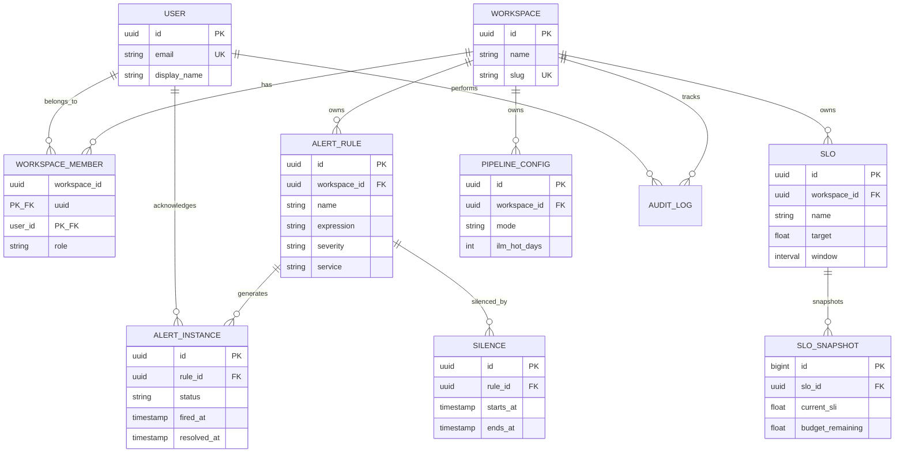

---

## 16. Multi-tenancy & RBAC

### 16.1 Tenant Model

LogMon hỗ trợ multi-tenancy qua **Workspace** — mỗi team/project có workspace riêng với data isolation:

```
Platform
  └── Workspace "backend-team"
  │     ├── Alert Rules (chỉ thấy rules của team mình)
  │     ├── SLOs (chỉ thấy SLOs của team mình)
  │     ├── Logs (filtered theo services của team)
  │     ├── Members (admin, editor, viewer)
  │     └── Audit Log
  └── Workspace "infra-team"
        ├── Alert Rules
        ├── SLOs
        └── ...
```

**Data isolation strategy:**
- **PostgreSQL**: Mọi table có `workspace_id` column + composite indexes → row-level filtering
- **Elasticsearch**: Index pattern `logs-{workspace}-{service}-{yyyy.MM.dd}` → workspace prefix isolation
- **Prometheus/Thanos**: Label `workspace` trên mọi metric → PromQL filter `{workspace="backend-team"}`
- **Jaeger**: Tag `workspace` trên mọi trace → filtered by workspace in query

### 16.2 RBAC Roles

| Role | Alert Rules | SLOs | Pipeline | Logs | Users | Workspace |
|------|-------------|------|----------|------|-------|-----------|
| **viewer** | Read | Read | Read status | Search | - | - |
| **editor** | CRUD | CRUD | Read status | Search | - | - |
| **admin** | CRUD | CRUD | CRUD + mode switch | Search + tail | Manage members | Manage settings |
| **platform_admin** | All workspaces | All | All | All | All | Create/delete workspaces |

### 16.3 Middleware Chain (updated with RBAC)

```
Request → Recovery → Logging → Metrics → Auth(JWT) → Workspace(extract) → RBAC(check role) → Handler
```

```go
// shared/middleware/workspace.go
func WorkspaceMiddleware() gin.HandlerFunc {
    return func(c *gin.Context) {
        workspaceID := c.GetHeader("X-Workspace-ID")
        if workspaceID == "" {
            workspaceID = c.Query("workspace_id")
        }
        if workspaceID == "" {
            c.AbortWithStatusJSON(400, gin.H{"error": "workspace required"})
            return
        }
        c.Set("workspace_id", workspaceID)
        c.Next()
    }
}

// shared/middleware/rbac.go
func RequireRole(minRole string) gin.HandlerFunc {
    return func(c *gin.Context) {
        userID := c.GetString("user_id")        // from JWT
        wsID := c.GetString("workspace_id")     // from WorkspaceMiddleware
        role, err := memberRepo.GetRole(c, wsID, userID)
        if err != nil || !hasMinRole(role, minRole) {
            c.AbortWithStatusJSON(403, gin.H{"error": "insufficient permissions"})
            return
        }
        c.Set("user_role", role)
        c.Next()
    }
}
```

---

## 17. Capacity Planning & Sizing Guide

### 17.1 Sizing Profiles

| Profile | Services | Log Volume | Metrics | Traces | Team Size |
|---------|----------|------------|---------|--------|-----------|
| **Small** (Dev/Startup) | 2-5 | < 5K logs/s, < 5 GB/day | < 10K series | 10% sampling | 1-5 |
| **Medium** (Scale-up) | 5-20 | 5-20K logs/s, 5-50 GB/day | 10-100K series | 10% sampling | 5-20 |
| **Large** (Enterprise) | 20-100 | 20-100K logs/s, 50-500 GB/day | 100K-1M series | 5% sampling | 20-100 |

### 17.2 Resource Requirements

| Component | Small | Medium | Large |
|-----------|-------|--------|-------|
| **Go Services** (each) | 128 MB RAM, 0.25 CPU | 256 MB RAM, 0.5 CPU | 512 MB RAM, 1 CPU |
| **PostgreSQL** | 1 GB RAM, 20 GB disk | 4 GB RAM, 100 GB disk | 8 GB RAM, 500 GB disk |
| **Redis** | 256 MB RAM | 1 GB RAM | 4 GB RAM |
| **Prometheus** | 2 GB RAM, 50 GB disk | 4 GB RAM, 200 GB disk | 8 GB RAM, 500 GB disk |
| **Thanos (all components)** | 512 MB RAM | 2 GB RAM | 4 GB RAM |
| **Elasticsearch** | 2 GB RAM, 50 GB disk (1 node) | 12 GB RAM, 600 GB disk (3 nodes) | 40 GB RAM, 2.5 TB disk (5 nodes) |
| **Kafka** | Không cần (Mode A) | 3 GB RAM, 50 GB disk (3 brokers) | 6 GB RAM, 200 GB disk (3 brokers) |
| **Jaeger** | 512 MB RAM (in-memory) | 1 GB RAM (ES backend) | 2 GB RAM (ES backend) |
| **OTel Collector** | 256 MB RAM | 512 MB RAM | 1 GB RAM |
| **Grafana** | 256 MB RAM | 512 MB RAM | 1 GB RAM |
| **MinIO** | 512 MB RAM, 100 GB disk | 1 GB RAM, 500 GB disk | 2 GB RAM, 2 TB disk |
| **Filebeat** (per host) | 128 MB RAM | 256 MB RAM | 512 MB RAM |
| **Logstash** | 1 GB RAM | 2 GB RAM | 4 GB RAM |
| **Nginx** | 128 MB RAM | 256 MB RAM | 512 MB RAM |
| **TOTAL** | ~8 GB RAM, 270 GB disk | ~32 GB RAM, 1.5 TB disk | ~80 GB RAM, 6 TB disk |

### 17.3 Infrastructure Cost Estimate

| Profile | Self-hosted (VPS) | vs Datadog | vs New Relic | vs Grafana Cloud |
|---------|-------------------|------------|--------------|------------------|
| **Small** | 1x VPS 8GB RAM ~$40/mo | $15/host × 5 = $75/mo | Free tier (100 GB) | Free tier (50 GB logs) |
| **Medium** | 2-3x VPS 16GB ~$150-250/mo | $15/host × 20 = $300/mo + $0.10/GB logs | $0.40/GB × 50 GB = $20/mo + $49/user | $0.55/GB × 50 GB = $28/mo |
| **Large** | 4-6x VPS 32GB ~$500-1000/mo | $15/host × 100 = $1500/mo + logs | $0.40/GB × 500 = $200/mo + users | $0.55/GB × 500 = $275/mo |

> **Insight từ free-for-dev analysis**: LogMon self-hosted rẻ hơn SaaS ở Medium-Large scale, nhưng cần ops effort. Small scale nên dùng SaaS free tiers (New Relic 100 GB, Grafana Cloud 50 GB) cho tới khi outgrow.

### 17.4 Disk Calculation Formula

```
Elasticsearch daily disk = (log_volume_per_day_GB) × (1 + replica_count) × 1.1 (overhead)
Elasticsearch total disk = daily_disk × retention_days

Prometheus disk (15d) = (metric_series × 2 bytes × scrape_interval_seconds × 86400 × 15) / compression_ratio
  Example: 50K series × 2B × (86400/15) × 15 / 10 = ~8.6 GB

Thanos object storage (1 year) = Prometheus_15d_size × (365/15) × 0.3 (downsampling compression)
  Example: 8.6 GB × 24.3 × 0.3 = ~63 GB

Kafka disk = log_volume_per_hour_GB × retention_hours × (1 + replica_factor)
  Example: 2 GB/h × 24h × 2 = 96 GB
```

---

## 18. Backup & Disaster Recovery

### 18.1 Backup Strategy

| Component | Backup Method | Frequency | Retention | Storage |
|-----------|---------------|-----------|-----------|---------|
| **PostgreSQL** | `pg_dump` (logical) + WAL archiving | Daily full + continuous WAL | 30 ngày | MinIO/S3 |
| **Elasticsearch** | Snapshot API → MinIO/S3 repository | Daily snapshot | 30 ngày (snapshots) | MinIO/S3 |
| **Prometheus TSDB** | Thanos auto-upload blocks | Every 2h (automatic) | 1 năm (Thanos) | MinIO/S3 |
| **Grafana** | Dashboard JSON export + provisioning git | On change (git commit) | Git history | Git repo |
| **Kafka** | Topic mirroring (MirrorMaker 2) cho DR | Continuous | 24h (same as topic) | DR cluster |
| **Configuration** | Docker Compose + configs in git | On change | Git history | Git repo |

### 18.2 Backup Scripts

```bash
#!/bin/bash
# /opt/logmon/scripts/backup.sh — chạy via cron daily 02:00 UTC

set -euo pipefail
BACKUP_DATE=$(date +%Y-%m-%d)
MINIO_BUCKET="logmon-backups"

# 1. PostgreSQL backup
echo "Backing up PostgreSQL..."
docker compose exec -T postgres pg_dump -U logmon -Fc logmon_db \
  > "/tmp/pg-${BACKUP_DATE}.dump"
mc cp "/tmp/pg-${BACKUP_DATE}.dump" "minio/${MINIO_BUCKET}/postgres/"
rm "/tmp/pg-${BACKUP_DATE}.dump"

# 2. Elasticsearch snapshot
echo "Creating ES snapshot..."
curl -s -X PUT "localhost:9200/_snapshot/s3_backup/snapshot-${BACKUP_DATE}" \
  -H 'Content-Type: application/json' \
  -d '{"indices": "logs-*,jaeger-*", "ignore_unavailable": true}'

# 3. Grafana dashboards (git-based)
echo "Exporting Grafana dashboards..."
for uid in $(curl -s localhost:3001/api/search | jq -r '.[].uid'); do
  curl -s "localhost:3001/api/dashboards/uid/${uid}" | jq '.dashboard' \
    > "infra/grafana/dashboards/${uid}.json"
done

echo "Backup completed: ${BACKUP_DATE}"
```

### 18.3 Disaster Recovery Plan

| Scenario | RTO | RPO | Recovery Steps |
|----------|-----|-----|----------------|
| **Single service crash** | < 1m | 0 | Docker auto-restart (restart policy: unless-stopped) |
| **PostgreSQL data loss** | < 30m | < 24h | Restore from latest pg_dump + WAL replay |
| **ES index corruption** | < 1h | < 24h | Restore from S3 snapshot |
| **Prometheus TSDB loss** | < 5m | < 2h | Thanos Store Gateway serves from object storage |
| **Full server failure** | < 2h | < 24h | Spin new VPS, restore from backups |
| **Kafka cluster loss** | < 30m | < 24h (logs only) | Recreate topics, Filebeat replays from position file |

### 18.4 Recovery Procedures

```bash
# PostgreSQL recovery
docker compose exec -T postgres pg_restore -U logmon -d logmon_db \
  < /path/to/pg-backup.dump

# Elasticsearch recovery
curl -X POST "localhost:9200/_snapshot/s3_backup/snapshot-2026-04-01/_restore" \
  -H 'Content-Type: application/json' \
  -d '{"indices": "logs-*"}'

# Prometheus — không cần manual recovery
# Thanos Store Gateway tự động serve historical data từ MinIO
# Prometheus tự bắt đầu scrape lại, TSDB rebuild tự động
```

---

## 19. Architecture Decisions (Bổ sung)

### ADR 010: OpenTelemetry cho Distributed Tracing

**Status:** Accepted

**Context:** LogMon chỉ có metrics + logs, thiếu trụ cột thứ 3 của observability: distributed tracing. Debug cross-service request failures mà không có trace context là nightmare. Phân tích 17+ nền tảng log management (Datadog, New Relic, Grafana Stack, SigNoz, OpenObserve) cho thấy unified observability (logs + metrics + traces) là industry standard, không phải premium feature.

**Decision:** Áp dụng OpenTelemetry (OTel) làm tracing standard:
- OTel SDK cho Go services (auto-instrumentation cho Gin, pgx, go-redis)
- OTel Collector làm processing pipeline (sampling, batching)
- Jaeger làm trace storage backend (dùng chung ES cluster)
- W3C Trace Context cho span propagation
- `trace_id` + `span_id` inject vào mọi log entry → trace-to-log correlation

**Consequences:**
- (+) Debug cross-service requests: xem entire request path, identify bottleneck
- (+) Trace-to-log correlation: click trace → xem logs liên quan, click log → xem trace context
- (+) Span metrics: OTel Collector auto-generate RED metrics từ traces → giảm manual instrumentation
- (+) Vendor-neutral: OTel là CNCF standard, switch backend (Jaeger → Tempo → X-Ray) chỉ đổi exporter
- (-) Thêm latency ~1-2ms per request (batch export giảm thiểu)
- (-) Storage: traces high volume, cần aggressive sampling (10% default, 100% errors)

### ADR 011: Thanos cho Long-term Metrics Storage

**Status:** Accepted

**Context:** Prometheus local retention 15 ngày mâu thuẫn với SLO BC cần 30-90 ngày data. Alternatives: (1) Tăng Prometheus retention → RAM/disk tăng linearly, (2) VictoriaMetrics, (3) Thanos, (4) Cortex/Mimir.

**Decision:** Thanos Sidecar + Store Gateway + Object Storage (MinIO):
- Sidecar chạy cạnh Prometheus, upload TSDB blocks → MinIO mỗi 2h
- Store Gateway serve historical queries từ MinIO
- Thanos Query unified endpoint (merge Prometheus + Store)
- Compactor chạy downsampling: raw → 5m → 1h → 24h

**Consequences:**
- (+) Prometheus RAM/disk không tăng — chỉ giữ 15 ngày local
- (+) MinIO storage rẻ (~$0.01/GB/month), 1 năm metrics ~$0.63/month (estimate)
- (+) Grafana query Thanos thay vì Prometheus → transparent long-term access
- (-) Thêm 3 components (Sidecar, Store, Compactor) — nhưng lightweight
- (-) Historical queries chậm hơn local (acceptable cho dashboard, not for alerting)

### ADR 012: Multi-tenancy via Workspace Model

**Status:** Accepted

**Context:** Real-world deployment cần nhiều teams dùng chung 1 LogMon instance. Phân tích market: mọi SaaS log platform (Datadog, New Relic, Grafana Cloud) đều có team/org isolation. LogMon không có → không thể dùng ngoài single-team.

**Decision:** Row-level multi-tenancy qua `workspace_id`:
- PostgreSQL: `workspace_id` column + composite indexes trên mọi table
- Elasticsearch: index pattern prefix `logs-{workspace_slug}-{service}-{date}`
- Prometheus: label `workspace` trên mọi metric
- RBAC: 4 roles (viewer, editor, admin, platform_admin)

**Consequences:**
- (+) Shared infrastructure — 1 cluster serve nhiều teams, giảm cost
- (+) Data isolation — team A không thể xem data team B
- (+) Self-service — team admin quản lý members, rules, SLOs riêng
- (-) Query complexity tăng (luôn phải filter workspace)
- (-) Noisy neighbor risk (1 team heavy usage ảnh hưởng team khác) — mitigate bằng rate limiting

### ADR 013: Log Search API (thay vì chỉ Grafana/Kibana UI)

**Status:** Accepted

**Context:** LogMon hiện chỉ expose logs qua Grafana UI (embed iframe). Phân tích free-for-dev: 90%+ platforms cung cấp REST API cho log search, cho phép automation, custom dashboards, CLI tools. Thiếu API = thiếu programmability.

**Decision:** Thêm Log Search API endpoints:
- `POST /api/v1/logs/search` — full-text search với filters (service, level, time range, trace_id)
- `GET /api/v1/logs/tail` — real-time log tail via Server-Sent Events (SSE)
- `GET /api/v1/logs/trace/:trace_id` — logs by trace ID
- Backend proxy Elasticsearch queries, thêm workspace filtering + auth

**Consequences:**
- (+) Programmable: CI/CD scripts query logs, custom dashboards, CLI tools
- (+) SSE tail: real-time monitoring mà không cần Grafana
- (+) Trace correlation: click trace_id → xem all logs across services
- (-) Thêm load lên backend (proxy ES queries) — mitigate bằng rate limiting + cache

### ADR 014: Incident Management BC

**Status:** Accepted

**Context:** AlertFired → Slack/Email là notification, không phải incident management. Production systems cần full lifecycle: create → triage → assign → mitigate → resolve → postmortem. Thiếu incident tracking = thiếu MTTR measurement, thiếu accountability, thiếu organizational learning từ postmortems.

**Decision:** Thêm `incident/` BC (Clean Arch + DDD + CQRS):
- Aggregate Root: `Incident` với state machine (open → triaged → assigned → mitigating → resolved → postmortem_pending → closed)
- Auto-create từ critical alerts (firing > 5m) hoặc SLO budget exhaustion
- On-call rotation + escalation policy
- Postmortem entity với action items tracking
- MTTR/MTTA/MTBF metrics tự động calculate

**Consequences:**
- (+) Measurable reliability: MTTR trend over time
- (+) Accountability: clear owner for every incident
- (+) Organizational learning: blameless postmortems → action items → fewer repeat incidents
- (-) Thêm 1 BC, ~10 DB tables, 15+ API endpoints

### ADR 015: Notification Hub thay vì Hardcoded Slack/Email

**Status:** Accepted

**Context:** Alerting BC hiện hardcode Slack + Email adapters. Real-world cần PagerDuty (on-call), Teams (enterprise), generic webhooks (custom integrations). Mỗi team có notification preferences khác nhau.

**Decision:** Tách notification thành BC riêng (`notification/`) với plugin architecture:
- Channel interface: `Sender { Send(ctx, message) error }`
- Implementations: Slack, Email, PagerDuty, Teams, generic webhook
- Template engine: Go `text/template` cho notification formatting
- Delivery queue: Redis-based job queue với retry + exponential backoff
- Per-workspace channel configuration

**Consequences:**
- (+) Extensible: thêm channel mới = implement 1 interface
- (+) Reliable delivery: retry queue prevents message loss
- (+) Self-service: teams configure own channels, không cần platform admin
- (-) Complexity: async delivery, eventual consistency cho notification status

### ADR 016: Transactional Outbox Pattern cho Event Bus

**Status:** Accepted

**Context:** In-memory event bus (ADR 009) có SPOF: nếu crash sau DB write nhưng trước event publish → event mất → cross-BC inconsistency. Với incident management và notification hub, event reliability trở thành critical.

**Decision:** Transactional Outbox Pattern:
- Events được INSERT vào `outbox_events` table trong cùng DB transaction với business data
- Background relay goroutine polls outbox mỗi 100ms, publish to in-memory bus
- Idempotent subscribers (dedup by event ID)
- Evolution path: Outbox → Kafka → CDC (Debezium) khi cần scale

**Consequences:**
- (+) At-least-once delivery: events persisted cùng transaction, không bao giờ mất
- (+) Audit trail tự nhiên: outbox table = event log
- (+) Simple: polling pattern, không cần thêm infrastructure (Kafka)
- (-) Polling delay: ~100ms latency (acceptable cho monitoring use cases)
- (-) DB load: thêm inserts + polling queries (mitigate: batch processing, periodic cleanup)

### ADR 017: Object Storage Tiering cho Cost Optimization

**Status:** Accepted

**Context:** Phân tích market pricing: per-GB storage là chi phí lớn nhất. Parseable/OpenObserve giảm 95%+ cost bằng object storage. ELK stack tốn 10x Loki vì full-text index. LogMon cần balance giữa search capability (ES mạnh) và cost (ES đắt ở scale).

**Decision:** 3-tier storage:
- **Hot** (0-7 ngày): Elasticsearch SSD — full-text search, real-time
- **Warm** (7-30 ngày): Elasticsearch HDD — search OK, cost thấp hơn
- **Cold** (30-90+ ngày): ES snapshot → MinIO/S3 — restore khi cần, very low cost

Thanos cho metrics cũng theo pattern tương tự: Prometheus local → MinIO.

**Consequences:**
- (+) Cost giảm 5-10x cho data >7 ngày
- (+) Retention dài hơn (180 ngày thay vì 90 ngày) cùng budget
- (+) Compliance: giữ audit logs 2 năm trên object storage
- (-) Cold tier cần restore time (minutes) — không real-time search
- (-) Thêm MinIO component — nhưng MinIO lightweight và dùng chung cho Thanos + ES + backup

---

## 20. Competitive Positioning

> Phân tích dựa trên 17+ nền tảng log management từ [free-for-dev](https://github.com/ripienaar/free-for-dev#log-management) và các platform phổ biến.

### 20.1 LogMon vs Market

| Feature | LogMon | Datadog | Grafana Stack | OpenObserve | ELK (self-hosted) |
|---------|--------|---------|---------------|-------------|-------------------|
| **Metrics** | Prometheus + Thanos | Agent + integrations | Prometheus/Mimir | Built-in | Elastic Metrics |
| **Logs** | ELK pipeline + Search API | Native | Loki (label-based) | Built-in (SQL query) | Elasticsearch |
| **Tracing** | OpenTelemetry + Jaeger | Full APM | Tempo | Built-in | Elastic APM |
| **Alerting** | DDD-based (inhibition, escalation, silence) | Native + ML anomaly | Grafana Alerting | Built-in | Elastic Alerting |
| **SLO** | Custom BC (error budget, burn rate) | Built-in | Grafana Cloud SLO | N/A | N/A |
| **Multi-tenancy** | Workspace + RBAC | Built-in | Organizations | Built-in | X-Pack Security |
| **Log Search** | Full-text (ES) + REST API | Native | Label + regex | SQL-based | Kibana + ES API |
| **Dashboard** | Grafana + Next.js | Native | Grafana | Built-in | Kibana |
| **Incident Management** | Full lifecycle + postmortem + on-call | Built-in | Grafana OnCall | N/A | N/A |
| **Notification Hub** | Slack, Email, PagerDuty, Teams, webhooks | Built-in | Built-in | Built-in | X-Pack Watcher |
| **Cost (Medium)** | ~$150-250/mo (self-hosted) | ~$300+/mo | ~$28/mo (cloud) | Free (self-hosted) | Free (self-hosted) |
| **Ops Effort** | High (self-hosted) | Zero (SaaS) | Low (cloud) / High (self-hosted) | Medium | High |

### 20.2 LogMon Differentiators

1. **DDD-based Alerting + Incident Management**: Alert → auto-create incident → triage → assign → resolve → postmortem. Full SRE workflow, không chỉ notification
2. **SLO-first Design**: Dedicated SLO BC với error budget tracking, burn rate alerts, MTTR measurement — Google SRE practices built-in
3. **Full Observability Stack tự vận hành**: Metrics + Logs + Traces + SLOs + Incidents trên single platform, self-hosted, không vendor lock-in
4. **Log Pipeline Management UI**: Switch modes, DLQ retry, ILM policy management, cost monitoring qua API — không cần SSH vào server
5. **Extensible Notification Hub**: Slack, Email, PagerDuty, Teams, generic webhooks — teams self-configure channels và templates
6. **Cost-effective tại scale**: Self-hosted trên VPS rẻ hơn SaaS 2-5x ở medium-large scale. Rate limiting + log sampling control costs
7. **Event-driven Architecture**: Transactional outbox pattern → at-least-once delivery → reliable cross-BC communication

### 20.3 Feature Benchmark (vs Free Tier Standards)

Dựa trên phân tích free tiers từ 17+ platforms, đây là "table stakes" mà LogMon cần đáp ứng:

| Standard Feature | LogMon Status | Notes |
|-----------------|---------------|-------|
| Structured log ingestion (JSON, syslog) | ✅ Done | zerolog JSON → Filebeat → ES |
| Full-text search | ✅ Done | Elasticsearch |
| Real-time log tail | ✅ Done | SSE endpoint `/api/v1/logs/tail` |
| REST API cho log search | ✅ Done | `/api/v1/logs/search` |
| Alerting với routing | ✅ Done | Alertmanager + custom DDD BC |
| Dashboard visualization | ✅ Done | Grafana + Next.js |
| Multi-source collection | ✅ Done | Filebeat (Docker, files), OTel SDK |
| Retention policies | ✅ Done | ILM (hot/warm/cold) + Thanos |
| Team collaboration (RBAC) | ✅ Done | Workspace + 4 roles |
| Distributed tracing | ✅ Done | OpenTelemetry + Jaeger |
| Trace-to-log correlation | ✅ Done | trace_id + span_id in logs |
| Long-term metrics | ✅ Done | Thanos + MinIO (1 year) |
| Incident management lifecycle | ✅ Done | Full BC: Create → Triage → Assign → Mitigate → Resolve → Postmortem |
| Service topology / dependency map | ✅ Done | Auto-discover từ traces, real-time health map |
| Rate limiting / log sampling | ✅ Done | Per-workspace quotas, tail sampling, cost control |
| Notification hub (multi-channel) | ✅ Done | Slack, Email, PagerDuty, Teams, generic webhooks |
| Scheduled reports / data export | ✅ Done | SLO compliance reports, CSV/PDF export, email scheduling |
| Inter-service resilience | ✅ Done | Circuit breaker, retry, timeout patterns |
| SQL-based log query | ❌ Future | Consider adding ClickHouse adapter |
| AI/ML anomaly detection | ❌ Future | Consider ML pipeline cho alert rules |

---

## 21. Incident Management

### 21.1 Tổng Quan

Incident Management là **Bounded Context mới** (Clean Architecture + DDD + CQRS), quản lý toàn bộ lifecycle của sự cố từ phát hiện đến postmortem. Đây là bridge giữa alerting (phát hiện) và operations (xử lý).

```
AlertFired ──→ Incident Created ──→ Triage ──→ Assign ──→ Mitigate ──→ Resolve ──→ Postmortem
                    │                                         │              │
                    │                                         ▼              ▼
                    └── Auto-create từ ──────────── Notify On-call ──── Update SLO
                        critical alerts                    (PagerDuty)     Error Budget
```

**Tại sao cần:** Phân tích market cho thấy 100% nền tảng enterprise (Datadog, PagerDuty, Grafana OnCall) có incident management. AlertFired → Slack chỉ là bước 1. Thiếu lifecycle tracking = thiếu accountability, thiếu MTTR measurement, thiếu postmortem learning.

### 21.2 Domain Model (DDD)

| DDD Concept | Implementation | Mô tả |
|-------------|---------------|-------|
| **Aggregate Root** | `Incident` | Quản lý lifecycle: create → triage → assign → mitigate → resolve → postmortem |
| **Entity** | `IncidentTimeline` | Chuỗi events xảy ra trong incident (mỗi entry là 1 timeline event) |
| **Entity** | `Postmortem` | Bài học sau incident: root cause, action items, blameless review |
| **Value Object** | `IncidentSeverity` | SEV1 (critical, < 15m response) / SEV2 (major, < 1h) / SEV3 (minor, < 4h) / SEV4 (low) |
| **Value Object** | `IncidentStatus` | open → triaged → assigned → mitigating → resolved → postmortem_pending → closed |
| **Value Object** | `OnCallSchedule` | Rotation schedule: primary + secondary on-call per team |
| **Domain Event** | `IncidentCreated` | Trigger: auto (from AlertFired) hoặc manual |
| **Domain Event** | `IncidentAssigned` | Notify assignee qua PagerDuty/Slack |
| **Domain Event** | `IncidentResolved` | Update SLO error budget, stop timers |
| **Domain Event** | `PostmortemCompleted` | Tạo action items, archive blameless review |

### 21.3 Incident Lifecycle & State Machine

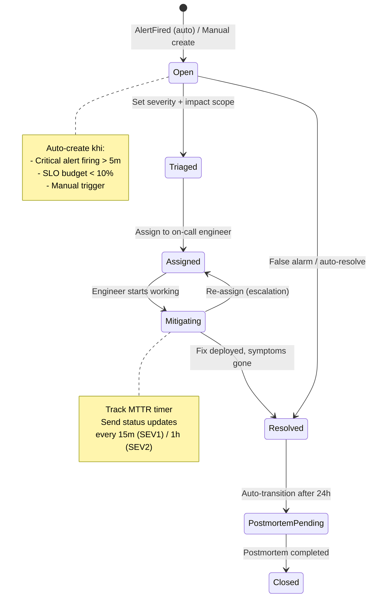

### 21.4 MTTR & Metrics

| Metric | Mô tả | Prometheus metric |
|--------|-------|-------------------|
| **MTTA** (Mean Time to Acknowledge) | Từ IncidentCreated → Assigned | `logmon_incident_mtta_seconds` |
| **MTTR** (Mean Time to Resolve) | Từ IncidentCreated → Resolved | `logmon_incident_mttr_seconds` |
| **MTBF** (Mean Time Between Failures) | Khoảng cách giữa incidents | `logmon_incident_mtbf_seconds` |
| **Incident Count** | Tổng incidents theo severity, service | `logmon_incidents_total{severity, service}` |
| **Open Incidents** | Incidents đang active | `logmon_incidents_open{severity}` |

### 21.5 On-Call Rotation

```json
// On-call schedule configuration
{
  "workspace_id": "ws-001",
  "team": "backend-team",
  "rotation": "weekly",
  "timezone": "Asia/Ho_Chi_Minh",
  "schedules": [
    {
      "role": "primary",
      "members": ["user-001", "user-002", "user-003"],
      "handoff_time": "09:00",
      "handoff_day": "monday"
    },
    {
      "role": "secondary",
      "members": ["user-004", "user-005"],
      "handoff_time": "09:00",
      "handoff_day": "monday"
    }
  ],
  "escalation_policy": {
    "levels": [
      { "targets": ["primary_oncall"], "timeout": "15m" },
      { "targets": ["secondary_oncall"], "timeout": "30m" },
      { "targets": ["team_lead"], "timeout": "1h" }
    ]
  }
}
```

### 21.6 API Endpoints

| Method | Endpoint | Mô tả | Auth |
|--------|----------|-------|------|
| GET | `/api/v1/incidents` | List incidents (filter: status, severity, service, time range) | Yes |
| POST | `/api/v1/incidents` | Create incident manually | Editor |
| GET | `/api/v1/incidents/:id` | Incident detail + timeline | Yes |
| PUT | `/api/v1/incidents/:id/triage` | Set severity + impact | Editor |
| PUT | `/api/v1/incidents/:id/assign` | Assign to user | Editor |
| PUT | `/api/v1/incidents/:id/status` | Update status (mitigating, resolved) | Editor |
| POST | `/api/v1/incidents/:id/timeline` | Add timeline entry (update, note, action) | Editor |
| POST | `/api/v1/incidents/:id/postmortem` | Submit postmortem | Editor |
| GET | `/api/v1/incidents/:id/postmortem` | View postmortem | Yes |
| GET | `/api/v1/incidents/metrics` | MTTR, MTTA, incident count (aggregate) | Yes |
| GET | `/api/v1/oncall/current` | Who is on-call now | Yes |
| GET | `/api/v1/oncall/schedule` | Full rotation schedule | Yes |
| PUT | `/api/v1/oncall/schedule` | Update rotation | Admin |
| POST | `/api/v1/oncall/override` | Temporary override (swap, time off) | Editor |

```json
// POST /api/v1/incidents
{
  "title": "Order Service high error rate",
  "severity": "SEV1",
  "service": "order-service",
  "description": "Error rate > 10% since 14:30 UTC",
  "source": "manual",
  "related_alerts": ["alert-instance-001"]
}

// Response (201):
{
  "id": "inc-001",
  "title": "Order Service high error rate",
  "severity": "SEV1",
  "status": "open",
  "service": "order-service",
  "created_at": "2026-04-02T14:35:00Z",
  "assigned_to": null,
  "timeline": [
    {
      "type": "status_change",
      "from": null,
      "to": "open",
      "message": "Incident created manually by admin@logmon.io",
      "timestamp": "2026-04-02T14:35:00Z"
    }
  ]
}

// POST /api/v1/incidents/inc-001/postmortem
{
  "root_cause": "Database connection pool exhausted due to missing connection timeout config",
  "impact": "15% of orders failed for 23 minutes, affecting ~340 users",
  "timeline_summary": "14:30 alert fired → 14:35 incident created → 14:40 assigned → 14:50 root cause identified → 14:53 hotfix deployed → 14:58 error rate normalized",
  "action_items": [
    { "title": "Add connection pool timeout to all DB configs", "assignee": "user-001", "due_date": "2026-04-09" },
    { "title": "Add alert for connection pool exhaustion", "assignee": "user-002", "due_date": "2026-04-05" },
    { "title": "Add circuit breaker to order→user service call", "assignee": "user-001", "due_date": "2026-04-12" }
  ],
  "lessons_learned": "Connection pool exhaustion is silent until it cascades. Need proactive monitoring, not reactive."
}
```

### 21.7 Database Schema

```sql
-- Incidents
CREATE TABLE incidents (
    id              UUID PRIMARY KEY DEFAULT gen_random_uuid(),
    workspace_id    UUID NOT NULL REFERENCES workspaces(id),
    title           VARCHAR(200) NOT NULL,
    description     TEXT,
    severity        VARCHAR(10) NOT NULL,    -- SEV1, SEV2, SEV3, SEV4
    status          VARCHAR(30) NOT NULL DEFAULT 'open',
    service         VARCHAR(100) NOT NULL,
    source          VARCHAR(20) NOT NULL DEFAULT 'manual', -- manual, alert, slo
    source_ref      UUID,                    -- alert_instance_id hoặc slo_id
    assigned_to     UUID REFERENCES users(id),
    created_by      UUID NOT NULL REFERENCES users(id),
    created_at      TIMESTAMPTZ NOT NULL DEFAULT now(),
    triaged_at      TIMESTAMPTZ,
    assigned_at     TIMESTAMPTZ,
    mitigated_at    TIMESTAMPTZ,
    resolved_at     TIMESTAMPTZ,
    closed_at       TIMESTAMPTZ
);
CREATE INDEX idx_incidents_ws_status ON incidents(workspace_id, status);
CREATE INDEX idx_incidents_ws_svc ON incidents(workspace_id, service, created_at DESC);

-- Incident Timeline
CREATE TABLE incident_timeline (
    id              BIGSERIAL PRIMARY KEY,
    incident_id     UUID NOT NULL REFERENCES incidents(id) ON DELETE CASCADE,
    user_id         UUID REFERENCES users(id),
    event_type      VARCHAR(30) NOT NULL,    -- status_change, note, action, escalation, notification
    message         TEXT NOT NULL,
    metadata        JSONB,                   -- flexible data per event_type
    created_at      TIMESTAMPTZ NOT NULL DEFAULT now()
);
CREATE INDEX idx_timeline_incident ON incident_timeline(incident_id, created_at);

-- Postmortems
CREATE TABLE postmortems (
    id              UUID PRIMARY KEY DEFAULT gen_random_uuid(),
    incident_id     UUID NOT NULL UNIQUE REFERENCES incidents(id) ON DELETE CASCADE,
    root_cause      TEXT NOT NULL,
    impact          TEXT NOT NULL,
    timeline_summary TEXT NOT NULL,
    lessons_learned TEXT,
    created_by      UUID NOT NULL REFERENCES users(id),
    created_at      TIMESTAMPTZ NOT NULL DEFAULT now(),
    updated_at      TIMESTAMPTZ NOT NULL DEFAULT now()
);

-- Postmortem Action Items
CREATE TABLE postmortem_actions (
    id              UUID PRIMARY KEY DEFAULT gen_random_uuid(),
    postmortem_id   UUID NOT NULL REFERENCES postmortems(id) ON DELETE CASCADE,
    title           VARCHAR(200) NOT NULL,
    assignee        UUID REFERENCES users(id),
    due_date        DATE,
    status          VARCHAR(20) NOT NULL DEFAULT 'pending', -- pending, in_progress, done
    completed_at    TIMESTAMPTZ,
    created_at      TIMESTAMPTZ NOT NULL DEFAULT now()
);

-- On-Call Schedules
CREATE TABLE oncall_schedules (
    id              UUID PRIMARY KEY DEFAULT gen_random_uuid(),
    workspace_id    UUID NOT NULL REFERENCES workspaces(id),
    team_name       VARCHAR(100) NOT NULL,
    rotation_type   VARCHAR(20) NOT NULL DEFAULT 'weekly', -- daily, weekly, custom
    timezone        VARCHAR(50) NOT NULL DEFAULT 'UTC',
    config          JSONB NOT NULL,          -- full rotation config
    created_at      TIMESTAMPTZ NOT NULL DEFAULT now(),
    updated_at      TIMESTAMPTZ NOT NULL DEFAULT now(),
    UNIQUE (workspace_id, team_name)
);

-- On-Call Overrides
CREATE TABLE oncall_overrides (
    id              UUID PRIMARY KEY DEFAULT gen_random_uuid(),
    schedule_id     UUID NOT NULL REFERENCES oncall_schedules(id) ON DELETE CASCADE,
    user_id         UUID NOT NULL REFERENCES users(id),
    role            VARCHAR(20) NOT NULL,    -- primary, secondary
    starts_at       TIMESTAMPTZ NOT NULL,
    ends_at         TIMESTAMPTZ NOT NULL,
    reason          VARCHAR(200),
    created_at      TIMESTAMPTZ NOT NULL DEFAULT now()
);
```

### 21.8 Domain Events (Cross-BC Integration)

```
alerting/domain:
  AlertFired (severity=critical, duration > 5m)
    → incident/app/command: AutoCreateIncident
    
  AlertResolved
    → incident/app/command: AutoResolveIncident (if source=alert)

slo/domain:
  BudgetExhausted (budget < 10%)
    → incident/app/command: AutoCreateIncident (severity=SEV2)

incident/domain:
  IncidentCreated
    → notification/: NotifyOnCall (PagerDuty/Slack)
    → shared/eventbus: Log audit trail
    
  IncidentResolved
    → slo/app/command: RecordRecovery
    → notification/: NotifyResolution
    
  IncidentEscalated
    → notification/: NotifyNextLevel (escalation policy)
    
  PostmortemCompleted
    → notification/: NotifyTeam (share learnings)
```

---

## 22. Service Topology & Health Map

### 22.1 Tổng Quan

Service Topology tự động discover dependencies giữa microservices từ traces và hiển thị real-time health map. Không cần cấu hình thủ công — data-driven từ OpenTelemetry spans.

### 22.2 Auto-discovery từ Traces

```
OTel Spans chứa:
  - service.name (source service)
  - peer.service / net.peer.name (target service)
  - span.kind (client/server)
  - status (OK/ERROR)
  - duration

→ LogMon aggregate → Build directed graph:
  order-service ──HTTP──→ user-service
  order-service ──pgx───→ PostgreSQL
  order-service ──redis──→ Redis
  user-service  ──pgx───→ PostgreSQL
```

### 22.3 Health Map Data Model

```json
// GET /api/v1/topology
{
  "nodes": [
    {
      "service": "order-service",
      "type": "application",
      "health": "healthy",
      "metrics": {
        "request_rate": 150.5,
        "error_rate": 0.002,
        "p99_latency_ms": 120,
        "active_alerts": 0,
        "slo_compliance": 0.9995
      }
    },
    {
      "service": "user-service",
      "type": "application",
      "health": "degraded",
      "metrics": {
        "request_rate": 80.2,
        "error_rate": 0.05,
        "p99_latency_ms": 850,
        "active_alerts": 1,
        "slo_compliance": 0.997
      }
    },
    {
      "service": "PostgreSQL",
      "type": "database",
      "health": "healthy",
      "metrics": { "connections": 42, "query_duration_p99_ms": 15 }
    }
  ],
  "edges": [
    {
      "source": "order-service",
      "target": "user-service",
      "protocol": "HTTP",
      "request_rate": 50.3,
      "error_rate": 0.04,
      "p99_latency_ms": 200
    },
    {
      "source": "order-service",
      "target": "PostgreSQL",
      "protocol": "pgx",
      "request_rate": 300.0,
      "error_rate": 0.001,
      "p99_latency_ms": 8
    }
  ],
  "updated_at": "2026-04-02T15:00:00Z"
}
```

### 22.4 Health Status Rules

| Status | Conditions | Color |
|--------|------------|-------|
| **healthy** | error_rate < 1% AND p99 < SLO target AND no active critical alerts | Green |
| **degraded** | error_rate 1-5% OR p99 approaching SLO target OR active warning alert | Yellow |
| **unhealthy** | error_rate > 5% OR active critical alert OR SLO budget < 10% | Red |
| **unknown** | No data for > 5 minutes | Grey |

### 22.5 API Endpoints

| Method | Endpoint | Mô tả | Auth |
|--------|----------|-------|------|
| GET | `/api/v1/topology` | Full service dependency graph + health | Yes |
| GET | `/api/v1/topology/service/:name` | Single service detail + dependencies | Yes |
| GET | `/api/v1/topology/service/:name/dependencies` | Upstream/downstream services | Yes |

### 22.6 Implementation Strategy

```
Approach: Materialized view, updated mỗi 30s

1. OTel Collector → Jaeger stores traces
2. Background job (Go goroutine) queries Jaeger API mỗi 30s:
   - Extract unique (source_service, target_service, protocol) tuples
   - Calculate aggregate metrics (rate, error_rate, latency) từ spans
3. Store in Redis (TTL 5m) cho fast read
4. API serves từ Redis cache
5. Frontend render D3.js / React Flow graph

Không cần new database table — topology is derived data từ traces + metrics.
```

---

## 23. Rate Limiting, Log Sampling & Cost Control

### 23.1 Tại Sao Cần

Phân tích market pricing: **per-GB ingestion là chi phí lớn nhất** (ES storage, Kafka throughput). Một service bị bug logging spam có thể tạo 100x volume bình thường → ES disk full → toàn bộ platform down. Rate limiting và sampling là **bảo vệ bắt buộc**.

### 23.2 Multi-layer Rate Limiting

```
Layer 1: OTel Collector — Trace Sampling (tail-based)
  ├── 100% errors (always capture)
  ├── 100% slow requests (> 1s)
  └── 10% normal requests (probabilistic)

Layer 2: Filebeat — Log Rate Limiting (per container)
  ├── Max 10K events/s per container
  └── Drop events khi exceed (log warning)

Layer 3: Kafka — Topic Quotas
  ├── Producer byte rate: 50 MB/s per producer
  └── Consumer byte rate: 100 MB/s per consumer group

Layer 4: Backend API — Per-workspace Rate Limiting (Redis-based)
  ├── Log Search: 100 req/min per workspace
  ├── Log Tail (SSE): 5 concurrent connections per workspace
  ├── Alert CRUD: 30 req/min per workspace
  └── General API: 1000 req/min per workspace

Layer 5: Elasticsearch — Index-level Controls
  ├── ILM rollover: max 50 GB/shard, max 1 day
  └── Per-workspace index size monitoring + alerts
```

### 23.3 Per-workspace Ingestion Quotas

| Plan | Log Ingestion | Metrics Series | Trace Spans | Retention |
|------|---------------|----------------|-------------|-----------|
| **Free** | 1 GB/day | 10K series | 100K spans/day | 3 ngày |
| **Team** | 10 GB/day | 100K series | 1M spans/day | 30 ngày |
| **Enterprise** | 100 GB/day | 1M series | 10M spans/day | 90 ngày |

```go
// shared/middleware/ratelimit.go
type RateLimiter struct {
    redis   *redis.Client
    configs map[string]QuotaConfig // per workspace plan
}

// Per-workspace rate limiting using Redis sliding window
func (rl *RateLimiter) AllowRequest(ctx context.Context, workspaceID, endpoint string) (bool, error) {
    key := fmt.Sprintf("ratelimit:%s:%s:%d", workspaceID, endpoint, time.Now().Unix()/60)
    count, err := rl.redis.Incr(ctx, key).Result()
    if err != nil {
        return true, fmt.Errorf("incr rate limit: %w", err) // fail open
    }
    if count == 1 {
        rl.redis.Expire(ctx, key, 2*time.Minute) // TTL > window
    }
    limit := rl.configs[workspaceID].GetLimit(endpoint)
    return count <= int64(limit), nil
}
```

### 23.4 Log Sampling Strategies

| Strategy | Khi nào dùng | Implementation |
|----------|-------------|----------------|
| **Head sampling** (probabilistic) | Default cho traces | OTel SDK: `TraceIDRatioBased(0.1)` — 10% |
| **Tail sampling** (decision-based) | Production traces | OTel Collector: capture 100% errors + slow, 10% normal |
| **Dynamic sampling** | High-volume services | Adjust rate dựa trên current volume vs quota |
| **Log level filtering** | Dev vs Prod | Dev: DEBUG+, Staging: INFO+, Prod: WARN+ (configurable) |
| **Deduplication** | Repeated errors | Gom identical error messages, chỉ index unique + count |

```yaml
# OTel Collector — tail_sampling processor (đã config ở Section 8.7)
processors:
  tail_sampling:
    decision_wait: 10s
    policies:
      - name: errors-always
        type: status_code
        status_code: { status_codes: [ERROR] }
      - name: slow-requests
        type: latency
        latency: { threshold_ms: 1000 }
      - name: health-check-drop
        type: string_attribute
        string_attribute:
          key: http.target
          values: ["/health", "/ready", "/metrics"]
          enabled_regex_matching: true
          invert_match: true
      - name: probabilistic-default
        type: probabilistic
        probabilistic: { sampling_percentage: 10 }
```

### 23.5 Cost Monitoring Dashboard

```json
// GET /api/v1/billing/usage?workspace_id=ws-001&period=2026-04
{
  "workspace_id": "ws-001",
  "period": "2026-04",
  "plan": "team",
  "usage": {
    "logs_ingested_gb": 45.2,
    "logs_quota_gb": 300,
    "logs_usage_percent": 15.1,
    "metrics_series": 42000,
    "metrics_quota": 100000,
    "trace_spans": 5200000,
    "trace_quota": 30000000,
    "storage_used_gb": 180.5
  },
  "estimated_cost": {
    "compute": 80.0,
    "storage": 45.0,
    "total_monthly": 125.0,
    "currency": "USD"
  },
  "alerts": [
    { "type": "warning", "message": "Log volume trending 20% above last month" }
  ]
}
```

---

## 24. Notification & Integration Hub

### 24.1 Tổng Quan

Thay vì hardcode Slack + Email, LogMon cung cấp **Notification Hub** — hệ thống notification extensible hỗ trợ nhiều channels và custom webhooks.

### 24.2 Supported Channels

| Channel | Protocol | Dùng cho | Configuration |
|---------|----------|---------|---------------|
| **Slack** | Webhook HTTP POST | Alerts, incidents, status updates | Webhook URL + channel |
| **Email** | SMTP | Digests, reports, postmortems | SMTP config + recipients |
| **PagerDuty** | Events API v2 | Critical incidents, on-call escalation | Integration key + service |
| **Microsoft Teams** | Incoming Webhook | Alerts, incidents (enterprise) | Webhook URL |
| **Generic Webhook** | HTTP POST (customizable) | Custom integrations, Telegram bots, Discord | URL + headers + payload template |
| **In-app** | WebSocket / SSE | Real-time notifications trong Next.js dashboard | Auto (logged-in users) |

### 24.3 Notification Templates

```yaml
# Notification template configuration (per workspace)
templates:
  alert_fired:
    title: "🔴 Alert Firing: {{ .AlertName }}"
    body: |
      **Service:** {{ .Service }}
      **Severity:** {{ .Severity }}
      **Expression:** `{{ .Expression }}`
      **Value:** {{ .Value }}
      **Since:** {{ .FiredAt | timeAgo }}
      **Runbook:** {{ .RunbookURL }}
    channels: ["slack-critical", "pagerduty-primary"]
    
  alert_resolved:
    title: "✅ Alert Resolved: {{ .AlertName }}"
    body: |
      **Service:** {{ .Service }}
      **Duration:** {{ .Duration }}
      **Resolved at:** {{ .ResolvedAt }}
    channels: ["slack-critical"]
    
  incident_created:
    title: "🚨 Incident {{ .Severity }}: {{ .Title }}"
    body: |
      **Service:** {{ .Service }}
      **Created by:** {{ .CreatedBy }}
      **Description:** {{ .Description }}
      **On-call:** {{ .OnCallPrimary }}
    channels: ["slack-incidents", "pagerduty-primary"]
    
  slo_budget_warning:
    title: "⚠️ SLO Budget Warning: {{ .SLOName }}"
    body: |
      **Service:** {{ .Service }}
      **Budget remaining:** {{ .BudgetPercent }}%
      **Burn rate (1h):** {{ .BurnRate1h }}x
      **Target:** {{ .Target }}
    channels: ["slack-sre", "email-sre-team"]
    
  weekly_report:
    title: "📊 Weekly SLO Report — {{ .WeekStart }} to {{ .WeekEnd }}"
    channels: ["email-management"]
```

### 24.4 API Endpoints

| Method | Endpoint | Mô tả | Auth |
|--------|----------|-------|------|
| GET | `/api/v1/notifications/channels` | List configured channels | Admin |
| POST | `/api/v1/notifications/channels` | Add notification channel | Admin |
| PUT | `/api/v1/notifications/channels/:id` | Update channel config | Admin |
| DELETE | `/api/v1/notifications/channels/:id` | Remove channel | Admin |
| POST | `/api/v1/notifications/channels/:id/test` | Send test notification | Admin |
| GET | `/api/v1/notifications/templates` | List notification templates | Admin |
| PUT | `/api/v1/notifications/templates/:name` | Update template | Admin |
| GET | `/api/v1/notifications/history` | Notification delivery history | Yes |

```json
// POST /api/v1/notifications/channels
{
  "name": "slack-critical",
  "type": "slack",
  "config": {
    "webhook_url": "https://hooks.slack.com/services/T.../B.../xxx",
    "channel": "#alerts-critical",
    "username": "LogMon"
  },
  "events": ["alert_fired", "alert_resolved", "incident_created"]
}

// POST /api/v1/notifications/channels (Generic Webhook — e.g., Telegram bot)
{
  "name": "telegram-ops",
  "type": "webhook",
  "config": {
    "url": "https://api.telegram.org/bot<token>/sendMessage",
    "method": "POST",
    "headers": { "Content-Type": "application/json" },
    "body_template": "{\"chat_id\": \"-100123\", \"text\": \"{{ .Title }}\\n{{ .Body }}\"}"
  },
  "events": ["incident_created", "incident_resolved"]
}
```

### 24.5 Database Schema

```sql
-- Notification Channels
CREATE TABLE notification_channels (
    id              UUID PRIMARY KEY DEFAULT gen_random_uuid(),
    workspace_id    UUID NOT NULL REFERENCES workspaces(id),
    name            VARCHAR(100) NOT NULL,
    channel_type    VARCHAR(20) NOT NULL,    -- slack, email, pagerduty, teams, webhook
    config          JSONB NOT NULL,          -- type-specific config (encrypted at rest)
    events          TEXT[] NOT NULL,          -- subscribed event types
    enabled         BOOLEAN NOT NULL DEFAULT true,
    created_at      TIMESTAMPTZ NOT NULL DEFAULT now(),
    updated_at      TIMESTAMPTZ NOT NULL DEFAULT now(),
    UNIQUE (workspace_id, name)
);

-- Notification Delivery History
CREATE TABLE notification_history (
    id              BIGSERIAL PRIMARY KEY,
    workspace_id    UUID NOT NULL REFERENCES workspaces(id),
    channel_id      UUID NOT NULL REFERENCES notification_channels(id),
    event_type      VARCHAR(50) NOT NULL,
    event_ref       UUID,                    -- alert_instance_id, incident_id, etc.
    status          VARCHAR(20) NOT NULL,    -- sent, failed, retried
    response_code   INT,
    error_message   TEXT,
    sent_at         TIMESTAMPTZ NOT NULL DEFAULT now()
);
CREATE INDEX idx_notif_history_ws ON notification_history(workspace_id, sent_at DESC);
```

### 24.6 Delivery Guarantees

```
Notification Pipeline:
1. Domain Event emitted (e.g., AlertFired)
2. NotificationService receives event
3. Lookup channels subscribed to event type (per workspace)
4. For each channel:
   a. Render template with event data
   b. Enqueue delivery job (Redis queue)
   c. Worker picks up job, sends HTTP request
   d. If fail → retry with exponential backoff (max 3 retries)
   e. Log delivery result to notification_history

Retry policy:
  - Attempt 1: immediate
  - Attempt 2: after 30s
  - Attempt 3: after 2m
  - After 3 failures: mark as failed, log error, move on
```

---

## 25. Scheduled Reports & Data Export

### 25.1 Report Types

| Report | Nội dung | Schedule | Format |
|--------|---------|----------|--------|
| **SLO Compliance Weekly** | All SLOs status, budget remaining, burn rate trends | Weekly (Monday 9:00) | Email + PDF |
| **Incident Summary Weekly** | Open/resolved incidents, MTTR trends, postmortem status | Weekly (Monday 9:00) | Email + PDF |
| **Infrastructure Health Daily** | CPU/RAM/Disk trends, capacity projections | Daily (8:00) | Email |
| **Alert Noise Report** | Most fired alerts, false positive rate, silenced alerts | Weekly | Email |
| **Cost & Usage Monthly** | Per-workspace ingestion, storage, trends | Monthly (1st day) | Email + CSV |

### 25.2 API Endpoints

| Method | Endpoint | Mô tả | Auth |
|--------|----------|-------|------|
| GET | `/api/v1/reports` | List available report types | Yes |
| GET | `/api/v1/reports/schedules` | List scheduled reports | Admin |
| POST | `/api/v1/reports/schedules` | Create report schedule | Admin |
| PUT | `/api/v1/reports/schedules/:id` | Update schedule | Admin |
| DELETE | `/api/v1/reports/schedules/:id` | Delete schedule | Admin |
| POST | `/api/v1/reports/generate` | Generate report on-demand | Yes |
| GET | `/api/v1/reports/history` | Past generated reports | Yes |
| GET | `/api/v1/reports/history/:id/download` | Download report file | Yes |
| POST | `/api/v1/export/logs` | Export logs as CSV/JSON (async job) | Yes |
| POST | `/api/v1/export/metrics` | Export metrics as CSV (async job) | Yes |
| GET | `/api/v1/export/jobs/:id` | Check export job status | Yes |
| GET | `/api/v1/export/jobs/:id/download` | Download export file | Yes |

```json
// POST /api/v1/reports/schedules
{
  "report_type": "slo_compliance_weekly",
  "schedule": "0 9 * * MON",
  "timezone": "Asia/Ho_Chi_Minh",
  "format": "pdf",
  "recipients": ["sre-team@company.com", "engineering-lead@company.com"],
  "notification_channel": "email-management"
}

// POST /api/v1/export/logs (async — large exports)
{
  "service": "order-service",
  "level": "error",
  "from": "2026-03-01T00:00:00Z",
  "to": "2026-04-01T00:00:00Z",
  "format": "csv",
  "fields": ["timestamp", "level", "message", "trace_id", "caller"]
}

// Response (202 Accepted):
{
  "job_id": "export-001",
  "status": "processing",
  "estimated_rows": 142000,
  "estimated_size_mb": 85,
  "created_at": "2026-04-02T15:00:00Z"
}

// GET /api/v1/export/jobs/export-001 (poll until done):
{
  "job_id": "export-001",
  "status": "completed",
  "rows": 141856,
  "size_mb": 82.3,
  "download_url": "/api/v1/export/jobs/export-001/download",
  "expires_at": "2026-04-03T15:00:00Z"
}
```

### 25.3 Database Schema

```sql
-- Report Schedules
CREATE TABLE report_schedules (
    id              UUID PRIMARY KEY DEFAULT gen_random_uuid(),
    workspace_id    UUID NOT NULL REFERENCES workspaces(id),
    report_type     VARCHAR(50) NOT NULL,
    cron_expression VARCHAR(50) NOT NULL,
    timezone        VARCHAR(50) NOT NULL DEFAULT 'UTC',
    format          VARCHAR(10) NOT NULL DEFAULT 'pdf',  -- pdf, csv, json
    recipients      TEXT[] NOT NULL,
    channel_id      UUID REFERENCES notification_channels(id),
    enabled         BOOLEAN NOT NULL DEFAULT true,
    last_run_at     TIMESTAMPTZ,
    created_at      TIMESTAMPTZ NOT NULL DEFAULT now(),
    updated_at      TIMESTAMPTZ NOT NULL DEFAULT now()
);

-- Report History
CREATE TABLE report_history (
    id              BIGSERIAL PRIMARY KEY,
    schedule_id     UUID REFERENCES report_schedules(id),
    workspace_id    UUID NOT NULL REFERENCES workspaces(id),
    report_type     VARCHAR(50) NOT NULL,
    status          VARCHAR(20) NOT NULL,    -- processing, completed, failed
    file_path       TEXT,                    -- MinIO path
    file_size_bytes BIGINT,
    generated_at    TIMESTAMPTZ NOT NULL DEFAULT now(),
    expires_at      TIMESTAMPTZ
);

-- Export Jobs (async large exports)
CREATE TABLE export_jobs (
    id              UUID PRIMARY KEY DEFAULT gen_random_uuid(),
    workspace_id    UUID NOT NULL REFERENCES workspaces(id),
    user_id         UUID NOT NULL REFERENCES users(id),
    export_type     VARCHAR(20) NOT NULL,    -- logs, metrics
    query_params    JSONB NOT NULL,
    format          VARCHAR(10) NOT NULL,    -- csv, json
    status          VARCHAR(20) NOT NULL DEFAULT 'pending',
    row_count       BIGINT,
    file_path       TEXT,
    file_size_bytes BIGINT,
    created_at      TIMESTAMPTZ NOT NULL DEFAULT now(),
    completed_at    TIMESTAMPTZ,
    expires_at      TIMESTAMPTZ
);
CREATE INDEX idx_export_jobs_ws ON export_jobs(workspace_id, created_at DESC);
```

---

## 26. Inter-service Resilience Patterns

### 26.1 Tại Sao Cần

Khi order-service gọi user-service qua HTTP REST, nếu user-service down hoặc slow → order-service bị cascade failure. Phân tích market: mọi production microservice platform cần circuit breaker, retry, và timeout patterns.

### 26.2 Circuit Breaker

```go
// shared/resilience/circuitbreaker.go
// Dùng sony/gobreaker — lightweight, production-proven

import "github.com/sony/gobreaker"

type ServiceClient struct {
    cb     *gobreaker.CircuitBreaker
    client *http.Client
}

func NewServiceClient(serviceName string, opts ...Option) *ServiceClient {
    settings := gobreaker.Settings{
        Name:        serviceName,
        MaxRequests: 3,                          // half-open: cho 3 request thử
        Interval:    30 * time.Second,           // reset counters mỗi 30s (closed state)
        Timeout:     10 * time.Second,           // open → half-open sau 10s
        ReadyToTrip: func(counts gobreaker.Counts) bool {
            failureRatio := float64(counts.TotalFailures) / float64(counts.Requests)
            return counts.Requests >= 5 && failureRatio >= 0.5 // open khi >= 50% failure
        },
        OnStateChange: func(name string, from, to gobreaker.State) {
            logger.Warn().
                Str("service", name).
                Str("from", from.String()).
                Str("to", to.String()).
                Msg("circuit breaker state changed")

            // Emit metric
            circuitBreakerState.WithLabelValues(name, to.String()).Set(1)
        },
    }

    return &ServiceClient{
        cb:     gobreaker.NewCircuitBreaker(settings),
        client: &http.Client{Timeout: 5 * time.Second},
    }
}

func (sc *ServiceClient) Do(ctx context.Context, req *http.Request) (*http.Response, error) {
    result, err := sc.cb.Execute(func() (interface{}, error) {
        resp, err := sc.client.Do(req.WithContext(ctx))
        if err != nil {
            return nil, fmt.Errorf("execute request: %w", err)
        }
        if resp.StatusCode >= 500 {
            return resp, fmt.Errorf("server error: %d", resp.StatusCode)
        }
        return resp, nil
    })
    if err != nil {
        return nil, err
    }
    return result.(*http.Response), nil
}
```

### 26.3 Retry with Exponential Backoff

```go
// shared/resilience/retry.go

type RetryConfig struct {
    MaxAttempts int           // default: 3
    InitialWait time.Duration // default: 100ms
    MaxWait     time.Duration // default: 5s
    Multiplier  float64       // default: 2.0
    RetryOn     []int         // HTTP status codes to retry (e.g., 502, 503, 504)
}

func WithRetry(ctx context.Context, cfg RetryConfig, fn func() error) error {
    var lastErr error
    wait := cfg.InitialWait

    for attempt := 0; attempt < cfg.MaxAttempts; attempt++ {
        if err := fn(); err == nil {
            return nil
        } else {
            lastErr = err
        }

        if attempt < cfg.MaxAttempts-1 {
            // Jitter: ±25% to avoid thundering herd
            jitter := time.Duration(float64(wait) * (0.75 + 0.5*rand.Float64()))
            select {
            case <-ctx.Done():
                return ctx.Err()
            case <-time.After(jitter):
            }
            wait = time.Duration(float64(wait) * cfg.Multiplier)
            if wait > cfg.MaxWait {
                wait = cfg.MaxWait
            }
        }
    }
    return fmt.Errorf("after %d attempts: %w", cfg.MaxAttempts, lastErr)
}
```

### 26.4 Timeout Strategy

| Call Type | Timeout | Lý do |
|-----------|---------|-------|
| Service-to-service HTTP | 5s | Tránh cascade slow, fail fast |
| Database query | 3s | Query chậm hơn → index issue, cần investigate |
| Redis cache | 500ms | Cache miss → fallback to DB, không block |
| Elasticsearch search | 10s | Complex queries có thể chậm |
| External webhook (notification) | 10s | External service không kiểm soát được |
| Graceful shutdown | 30s | Drain connections + finish in-flight requests |

### 26.5 Fallback Patterns

```go
// Pattern: Cache fallback — khi service hoặc DB down
func (h *Handler) GetUser(ctx context.Context, id string) (*domain.User, error) {
    // 1. Try cache first (fast path)
    if user, err := h.cache.Get(ctx, id); err == nil {
        return user, nil
    }

    // 2. Try primary source (DB via service call)
    user, err := h.userClient.GetByID(ctx, id) // circuit breaker protected
    if err == nil {
        _ = h.cache.Set(ctx, id, user, 5*time.Minute) // update cache, ignore error
        return user, nil
    }

    // 3. Fallback: stale cache (better than error)
    if user, err := h.cache.GetStale(ctx, id); err == nil {
        logger.Warn().Str("user_id", id).Msg("serving stale cache, primary unavailable")
        return user, nil
    }

    // 4. No fallback available
    return nil, fmt.Errorf("get user %s: all sources unavailable: %w", id, err)
}
```

### 26.6 Prometheus Metrics cho Resilience

```go
var (
    circuitBreakerState = promauto.NewGaugeVec(prometheus.GaugeOpts{
        Name: "logmon_circuit_breaker_state",
        Help: "Circuit breaker state (0=closed, 1=half-open, 2=open)",
    }, []string{"service", "state"})

    retryAttempts = promauto.NewHistogramVec(prometheus.HistogramOpts{
        Name:    "logmon_retry_attempts_total",
        Help:    "Number of retry attempts per request",
        Buckets: []float64{1, 2, 3},
    }, []string{"service", "result"})

    fallbackUsage = promauto.NewCounterVec(prometheus.CounterOpts{
        Name: "logmon_fallback_usage_total",
        Help: "Fallback usage count",
    }, []string{"service", "fallback_type"})  // stale_cache, default_value, degraded
)
```

---

## 27. Event Bus Reliability (Outbox Pattern)

### 27.1 Problem

Event bus hiện tại là in-memory (`shared/eventbus/memory.go`). Nếu service crash sau khi write DB nhưng trước khi publish event → **event mất**, cross-BC state inconsistent.

```
Ví dụ failure:
1. AlertRule saved to PostgreSQL    ✅
2. Service crash                    💥
3. AlertFired event NOT published   ❌
4. SLO BC không nhận được event     → error budget không cập nhật
```

### 27.2 Transactional Outbox Pattern

```
Write Path (trong cùng DB transaction):
┌──────────────────────────────────────────────┐
│  BEGIN TRANSACTION                            │
│    1. INSERT INTO alert_rules (...)           │
│    2. INSERT INTO outbox_events (            │
│         event_type = 'AlertFired',            │
│         payload = '{"rule_id": "..."}',       │
│         status = 'pending'                    │
│       )                                       │
│  COMMIT                                       │
└──────────────────────────────────────────────┘

Relay Process (background goroutine, polling outbox):
┌──────────────────────────────────────────────┐
│  Loop every 100ms:                            │
│    1. SELECT * FROM outbox_events             │
│       WHERE status = 'pending'                │
│       ORDER BY created_at LIMIT 100           │
│    2. For each event:                         │
│       a. Publish to in-memory bus             │
│       b. UPDATE outbox_events                 │
│          SET status = 'published'             │
│    3. If publish fails → retry next cycle     │
└──────────────────────────────────────────────┘
```

### 27.3 Outbox Table

```sql
CREATE TABLE outbox_events (
    id              BIGSERIAL PRIMARY KEY,
    aggregate_type  VARCHAR(50) NOT NULL,    -- 'AlertRule', 'SLO', 'Incident'
    aggregate_id    UUID NOT NULL,
    event_type      VARCHAR(50) NOT NULL,    -- 'AlertFired', 'BudgetExhausted'
    payload         JSONB NOT NULL,
    status          VARCHAR(20) NOT NULL DEFAULT 'pending',  -- pending, published, failed
    created_at      TIMESTAMPTZ NOT NULL DEFAULT now(),
    published_at    TIMESTAMPTZ,
    retry_count     INT NOT NULL DEFAULT 0
);
CREATE INDEX idx_outbox_pending ON outbox_events(status, created_at) WHERE status = 'pending';
```

### 27.4 Implementation

```go
// shared/eventbus/outbox.go
type OutboxPublisher struct {
    pool    *pgxpool.Pool
    bus     EventBus       // in-memory bus for local delivery
    stop    chan struct{}
    done    chan struct{}
}

// Publish within transaction (called by command handlers)
func (p *OutboxPublisher) PublishInTx(ctx context.Context, tx pgx.Tx, event domain.Event) error {
    payload, err := json.Marshal(event)
    if err != nil {
        return fmt.Errorf("marshal event: %w", err)
    }
    _, err = tx.Exec(ctx,
        `INSERT INTO outbox_events (aggregate_type, aggregate_id, event_type, payload)
         VALUES ($1, $2, $3, $4)`,
        event.AggregateType(), event.AggregateID(), event.EventType(), payload,
    )
    if err != nil {
        return fmt.Errorf("insert outbox event: %w", err)
    }
    return nil
}

// Relay — background goroutine polls outbox and publishes to in-memory bus
func (p *OutboxPublisher) StartRelay() {
    go func() {
        defer close(p.done)
        ticker := time.NewTicker(100 * time.Millisecond)
        defer ticker.Stop()

        for {
            select {
            case <-ticker.C:
                p.relayPending(context.Background())
            case <-p.stop:
                return
            }
        }
    }()
}

func (p *OutboxPublisher) relayPending(ctx context.Context) {
    rows, _ := p.pool.Query(ctx,
        `SELECT id, event_type, payload FROM outbox_events
         WHERE status = 'pending' ORDER BY created_at LIMIT 100`)
    defer rows.Close()

    for rows.Next() {
        var id int64
        var eventType string
        var payload []byte
        rows.Scan(&id, &eventType, &payload)

        event, err := domain.UnmarshalEvent(eventType, payload)
        if err != nil {
            p.pool.Exec(ctx,
                `UPDATE outbox_events SET status = 'failed', retry_count = retry_count + 1 WHERE id = $1`, id)
            continue
        }

        p.bus.Publish(ctx, event) // deliver to in-memory subscribers

        p.pool.Exec(ctx,
            `UPDATE outbox_events SET status = 'published', published_at = now() WHERE id = $1`, id)
    }
}
```

### 27.5 Evolution Path

```
Phase 1 (MVP): Outbox + In-memory bus (current approach, improved)
  - DB transaction guarantees event persisted
  - Relay publishes to in-memory bus
  - Single process, simple, sufficient for moderate scale

Phase 2 (Scale): Outbox + Kafka
  - Relay publishes to Kafka topic instead of in-memory bus
  - Multiple service instances can consume events
  - Exactly-once semantics via Kafka transactions

Phase 3 (Event Sourcing): CDC → Kafka (Debezium)
  - Change Data Capture watches outbox table
  - Zero polling, real-time event streaming
  - Fully decoupled from application code
```
