# Hệ Thống Logging & Monitoring (LogMon)

> **Dự án:** `logmon` — Logging & Monitoring Platform cho Microservices
> **Mục tiêu:** Thu thập, lưu trữ, trực quan hóa metrics & logs từ hệ thống microservices; cảnh báo tự động khi có sự cố
> **Cập nhật:** 2026-03-17

---

## 1. Tổng Quan Hệ Thống

LogMon là nền tảng observability tập trung, cung cấp khả năng:

- **Metrics Collection**: Thu thập số liệu hiệu suất (CPU, RAM, request rate, latency...) theo thời gian thực
- **Log Aggregation**: Tập trung logs từ tất cả microservices, parse & index để tìm kiếm nhanh
- **Alerting**: Phát hiện bất thường và thông báo qua Slack/Email
- **Visualization**: Dashboard tập trung cho DevOps, Developer, SRE

### Tech Stack

| Layer | Công nghệ | Vai trò |
|-------|-----------|---------|
| **Backend** | Go 1.22+, Gin, zerolog, prometheus/client_golang | Microservices với built-in observability |
| **Database** | PostgreSQL (pgx/v5) | Dữ liệu nghiệp vụ |
| **Metrics** | Prometheus (PULL model) + Exporters | Thu thập & lưu trữ time-series metrics |
| **Alerting** | Alertmanager | Định tuyến cảnh báo → Slack, Email |
| **Logs (Mode A)** | Filebeat → Logstash → Elasticsearch | Pipeline logs cho quy mô nhỏ |
| **Logs (Mode B)** | Filebeat → Kafka → Logstash → Elasticsearch | Pipeline logs cho quy mô lớn |
| **Message Buffer** | Apache Kafka | Buffer chống burst traffic cho log pipeline |
| **Visualization** | Grafana 10.4+ | Single pane of glass: metrics + logs + alerts |
| **Frontend** | Next.js 14+, TypeScript, TailwindCSS, shadcn/ui | Dashboard quản trị & monitoring |
| **Container** | Docker Compose (dev), Kubernetes (prod) | Orchestration |

---

## 2. Kiến Trúc Hệ Thống

> 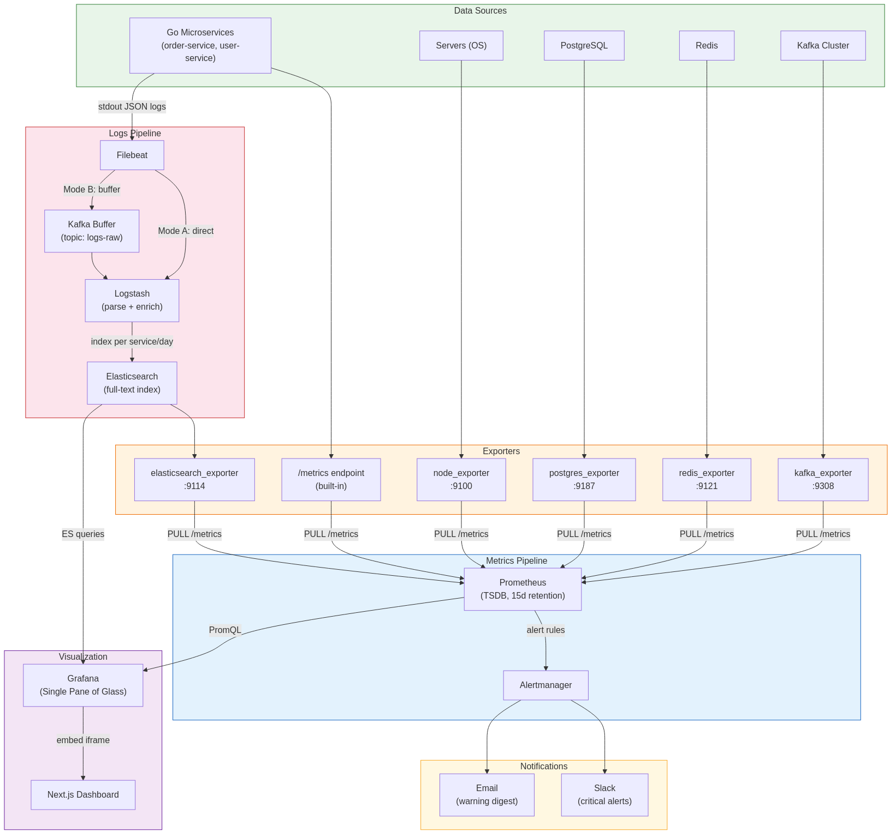
>
> Sơ đồ: [diagrams/01-system-architecture.mmd](diagrams/01-system-architecture.mmd)

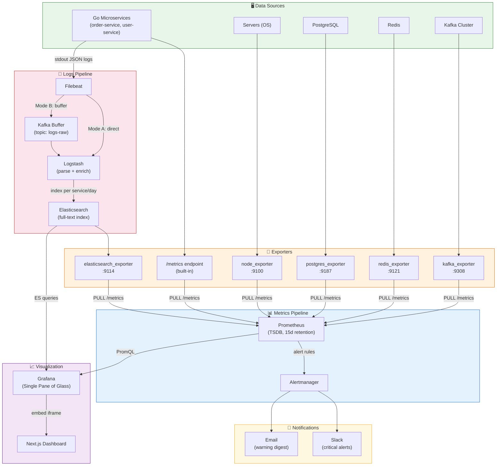
```mermaid
graph TB
    subgraph Sources["🖥️ Data Sources"]
        APP["Go Microservices<br/>(order-service, user-service)"]
        SRV["Servers (OS)"]
        DB["PostgreSQL"]
        CACHE["Redis"]
        MQ["Kafka Cluster"]
    end

    subgraph Exporters["📡 Exporters"]
        APP_EXP["/metrics endpoint<br/>(built-in)"]
        NODE_EXP["node_exporter<br/>:9100"]
        PG_EXP["postgres_exporter<br/>:9187"]
        REDIS_EXP["redis_exporter<br/>:9121"]
        KAFKA_EXP["kafka_exporter<br/>:9308"]
        ES_EXP["elasticsearch_exporter<br/>:9114"]
    end

    subgraph MetricsPipeline["📊 Metrics Pipeline"]
        PROM["Prometheus<br/>(TSDB, 15d retention)"]
        AM["Alertmanager"]
    end

    subgraph LogsPipeline["📝 Logs Pipeline"]
        FB["Filebeat"]
        KAFKA_BUF["Kafka Buffer<br/>(topic: logs-raw)"]
        LS["Logstash<br/>(parse + enrich)"]
        ES["Elasticsearch<br/>(full-text index)"]
    end

    subgraph Visualization["📈 Visualization"]
        GF["Grafana<br/>(Single Pane of Glass)"]
        FE["Next.js Dashboard"]
    end

    subgraph Notifications["🔔 Notifications"]
        SLACK["Slack<br/>(critical alerts)"]
        EMAIL["Email<br/>(warning digest)"]
    end

    APP --> APP_EXP
    SRV --> NODE_EXP
    DB --> PG_EXP
    CACHE --> REDIS_EXP
    MQ --> KAFKA_EXP
    ES --> ES_EXP

    APP_EXP -->|"PULL /metrics"| PROM
    NODE_EXP -->|"PULL /metrics"| PROM
    PG_EXP -->|"PULL /metrics"| PROM
    REDIS_EXP -->|"PULL /metrics"| PROM
    KAFKA_EXP -->|"PULL /metrics"| PROM
    ES_EXP -->|"PULL /metrics"| PROM

    PROM -->|"alert rules"| AM
    AM --> SLACK
    AM --> EMAIL

    APP -->|"stdout JSON logs"| FB
    FB -->|"Mode A: direct"| LS
    FB -->|"Mode B: buffer"| KAFKA_BUF
    KAFKA_BUF --> LS
    LS -->|"index per service/day"| ES

    PROM -->|"PromQL"| GF
    ES -->|"ES queries"| GF
    GF -->|"embed iframe"| FE

    style Sources fill:#e8f5e9,stroke:#2e7d32
    style Exporters fill:#fff3e0,stroke:#ef6c00
    style MetricsPipeline fill:#e3f2fd,stroke:#1565c0
    style LogsPipeline fill:#fce4ec,stroke:#c62828
    style Visualization fill:#f3e5f5,stroke:#6a1b9a
    style Notifications fill:#fff8e1,stroke:#f9a825
```

---

## 3. Các Thành Phần & Giao Tiếp

> 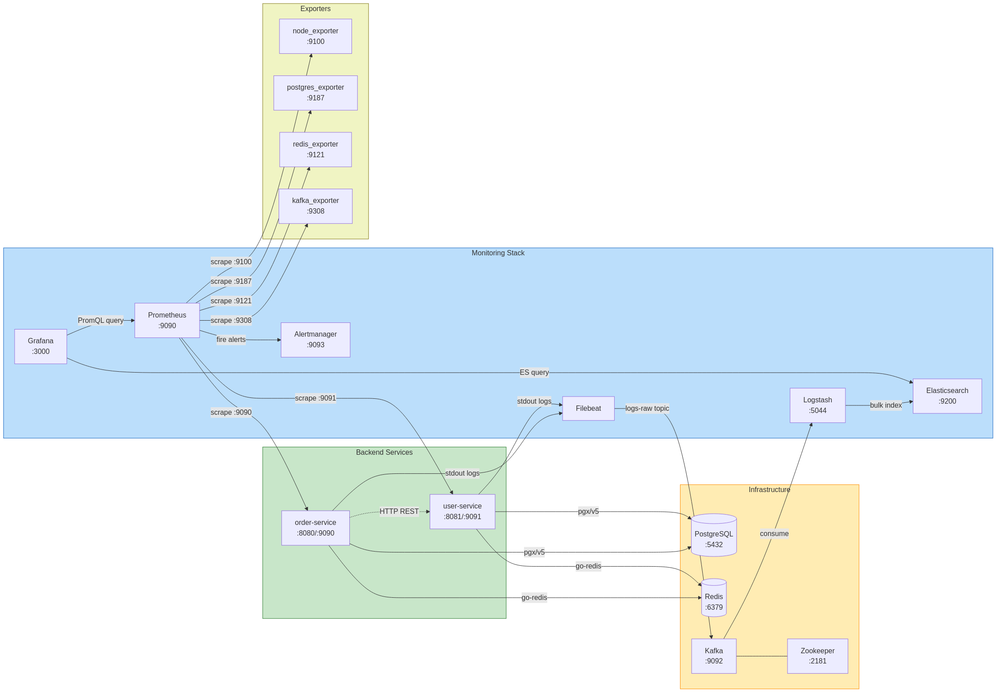
>
> Sơ đồ: [diagrams/02-component-communication.mmd](diagrams/02-component-communication.mmd)

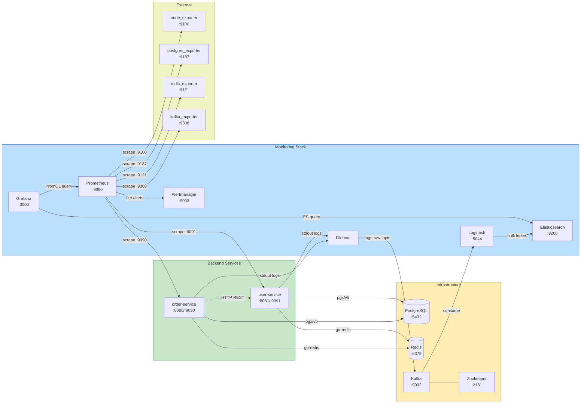
```mermaid
graph LR
    subgraph Backend["Backend Services"]
        OS["order-service<br/>:8080/:9090"]
        US["user-service<br/>:8081/:9091"]
    end

    subgraph Infrastructure["Infrastructure"]
        PG[(PostgreSQL<br/>:5432)]
        RD[(Redis<br/>:6379)]
        KF["Kafka<br/>:9092"]
        ZK["Zookeeper<br/>:2181"]
    end

    subgraph Monitoring["Monitoring Stack"]
        PROM["Prometheus<br/>:9090"]
        AM["Alertmanager<br/>:9093"]
        FB["Filebeat"]
        LS["Logstash<br/>:5044"]
        ES["Elasticsearch<br/>:9200"]
        GF["Grafana<br/>:3000"]
    end

    subgraph External["External"]
        NE["node_exporter<br/>:9100"]
        PE["postgres_exporter<br/>:9187"]
        RE["redis_exporter<br/>:9121"]
        KE["kafka_exporter<br/>:9308"]
    end

    OS -->|"pgx/v5"| PG
    US -->|"pgx/v5"| PG
    OS -->|"go-redis"| RD
    US -->|"go-redis"| RD

    OS -.->|"HTTP REST"| US

    OS -->|"stdout logs"| FB
    US -->|"stdout logs"| FB
    FB -->|"logs-raw topic"| KF
    KF -->|"consume"| LS
    LS -->|"bulk index"| ES
    KF --- ZK

    PROM -->|"scrape :9090"| OS
    PROM -->|"scrape :9091"| US
    PROM -->|"scrape :9100"| NE
    PROM -->|"scrape :9187"| PE
    PROM -->|"scrape :9121"| RE
    PROM -->|"scrape :9308"| KE
    PROM -->|"fire alerts"| AM

    GF -->|"PromQL query"| PROM
    GF -->|"ES query"| ES

    style Backend fill:#c8e6c9,stroke:#2e7d32
    style Infrastructure fill:#ffecb3,stroke:#ff8f00
    style Monitoring fill:#bbdefb,stroke:#1565c0
    style External fill:#f0f4c3,stroke:#827717
```

### Giao thức giao tiếp

| Từ | Đến | Giao thức | Mô tả |
|----|-----|-----------|-------|
| Go Services | PostgreSQL | TCP (pgx/v5) | Kết nối database nghiệp vụ |
| Go Services | Redis | TCP (go-redis) | Cache & session |
| Service ↔ Service | HTTP REST | JSON over HTTP | Giao tiếp inter-service |
| Prometheus → Services | HTTP GET | Pull `/metrics` mỗi 15s | Thu thập metrics |
| Prometheus → Exporters | HTTP GET | Pull `/metrics` mỗi 60s | Thu thập infra metrics |
| Prometheus → Alertmanager | HTTP POST | Push alert khi rule match | Gửi cảnh báo |
| Filebeat → Kafka | TCP | Produce vào topic `logs-raw` | Đẩy logs vào buffer |
| Kafka → Logstash | TCP | Consumer group `logstash-consumer` | Consume logs |
| Logstash → Elasticsearch | HTTP | Bulk index API | Lưu logs đã parse |
| Grafana → Prometheus | HTTP | PromQL queries | Hiển thị metrics |
| Grafana → Elasticsearch | HTTP | ES queries | Hiển thị logs |

---

## 4. Luồng Dữ Liệu

### 4.1 Luồng Metrics (PULL Model)

> 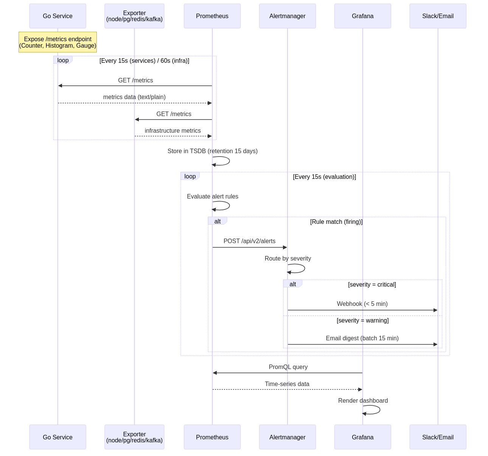
>
> Sơ đồ: [diagrams/03-metrics-flow.mmd](diagrams/03-metrics-flow.mmd)

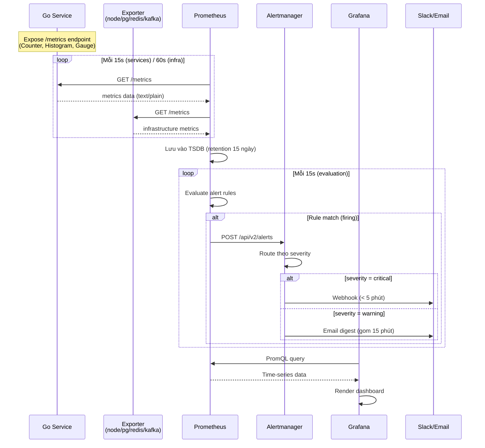
```mermaid
sequenceDiagram
    participant SVC as Go Service
    participant EXP as Exporter<br/>(node/pg/redis/kafka)
    participant PROM as Prometheus
    participant AM as Alertmanager
    participant GF as Grafana
    participant SLACK as Slack/Email

    Note over SVC: Expose /metrics endpoint<br/>(Counter, Histogram, Gauge)

    loop Mỗi 15s (services) / 60s (infra)
        PROM->>SVC: GET /metrics
        SVC-->>PROM: metrics data (text/plain)
        PROM->>EXP: GET /metrics
        EXP-->>PROM: infrastructure metrics
    end

    PROM->>PROM: Lưu vào TSDB (retention 15 ngày)

    loop Mỗi 15s (evaluation)
        PROM->>PROM: Evaluate alert rules
        alt Rule match (firing)
            PROM->>AM: POST /api/v2/alerts
            AM->>AM: Route theo severity
            alt severity = critical
                AM->>SLACK: Webhook (< 5 phút)
            else severity = warning
                AM->>SLACK: Email digest (gom 15 phút)
            end
        end
    end

    GF->>PROM: PromQL query
    PROM-->>GF: Time-series data
    GF->>GF: Render dashboard
```

**Đặc điểm:**
- **PULL model**: Prometheus chủ động kéo metrics, không cần service push
- **Backpressure tự nhiên**: Service quá tải → Prometheus chỉ scrape mỗi 15s, không tạo thêm load
- **Service discovery**: Prometheus biết service nào alive qua target `up/down`

### 4.2 Luồng Logs (PUSH Model)

> 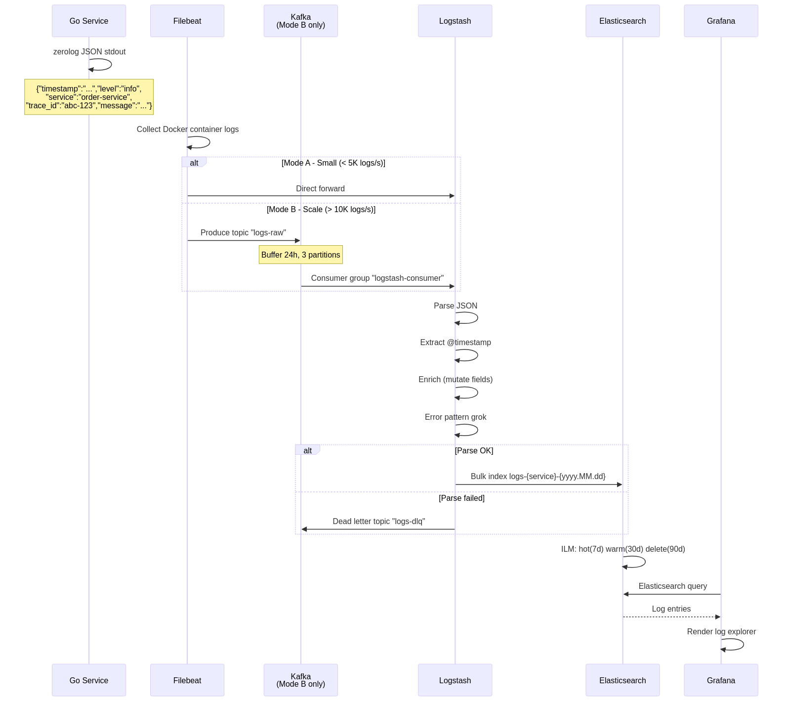
>
> Sơ đồ: [diagrams/04-logs-flow.mmd](diagrams/04-logs-flow.mmd)

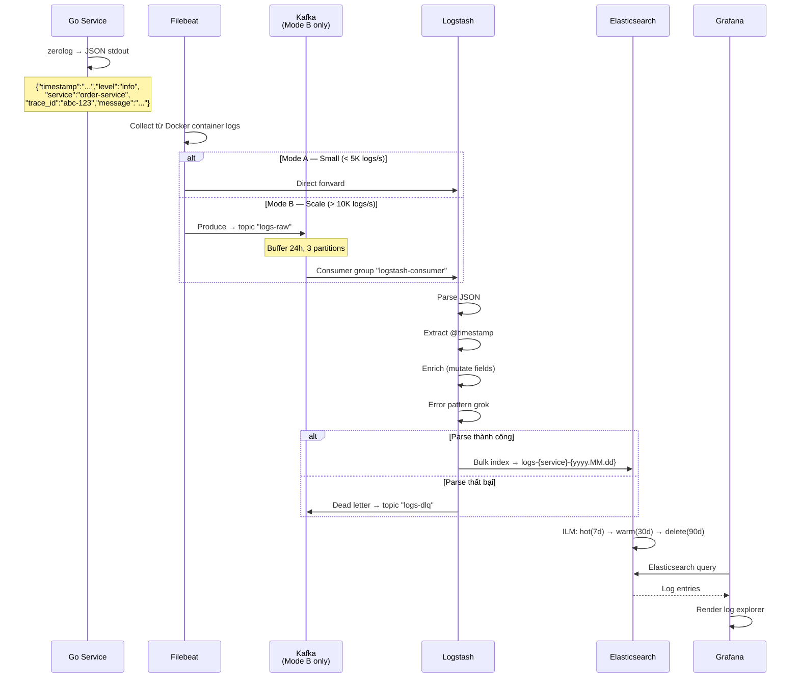
```mermaid
sequenceDiagram
    participant SVC as Go Service
    participant FB as Filebeat
    participant KF as Kafka<br/>(Mode B only)
    participant LS as Logstash
    participant ES as Elasticsearch
    participant GF as Grafana

    SVC->>SVC: zerolog → JSON stdout
    Note over SVC: {"timestamp":"...","level":"info",<br/>"service":"order-service",<br/>"trace_id":"abc-123","message":"..."}

    FB->>FB: Collect từ Docker container logs

    alt Mode A — Small (< 5K logs/s)
        FB->>LS: Direct forward
    else Mode B — Scale (> 10K logs/s)
        FB->>KF: Produce → topic "logs-raw"
        Note over KF: Buffer 24h, 3 partitions
        KF->>LS: Consumer group "logstash-consumer"
    end

    LS->>LS: Parse JSON
    LS->>LS: Extract @timestamp
    LS->>LS: Enrich (mutate fields)
    LS->>LS: Error pattern grok

    alt Parse thành công
        LS->>ES: Bulk index → logs-{service}-{yyyy.MM.dd}
    else Parse thất bại
        LS->>KF: Dead letter → topic "logs-dlq"
    end

    ES->>ES: ILM: hot(7d) → warm(30d) → delete(90d)

    GF->>ES: Elasticsearch query
    ES-->>GF: Log entries
    GF->>GF: Render log explorer
```

**Đặc điểm:**
- **2 modes**: Mode A (direct) cho dev/staging, Mode B (Kafka buffer) cho production
- **Kafka buffer**: Chịu burst 100K+ msg/s, replay khi Logstash crash
- **ILM lifecycle**: Tự động quản lý vòng đời index (hot → warm → delete)

### 4.3 Luồng Alert

> 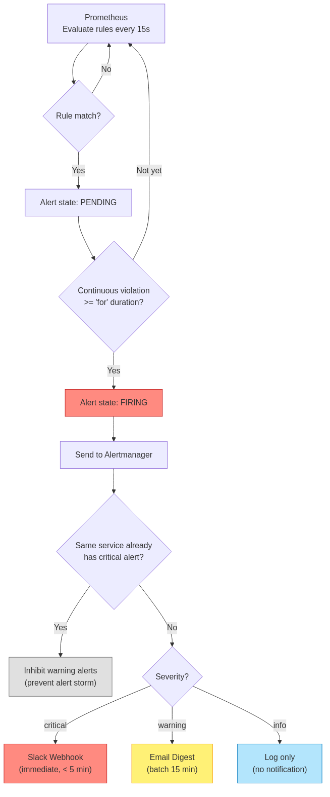
>
> Sơ đồ: [diagrams/05-alert-flow.mmd](diagrams/05-alert-flow.mmd)

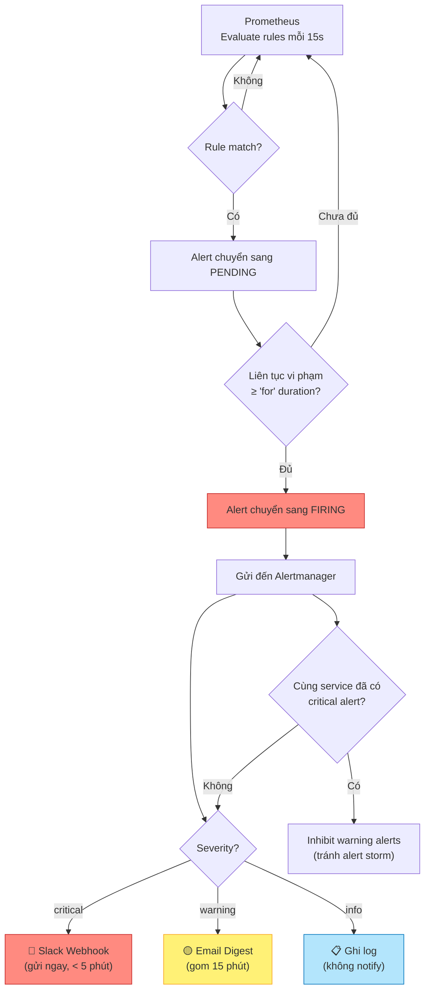
```mermaid
flowchart TD
    A["Prometheus<br/>Evaluate rules mỗi 15s"] --> B{Rule match?}
    B -->|Không| A
    B -->|Có| C["Alert chuyển sang PENDING"]
    C --> D{"Liên tục vi phạm<br/>≥ 'for' duration?"}
    D -->|Chưa đủ| A
    D -->|Đủ| E["Alert chuyển sang FIRING"]
    E --> F["Gửi đến Alertmanager"]
    F --> G{"Severity?"}
    G -->|critical| H["🔴 Slack Webhook<br/>(gửi ngay, < 5 phút)"]
    G -->|warning| I["🟡 Email Digest<br/>(gom 15 phút)"]
    G -->|info| J["📋 Ghi log<br/>(không notify)"]

    F --> K{"Cùng service đã có<br/>critical alert?"}
    K -->|Có| L["Inhibit warning alerts<br/>(tránh alert storm)"]
    K -->|Không| G

    style E fill:#ff8a80,stroke:#c62828
    style H fill:#ff8a80,stroke:#c62828
    style I fill:#fff176,stroke:#f9a825
    style J fill:#b3e5fc,stroke:#0277bd
```

---

## 5. Data Sources & Exporters

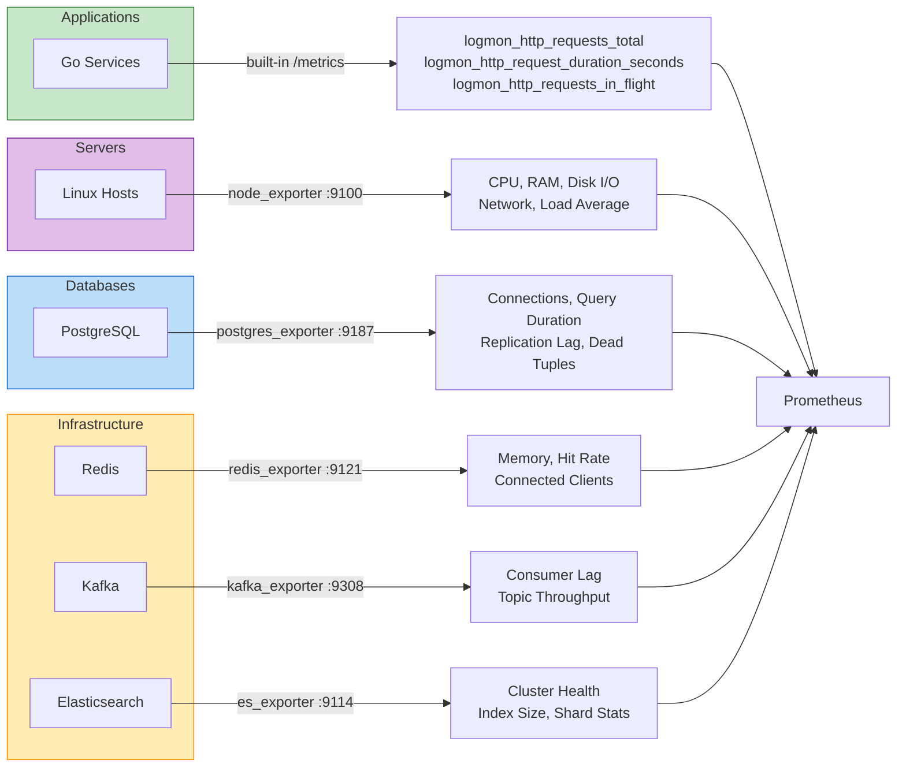
```mermaid
graph LR
    subgraph Applications["Applications"]
        GO["Go Services"]
    end
    subgraph Servers["Servers"]
        HOST["Linux Hosts"]
    end
    subgraph Databases["Databases"]
        PG["PostgreSQL"]
    end
    subgraph Infra["Infrastructure"]
        RD["Redis"]
        KF["Kafka"]
        ES["Elasticsearch"]
    end

    GO -->|"built-in /metrics"| M1["logmon_http_requests_total<br/>logmon_http_request_duration_seconds<br/>logmon_http_requests_in_flight"]
    HOST -->|"node_exporter :9100"| M2["CPU, RAM, Disk I/O<br/>Network, Load Average"]
    PG -->|"postgres_exporter :9187"| M3["Connections, Query Duration<br/>Replication Lag, Dead Tuples"]
    RD -->|"redis_exporter :9121"| M4["Memory, Hit Rate<br/>Connected Clients"]
    KF -->|"kafka_exporter :9308"| M5["Consumer Lag<br/>Topic Throughput"]
    ES -->|"es_exporter :9114"| M6["Cluster Health<br/>Index Size, Shard Stats"]

    M1 --> PROM["Prometheus"]
    M2 --> PROM
    M3 --> PROM
    M4 --> PROM
    M5 --> PROM
    M6 --> PROM

    style Applications fill:#c8e6c9,stroke:#2e7d32
    style Servers fill:#e1bee7,stroke:#6a1b9a
    style Databases fill:#bbdefb,stroke:#1565c0
    style Infra fill:#ffecb3,stroke:#ff8f00
```

| Data Source | Exporter | Port | Scrape Interval | Metrics chính |
|-------------|----------|------|-----------------|---------------|
| Go Services | Built-in `/metrics` | 9090-9091 | 15s | HTTP request rate, latency, errors, in-flight |
| Linux Hosts | `node_exporter` | 9100 | 60s | CPU, RAM, disk I/O, network, load average |
| PostgreSQL | `postgres_exporter` | 9187 | 60s | Connections, query duration, replication lag |
| Redis | `redis_exporter` | 9121 | 60s | Memory usage, hit rate, connected clients |
| Kafka | `kafka_exporter` | 9308 | 60s | Consumer lag, topic throughput, partition count |
| Elasticsearch | `elasticsearch_exporter` | 9114 | 60s | Cluster health, index size, shard stats |

---

## 6. Deployment Modes

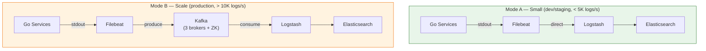
```mermaid
graph TB
    subgraph ModeA["Mode A — Small (dev/staging, < 5K logs/s)"]
        A1["Go Services"] -->|stdout| A2["Filebeat"]
        A2 -->|direct| A3["Logstash"]
        A3 --> A4["Elasticsearch"]
    end

    subgraph ModeB["Mode B — Scale (production, > 10K logs/s)"]
        B1["Go Services"] -->|stdout| B2["Filebeat"]
        B2 -->|produce| B3["Kafka<br/>(3 brokers + ZK)"]
        B3 -->|consume| B4["Logstash"]
        B4 --> B5["Elasticsearch"]
    end

    style ModeA fill:#e8f5e9,stroke:#2e7d32
    style ModeB fill:#fff3e0,stroke:#ef6c00
```

| | Mode A — Small | Mode B — Scale |
|---|---|---|
| **Khi nào dùng** | Dev/staging, log < 5K msg/s | Production, log > 10K msg/s |
| **Pipeline** | Filebeat → Logstash → ES | Filebeat → Kafka → Logstash → ES |
| **Ưu điểm** | Đơn giản, ít resource | Chịu burst, replay khi crash |
| **Nhược điểm** | Logstash overload khi burst | Thêm Kafka + Zookeeper phải maintain |
| **Docker Compose** | `docker compose up` | `docker compose --profile scale up` |
| **Thành phần thêm** | Không | Kafka (3 brokers) + Zookeeper |

---

## 7. Cấu Trúc Dự Án

### 7.1 Tổng Quan Kiến Trúc Backend

Backend áp dụng **2 mô hình kiến trúc** tùy theo complexity của mỗi Bounded Context:

| Bounded Context | Pattern | Lý do |
|-----------------|---------|-------|
| `order/` | **Clean Architecture** | CRUD-like, domain đơn giản |
| `user/` | **Clean Architecture** | CRUD-like, domain đơn giản |
| `alerting/` | **Clean Architecture + DDD + CQRS** | Business rules phức tạp: threshold, inhibition, routing, escalation |
| `slo/` | **Clean Architecture + DDD + CQRS** | Error budget calculation, burn rate, compliance tracking |
| `logpipeline/` | **Clean Architecture + DDD + CQRS** | Mode switching, DLQ retry, ILM policy management |
| `shared/` | **Shared Kernel** | Infrastructure concerns dùng chung |

### 7.2 Cấu Trúc Thư Mục

```
logmon/
├── backend/                                    ← Go Backend
│   ├── cmd/
│   │   ├── orderservice/main.go                ← Order Service entry point
│   │   └── userservice/main.go                 ← User Service entry point
│   ├── internal/
│   │   │
│   │   ├── order/                              ── Clean Architecture ──
│   │   │   ├── domain/
│   │   │   │   ├── order.go                    ← Entity + business rules
│   │   │   │   ├── errors.go                   ← Domain-specific errors
│   │   │   │   └── value_objects.go            ← OrderID, Money, Status
│   │   │   ├── app/
│   │   │   │   ├── create_order.go             ← Use case
│   │   │   │   ├── cancel_order.go             ← Use case
│   │   │   │   └── get_order.go                ← Use case
│   │   │   ├── ports/
│   │   │   │   ├── repository.go               ← OrderRepository interface
│   │   │   │   └── cache.go                    ← OrderCache interface
│   │   │   └── adapters/
│   │   │       ├── http/handler.go             ← Gin HTTP handlers
│   │   │       ├── postgres/repo.go            ← pgx implementation
│   │   │       └── redis/cache.go              ← Redis cache implementation
│   │   │
│   │   ├── user/                               ── Clean Architecture ──
│   │   │   ├── domain/
│   │   │   │   ├── user.go                     ← Entity
│   │   │   │   └── errors.go                   ← Domain errors
│   │   │   ├── app/
│   │   │   │   ├── register_user.go            ← Use case
│   │   │   │   └── get_user.go                 ← Use case
│   │   │   ├── ports/
│   │   │   │   └── repository.go               ← UserRepository interface
│   │   │   └── adapters/
│   │   │       ├── http/handler.go             ← Gin HTTP handlers
│   │   │       └── postgres/repo.go            ← pgx implementation
│   │   │
│   │   ├── alerting/                           ── Clean Architecture + DDD + CQRS ──
│   │   │   ├── domain/
│   │   │   │   ├── alert_rule.go               ← Aggregate Root
│   │   │   │   ├── alert_instance.go           ← Entity (trạng thái alert)
│   │   │   │   ├── notification_channel.go     ← Value Object
│   │   │   │   ├── severity.go                 ← Value Object (critical/warning/info)
│   │   │   │   ├── silence.go                  ← Entity (silence window)
│   │   │   │   ├── events.go                   ← Domain Events
│   │   │   │   └── errors.go                   ← Domain errors
│   │   │   ├── app/
│   │   │   │   ├── command/                    ← Write side (CQRS)
│   │   │   │   │   ├── create_rule.go          ← Tạo alert rule mới
│   │   │   │   │   ├── update_rule.go          ← Cập nhật rule
│   │   │   │   │   ├── acknowledge_alert.go    ← Xác nhận đã thấy alert
│   │   │   │   │   ├── silence_alert.go        ← Tạm tắt alert
│   │   │   │   │   └── resolve_alert.go        ← Đánh dấu resolved
│   │   │   │   └── query/                      ← Read side (CQRS)
│   │   │   │       ├── active_alerts.go        ← Lấy alerts đang firing
│   │   │   │       ├── alert_history.go        ← Lịch sử alerts
│   │   │   │       └── rule_evaluation.go      ← Trạng thái evaluation
│   │   │   ├── ports/
│   │   │   │   ├── repository.go               ← AlertRuleRepository interface
│   │   │   │   ├── event_publisher.go          ← EventPublisher interface
│   │   │   │   ├── notifier.go                 ← Notifier interface
│   │   │   │   └── read_model.go               ← AlertReadModel interface (CQRS)
│   │   │   └── adapters/
│   │   │       ├── http/handler.go             ← Alert management API
│   │   │       ├── postgres/repo.go            ← Alert persistence
│   │   │       ├── prometheus/evaluator.go     ← Prometheus rule management
│   │   │       ├── slack/notifier.go           ← Slack webhook sender
│   │   │       └── email/notifier.go           ← Email sender
│   │   │
│   │   ├── slo/                                ── Clean Architecture + DDD + CQRS ──
│   │   │   ├── domain/
│   │   │   │   ├── slo.go                      ← Aggregate Root (SLO definition)
│   │   │   │   ├── error_budget.go             ← Value Object (remaining budget)
│   │   │   │   ├── burn_rate.go                ← Value Object (consumption speed)
│   │   │   │   ├── events.go                   ← Domain Events
│   │   │   │   └── errors.go                   ← Domain errors
│   │   │   ├── app/
│   │   │   │   ├── command/                    ← DefineSLO, RecalculateBudget
│   │   │   │   └── query/                      ← SLOCompliance, BudgetRemaining
│   │   │   ├── ports/
│   │   │   │   ├── repository.go               ← SLORepository interface
│   │   │   │   ├── metrics_reader.go           ← MetricsReader interface (query Prometheus)
│   │   │   │   └── read_model.go               ← SLOReadModel interface (CQRS)
│   │   │   └── adapters/
│   │   │       ├── http/handler.go
│   │   │       ├── postgres/repo.go
│   │   │       └── prometheus/reader.go        ← PromQL query adapter
│   │   │
│   │   ├── logpipeline/                        ── Clean Architecture + DDD + CQRS ──
│   │   │   ├── domain/
│   │   │   │   ├── pipeline.go                 ← Aggregate Root
│   │   │   │   ├── pipeline_mode.go            ← Value Object (ModeA/ModeB)
│   │   │   │   ├── index_lifecycle.go          ← Value Object (hot/warm/delete)
│   │   │   │   ├── dead_letter.go              ← Entity (DLQ entry)
│   │   │   │   ├── events.go                   ← Domain Events
│   │   │   │   └── errors.go                   ← Domain errors
│   │   │   ├── app/
│   │   │   │   ├── command/                    ← SwitchMode, RetryDLQ, UpdateILMPolicy
│   │   │   │   └── query/                      ← PipelineStatus, DLQCount, IndexStats
│   │   │   ├── ports/
│   │   │   │   ├── repository.go               ← PipelineRepository interface
│   │   │   │   ├── message_broker.go           ← MessageBroker interface
│   │   │   │   └── search_engine.go            ← SearchEngine interface
│   │   │   └── adapters/
│   │   │       ├── http/handler.go
│   │   │       ├── postgres/repo.go
│   │   │       ├── kafka/broker.go             ← Kafka producer/consumer
│   │   │       ├── elasticsearch/engine.go     ← ES index management
│   │   │       └── logstash/controller.go      ← Logstash pipeline control
│   │   │
│   │   └── shared/                             ── Shared Kernel ──
│   │       ├── auth/middleware.go              ← JWT verification middleware
│   │       ├── errors/types.go                 ← Typed application errors
│   │       ├── logger/logger.go                ← zerolog wrapper + trace_id
│   │       ├── metrics/
│   │       │   ├── registry.go                 ← Prometheus registry
│   │       │   ├── collectors.go               ← Custom business metrics
│   │       │   └── middleware.go               ← Prometheus HTTP middleware
│   │       ├── middleware/
│   │       │   ├── logging.go                  ← Structured logging middleware
│   │       │   └── recovery.go                 ← Panic recovery middleware
│   │       └── eventbus/
│   │           ├── bus.go                      ← In-process event bus interface
│   │           └── memory.go                   ← In-memory implementation
│   │
│   └── go.mod
│
├── infra/                                      ← Infrastructure-as-Code
│   ├── docker/docker-compose.yml               ← Full stack orchestration
│   ├── prometheus/
│   │   ├── prometheus.yml                      ← Scrape config
│   │   ├── rules/                              ← Alert rules
│   │   └── alertmanager.yml
│   ├── elk/
│   │   ├── filebeat/filebeat.yml
│   │   ├── logstash/pipeline/main.conf         ← Kafka → Parse → ES
│   │   └── elasticsearch/
│   │       ├── ilm-policy.json                 ← Index Lifecycle Management
│   │       └── index-template.json
│   ├── kafka/topics.sh                         ← Topic creation
│   └── grafana/
│       ├── provisioning/
│       │   ├── datasources/datasources.yml
│       │   └── dashboards/dashboards.yml
│       └── dashboards/
│           ├── service-overview.json            ← Developer: request rate, errors
│           ├── logs-explorer.json               ← Developer: log search, trace_id
│           ├── infrastructure.json              ← DevOps: CPU/RAM/disk per host
│           ├── slo-dashboard.json               ← SRE: error budget, latency SLO
│           └── alerting-overview.json           ← All: active alerts, history
│
└── frontend/                                   ← Next.js Monitoring Dashboard
    ├── app/
    │   ├── page.tsx                             ← Dashboard overview
    │   ├── services/page.tsx                    ← Service health
    │   ├── metrics/page.tsx                     ← Grafana embed
    │   ├── logs/page.tsx                        ← Log viewer
    │   └── alerts/page.tsx                      ← Alert management
    ├── components/                              ← Shared UI components
    ├── services/                                ← API client layer
    └── types/                                   ← TypeScript definitions
```

---

## 8. Chi Tiết Thành Phần

### 8.1 Backend — Go Microservices

#### Tổng Quan Kiến Trúc

Backend áp dụng 2 mô hình kiến trúc tùy theo complexity:

| Mô hình | Áp dụng cho | Đặc điểm |
|---------|-------------|-----------|
| **Clean Architecture** | `order/`, `user/` | Domain đơn giản, CRUD-like. Layers: domain → app → ports → adapters |
| **Clean Arch + DDD + CQRS** | `alerting/`, `slo/`, `logpipeline/` | Business rules phức tạp. Thêm: Command/Query split, Domain Events, Aggregate Roots |

#### Layer Direction (strict, áp dụng cho TẤT CẢ BCs)

```
adapters → ports ← app → domain
```

- `domain/` không import gì ngoài Go standard library
- `app/` chỉ import `domain/` và `ports/`
- `ports/` chỉ chứa interfaces
- `adapters/` implement interfaces từ `ports/`
- Không cross-BC imports — giao tiếp qua domain events hoặc shared kernel

#### Clean Architecture (order, user)

```
HTTP Request
    ↓
shared/middleware/ (recovery → logging → metrics → auth)
    ↓
adapters/http/handler.go          ← Gin HTTP handler, gọi use case
    ↓
app/create_order.go               ← Use case, orchestrate domain logic
    ↓
domain/order.go                   ← Entity + business rules (pure Go)
    ↓
ports/repository.go               ← Interface (OrderRepository)
    ↓
adapters/postgres/repo.go         ← pgx implementation
    ↓
PostgreSQL
```

#### Clean Architecture + DDD + CQRS (alerting, slo, logpipeline)

```
HTTP Request
    ↓
shared/middleware/ (recovery → logging → metrics → auth)
    ↓
adapters/http/handler.go
    ↓
┌─────────── CQRS Split ───────────┐
│                                   │
│  WRITE (Command)                  │  READ (Query)
│  app/command/create_rule.go       │  app/query/active_alerts.go
│       ↓                          │       ↓
│  domain/alert_rule.go            │  ports/read_model.go
│  (Aggregate Root,                │  (AlertReadModel interface)
│   validate business rules,       │       ↓
│   emit Domain Events)            │  adapters/postgres/read_model.go
│       ↓                          │  (denormalized views, cache)
│  ports/repository.go             │
│       ↓                          │
│  adapters/postgres/repo.go       │
│       ↓                          │
│  ports/event_publisher.go        │
│       ↓                          │
│  shared/eventbus/bus.go          │
│       ↓                          │
│  Subscribers (cross-BC)          │
└───────────────────────────────────┘
```

**Domain Events Flow (cross-BC communication):**
```
alerting/domain:
  AlertFired         → shared/eventbus → slo/app: RecordFailure
  AlertResolved      → shared/eventbus → slo/app: RecordRecovery

slo/domain:
  BudgetExhausted    → shared/eventbus → alerting/app: CreateCriticalAlert

logpipeline/domain:
  PipelineModeChanged → shared/eventbus → alerting/app: UpdatePipelineAlerts
  DLQThresholdExceeded → shared/eventbus → alerting/app: CreateWarningAlert
```

#### Bounded Context: Alerting (DDD + CQRS)

| DDD Concept | Implementation | Mô tả |
|-------------|---------------|-------|
| **Aggregate Root** | `AlertRule` | Quản lý vòng đời rule: create → evaluate → fire → resolve |
| **Entity** | `AlertInstance` | Một lần firing cụ thể (có trạng thái riêng) |
| **Entity** | `Silence` | Silence window (tạm tắt alert trong khoảng thời gian) |
| **Value Object** | `Severity` | critical / warning / info (immutable) |
| **Value Object** | `NotificationChannel` | Slack webhook URL / Email address |
| **Domain Event** | `AlertFired` | Emitted khi rule chuyển sang FIRING |
| **Domain Event** | `AlertResolved` | Emitted khi alert tự khỏi |
| **Domain Event** | `AlertAcknowledged` | Emitted khi engineer xác nhận đã thấy |

**CQRS Commands & Queries:**

| Side | Handler | Mô tả |
|------|---------|-------|
| Command | `CreateRule` | Tạo alert rule mới, validate PromQL expression |
| Command | `AcknowledgeAlert` | Engineer xác nhận đã thấy alert |
| Command | `SilenceAlert` | Tạm tắt notifications trong time window |
| Command | `ResolveAlert` | Đánh dấu alert đã resolved |
| Query | `ActiveAlerts` | Lấy tất cả alerts đang firing (read model, có thể cache) |
| Query | `AlertHistory` | Lịch sử alerts với filter (service, severity, time range) |
| Query | `RuleEvaluation` | Trạng thái evaluation của rules |

#### Bounded Context: SLO (DDD + CQRS)

| DDD Concept | Implementation | Mô tả |
|-------------|---------------|-------|
| **Aggregate Root** | `ServiceLevelObjective` | SLO definition (target, window, indicator) |
| **Value Object** | `ErrorBudget` | Budget remaining (calculated from SLI data) |
| **Value Object** | `BurnRate` | Tốc độ tiêu thụ error budget (1h, 6h, 24h windows) |
| **Domain Event** | `BudgetExhausted` | Budget còn 0% → trigger critical alert |
| **Domain Event** | `BurnRateExceeded` | Burn rate > threshold → early warning |

#### Bounded Context: LogPipeline (DDD + CQRS)

| DDD Concept | Implementation | Mô tả |
|-------------|---------------|-------|
| **Aggregate Root** | `Pipeline` | Pipeline configuration (mode, targets, filters) |
| **Value Object** | `PipelineMode` | ModeA (direct) / ModeB (Kafka buffer) |
| **Value Object** | `IndexLifecycle` | hot(7d) → warm(30d) → delete(90d) |
| **Entity** | `DeadLetter` | Failed log entry in DLQ (retryable) |
| **Domain Event** | `PipelineModeChanged` | Mode switch A↔B |
| **Domain Event** | `DLQThresholdExceeded` | DLQ count > threshold |

#### Middleware Chain (thứ tự bắt buộc, shared cho tất cả BCs)

| # | Middleware | Chức năng |
|---|-----------|-----------|
| 1 | `shared/middleware/recovery.go` | Catch panics, log stack trace, trả HTTP 500 |
| 2 | `shared/middleware/logging.go` | Inject trace_id (UUID), log request/response, duration |
| 3 | `shared/metrics/middleware.go` | Record `http_requests_total`, `http_request_duration_seconds` |
| 4 | `shared/auth/middleware.go` | Verify JWT token |
| 5 | `adapters/http/handler.go` | Business endpoint (per BC) |

**Prometheus Metrics:**

| Metric | Type | Labels | Mô tả |
|--------|------|--------|-------|
| `logmon_http_requests_total` | Counter | method, path, status | Tổng số HTTP requests |
| `logmon_http_request_duration_seconds` | Histogram | method, path | Phân bố thời gian xử lý |
| `logmon_http_requests_in_flight` | Gauge | — | Số request đang xử lý |

**Structured Log Format (zerolog → JSON stdout):**
```json
{
  "timestamp": "2026-03-17T10:00:00Z",
  "level": "info",
  "service": "order-service",
  "trace_id": "abc-123-def-456",
  "method": "POST",
  "path": "/api/orders",
  "status": 201,
  "duration_ms": 45,
  "message": "request completed",
  "caller": "adapters/http/handler.go:42"
}
```

### 8.2 Prometheus

- **Model**: PULL — scrape `/metrics` endpoint định kỳ
- **Scrape interval**: 15s (services), 60s (infrastructure exporters)
- **Storage**: Local TSDB, retention 15 ngày
- **Alert evaluation**: Mỗi 15s
- **Histogram buckets**: `0.005, 0.01, 0.025, 0.05, 0.1, 0.25, 0.5, 1, 2.5, 5, 10`

### 8.3 Alertmanager

| Cấu hình | Giá trị |
|-----------|---------|
| Critical → Slack | Webhook, gửi ngay (< 5 phút delay) |
| Warning → Email | Digest, gom 15 phút |
| Inhibition | Critical suppresses warning cùng service |
| Labels bắt buộc | `severity`, `service`, `runbook_url` |

### 8.4 ELK Stack

**Filebeat:**
- Input: Docker container logs (socket mount)
- Output: Kafka `logs-raw` (Mode B) hoặc Logstash trực tiếp (Mode A)
- Multiline: aggregate Go stack traces

**Logstash Pipeline:**
```
input { kafka { topic: "logs-raw" } }
  → filter { json → date → mutate → grok (errors) }
  → output { elasticsearch { index: "logs-%{service}-%{+yyyy.MM.dd}" } }
  → dead_letter { kafka { topic: "logs-dlq" } }
```

**Elasticsearch:**
- Index pattern: `logs-{service}-{yyyy.MM.dd}`
- ILM policy: hot (7 ngày) → warm (30 ngày) → delete (90 ngày)
- Shard size target: 10-50 GB/shard

### 8.5 Kafka (Log Buffer)

| Cấu hình | Giá trị |
|-----------|---------|
| Topics | `logs-raw` (input), `logs-dlq` (dead letter) |
| Partitions | 3 (match Logstash pipeline workers) |
| Retention | 24h (buffer, không phải archive) |
| Consumer group | `logstash-consumer` |
| Khi nào cần | Log volume > 10K msg/s, cần replay |
| Khi nào KHÔNG cần | Dev/staging, log < 5K msg/s |

### 8.6 Grafana

- **Single pane of glass**: Cả metrics (Prometheus) + logs (Elasticsearch)
- **Provisioned dashboards**: Auto-load từ JSON files (as-code)
- **Datasources**: Prometheus + Elasticsearch

**Dashboard per Persona:**

| Dashboard | Persona | Nội dung |
|-----------|---------|----------|
| `service-overview.json` | Developer | Request rate, error rate, p95 latency per service |
| `logs-explorer.json` | Developer | Log search, trace_id correlation, error patterns |
| `infrastructure.json` | DevOps | node_exporter metrics, container stats, disk usage |
| `slo-dashboard.json` | SRE | Error budget burn rate, latency SLO compliance |
| `alerting-overview.json` | All | Active alerts, alert history, silence management |

---

## 9. Quy Tắc Hệ Thống

> **Tham khảo:** [Uber Go Style Guide](https://github.com/uber-go/guide/blob/master/style.md), [SOLID Go Design — Dave Cheney](https://dave.cheney.net/2016/08/20/solid-go-design), [OWASP Go Secure Coding Practices](https://owasp.org/www-project-go-secure-coding-practices-guide/)

### 9.1 Go Code Style

**Naming:**
- Package names: lowercase, không underscore, không plural, **KHÔNG** dùng `common`, `util`, `helpers` (dùng `shared/` với sub-packages có tên rõ ràng)
- Exported error variables: prefix `Err` → `ErrAlertNotFound`
- Unexported globals: prefix `_` → `_defaultScrapeInterval`
- Error types: suffix `Error` → `NotFoundError`, `ValidationError`
- Enums bắt đầu từ 1 (không phải 0) trừ khi zero value có ý nghĩa:

```go
type Severity int
const (
    SeverityCritical Severity = iota + 1  // 1
    SeverityWarning                        // 2
    SeverityInfo                           // 3
)
```

**Import ordering (2 groups, ngăn cách bằng dòng trống):**
```go
import (
    "context"
    "fmt"

    "github.com/gin-gonic/gin"
    "github.com/yourorg/logmon/internal/alerting/domain"
)
```

**Function ordering trong file:**
1. Type definition
2. Constructor (`NewXYZ`)
3. Methods trên receiver (group theo receiver)
4. Plain utility functions cuối file

**Early return — giảm nesting:**
```go
// BAD
func (h *Handler) GetAlert(c *gin.Context) {
    id := c.Param("id")
    if id != "" {
        alert, err := h.query.Handle(ctx, GetAlertQuery{ID: id})
        if err == nil {
            c.JSON(200, alert)
        } else {
            c.JSON(500, gin.H{"error": "internal error"})
        }
    } else {
        c.JSON(400, gin.H{"error": "missing id"})
    }
}

// GOOD
func (h *Handler) GetAlert(c *gin.Context) {
    id := c.Param("id")
    if id == "" {
        c.JSON(400, gin.H{"error": "missing id"})
        return
    }
    alert, err := h.query.Handle(ctx, GetAlertQuery{ID: id})
    if err != nil {
        c.JSON(500, gin.H{"error": "internal error"})
        return
    }
    c.JSON(200, alert)
}
```

**Functional Options cho service configuration:**
```go
type Option func(*options)
type options struct {
    scrapeInterval time.Duration
    retentionDays  int
}

func WithScrapeInterval(d time.Duration) Option {
    return func(o *options) { o.scrapeInterval = d }
}

func NewPrometheusAdapter(addr string, opts ...Option) *PrometheusAdapter {
    o := options{scrapeInterval: 15 * time.Second, retentionDays: 15}
    for _, opt := range opts {
        opt(&o)
    }
    // ...
}
```

**Entry point — `run()` pattern:**
```go
func main() {
    if err := run(); err != nil {
        log.Fatal(err)
    }
}

func run() error {
    cfg, err := config.Load()
    if err != nil {
        return fmt.Errorf("load config: %w", err)
    }
    // wire dependencies, start server
    // defer cleanup
    return nil
}
```

**Performance (hot path only):**
- `strconv.Itoa()` thay vì `fmt.Sprint()` khi convert primitives
- Specify container capacity: `make(map[string]int, expectedSize)`, `make([]T, 0, expectedSize)`
- Chuyển `[]byte` một lần, tái sử dụng (không convert lặp lại trong loop)

### 9.2 Error Handling

**Decision matrix:**

| Cần match? | Message | Approach |
|------------|---------|----------|
| Không | Static | `errors.New("alert not found")` |
| Không | Dynamic | `fmt.Errorf("rule %s failed: %w", id, err)` |
| Có | Static | `var ErrAlertNotFound = errors.New("alert not found")` |
| Có | Dynamic | Custom error type `NotFoundError{ID: id}` |

**Error wrapping — dùng context ngắn gọn, không dùng "failed to":**
```go
// BAD: "failed to get alert: failed to query DB: connection refused"
return fmt.Errorf("failed to get alert: %w", err)

// GOOD: "get alert: query DB: connection refused"
return fmt.Errorf("get alert: %w", err)
```

**Wrap `%w` vs `%v`:**
- `%w` — khi caller CẦN match underlying error (preferred)
- `%v` — khi muốn ẨN implementation detail khỏi caller (dùng ở adapter boundary)

```go
// adapters/ — ẩn infrastructure errors, expose domain errors
func (r *PostgresAlertRepo) FindByID(ctx context.Context, id string) (*domain.AlertRule, error) {
    row := r.pool.QueryRow(ctx, query, id)
    var a alertModel
    if err := row.Scan(&a.ID, &a.Name); err != nil {
        if errors.Is(err, pgx.ErrNoRows) {
            return nil, domain.ErrAlertNotFound  // domain error, không wrap pgx
        }
        return nil, fmt.Errorf("scan alert %s: %v", id, err)  // %v: ẩn pgx detail
    }
    return a.toDomain(), nil
}
```

**Handle once — log HOẶC return, KHÔNG làm cả hai:**
```go
// BAD: duplicate logging
log.Printf("could not get alert %s: %v", id, err)
return err

// GOOD: wrap và return, để upstream xử lý
return fmt.Errorf("get alert %s: %w", id, err)

// GOOD: log và degrade (không return error)
if err := emitMetrics(); err != nil {
    log.Printf("emit metrics: %v", err)
    // continue without error
}
```

**Custom domain errors (cho match):**
```go
// domain/errors.go
var (
    ErrAlertNotFound   = errors.New("alert not found")
    ErrRuleInvalid     = errors.New("invalid alert rule")
    ErrBudgetExhausted = errors.New("error budget exhausted")
)

type ValidationError struct {
    Field   string
    Message string
}
func (e *ValidationError) Error() string {
    return fmt.Sprintf("validation: %s — %s", e.Field, e.Message)
}

// Caller
var ve *domain.ValidationError
if errors.As(err, &ve) {
    c.JSON(400, gin.H{"field": ve.Field, "error": ve.Message})
    return
}
```

**KHÔNG panic trong production code:**
```go
// BAD
panic("missing required config")

// GOOD
return fmt.Errorf("missing required config: %s", key)
```

Exception: `template.Must()` và similar chỉ trong program init.

### 9.3 Interface Design & SOLID Principles

> *"Accept interfaces, return structs."* — Jack Lindamood
> *"Require no more, promise no less."* — Jim Weirich

**Single Responsibility (SRP) — mỗi package có MỘT lý do để thay đổi:**
```
# GOOD — mỗi package = 1 bounded context hoặc 1 concern
internal/alerting/domain/     ← thay đổi khi business rules đổi
internal/alerting/adapters/   ← thay đổi khi infrastructure đổi
internal/shared/logger/       ← thay đổi khi logging strategy đổi

# BAD — SRP violations
internal/common/              ← thay đổi vì BẤT KỲ lý do gì
internal/utils/               ← junk drawer
internal/models/              ← mọi entity trong 1 package
```

**Interface Segregation (ISP) — interfaces nhỏ, focused:**
```go
// BAD — God interface, mọi consumer phải depend vào tất cả methods
type AlertRepository interface {
    FindByID(ctx context.Context, id string) (*AlertRule, error)
    FindByService(ctx context.Context, svc string) ([]*AlertRule, error)
    FindActive(ctx context.Context) ([]*AlertRule, error)
    Save(ctx context.Context, rule *AlertRule) error
    Delete(ctx context.Context, id string) error
    UpdateStatus(ctx context.Context, id string, s Status) error
}

// GOOD — segregated, mỗi consumer chỉ depend vào cái nó cần
type AlertFinder interface {
    FindByID(ctx context.Context, id string) (*AlertRule, error)
}

type AlertSaver interface {
    Save(ctx context.Context, rule *AlertRule) error
}

// Command handler chỉ cần Save
type CreateRuleHandler struct {
    alerts AlertSaver
}

// Query handler chỉ cần Find
type GetAlertHandler struct {
    alerts AlertFinder
}

// 1 struct concrete implement tất cả interfaces nhỏ
type PostgresAlertRepo struct { pool *pgxpool.Pool }
// satisfies AlertFinder, AlertSaver, etc. implicitly
```

**Dependency Inversion (DIP) — domain defines interfaces, infrastructure implements:**
```
Import direction (KHÔNG được vi phạm):

cmd/main.go          ← wiring, biết mọi concrete type
    |
    ├── app/command/  ← depend on ports/ interfaces ONLY
    │     ↓
    │   domain/       ← pure Go, zero infrastructure imports
    │
    └── adapters/     ← implement ports/ interfaces
          ↓
        ports/        ← interfaces defined by domain needs
```

**Verify interface compliance tại compile time:**
```go
// Đặt ở đầu file adapter — fail ngay khi build nếu thiếu method
var _ ports.AlertRuleRepository = (*PostgresAlertRepo)(nil)
var _ ports.Notifier = (*SlackNotifier)(nil)
var _ ports.MetricsReader = (*PrometheusReader)(nil)
```

**Không dùng pointer to interface:**
```go
// BAD — interface đã là reference type
func process(r *io.Reader) { }

// GOOD
func process(r io.Reader) { }
```

### 9.4 Concurrency

**Goroutine lifecycle — MỌI goroutine phải có cách stop VÀ cách wait:**
```go
// Prometheus scraper — background goroutine với lifecycle management
type Scraper struct {
    targets []string
    stop    chan struct{}
    done    chan struct{}
}

func NewScraper(targets []string) *Scraper {
    s := &Scraper{
        targets: targets,
        stop:    make(chan struct{}),
        done:    make(chan struct{}),
    }
    go s.run()
    return s
}

func (s *Scraper) run() {
    defer close(s.done)
    ticker := time.NewTicker(15 * time.Second)
    defer ticker.Stop()
    for {
        select {
        case <-ticker.C:
            s.scrapeAll()
        case <-s.stop:
            return
        }
    }
}

func (s *Scraper) Shutdown() {
    close(s.stop)
    <-s.done  // block cho đến khi goroutine exit
}
```

**Copy slices/maps tại API boundaries (ngăn mutation từ bên ngoài):**
```go
// BAD — caller có thể mutate internal state
func (s *AlertStore) GetActiveAlerts() []*AlertRule {
    s.mu.RLock()
    defer s.mu.RUnlock()
    return s.alerts  // caller gets reference to internal slice!
}

// GOOD — return copy
func (s *AlertStore) GetActiveAlerts() []*AlertRule {
    s.mu.RLock()
    defer s.mu.RUnlock()
    result := make([]*AlertRule, len(s.alerts))
    copy(result, s.alerts)
    return result
}
```

**Mutex patterns:**
```go
type AlertCache struct {
    mu     sync.RWMutex            // KHÔNG embed (ẩn Lock/Unlock khỏi callers)
    alerts map[string]*AlertRule
}

// KHÔNG dùng new(sync.Mutex) — zero value is ready to use
var mu sync.Mutex
```

**Channel sizes — chỉ 0 (unbuffered) hoặc 1:**
```go
events := make(chan domain.Event, 1)  // buffered size 1: OK
events := make(chan domain.Event)     // unbuffered: OK
events := make(chan domain.Event, 64) // BAD: cần lý do rất rõ ràng
```

**KHÔNG dùng goroutines trong `init()`** — expose objects với explicit lifecycle thay vì fire-and-forget.

### 9.5 Logging

- Output: JSON to stdout (Filebeat collect)
- Fields bắt buộc: `timestamp` (ISO8601), `level`, `service`, `trace_id`, `message`
- HTTP logs thêm: `method`, `path`, `status`, `duration_ms`, `caller`
- **KHÔNG** log sensitive data (password, token, PII, session token, API key)
- **KHÔNG** log request/response body
- **KHÔNG** dùng `log.Println` / `fmt.Print` — chỉ dùng zerolog wrapper từ `shared/logger/`
- **KHÔNG** dùng `log.Fatal` trong request handlers (gọi `os.Exit`, skip defer cleanup) — chỉ dùng trong `main()`

**Security logging — events BẮT BUỘC phải log:**
- Authentication attempts (cả success và failure)
- Authorization failures (access denied)
- Input validation failures
- System exceptions và unexpected state changes
- Admin function usage (tạo/xóa alert rules, thay đổi SLO)
- TLS connection failures

**Events KHÔNG ĐƯỢC log:**
- Passwords, session tokens, JWT tokens
- Database connection strings
- Encryption keys
- Full stack traces trong production (chỉ log ở DEBUG level)

### 9.6 Metrics

- Naming: `snake_case`, prefix `logmon_`
- Counter phải có suffix `_total`
- **KHÔNG** dùng high-cardinality labels: `user_id`, `request_id`, `trace_id`, `session_id`
- Labels cho phép: `method`, `path`, `status_code`, `service`
- Mỗi service expose `/metrics` trên port riêng (API: 8080, metrics: 9090)

### 9.7 Security (OWASP Go Secure Coding Practices)

**Input validation — validate TẤT CẢ input từ bên ngoài:**
```go
import "github.com/go-playground/validator/v10"

type CreateRuleRequest struct {
    Name       string `json:"name" validate:"required,min=3,max=100"`
    Expression string `json:"expression" validate:"required,min=1"`
    Severity   string `json:"severity" validate:"required,oneof=critical warning info"`
    ForDuration string `json:"for" validate:"required,min=2"`
}

var validate = validator.New()

func (h *Handler) CreateRule(c *gin.Context) {
    var req CreateRuleRequest
    if err := c.ShouldBindJSON(&req); err != nil {
        c.JSON(400, gin.H{"error": "invalid request body"})  // generic message
        return
    }
    if err := validate.Struct(req); err != nil {
        c.JSON(400, gin.H{"error": "validation failed"})  // KHÔNG expose field details
        return
    }
    // ...
}
```

**Authentication — bcrypt cho passwords, JWT cho sessions:**
```go
import "golang.org/x/crypto/bcrypt"

// Hash password (registration)
hash, err := bcrypt.GenerateFromPassword([]byte(password), bcrypt.DefaultCost)

// Verify password (login)
if bcrypt.CompareHashAndPassword([]byte(storedHash), []byte(password)) != nil {
    // GENERIC error: không nói rõ username hay password sai
    return ErrInvalidCredentials
}

// JWT cookie — TẤT CẢ flags đều quan trọng
cookie := &http.Cookie{
    Name:     "Auth",
    Value:    signedToken,
    HttpOnly: true,   // chặn JavaScript access (XSS protection)
    Secure:   true,   // HTTPS only
    SameSite: http.SameSiteStrictMode,
    Path:     "/",
    MaxAge:   1800,   // 30 phút
}
```

**SQL Injection prevention — LUÔN dùng parameterized queries:**
```go
// BAD — SQL injection
query := "SELECT * FROM alert_rules WHERE service = '" + service + "'"

// GOOD — parameterized (pgx dùng $1, $2, ...)
query := "SELECT id, name, expression FROM alert_rules WHERE service = $1"
rows, err := pool.Query(ctx, query, service)
```

**HTTP Security Headers:**
```go
func SecurityHeaders() gin.HandlerFunc {
    return func(c *gin.Context) {
        c.Header("Strict-Transport-Security", "max-age=63072000; includeSubDomains")
        c.Header("X-Content-Type-Options", "nosniff")
        c.Header("X-Frame-Options", "DENY")
        c.Header("Content-Type", "application/json; charset=utf-8")
        c.Next()
    }
}
```

**TLS configuration:**
```go
tlsConfig := &tls.Config{
    MinVersion:         tls.VersionTLS12,
    MaxVersion:         tls.VersionTLS13,
    InsecureSkipVerify: false,  // LUÔN false trong production
}
```

**Secrets management:**
- **KHÔNG** hardcode credentials, API keys, JWT secrets trong source code
- Load từ environment variables hoặc secrets manager
- **KHÔNG** commit `.env` files
- Dùng `crypto/rand` cho token generation (KHÔNG dùng `math/rand`)

```go
// BAD — predictable
import "math/rand"
token := rand.Intn(999999)

// GOOD — cryptographically secure
import "crypto/rand"
import "math/big"
n, _ := rand.Int(rand.Reader, big.NewInt(999999))
```

**Error messages to users — KHÔNG expose internal details:**
```go
// BAD — lộ stack trace, DB schema, internal paths
c.JSON(500, gin.H{"error": err.Error()})

// GOOD — generic message, log chi tiết internally
logger.Error().Err(err).Str("alert_id", id).Msg("failed to get alert")
c.JSON(500, gin.H{"error": "an internal error occurred"})
```

**Anti-patterns TUYỆT ĐỐI TRÁNH:**
- `unsafe` package trong production code
- `text/template` cho HTML output (dùng `html/template`)
- `InsecureSkipVerify: true` trong TLS config
- Ignore errors: `result, _ := doSomething()`
- `log.Fatal` trong request handlers

### 9.8 Testing

**Table-driven tests:**
```go
func TestAlertRule_Evaluate(t *testing.T) {
    tests := []struct {
        give        float64   // current metric value
        wantFiring  bool
        wantEvents  int
    }{
        {give: 0.01, wantFiring: false, wantEvents: 0},
        {give: 0.06, wantFiring: true, wantEvents: 1},   // > 5% threshold
        {give: 0.05, wantFiring: false, wantEvents: 0},  // exactly at threshold
    }

    rule := domain.NewAlertRule("high-error-rate", "> 0.05", domain.SeverityCritical)
    for _, tt := range tests {
        t.Run(fmt.Sprintf("value=%.2f", tt.give), func(t *testing.T) {
            events := rule.Evaluate(tt.give)
            require.Equal(t, tt.wantFiring, rule.IsFiring())
            require.Len(t, events, tt.wantEvents)
        })
    }
}
```

**Naming convention:** slice `tests`, each case `tt`, input prefix `give`, output prefix `want`.

**KHÔNG dùng mutable globals — inject dependencies:**
```go
// BAD — mutating global for testing
var _timeNow = time.Now

// GOOD — inject qua struct field
type RuleEvaluator struct {
    now func() time.Time   // injectable
}

func NewRuleEvaluator() *RuleEvaluator {
    return &RuleEvaluator{now: time.Now}
}

// In test:
eval := &RuleEvaluator{now: func() time.Time { return fixedTime }}
```

**Interface mocking (lợi ích của ports/):**
```go
// Unit test domain logic KHÔNG cần database
type mockAlertRepo struct {
    alerts map[string]*domain.AlertRule
}

func (m *mockAlertRepo) Save(ctx context.Context, rule *domain.AlertRule) error {
    m.alerts[rule.ID()] = rule
    return nil
}

func (m *mockAlertRepo) FindByID(ctx context.Context, id string) (*domain.AlertRule, error) {
    if a, ok := m.alerts[id]; ok {
        return a, nil
    }
    return nil, domain.ErrAlertNotFound
}

func TestCreateRule(t *testing.T) {
    repo := &mockAlertRepo{alerts: make(map[string]*domain.AlertRule)}
    handler := command.NewCreateRuleHandler(repo)
    err := handler.Handle(context.Background(), command.CreateRule{
        Name:       "high-error-rate",
        Expression: "rate(logmon_http_requests_total{status=~\"5..\"}[5m]) > 0.05",
        Severity:   "critical",
    })
    require.NoError(t, err)
    require.Len(t, repo.alerts, 1)
}
```

**Dùng `require.NoError` (không `assert.NoError`) cho setup steps** — fail immediately thay vì continue với state sai.

### 9.9 Infrastructure

- Mọi Docker service phải có: healthcheck, resource limits, restart policy
- Network isolation: `app_net`, `monitoring_net`, `kafka_net`
- Dùng named volumes cho persistent data (ES, Prometheus, Kafka)
- Secrets qua environment variables, **KHÔNG** commit `.env`

### 9.10 Alerting

- Mọi alert phải có: `severity`, `service`, `runbook_url`
- `for` duration: critical ≥ 1m, warning ≥ 5m
- **KHÔNG** alert trên raw counter — luôn dùng `rate()` hoặc `increase()`

---

## 10. Architecture Decisions

### ADR 001: Clean Architecture + DDD + CQRS (thay thế Layered Architecture)

**Status:** Supersedes original ADR 001 (Layered Architecture)

**Context:** Ban đầu chọn Layered Architecture đơn giản (middleware → handler → service → repository) vì cho rằng domain observability đơn giản. Tuy nhiên, khi phân tích sâu các yêu cầu của alerting (threshold, inhibition, routing, escalation), SLO (error budget calculation, burn rate), và log pipeline management (mode switching, DLQ retry) — đây là **real business logic**, không phải CRUD.

**Decision:**
- **`order/`, `user/`**: Clean Architecture (domain → app → ports → adapters). Domain đơn giản, không cần CQRS hay Domain Events.
- **`alerting/`, `slo/`, `logpipeline/`**: Clean Architecture + DDD + CQRS. Command/Query split cho read-heavy monitoring use cases. Domain Events cho cross-BC communication.
- **Layer rule**: `adapters → ports ← app → domain` (strict, one-way). Domain không import ngoài stdlib.

**Consequences:**
- (+) Domain logic testable không cần Docker/database (dùng in-memory adapters)
- (+) CQRS cho phép tối ưu read side riêng biệt (cache, materialized views) — phù hợp monitoring (read:write ~ 100:1)
- (+) Domain Events loose coupling giữa BCs — thêm notification channel không sửa alerting domain
- (+) Swap infrastructure dễ (Prometheus → VictoriaMetrics, Slack → PagerDuty) chỉ thêm adapter mới
- (-) Overhead: nhiều files hơn, cần discipline để maintain layer boundaries
- (-) Learning curve cho developers chưa quen DDD/CQRS

### ADR 002: Kafka làm Log Buffer

Filebeat → Kafka → Logstash → ES. Kafka chịu burst 100K+ msg/s (Logstash chỉ 5-10K/s), hỗ trợ replay khi Logstash crash. Trade-off: thêm component phải maintain, delay tăng 1-5s.

### ADR 003: ELK thay vì Loki

Elasticsearch full-text search bất kỳ field trong JSON log. Loki chỉ index labels, query body bằng regex. ES hỗ trợ aggregation/analytics trên log data. Trade-off: ES cần 2GB+ RAM, storage đắt hơn.

### ADR 004: Prometheus PULL Model

PULL (scrape /metrics) thay vì PUSH (StatsD/InfluxDB). Backpressure tự nhiên, service discovery tự động, service chỉ cần expose HTTP endpoint. Dùng Pushgateway cho short-lived jobs (batch/cron).

### ADR 005: Grafana Single Pane thay vì Grafana + Kibana

Grafana 10.4+ hỗ trợ ES datasource tốt. 1 tool = 1 learning curve. Correlation: click metrics → jump logs cùng time range. Dashboard-as-code provisioned JSON.

### ADR 006: Exporters Strategy

Mỗi infrastructure component có dedicated exporter riêng. Chạy sidecar trong Docker Compose network. Port riêng, scrape config phân biệt job per exporter type.

### ADR 007: 2 Deployment Modes

Mode A (small, no Kafka) cho dev/staging. Mode B (with Kafka) cho production. Docker Compose profiles điều khiển: `--profile scale`.

### ADR 008: CQRS cho Complex Bounded Contexts

**Context:** Monitoring systems có read:write ratio cực kỳ lệch (~100:1). Write side (metrics ingestion, alert firing) cần consistency và business rule validation. Read side (dashboards, log search, alert history) cần speed và flexibility.

**Decision:** Áp dụng CQRS cho `alerting/`, `slo/`, `logpipeline/`. Tách `app/command/` (write) và `app/query/` (read). Read side có thể dùng denormalized views, cache, hoặc read replicas mà không ảnh hưởng write side. KHÔNG áp dụng cho `order/`, `user/` vì read/write balanced và domain đơn giản.

**Consequences:**
- (+) Read side tối ưu riêng (cache active alerts, materialized SLO compliance views)
- (+) Write side focus vào domain logic purity
- (-) Eventual consistency giữa write và read models (chấp nhận được vì monitoring data inherently near-real-time)

### ADR 009: Domain Events cho Cross-BC Communication

**Context:** Khi alert firing, cần update SLO error budget, gửi notification, tạo incident. Direct coupling (alerting gọi SLO service trực tiếp) vi phạm BC boundaries và tạo circular dependency.

**Decision:** Cross-BC communication qua in-process domain events (shared/eventbus). Event publisher interface trong ports/ của mỗi BC. Synchronous in-process bus cho MVP, có thể evolve sang async (Kafka/NATS) khi cần scale.

**Consequences:**
- (+) BCs hoàn toàn độc lập — thêm/xóa subscriber không sửa publisher
- (+) Audit trail tự nhiên (log events)
- (+) Dễ evolve sang async messaging khi cần
- (-) Debugging event chains phức tạp hơn direct calls
- (-) Eventual consistency (cho synchronous bus thì không có vấn đề này)

---

## 11. Common Alert Patterns

| Alert | PromQL Expression | For | Severity |
|-------|-------------------|-----|----------|
| Service Down | `up{job="golang-services"} == 0` | 1m | critical |
| High Error Rate | `rate(logmon_http_requests_total{status=~"5.."}[5m]) / rate(logmon_http_requests_total[5m]) > 0.05` | 2m | critical |
| High Latency P95 | `histogram_quantile(0.95, rate(logmon_http_request_duration_seconds_bucket[5m])) > 1.0` | 5m | warning |
| Kafka Consumer Lag | `kafka_consumer_group_lag > 10000` | 5m | warning |
| ES Disk High | `elasticsearch_filesystem_data_used_percent > 85` | 10m | warning |
| PostgreSQL Connections | `pg_stat_activity_count > 80` | 5m | warning |

---

## 12. Personas & Use Cases

| Persona | Nhu cầu | Dashboard chính | Hành động |
|---------|---------|-----------------|-----------|
| **DevOps** | Infrastructure health, container status | `infrastructure.json` | Monitor CPU/RAM/disk, restart containers |
| **Developer** | Debug errors, trace requests | `service-overview.json` + `logs-explorer.json` | Search by trace_id, filter error logs |
| **SRE** | SLI/SLO tracking, incident response | `slo-dashboard.json` | Track error budget, manage on-call alerts |

---

## 13. Hướng Dẫn Deploy & DevOps Pipeline

### 13.1 Tổng Quan DevOps Pipeline

DevOps không phải là một "vị trí" mà là một **luồng công việc (workflow)** — từ viết code đến vận hành production. LogMon áp dụng DevOps Infinity Loop: **Plan → Code → Build → Test → Release → Deploy → Operate → Monitor → Plan...**

> 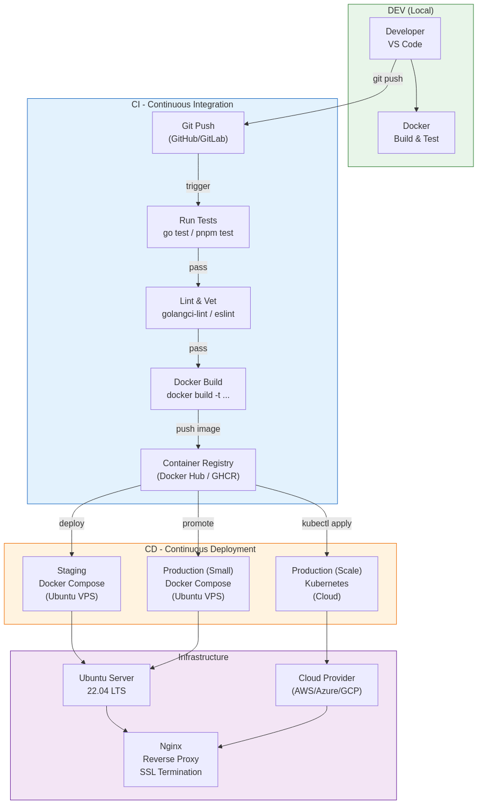
>
> Sơ đồ: [diagrams/08-devops-pipeline.mmd](diagrams/08-devops-pipeline.mmd)

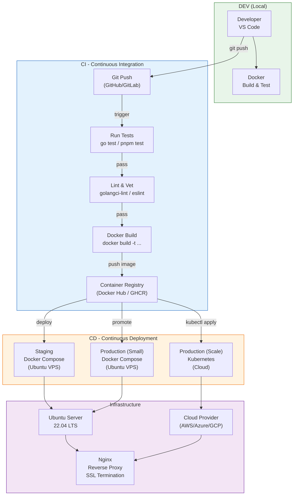
```mermaid
flowchart TB
    subgraph DEV["DEV (Local)"]
        CODE["Developer\nVS Code"]
        DOCKER_LOCAL["Docker\nBuild & Test"]
    end

    subgraph CI["CI - Continuous Integration"]
        GIT["Git Push\n(GitHub/GitLab)"]
        TEST["Run Tests\ngo test / pnpm test"]
        LINT["Lint & Vet\ngolangci-lint / eslint"]
        BUILD["Docker Build\ndocker build -t ..."]
        REGISTRY["Container Registry\n(Docker Hub / GHCR)"]
    end

    subgraph CD["CD - Continuous Deployment"]
        STAGING["Staging\nDocker Compose\n(Ubuntu VPS)"]
        PROD_COMPOSE["Production (Small)\nDocker Compose\n(Ubuntu VPS)"]
        PROD_K8S["Production (Scale)\nKubernetes\n(Cloud)"]
    end

    subgraph INFRA["Infrastructure"]
        NGINX["Nginx\nReverse Proxy\nSSL Termination"]
        UBUNTU["Ubuntu Server\n22.04 LTS"]
        CLOUD["Cloud Provider\n(AWS/Azure/GCP)"]
    end

    CODE -->|"git push"| GIT
    CODE --> DOCKER_LOCAL
    GIT -->|"trigger"| TEST
    TEST -->|"pass"| LINT
    LINT -->|"pass"| BUILD
    BUILD -->|"push image"| REGISTRY

    REGISTRY -->|"deploy"| STAGING
    REGISTRY -->|"promote"| PROD_COMPOSE
    REGISTRY -->|"kubectl apply"| PROD_K8S

    STAGING --> UBUNTU
    PROD_COMPOSE --> UBUNTU
    PROD_K8S --> CLOUD
    UBUNTU --> NGINX
    CLOUD --> NGINX

    style DEV fill:#e8f5e9,stroke:#2e7d32
    style CI fill:#e3f2fd,stroke:#1565c0
    style CD fill:#fff3e0,stroke:#ef6c00
    style INFRA fill:#f3e5f5,stroke:#6a1b9a
```

### 13.2 Các Tầng Hạ Tầng

| Tầng | Công nghệ | Vai trò trong LogMon |
|------|-----------|---------------------|
| **Hệ điều hành** | Ubuntu 22.04 LTS | Server chạy Docker, nhẹ, bảo mật, ecosystem lớn |
| **Web Server** | Nginx | Reverse proxy, SSL termination, load balancing |
| **Containerization** | Docker + Docker Compose | Đóng gói services, đảm bảo "build once, run anywhere" |
| **Orchestration** | Docker Compose (small) / K8s (scale) | Quản lý vòng đời containers |
| **CI/CD** | GitHub Actions / GitLab CI / Azure DevOps | Tự động test → build → deploy |
| **Cloud** | AWS / Azure / GCP (khi cần scale) | Compute, networking, managed services |

### 13.3 Luồng Deploy Chi Tiết

> 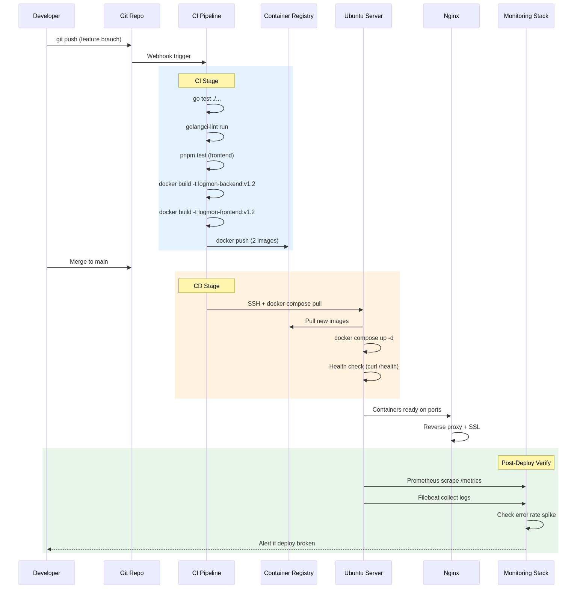
>
> Sơ đồ: [diagrams/09-deploy-flow.mmd](diagrams/09-deploy-flow.mmd)

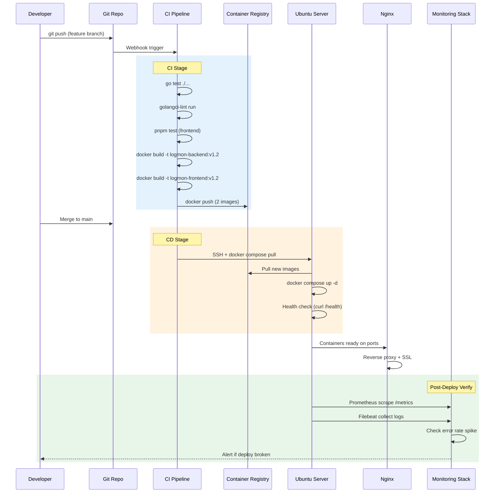
```mermaid
sequenceDiagram
    participant DEV as Developer
    participant GIT as Git Repo
    participant CI as CI Pipeline
    participant REG as Container Registry
    participant SRV as Ubuntu Server
    participant NGX as Nginx
    participant MON as Monitoring Stack

    DEV->>GIT: git push (feature branch)
    GIT->>CI: Webhook trigger

    rect rgb(227, 242, 253)
        Note over CI: CI Stage
        CI->>CI: go test ./...
        CI->>CI: golangci-lint run
        CI->>CI: pnpm test (frontend)
        CI->>CI: docker build -t logmon-backend:v1.2
        CI->>CI: docker build -t logmon-frontend:v1.2
        CI->>REG: docker push (2 images)
    end

    DEV->>GIT: Merge to main

    rect rgb(255, 243, 224)
        Note over CI: CD Stage
        CI->>SRV: SSH + docker compose pull
        SRV->>REG: Pull new images
        SRV->>SRV: docker compose up -d
        SRV->>SRV: Health check (curl /health)
    end

    SRV->>NGX: Containers ready on ports
    NGX->>NGX: Reverse proxy + SSL

    rect rgb(232, 245, 233)
        Note over MON: Post-Deploy Verify
        SRV->>MON: Prometheus scrape /metrics
        SRV->>MON: Filebeat collect logs
        MON->>MON: Check error rate spike
        MON-->>DEV: Alert if deploy broken
    end
```

### 13.4 Nginx Reverse Proxy

> 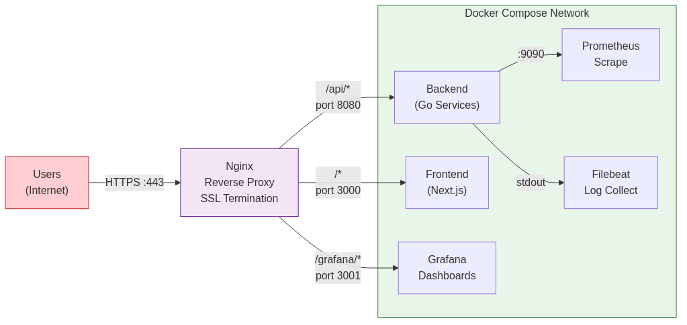
>
> Sơ đồ: [diagrams/10-nginx-architecture.mmd](diagrams/10-nginx-architecture.mmd)

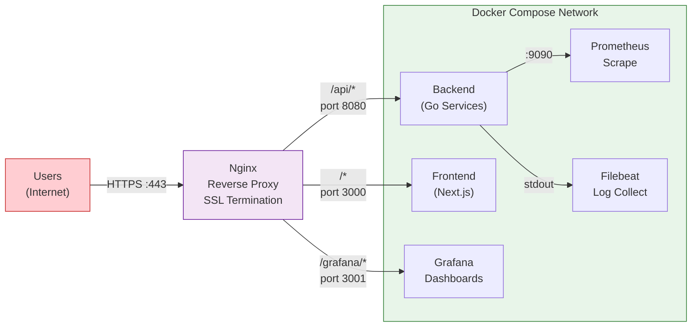
```mermaid
flowchart LR
    USER["Users\n(Internet)"] -->|"HTTPS :443"| NGX["Nginx\nReverse Proxy\nSSL Termination"]

    NGX -->|"/api/*\nport 8080"| BE["Backend\n(Go Services)"]
    NGX -->|"/*\nport 3000"| FE["Frontend\n(Next.js)"]
    NGX -->|"/grafana/*\nport 3001"| GF["Grafana\nDashboards"]

    BE -->|":9090"| PROM["Prometheus\nScrape"]
    BE -->|"stdout"| FB["Filebeat\nLog Collect"]

    subgraph Docker["Docker Compose Network"]
        BE
        FE
        GF
        PROM
        FB
    end

    style USER fill:#ffcdd2,stroke:#c62828
    style NGX fill:#f3e5f5,stroke:#6a1b9a
    style Docker fill:#e8f5e9,stroke:#2e7d32
```

**Nginx config mẫu** (`/etc/nginx/sites-available/logmon`):

```nginx
server {
    listen 443 ssl http2;
    server_name logmon.example.com;

    ssl_certificate     /etc/letsencrypt/live/logmon.example.com/fullchain.pem;
    ssl_certificate_key /etc/letsencrypt/live/logmon.example.com/privkey.pem;

    # Frontend (Next.js)
    location / {
        proxy_pass http://localhost:3000;
        proxy_set_header Host $host;
        proxy_set_header X-Real-IP $remote_addr;
        proxy_set_header X-Forwarded-For $proxy_add_x_forwarded_for;
        proxy_set_header X-Forwarded-Proto $scheme;
    }

    # Backend API
    location /api/ {
        proxy_pass http://localhost:8080;
        proxy_set_header Host $host;
        proxy_set_header X-Real-IP $remote_addr;
        proxy_set_header X-Forwarded-For $proxy_add_x_forwarded_for;
        proxy_set_header X-Forwarded-Proto $scheme;
    }

    # Grafana (internal dashboards)
    location /grafana/ {
        proxy_pass http://localhost:3001/;
        proxy_set_header Host $host;
    }
}

# HTTP → HTTPS redirect
server {
    listen 80;
    server_name logmon.example.com;
    return 301 https://$server_name$request_uri;
}
```

### 13.5 Dockerfile

**Backend** (`backend/Dockerfile`):

```dockerfile
# Build stage
FROM golang:1.22-alpine AS builder
WORKDIR /app
COPY go.mod go.sum ./
RUN go mod download
COPY . .
RUN CGO_ENABLED=0 GOOS=linux go build -o /bin/service ./cmd/orderservice/

# Runtime stage
FROM alpine:3.19
RUN apk --no-cache add ca-certificates
COPY --from=builder /bin/service /bin/service
EXPOSE 8080 9090
HEALTHCHECK --interval=10s --timeout=3s --retries=3 \
    CMD wget -qO- http://localhost:8080/health || exit 1
ENTRYPOINT ["/bin/service"]
```

**Frontend** (`frontend/Dockerfile`):

```dockerfile
# Build stage
FROM node:20-alpine AS builder
WORKDIR /app
RUN corepack enable
COPY package.json pnpm-lock.yaml ./
RUN pnpm install --frozen-lockfile
COPY . .
RUN pnpm build

# Runtime stage
FROM node:20-alpine
WORKDIR /app
RUN corepack enable
COPY --from=builder /app/.next/standalone ./
COPY --from=builder /app/.next/static ./.next/static
COPY --from=builder /app/public ./public
EXPOSE 3000
HEALTHCHECK --interval=10s --timeout=3s --retries=3 \
    CMD wget -qO- http://localhost:3000/ || exit 1
CMD ["node", "server.js"]
```

### 13.6 CI/CD Pipeline (GitHub Actions)

```yaml
# .github/workflows/deploy.yml
name: Build & Deploy LogMon

on:
  push:
    branches: [main]
  pull_request:
    branches: [main]

env:
  REGISTRY: ghcr.io
  IMAGE_PREFIX: ghcr.io/${{ github.repository }}

jobs:
  # ── CI: Test & Build ──────────────────────────
  test-backend:
    runs-on: ubuntu-latest
    steps:
      - uses: actions/checkout@v4
      - uses: actions/setup-go@v5
        with:
          go-version: '1.22'
      - run: cd backend && go test ./...
      - run: cd backend && go vet ./...
      - run: cd backend && golangci-lint run

  test-frontend:
    runs-on: ubuntu-latest
    steps:
      - uses: actions/checkout@v4
      - uses: pnpm/action-setup@v4
      - uses: actions/setup-node@v4
        with:
          node-version: '20'
          cache: 'pnpm'
          cache-dependency-path: frontend/pnpm-lock.yaml
      - run: cd frontend && pnpm install --frozen-lockfile
      - run: cd frontend && pnpm test
      - run: cd frontend && pnpm build

  build-and-push:
    needs: [test-backend, test-frontend]
    if: github.ref == 'refs/heads/main'
    runs-on: ubuntu-latest
    permissions:
      contents: read
      packages: write
    steps:
      - uses: actions/checkout@v4
      - uses: docker/login-action@v3
        with:
          registry: ${{ env.REGISTRY }}
          username: ${{ github.actor }}
          password: ${{ secrets.GITHUB_TOKEN }}

      - name: Build & push backend
        uses: docker/build-push-action@v5
        with:
          context: ./backend
          push: true
          tags: ${{ env.IMAGE_PREFIX }}-backend:${{ github.sha }},${{ env.IMAGE_PREFIX }}-backend:latest

      - name: Build & push frontend
        uses: docker/build-push-action@v5
        with:
          context: ./frontend
          push: true
          tags: ${{ env.IMAGE_PREFIX }}-frontend:${{ github.sha }},${{ env.IMAGE_PREFIX }}-frontend:latest

  # ── CD: Deploy ────────────────────────────────
  deploy-staging:
    needs: build-and-push
    runs-on: ubuntu-latest
    environment: staging
    steps:
      - name: Deploy to staging server
        uses: appleboy/ssh-action@v1
        with:
          host: ${{ secrets.STAGING_HOST }}
          username: ${{ secrets.STAGING_USER }}
          key: ${{ secrets.STAGING_SSH_KEY }}
          script: |
            cd /opt/logmon
            docker compose pull
            docker compose up -d
            sleep 10
            curl -f http://localhost:8080/health || exit 1
            echo "Deploy OK"

  deploy-production:
    needs: deploy-staging
    runs-on: ubuntu-latest
    environment: production  # requires manual approval
    steps:
      - name: Deploy to production server
        uses: appleboy/ssh-action@v1
        with:
          host: ${{ secrets.PROD_HOST }}
          username: ${{ secrets.PROD_USER }}
          key: ${{ secrets.PROD_SSH_KEY }}
          script: |
            cd /opt/logmon
            docker compose pull
            docker compose --profile scale up -d
            sleep 15
            curl -f http://localhost:8080/health || exit 1
            curl -f http://localhost:9090/api/v1/targets | grep -q '"health":"up"' || exit 1
            echo "Production deploy OK"
```

### 13.7 Hướng Dẫn Deploy Từng Bước

#### Bước 1: Chuẩn Bị Server (Ubuntu 22.04)

```bash
# Update system
sudo apt update && sudo apt upgrade -y

# Install Docker
curl -fsSL https://get.docker.com | sh
sudo usermod -aG docker $USER

# Install Docker Compose plugin
sudo apt install docker-compose-plugin -y

# Install Nginx
sudo apt install nginx -y

# Install Certbot (SSL)
sudo apt install certbot python3-certbot-nginx -y
```

#### Bước 2: Clone & Cấu Hình

```bash
# Clone project
git clone <repo-url> /opt/logmon
cd /opt/logmon

# Tạo file environment
cp .env.example .env
# Sửa .env với các giá trị thực tế:
#   POSTGRES_PASSWORD=<strong-password>
#   ELASTIC_PASSWORD=<strong-password>
#   GRAFANA_ADMIN_PASSWORD=<strong-password>
```

#### Bước 3: Deploy Mode A (Dev/Staging — Không Kafka)

```bash
cd /opt/logmon/infra/docker

# Start toàn bộ stack (Mode A: Filebeat → Logstash → ES)
docker compose up -d

# Kiểm tra tất cả services đã healthy
docker compose ps

# Kiểm tra endpoints
curl http://localhost:8080/health          # Backend
curl http://localhost:3000                 # Frontend
curl http://localhost:9090/api/v1/targets  # Prometheus targets
curl http://localhost:9200/_cluster/health # Elasticsearch
curl http://localhost:3001                 # Grafana
```

#### Bước 4: Deploy Mode B (Production — Với Kafka)

```bash
cd /opt/logmon/infra/docker

# Start full stack với Kafka buffer
docker compose --profile scale up -d

# Kiểm tra Kafka
docker compose exec kafka kafka-topics --list --bootstrap-server localhost:9092

# Kiểm tra consumer lag
docker compose exec kafka kafka-consumer-groups \
    --describe --group logstash-consumer \
    --bootstrap-server localhost:9092
```

#### Bước 5: Cấu Hình Nginx & SSL

```bash
# Copy nginx config
sudo cp /opt/logmon/infra/nginx/logmon.conf /etc/nginx/sites-available/logmon
sudo ln -s /etc/nginx/sites-available/logmon /etc/nginx/sites-enabled/

# Test & reload
sudo nginx -t
sudo systemctl reload nginx

# Cài SSL (Let's Encrypt)
sudo certbot --nginx -d logmon.example.com
```

#### Bước 6: Verify Post-Deploy

```bash
# 1. Health check
curl -f https://logmon.example.com/api/health

# 2. Prometheus targets all UP
curl -s http://localhost:9090/api/v1/targets | \
    jq '.data.activeTargets[] | {job: .labels.job, health: .health}'

# 3. Logs flowing vào Elasticsearch
curl -s 'http://localhost:9200/logs-*/_count' | jq '.count'

# 4. Grafana dashboards loaded
curl -s http://localhost:3001/api/dashboards | jq '.[].title'

# 5. Alertmanager reachable
curl -s http://localhost:9093/api/v2/status | jq '.cluster.status'
```

### 13.8 Rollback

Khi deploy lỗi, rollback nhanh bằng cách quay về image trước:

```bash
cd /opt/logmon/infra/docker

# Xem image version hiện tại
docker compose images

# Rollback về version cụ thể
export BACKEND_TAG=v1.1   # version trước
export FRONTEND_TAG=v1.1
docker compose pull
docker compose up -d

# Verify
curl -f http://localhost:8080/health
```

### 13.9 Lộ Trình DevOps cho LogMon

| Giai đoạn | Mục tiêu | Công cụ |
|-----------|----------|---------|
| **Phase 1: MVP** | 1 VPS, Docker Compose, deploy thủ công | Ubuntu + Docker + Nginx |
| **Phase 2: CI/CD** | Tự động test & deploy khi push code | GitHub Actions + SSH deploy |
| **Phase 3: Multi-env** | Staging + Production tách biệt | Docker Compose profiles + GitHub Environments |
| **Phase 4: Scale** | Auto-scaling, high availability | Kubernetes (managed: EKS/AKS/GKE) |

**Nguyên tắc**: Bắt đầu đơn giản nhất có thể. Chỉ thêm complexity khi nhu cầu thực sự phát sinh:

```
Phase 1 (đủ cho 90% startup):
  Ubuntu VPS + Docker Compose + Nginx + Let's Encrypt

Phase 2 (khi team > 3 người):
  + GitHub Actions CI/CD pipeline

Phase 3 (khi có staging/prod riêng):
  + Docker Compose profiles + GitHub Environments

Phase 4 (khi cần auto-scale, HA):
  + Kubernetes + Cloud managed services
```
