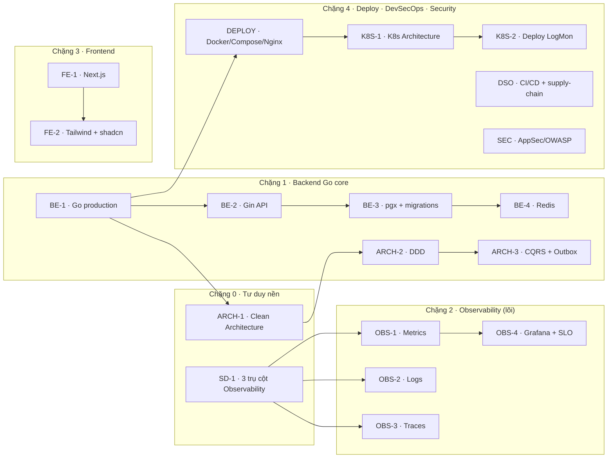

# 🎓 doc_tech — Học techstack LogMon từ Zero → Hero

> Một **giáo trình thực chiến**: học toàn bộ techstack của một nền tảng observability production
> (Go · DDD · Prometheus/OTel/Jaeger/ES · Next.js · Kubernetes · DevSecOps) **qua chính dự án LogMon**,
> không học chay. Mỗi kỹ năng được neo vào code thật trong repo + best practice đã research + sơ đồ trực quan.

## Triết lý: learn-by-doing trên một codebase thật

Đa số tài liệu dạy techstack rời rạc ("hello world"). Ở đây bạn học **trong ngữ cảnh một hệ thống thật**:
mỗi khái niệm đi kèm câu hỏi "**LogMon dùng nó ở đâu, vì sao**", và **bài tập thao tác ngay trên repo này**.
Đây là cách học gần với kỹ sư senior nhất: hiểu *trade-off trong hệ thống cụ thể*, không chỉ cú pháp.

## Cách dùng giáo trình

- Mỗi bài có **10 mục cố định**: vì sao quan trọng → mô hình tư duy (từ số 0) → khái niệm cốt lõi → **LogMon dùng thế nào (bám code `path:line`)** → best practices (có nguồn) → anti-patterns → **lộ trình luyện tập trên repo** → skill/agent ECC nên dùng → tài nguyên → checklist tự đánh giá.
- **Cấp độ trong mỗi bài**: 🥉 cơ bản → 🥈 trung cấp → 🥇 nâng cao. Cứ làm hết task 🥉 của các bài nền tảng trước, rồi mới lên 🥈.
- **Ký hiệu trạng thái**: phần đánh dấu *(implemented)* = đã có code trong repo để đọc/sửa; *(planned)* = mới là thiết kế trong `doc_v2/` (target roadmap) — học để biết đích đến.
- **Sơ đồ**: render bằng [drawio-ai-kit](../tools/drawio-ai-kit) (xem [diagrams/](diagrams/)). Mở `.drawio` để sửa, xem `.png` để đọc nhanh.

## 🗺️ Lộ trình đề xuất (zero → hero)

**Tóm tắt thứ tự**: `Tư duy nền → Backend Go → Observability → Frontend → Deploy/Sec`. Người mới hoàn toàn nên bắt đầu **BE-1 + SD-1** song song.

## 📚 Mục lục module (33 module + 2 capstone)

### Architecture & System Design
| Module | Bài | Prereqs | Sơ đồ |
|---|---|---|---|
| ARCH-1 | [Clean Architecture](architecture/01-clean-architecture.md) | BE-1 | [clean-arch-layers](diagrams/clean-arch-layers.png) |
| ARCH-2 | [DDD & Bounded Contexts](architecture/02-ddd-bounded-contexts.md) | ARCH-1 | [BC map](../doc_v2/diagrams/logmon_bc_map.png) |
| ARCH-3 | [CQRS & Event-driven (Outbox)](architecture/03-cqrs-event-driven.md) | ARCH-2 | BC map |
| SD-1 | [3 trụ cột Observability — tư duy hệ thống](system-design/01-observability-3-pillars.md) | — | [3-pillars](diagrams/observability-3-pillars.png) |

### Backend (Go)
| Module | Bài | Prereqs |
|---|---|---|
| BE-1 | [Go production-grade](backend-go/01-go-production.md) | — |
| BE-2 | [REST API với Gin](backend-go/02-gin-http-api.md) | BE-1 |
| BE-3 | [PostgreSQL: pgx + golang-migrate](backend-go/03-postgres-pgx-migrations.md) | BE-1 |
| BE-4 | [Redis (cache & rate limit)](backend-go/04-redis.md) | BE-3 |

### Observability (lõi nghiệp vụ của LogMon)
| Module | Bài | Prereqs | Sơ đồ |
|---|---|---|---|
| OBS-1 | [Metrics — Prometheus + Alertmanager](observability/01-metrics-prometheus.md) | SD-1 | [metrics](diagrams/metrics-prometheus-alertmanager.png) |
| OBS-2 | [Logs — zerolog → OTel → Elasticsearch](observability/02-logs-otel-elasticsearch.md) | SD-1 | [logs pipeline](../doc_v2/diagrams/logmon_logs_pipeline.png) |
| OBS-3 | [Traces — OpenTelemetry → Jaeger](observability/03-traces-opentelemetry-jaeger.md) | SD-1 | [traces](diagrams/traces-otel-jaeger.png) |
| OBS-4 | [Grafana & SLO / Error Budget](observability/04-grafana-slo.md) | OBS-1 | — |

### Frontend
| Module | Bài | Prereqs |
|---|---|---|
| FE-1 | [Next.js + TypeScript (admin dashboard)](frontend/01-nextjs-typescript.md) | — |
| FE-2 | [TailwindCSS + shadcn/ui](frontend/02-tailwind-shadcn.md) | FE-1 |

### Deploy, DevSecOps & Security
| Module | Bài | Prereqs | Sơ đồ |
|---|---|---|---|
| DEPLOY | [Docker, Compose & Nginx](devsecops/01-docker-compose-nginx.md) | BE-1 | — |
| K8S-1 | [Kubernetes: Architecture, Components & Concepts](kubernetes/01-architecture-components-concepts.md) | DEPLOY | [k8s arch](diagrams/kubernetes-architecture.png) |
| K8S-2 | [Triển khai LogMon trên Kubernetes](kubernetes/02-deploying-logmon.md) | K8S-1 | — |
| DSO | [CI/CD & Supply-chain Security](devsecops/02-ci-cd-supply-chain.md) | BE-1, DEPLOY | [ci/cd](diagrams/cicd-supply-chain.png) |
| SEC | [AppSec & OWASP — Auth](security/01-appsec-owasp-auth.md) | BE-2 | — |

### 🚀 Tier Hero / Nâng cao (planned BC + deep-dive)
> Học sau khi nắm vững các chặng trên. Phần lớn là **đích thiết kế (planned)** trong `doc_v2/` — học để biết hệ thống tiến hoá tới đâu.

| Module | Bài | Prereqs | Sơ đồ |
|---|---|---|---|
| INC-1 | [Incident Management](incident/01-incident-management.md) | ARCH-2, OBS-1 | [state machine](diagrams/incident-state-machine.png) |
| NOT-1 | [Notification Hub đa kênh](notification/01-notification-hub.md) | ARCH-3, INC-1 | [notification hub](diagrams/notification-hub.png) |
| AI-1 | [AI Incident Automation (GĐ5 — capstone)](ai/01-ai-incident-automation.md) | INC-1, NOT-1 | [ai flow](diagrams/ai-automation-flow.png) |
| ADV-1 | [Thanos — Metrics dài hạn](observability/05-thanos-long-term-metrics.md) | OBS-1 | — |
| ADV-2 | [OTel Collector & Tail Sampling](observability/06-otel-collector-tail-sampling.md) | OBS-3 | — |
| ADV-3 | [Elasticsearch — Data Streams & ILM](data/01-elasticsearch-data-streams-ilm.md) | OBS-2 | [ES ILM](diagrams/es-ilm-lifecycle.png) |
| ADV-4 | [eBPF — Auto-instrumentation](observability/07-ebpf-auto-instrumentation.md) | OBS-3 | — |
| TEST-1 | [Chiến lược Testing](backend-go/05-testing-strategy.md) | BE-1 | — |
| IAC-1 | [IaC (Terraform) & Runbooks](devsecops/03-iac-terraform-runbooks.md) | K8S-2 | — |

### 🧩 Module bổ sung & chuyên đề
| Module | Bài | Prereqs | Sơ đồ |
|---|---|---|---|
| BE-6 | [API Design & OpenAPI](backend-go/06-api-design-openapi.md) | BE-2 | [gin lifecycle](diagrams/gin-request-lifecycle.png) |
| BE-7 | [Performance & Profiling (Go)](backend-go/07-performance-profiling.md) | BE-1, OBS-1 | — |
| SEC-2 | [Identity, RBAC & Multi-tenancy](security/02-identity-rbac-multitenancy.md) | SEC-1, ARCH-1 | — |
| DATA-2 | [Kafka — Buffer Mode B](data/02-kafka-mode-b-buffer.md) | OBS-2 | [kafka Mode-B](diagrams/kafka-mode-b.png) |
| DSO-2 | [Config & Secrets (12-factor)](devsecops/04-config-12factor-secrets.md) | BE-1 | — |

### 🎓 Capstone (ráp tất cả lại)
| | Bài | Mục đích |
|---|---|---|
| 🧭 | [Lộ trình học theo vai trò](capstone/00-reading-paths.md) | "đọc bài nào trước?" — 5 path: BE / SRE / FE / DevOps / Architect |
| 🏗️ | [Xây 1 feature xuyên suốt mọi tầng](capstone/01-feature-end-to-end.md) | vertical slice domain→API→FE→observability→test→deploy |

## 🛠️ Map techstack → skill/agent ECC để luyện

| Khi học… | Dùng skill/agent ECC |
|---|---|
| Go (idioms, test, build) | `ecc:go-reviewer` · `ecc:golang-patterns` · `ecc:golang-testing` · `ecc:go-build` |
| Architecture / DDD | `ecc:architect` · `ecc:code-architect` · `ecc:hexagonal-architecture` · `ecc:type-design-analyzer` |
| PostgreSQL | `ecc:database-reviewer` · `ecc:postgres-patterns` · `ecc:database-migrations` |
| Frontend | `ecc:react-reviewer` · `ecc:design-system` · `ecc:dashboard-builder` · `ecc:a11y-architect` |
| Kubernetes / Deploy | `ecc:kubernetes-patterns` · `ecc:deployment-patterns` · `ecc:docker-patterns` |
| DevSecOps / Security | `ecc:security-reviewer` · `ecc:security-scan` · `ecc:security-bounty-hunter` |
| Observability/SRE | `ecc:architect` · `ecc:production-audit` · `ecc:performance-optimizer` |

## 🖼️ Thư viện sơ đồ

Tất cả sinh **bằng code** (drawio-ai-kit, không kéo-thả). Build scripts: `tools/drawio-ai-kit/examples/build_dt_*.mjs`.
Regenerate + render headless: xem [../doc_v2/diagrams/README.md](../doc_v2/diagrams/README.md).

| Sơ đồ | Dùng ở bài |
|---|---|
|  | ARCH-1 |
|  | SD-1 |
|  | OBS-1 |
|  | OBS-3 |
|  | K8S-1 |
|  | DSO |
|  | INC-1 |
|  | NOT-1 |
|  | AI-1 |
|  | ADV-3 |

**Sơ đồ bổ sung** (nhúng trong bài tương ứng): [auth-flow](diagrams/auth-flow.png) (SEC-1) · [db-erd](diagrams/db-erd.png) (BE-3) · [gin-request-lifecycle](diagrams/gin-request-lifecycle.png) (BE-2/6) · [thanos-components](diagrams/thanos-components.png) (ADV-1) · [deploy-topology](diagrams/deploy-topology.png) (K8S-2) · [test-pyramid](diagrams/test-pyramid.png) (TEST-1) · [kafka-mode-b](diagrams/kafka-mode-b.png) (DATA-2). **Tổng: 17 sơ đồ.**

> Tái sử dụng từ `doc_v2/diagrams/`: [logs pipeline](../doc_v2/diagrams/logmon_logs_pipeline.png) (OBS-2) · [BC map](../doc_v2/diagrams/logmon_bc_map.png) (ARCH-2/3).

## Nguồn sự thật & liên hệ

- Thiết kế chi tiết (target): [`doc_v2/`](../doc_v2) (18 file, source of truth).
- Quy ước code & kiến trúc: [`CLAUDE.md`](../CLAUDE.md).
- Trạng thái roadmap: BC `alerting · logpipeline · user(→identity) · shared` *(implemented)*; `slo · incident · notification`, k8s manifests, Thanos/Jaeger/ES *(planned — doc_v2)*. Mỗi bài sẽ nói rõ phần nào đọc được code, phần nào là đích.
