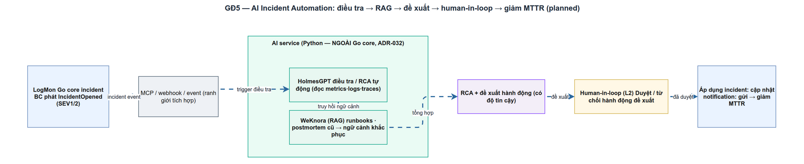

# AI Incident Automation (GĐ5 — capstone)
> Module AI-1 · AI điều tra/RCA, RAG runbooks, MCP, human-in-loop, giảm MTTR · Độ khó: 🥇 (nâng cao) · Prereqs: INC-1, NOT-1

> **Ghi chú trạng thái quan trọng:** Toàn bộ chủ đề này là **planned** — đích cuối roadmap. Trong repo *chưa có một dòng code AI nào*: `backend/internal/incident/` và `backend/internal/notification/` còn **trống** (prereq INC-1/NOT-1 là GĐ3, chưa làm), và không tồn tại service HolmesGPT/WeKnora/MCP-agent. Source of truth là `doc_v2/17-ai-incident-automation.md` (design doc) + ADR-031…035 (`doc_v2/13-adr.md`). Bài này dạy **đích đến và cách LogMon sẽ hiện thực**, neo chính xác vào doc đó. Điểm tựa code *thật* duy nhất hiện có là một MCP server đang chạy trong repo: `tools/drawio-ai-kit/` khai báo ở `.mcp.json` — ta dùng nó để hiểu MCP một cách cụ thể, không trừu tượng.

## 1. Vì sao kỹ năng này quan trọng trong LogMon

LogMon bán **độ tin cậy**: thu thập metrics/logs/traces, phát hiện và xử lý sự cố. Nhưng đo đạc xong rồi *con người vẫn phải triage + chẩn đoán thủ công* — và đó là nơi đồng hồ MTTR chạy nhanh nhất. Bằng chứng nhất quán 2025–2026: **>50% thời gian một sự cố nằm ở giai đoạn TRIAGE + DIAGNOSE** (`doc_v2/17-ai-incident-automation.md:44`). MTTD/MTTA khó cải thiện bằng AI (do độ phủ monitoring + cấu hình paging quyết định), nhưng triage/diagnose thì AI có đòn bẩy cao.

GĐ5 là **capstone**: nó chỉ có nghĩa khi mọi thứ phía dưới đã có thật — alerting BC (đã implemented), SLO error budget, incident state machine + MTTA/MTTR (GĐ3), notification hub đa kênh (GĐ3), và telemetry OTel hợp nhất. Không có các BC này thì AI **không có nơi ghi kết quả, không có runbook/postmortem để học, không có "đồng hồ" để đo cải thiện** (`doc_v2/17-ai-incident-automation.md:15`). Vì vậy nó được xếp **cuối** roadmap, sau cả GĐ4 (Scale & Enterprise) — không phải vì khó nhất về code, mà vì *phụ thuộc nhiều nhất*.

Mục tiêu thực tế, đã chốt chống-marketing: **giảm ~25–40% MTTR**, có điều kiện về chất lượng telemetry — **không hứa 50–80%** (đó là số vendor, `doc_v2/17-ai-incident-automation.md:49,230-233`).

## 2. Mô hình tư duy (first principles) — giải thích từ con số 0

Bắt đầu từ câu hỏi: *một SRE giỏi làm gì trong 30 phút đầu một sự cố?* (1) nhận alert, hỏi "cái gì vừa thay đổi?"; (2) kéo dữ liệu — Grafana error rate/latency, grep logs, trace request chậm; (3) dựng giả thuyết rồi **kéo thêm dữ liệu để xác nhận/bác bỏ**; (4) tra runbook / nhớ "lần trước fix thế nào"; (5) đề xuất khắc phục, làm, **kiểm tra telemetry đã hồi phục chưa**.

Một **agent** chỉ là vòng lặp đó được tự động một phần: LLM **suy luận**, gọi **tool** để quan sát, đọc kết quả, **suy luận tiếp** (mẫu *ReAct*: reason → act → observe → refine). Ba mảnh ghép để biến LLM thành agent điều tra:

- **Tools (MCP)** — cách agent "nhìn" hệ thống. Thay vì copy-paste log vào prompt, agent gọi một tool chuẩn hoá để query Prometheus/ES/Jaeger. **MCP** (Model Context Protocol) là chuẩn mở để mô tả tool đó (input/output schema) cho bất kỳ LLM nào dùng được — y hệt `tools/drawio-ai-kit/src/mcp-server.mjs` trong repo phơi tool "render diagram" cho Claude. Agent SRE sẽ phơi tool "query telemetry".
- **RAG** (Retrieval-Augmented Generation) — cách agent "nhớ". LLM không biết runbook nội bộ hay sự cố tháng trước; ta **truy hồi** đoạn tài liệu liên quan rồi nhét vào ngữ cảnh, kèm **citation** để người kiểm chứng. Đây là cách chống bịa.
- **Vòng điều khiển + guardrails** — cách agent "an toàn". Read-only khi điều tra, audit mọi truy vấn, sanitize input, và **con người duyệt trước khi hành động**.

Nguyên tắc nền tảng, nhớ một câu thôi: **"AI proposes, human approves, AI executes."** Tự chủ là thứ *phải kiếm được bằng bằng chứng*, không cấp sẵn (ADR-031, `doc_v2/17-ai-incident-automation.md:62,265`).

## 3. Khái niệm cốt lõi (tăng dần độ khó)

### 3.1 Họ metric MTTx — phải nói rõ chữ "R"
| Metric | Nghĩa | Ai/cái gì quyết định |
|--------|-------|----------------------|
| MTTD | Time to **Detect** | độ phủ monitoring |
| MTTA | Time to **Acknowledge** | sức khoẻ on-call/paging |
| MTTM | Time to **Mitigate** (failover/rollback) | thường là cái user quan tâm nhất |
| MTTR | Time to **Resolve** — *mơ hồ*, phải nói rõ mốc start/stop | metric bị lạm dụng nhất |

Quy ước LogMon: "MTTR" = **Mean Time to *Resolve*** (detect → service restored), tách riêng MTTM (`doc_v2/17-ai-incident-automation.md:35`). AI phải làm giảm *triage + diagnose*; nếu tổng MTTR giảm mà 2 phase này không → nguyên nhân khác (§10 của design doc).

### 3.2 Autonomy Ladder — GĐ5 trần ở **L2**
| Rung | Tên | AI làm gì | GĐ5 |
|------|-----|-----------|-----|
| L1 | Assistive (CRAWL) | quan sát, tương quan, dựng giả thuyết RCA — **không hành động** | ✅ khởi đầu, read-only ≥4 tuần |
| **L2** | Human-in-the-loop (WALK) | điều tra đa bước + **gợi ý remediation cụ thể**; người quyết | ✅ **trần GĐ5** |
| L3 | Approval-gated | AI *thực thi* fix với phê duyệt từng hành động | ⏭️ sau GĐ5 |
| L4 | Closed-loop | AI tự xử lý kịch bản hẹp đã chứng minh | ⏭️ sau GĐ5 |

"Soạn remediation có cổng" = L2: AI **chuẩn bị sẵn** lệnh/runbook/PR nháp để người duyệt rồi thực thi — *chưa* tự chạy (`doc_v2/17-ai-incident-automation.md:70-79`).

### 3.3 Pipeline agentic SRE 9 bước (chuẩn ngành)
`INGESTION → CORRELATION/DEDUP → TRIAGE → DIAGNOSIS/RCA (vòng tool MCP) → HYPOTHESIS RANKING → RUNBOOK RETRIEVAL (RAG) → REMEDIATION (GĐ5 dừng ở đây) → VERIFICATION → POSTMORTEM`. Vòng RCA là *loop*: confidence thấp → query thêm; verification thất bại → quay lại diagnosis (`doc_v2/17-ai-incident-automation.md:98-118`).

### 3.4 RAG: hybrid + GraphRAG + grounding nghiêm
Retrieval **hybrid** (BM25 từ-khoá + dense embedding) + **GraphRAG** (liên kết thực thể service↔error↔owner↔deploy để truy "sự cố tương tự đã từng xảy ra"). Grounding nghiêm: *"chỉ trả lời từ ngữ cảnh được cấp; không có thì nói không biết"* + **citation bắt buộc**. **Freshness là yếu tố số 1** quyết định chất lượng — runbook là docs-as-code, cập nhật cùng PR đổi hành vi (`doc_v2/17-ai-incident-automation.md:151-154`, nguồn `16-iac-runbooks.md`).

### 3.5 Telemetry là **untrusted input** (phản trực giác nhưng sống còn)
Log/metric/trace do *service* sinh ra — kẻ tấn công có thể nhúng payload đối kháng vào đó để lái agent. Nghiên cứu *AIOpsDoom* (USENIX Security '26) báo tỉ lệ tấn công ~89%, né được cả prompt-guard (`doc_v2/17-ai-incident-automation.md:63`). Hệ quả: **sanitize/redact telemetry trước khi đưa vào LLM** (ADR-033). Đây là tư duy security boundary y hệt §5.2 trong giáo trình AppSec: *không tin dữ liệu vượt biên*.

## 4. LogMon dùng/sẽ dùng nó thế nào (bám doc_v2 + code; ghi rõ implemented/planned)

**Implemented (có code thật để đọc):**
- **Nền alerting**: vòng đời rule do LogMon quản lý đã chạy — `backend/internal/alerting/` (validate PromQL, render→reload Prometheus, silence/ack qua Alertmanager API). Đây chính là điểm `AlertFired` (burn-rate breach) sẽ phát webhook kích hoạt agent.
- **MCP server mẫu**: `tools/drawio-ai-kit/` + khai báo `.mcp.json` — *bằng chứng cụ thể* MCP hoạt động ra sao trong repo này. Khi làm AI-1 bạn sẽ viết một MCP server tương tự nhưng phơi tool "đọc telemetry".
- **Telemetry pipeline**: metrics (Prometheus), logs (zerolog→OTel→ES), traces (OTel→Jaeger) đã có — là *chất nền* cho RCA đa tín hiệu.

**Planned (chỉ trong doc_v2/roadmap, CHƯA có code):**
- **Toàn bộ lớp AI**: là **service Python độc lập** (HolmesGPT engine RCA + WeKnora/pgvector RAG), **tách khỏi Go core**, nối qua **MCP (đọc telemetry) + webhook (Alertmanager) + read-API các BC** — KHÔNG cross-BC import, KHÔNG vi phạm layer direction (ADR-032, `doc_v2/17-ai-incident-automation.md:96`). Nó là một *bounded service* mới, giao tiếp qua event/HTTP như mọi BC khác.
- **Prereq INC-1**: `backend/internal/incident/` còn **trống** — agent cần incident aggregate (state machine SEV1–4, MTTA/MTTR) làm nơi ghi RCA và stage postmortem.
- **Prereq NOT-1**: `backend/internal/notification/` còn **trống** — agent cần hub để đẩy RCA ra Slack/PagerDuty và `get_current_oncall` để @mention đúng ca trực.
- **5 năng lực GĐ5** (`doc_v2/17-ai-incident-automation.md:143-166`): (1) RCA với subagent tách theo modality `metrics/logs/traces-investigator`; (2) RAG runbook/postmortem hybrid+GraphRAG; (3) remediation có cổng L2; (4) auto-draft postmortem (bắt buộc human-review); (5) giảm nhiễu alert + **chỉ trigger khi burn-rate đe doạ error budget** (ADR-034) để tránh đốt token vào alert nhiễu.
- **Tiền đề bắt buộc (mốc 5.0)**: OTel semconv chặt + `trace_id` vào log + exemplars + topology attrs **trước** khi bật agent (ADR-035, `doc_v2/17-ai-incident-automation.md:184-192`). *Không telemetry chất lượng → AI chỉ tóm tắt, không chẩn đoán.*

Tích hợp BC (qua event/API, không cross-import): `alerting` (trigger), `slo` (error-budget gate + thước "budget saved"), `incident` (ghi/annotate), `notification` (đẩy + oncall), `logpipeline` (nguồn logs) — `doc_v2/17-ai-incident-automation.md:170-180`.

## 5. Best practices (mỗi mục kèm 1 nguồn đã research)

1. **Bắt đầu read-only, leo thang autonomy bằng bằng chứng.** Google SRE chỉ giao mitigation tự động sau khi "Nightly Evals" chứng minh agent sẵn sàng; con người leo *lên* abstraction ladder thành architect of AI safety. ([Google SRE — AI engineering for reliable operations](https://sre.google/resources/practices-and-processes/ai-engineering-reliable-operations/))
2. **Dùng MCP để phơi tool telemetry, đừng nhồi dữ liệu vào prompt.** HolmesGPT "actively decides what data to fetch, runs targeted queries, and iteratively refines hypotheses" và cho phép phơi tool nội bộ qua MCP server. ([CNCF — HolmesGPT agentic troubleshooting](https://www.cncf.io/blog/2026/01/07/holmesgpt-agentic-troubleshooting-built-for-the-cloud-native-era/))
3. **RAG phải có grounding + citation tới đoạn cụ thể.** Best practice 2025: luôn render nguồn, ưu tiên snippet có anchor để người kiểm chứng; GraphRAG cho traceability đa-hop. ([Data Nucleus — RAG enterprise guide 2025](https://datanucleus.dev/rag-and-agentic-ai/what-is-rag-enterprise-guide-2025))
4. **Coi telemetry là untrusted, có observability *của* agent.** Production agentic cần thấy execution path, latency, failure mode của từng tool-call; trace mọi tool call qua một gateway/MCP có RBAC + audit. ([Red Hat — building effective AI agents with MCP](https://developers.redhat.com/articles/2026/01/08/building-effective-ai-agents-mcp))
5. **Trigger thông minh bằng multi-window multi-burn-rate, không trên mọi alert.** Chỉ đánh thức agent (và người) khi burn-rate thực sự đe doạ error budget. ([Google SRE Workbook — Alerting on SLOs](https://sre.google/workbook/alerting-on-slos/))
6. **Đo bằng "error budget saved", phân khúc theo severity, dùng p50/p90.** MTTR thô lệch phải và trộn SEV1 với SEV4 sẽ ra số vô nghĩa. ([Atlassian — incident management KPIs](https://www.atlassian.com/incident-management/kpis/common-metrics))

## 6. Lỗi thường gặp & anti-patterns

- **Closed-loop quá sớm.** Để AI tự restart/đổi config production trong vòng điều tra. Bài học Replit 7/2025: agent xoá prod DB *trong code freeze*. GĐ5 cấm tiệt (non-goal, ADR-031).
- **Tin RCA của AI vô điều kiện.** Benchmark thực còn yếu: OpenRCA model tốt nhất giải 11.34%, ITBench agent giải 13.8% kịch bản SRE (`doc_v2/17-ai-incident-automation.md:64`). → luôn kèm **confidence + citation**, người vẫn quyết.
- **Đưa raw telemetry thẳng vào LLM.** Mở cửa prompt-injection (AIOpsDoom ~89%) và rò rỉ secret/PII. Phải sanitize/redact trước.
- **RAG trên runbook cũ.** Freshness là yếu tố số 1; runbook stale làm RAG bịa "đúng kiểu". Docs-as-code, cập nhật cùng PR.
- **Trigger agent trên mọi alert.** Đốt token, tạo nhiễu, và che lấp tín hiệu thật. Gate bằng burn-rate.
- **Đo MTTR mà không cố định định nghĩa "R" + mốc start/stop.** "Cải thiện" hoá ra chỉ là đổi cách bấm giờ. Cũng đừng hứa 50–80% (số marketing).
- **Nhúng lớp AI vào Go core.** Vi phạm ADR-032 + layer direction. Nó là *service Python tách rời*, nói chuyện qua MCP/HTTP/event.
- **False-suppression khi dedup.** Gom alert quá tay → bỏ sót sự cố thật. Giám sát recall của dedup, không suppress mù.

## 7. Lộ trình luyện tập (🥉→🥈→🥇)

Vì chủ đề **planned**, task là **thiết kế/POC ngay trong repo LogMon** — vẫn phải tạo artifact cụ thể, không học chay.

**🥉 Cơ bản — hiểu MCP + đọc design doc**
1. Chạy thử MCP server có sẵn: đọc `tools/drawio-ai-kit/src/mcp-server.mjs` + `.mcp.json`, liệt kê các tool nó phơi (tên, input schema). Viết 1 trang `doc_tech/ai/notes-mcp.md`: "một tool MCP cần khai báo gì để LLM gọi được".
2. Lập bảng map: với mỗi BC (`alerting/slo/incident/notification/logpipeline`), ghi *agent sẽ cần read-API/tool nào* (bám `doc_v2/17-ai-incident-automation.md:170-180`). Đánh dấu cái nào đã có endpoint, cái nào planned.

**🥈 Trung cấp — POC tool + sanitizer**
3. Viết một **MCP tool "query_prometheus" read-only** (Python hoặc Node, ngoài Go core, đặt ở `tools/sre-agent-poc/`): nhận `promql`, trả JSON. Bọc **capability contract** (input/output/scope) và **chặn mọi tool ghi**. Test: gọi với một PromQL thật từ `infra/prometheus/rules/`.
4. Viết hàm **`sanitizeTelemetry()`**: nhận log record, redact pattern secret/PII (token, email, IP nội bộ) **trước** khi vào LLM. Viết bảng test table-driven (theo chuẩn `doc_v2/11`): input có secret → output đã redact; chống cả chuỗi "ignore previous instructions" nhúng trong log message.
5. Thiết kế **golden replay suite** (chưa cần LLM thật): tạo `tools/sre-agent-poc/eval/` với 3 case sự cố mô phỏng (deploy-bad, DB-pool-exhausted, ES-disk-full) — input = telemetry giả, expected = RCA nhãn người. Đây là khung để sau này "block merge khi hồi quy".

**🥇 Nâng cao — ADR + kiến trúc end-to-end**
6. Viết **ADR-036 (đề xuất)** trong `doc_v2/13-adr.md` (nháp riêng): chọn cụ thể *WeKnora vs pgvector tự cuốn* cho RAG, dựa trên: LogMon đã có Postgres + ES, freshness, GraphRAG. Liệt kê trade-off, quyết định, hệ quả.
7. Thiết kế **luồng webhook Alertmanager → agent**: định nghĩa contract payload (alert + labels burn-rate), điều kiện gate (multi-window: 1h≥14.4× & 6h elevated), và *sequence* tới khi post RCA vào Slack thread. Vẽ lại bằng `tools/drawio-ai-kit` thành `.drawio`, đối chiếu với `diagrams/ai-automation-flow.png`.
8. Viết **promotion gate** L1→L2 (bám §9 design doc): tiêu chí "2 tuần sạch", metric quality (agreement-rate, false-RCA rate, % gợi ý được chấp nhận), và *hook PreToolUse* read-only enforcement. Mô tả thành runbook trong `doc_tech/ai/`.

## 8. Skill/agent ECC nên dùng

- **`ecc:agentic-engineering`** — vận hành như agentic engineer: eval-first, decomposition, cost-aware model routing. Đúng tinh thần "không có eval thì không thăng rung" của §9 design doc; dùng khi thiết kế golden replay suite (task 🥈-5).
- **`ecc:mcp-server-patterns`** — mẫu chuẩn viết MCP server (capability contract, input/output schema, security). Dùng trực tiếp cho task 🥈-3 (POC tool query_prometheus) và để hiểu `tools/drawio-ai-kit`.
- **`ecc:iterative-retrieval`** — mẫu retrieval lặp (query→observe→refine) — chính là vòng RCA §3.3 và thiết kế RAG hybrid §3.4.
- **`ecc:agent-architecture-audit`** — diagnostic 12-layer cho agent app: phát hiện wrapper regression, memory pollution, tool discipline failure, hidden repair loop. Dùng review POC trước khi đề xuất leo lên L2, và khi viết promotion gate (task 🥇-8).
- *(bổ trợ)* `ecc:agent-harness-construction` cho thiết kế action space/tool definition; `ecc:security-review` + skill `cso` cho guardrails (sanitize, read-only, audit) map vào `doc_v2/09-security`.

## 9. Tài nguyên học thêm (link đã research)

- [CNCF — HolmesGPT: agentic troubleshooting built for the cloud native era](https://www.cncf.io/blog/2026/01/07/holmesgpt-agentic-troubleshooting-built-for-the-cloud-native-era/) — engine RCA LogMon chọn (ADR-032); agentic loop + MCP extensibility.
- [Google SRE — AI engineering for reliable operations](https://sre.google/resources/practices-and-processes/ai-engineering-reliable-operations/) — autonomy ladder, governance, Nightly Evals.
- [How Google SRE is using agentic AI to improve operations (Google Cloud Blog)](https://cloud.google.com/blog/products/devops-sre/how-google-sre-is-using-agentic-ai-to-improve-operations) — AI Operator + Actus control plane, mitigation an toàn.
- [Red Hat — Building effective AI agents with Model Context Protocol (MCP)](https://developers.redhat.com/articles/2026/01/08/building-effective-ai-agents-mcp) — RBAC/OAuth, MCP gateway, observability của tool-call.
- [MCP Specification (2025-11-25)](https://modelcontextprotocol.io/specification/2025-11-25) — chuẩn MCP chính thức (tool/resource/prompt).
- [Data Nucleus — RAG, GraphRAG & agentic AI: enterprise guide 2025](https://datanucleus.dev/rag-and-agentic-ai/what-is-rag-enterprise-guide-2025) — hybrid retrieval, grounding/citation, GraphRAG.
- [Google SRE Workbook — Alerting on SLOs](https://sre.google/workbook/alerting-on-slos/) — multi-window multi-burn-rate (cơ sở gate trigger).
- [Atlassian — incident management KPIs](https://www.atlassian.com/incident-management/kpis/common-metrics) — định nghĩa MTTD/MTTA/MTTR đúng.
- [AIOpsDoom — arXiv 2508.06394](https://arxiv.org/html/2508.06394v1) · [OpenRCA — ICLR 2025](https://github.com/microsoft/OpenRCA) · [ITBench — arXiv 2502.05352](https://arxiv.org/abs/2502.05352) — benchmark đối kháng & RCA tự chủ (hiệu chỉnh kỳ vọng).
- Source of truth trong repo: `doc_v2/17-ai-incident-automation.md` + ADR-031…035 (`doc_v2/13-adr.md`).

## 10. Checklist "đã hiểu"

- [ ] Giải thích được vì sao GĐ5 nằm **cuối** roadmap (phụ thuộc, không phải khó nhất) và vì sao trần **L2**.
- [ ] Nói rõ chữ "R" trong MTTR của LogMon (= Resolve) và tại sao AI nhắm *triage + diagnose*.
- [ ] Vẽ lại pipeline agentic 9 bước và chỉ ra vòng lặp (RCA refine, verification → back to diagnosis).
- [ ] Giải thích MCP bằng ví dụ thật `tools/drawio-ai-kit` + `.mcp.json` trong repo.
- [ ] Phân biệt được hybrid retrieval + GraphRAG + grounding/citation, và vì sao freshness là yếu tố số 1.
- [ ] Nêu được 3 guardrail bắt buộc (read-only điều tra, sanitize telemetry, approval gate) và map vào ADR-033/031.
- [ ] Giải thích vì sao lớp AI là **service Python tách rời**, không cross-BC import (ADR-032).
- [ ] Biết tiền đề mốc 5.0 (OTel semconv + trace_id→log + exemplars) phải xong **trước** khi bật agent.
- [ ] Đặt được KPI đúng: error budget saved, p50/p90, phân khúc severity — và biết 50–80% là số marketing.
- [ ] Hoàn thành ít nhất 2 task 🥉 + 1 task 🥈 (POC MCP tool hoặc sanitizer có test).
