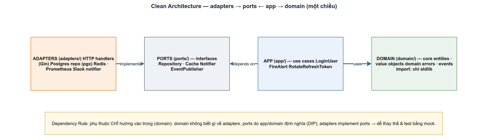

# Clean Architecture trong LogMon
> Module ARCH-1 · adapters→ports←app→domain, một chiều · Độ khó: 🥉→🥇 · Prereqs: BE-1

## 1. Vì sao kỹ năng này quan trọng trong LogMon

LogMon là một *modular monolith*: một process Go (`cmd/userservice`) chứa nhiều Bounded Context (BC) — `user` (sẽ thành `identity`), `alerting`, `logpipeline`, `slo` (mới có lớp `domain/`, app/ports/adapters còn dang dở), và sẽ thêm `incident`/`notification` ở GĐ3 (planned). Nếu các BC này dính chặt vào Gin, pgx, Prometheus, Alertmanager hay Elasticsearch thì:

- **Không test được nhanh**: muốn test luồng đăng nhập phải dựng cả Postgres thật.
- **Không thay được hạ tầng**: đổi từ rule file Prometheus sang một backend khác phải sửa cả business logic.
- **Rối khi tách service**: GĐ4 (Scale) muốn tách `alerting` ra service riêng — nếu domain biết về HTTP thì gỡ rất đau.

Clean Architecture (ở LogMon dùng biến thể *ports & adapters* của Cockburn) cô lập **logic nghiệp vụ** khỏi **chi tiết kỹ thuật**. Đó là lý do LogMon test được toàn bộ use case bằng fake in-memory (xem `app/service_test.go`), và đổi được adapter outbox → Kafka mà không đụng domain (doc_v2/02 §5.2).

## 2. Mô hình tư duy (first principles) — giải thích từ con số 0

Hãy chia code thành hai loại:

1. **Policy (chính sách)** — *cái gì* và *vì sao*: "mật khẩu phải ≥ 8 ký tự", "email phải hợp lệ", "login sai không được lộ email nào tồn tại". Loại này ổn định, ít đổi.
2. **Detail (chi tiết)** — *bằng cách nào*: lưu Postgres hay MySQL, trả JSON qua Gin hay gRPC, băm bằng argon2id hay bcrypt. Loại này hay đổi.

Quy tắc duy nhất cần nhớ — **Dependency Rule** của Uncle Bob: *mã nguồn chỉ được phụ thuộc hướng vào trong*; lớp trong **không bao giờ** được biết tên một thứ ở lớp ngoài ([Clean Coder Blog](https://blog.cleancoder.com/uncle-bob/2012/08/13/the-clean-architecture.html)). Policy nằm trong cùng, detail nằm ngoài cùng.

Vấn đề: làm sao Login (policy) "gọi database" (detail) mà không *phụ thuộc* vào database? Giải bằng **Dependency Inversion**: policy định nghĩa một *interface* mô tả thứ nó cần (`UserRepository`), detail *implement* interface đó. Lúc compile, mũi tên phụ thuộc đảo chiều — detail trỏ vào policy, không ngược lại. Đây chính là khái niệm **port** (interface mà core cần) và **adapter** (implementation cụ thể) của Cockburn ([alistair.cockburn.us](https://alistair.cockburn.us/hexagonal-architecture)).

## 3. Khái niệm cốt lõi (tăng dần độ khó)

### 3.1 Bốn lớp và chiều phụ thuộc

LogMon "phẳng hoá" 4 vòng tròn của Uncle Bob thành 4 package, một chiều:

```
adapters → ports ← app → domain
```

| Lớp LogMon | Tương ứng Uncle Bob | Được import gì | Tuyệt đối KHÔNG |
|---|---|---|---|
| `domain/` | Entities | chỉ Go stdlib | gin, pgx, prometheus, BC khác |
| `app/` | Use Cases | `domain`, `ports` cùng BC | adapters, infra libs |
| `ports/` | (ranh giới interface) | `domain` cùng BC (chỉ interface) | implementation |
| `adapters/` | Interface Adapters + Frameworks | `ports`, `domain` + infra libs | `app` của BC khác |
| `cmd/` | (composition root) | mọi thứ — chỉ để wiring | — |

Chú ý mũi tên `ports`: cả `app` *và* `adapters` đều trỏ **vào** `ports`. Đó là nơi đảo phụ thuộc xảy ra.

### 3.2 Domain — value object & entity bất biến

Domain chỉ chứa dữ liệu + bất biến nghiệp vụ, *không* biết gì về thế giới ngoài. Ví dụ `Email` là value object luôn hợp lệ sau khi tạo:

```go
// domain/email.go — chuẩn hoá + validate, field private => bất biến
func NewEmail(raw string) (Email, error) {
    v := strings.ToLower(strings.TrimSpace(raw))
    if !emailPattern.MatchString(v) {
        return Email{}, newValidationError("email", "invalid format")
    }
    return Email{value: v}, nil
}
```

### 3.3 Port — interface nhỏ, do core định nghĩa

Port khai báo *core cần gì*, không nói *làm bằng gì*. Theo ISP, giữ interface nhỏ:

```go
// ports/ports.go — app phụ thuộc cái này, KHÔNG phụ thuộc Postgres
type PasswordHasher interface {
    Hash(plain string) (string, error)
    Verify(hash, plain string) error
    NeedsRehash(hash string) bool
}
```

### 3.4 App — use case điều phối, không chạm hạ tầng

App ráp domain + port lại thành một luồng nghiệp vụ. Nó nhận interface qua constructor (DI), không tự `new` ra adapter.

### 3.5 Adapter — chi tiết kỹ thuật cắm vào port

Adapter implement port bằng công nghệ thật (pgx, Gin, argon2id). Có hai loại: *driving* (HTTP handler — đẩy request vào core) và *driven* (Postgres repo — core đẩy ra ngoài).

| Khái niệm | LogMon `user` BC | Loại |
|---|---|---|
| Driving adapter | `adapters/http/handler.go` (Gin) | input |
| Driven adapter | `adapters/postgres/repository.go` | output |
| Port | `ports.UserRepository`, `ports.PasswordHasher` | ranh giới |

## 4. LogMon dùng nó thế nào (bám code thật)



**`user` BC — Clean Architecture (đã implemented):**

- **Domain chỉ stdlib**: `backend/internal/user/domain/errors.go:3` mở đầu bằng comment "package này CHỈ import Go standard library"; thực tế các file domain chỉ `import "time"`, `"strings"`, `"regexp"`, `"errors"`, `"fmt"`. Aggregate root `User` ở `backend/internal/user/domain/user.go:29` có field private + constructor `NewUser` (`user.go:38`) để giữ bất biến.
- **Ports định nghĩa interface nhỏ**: `backend/internal/user/ports/ports.go:13` (`UserRepository`), `:27` (`PasswordHasher`), `:43` (`TokenIssuer`), `:77` (`Clock`). Comment ở `ports.go:1-2` ghi rõ "DIP ... ISP".
- **App chỉ import domain + ports**: `backend/internal/user/app/service.go:10-11` import đúng hai package đó, không có pgx/gin. Use case `Login` (`service.go:109`) gộp `repo.ByEmail` + `hasher.Verify` + `tokens.Issue`; mọi nhánh sai đều trả `domain.ErrInvalidCredentials` để không lộ user tồn tại (`service.go:117-125`).
- **Adapter map domain error → HTTP** ở biên: `backend/internal/user/adapters/http/handler.go:252` hàm `failDomain` dùng `errors.Is` đổi `ErrEmailTaken`→409, `ErrInvalidCredentials`→401 (`handler.go:256-259`). Postgres repo dịch lỗi hạ tầng → domain error: `backend/internal/user/adapters/postgres/repository.go:42` đổi mã unique-violation `23505` thành `domain.ErrEmailTaken`.
- **Compile-time check**: `backend/internal/user/adapters/postgres/repository.go:27` có `var _ ports.UserRepository = (*Repository)(nil)` — đúng chuẩn doc_v2/02 §2.

**`alerting` BC — Clean Arch + DDD + CQRS (đã implemented):**

- Tách write/read: `backend/internal/alerting/app/command/create_rule.go` (write) vs `backend/internal/alerting/app/query/queries.go` (read). Port read side tách riêng: `backend/internal/alerting/ports/ports.go:46` (`AlertInstanceReader`) vs `:38` (`AlertInstanceRepository`).
- **Transactional outbox**: `CreateRuleHandler.Handle` (`create_rule.go:79-95`) gọi `tx.WithinTx`, trong CÙNG một TX vừa `repo.Save` vừa `publisher.Publish` event vào outbox — pattern tx-in-context mô tả ở `ports/ports.go:1-4`.

**Composition root**: `backend/cmd/userservice/main.go` là nơi DUY NHẤT được phép import mọi thứ. `buildAlerting` (`main.go:143`) và phần wiring trong `run()` (`main.go:262-269`, `run` bắt đầu ở `:194`) `new` ra adapter rồi inject vào app — ví dụ `userapp.NewService(userpg.NewRepository(pool), usersys.NewArgon2idHasher(), ...)`.

**Mới scaffold một phần:** `slo/` BC (doc_v2/02 §1, GĐ3) đã có lớp `backend/internal/slo/domain/` (value object + domain event `BudgetExhausted`) nhưng CHƯA có `app/`/`ports/`/`adapters/` — coi như chưa nối được vào composition root.

**Planned (chưa có code):** `incident/`, `notification/` BC (doc_v2/02 §1, GĐ3) — chưa tồn tại trong `backend/internal/`. Redis (rate limit per-workspace, read-model cache — doc_v2/02 §6) **chưa có** trong `go.mod` lẫn code (rate limit hiện làm in-memory ở `internal/shared/middleware/ratelimit.go`). Middleware `workspace`/`rbac` (doc_v2/02 §3, dòng 8-9) là GĐ3 planned — `internal/shared/middleware/` chưa có file rbac/workspace. Enforce layer bằng `golangci-lint depguard` (doc_v2/02 §2 dòng 38) hiện là *khuyến nghị*: repo đã có `backend/.golangci.yml` nhưng CHƯA bật rule `depguard`.

## 5. Best practices (mỗi mục kèm 1 nguồn đã research)

1. **Dependency Rule là bất khả xâm phạm** — không bao giờ để lớp trong biết tên lớp ngoài; `domain` LogMon chỉ import stdlib ([Clean Coder Blog — Uncle Bob](https://blog.cleancoder.com/uncle-bob/2012/08/13/the-clean-architecture.html)).
2. **Port do core sở hữu, đặt tên theo "cuộc hội thoại" nó phục vụ** — một port có thể có nhiều adapter (Postgres test vs prod). LogMon: `PasswordHasher` có adapter argon2id, test dùng fake ([alistair.cockburn.us](https://alistair.cockburn.us/hexagonal-architecture)).
3. **Giữ interface nhỏ, đặt nơi nó được dùng** — Go idiom "accept interfaces, return structs"; `ports/` LogMon tách `AlertInstanceReader` (read) khỏi `AlertInstanceRepository` (write) ([Rafiul Alam — Hexagonal in Go](https://alamrafiul.com/posts/go-hexagonal-architecture/)).
4. **Domain logic phải lightweight, free khỏi infra để test bằng in-memory fake** — thay repo thật bằng map trong test ([Hexagonal in Go best practices, search summary 2024-2025](https://alamrafiul.com/posts/go-hexagonal-architecture/)).
5. **Adapter là lớp dịch (translation), không chứa nghiệp vụ** — HTTP handler chỉ parse + map error, Postgres repo chỉ dịch SQL error → domain error ([AWS Prescriptive Guidance — Hexagonal](https://docs.aws.amazon.com/prescriptive-guidance/latest/cloud-design-patterns/hexagonal-architecture.html)).
6. **Tự động hoá enforcement ranh giới import** — dùng `depguard` deny-list theo file pattern thay vì chỉ trông cậy code review ([OpenPeeDeeP/depguard](https://github.com/OpenPeeDeeP/depguard)).

## 6. Lỗi thường gặp & anti-patterns

- **Domain import infra**: lỡ `import "github.com/jackc/pgx/v5"` trong `domain/` — vi phạm rule ngay lập tức. Dấu hiệu: domain biết tên cột DB.
- **Anemic domain + fat service**: entity chỉ là struct getter/setter, mọi logic dồn vào `app`. LogMon tránh bằng cách đặt invariant trong `NewUser`/`NewEmail` (constructor validate).
- **Port "thượng đế"**: một `Repository` 15 method. Vi phạm ISP — tách như `AlertInstanceReader` vs `AlertInstanceRepository`.
- **Leak error hạ tầng ra HTTP**: trả thẳng `pgx.ErrNoRows` ra client (lộ chi tiết + sai status). Đúng: dịch tại biên (`failDomain`).
- **Wiring rải rác**: `new` adapter giữa use case thay vì ở `cmd/`. App phải nhận qua constructor, không tự tạo.
- **Cross-BC import**: `alerting/app` import `user/domain`. Cấm — giao tiếp qua domain event/outbox (doc_v2/02 §5).
- **Pointer-to-interface / embed mutex trong domain**: vi phạm Go style guide trong CLAUDE.md.

## 7. Lộ trình luyện tập NGAY trong repo LogMon

### 🥉 Cơ bản — đọc & lần theo chiều phụ thuộc
1. Mở `backend/internal/user/` và vẽ lại mũi tên import của 4 file: `domain/user.go`, `app/service.go`, `ports/ports.go`, `adapters/postgres/repository.go`. Xác nhận không file domain nào import pgx/gin.
2. Chạy `cd backend && go test ./internal/user/...` rồi đọc `app/service_test.go` — tìm chỗ inject fake `UserRepository`/`PasswordHasher` thay cho Postgres thật.
3. Tìm mọi dòng `var _ ports.X = (*Y)(nil)` trong `internal/user/adapters/` và giải thích nó bảo vệ điều gì lúc compile.
4. Trong `adapters/http/handler.go`, liệt kê mỗi `domain error → HTTP status` trong `failDomain` (`handler.go:252`); thêm một case mapping cho một domain error đang bị rơi vào `default`.

### 🥈 Trung cấp — thêm một use case theo đúng layer
1. Thêm value object `DisplayName` vào `user/domain/` (validate độ dài 1-50, trim), kèm bảng table-driven test — không đụng adapter nào.
2. Thêm method `ByEmailExists(ctx, email) (bool, error)` vào port `UserRepository` (`ports/ports.go:13`), implement ở `adapters/postgres/repository.go` bằng query parameterized `$1`, cập nhật `var _` check vẫn pass.
3. Thêm use case `ChangePassword` vào `app/service.go`: verify mật khẩu cũ qua `PasswordHasher.Verify`, hash mới, `repo.UpdatePasswordHash`; viết test trước (RED→GREEN) với fake hasher.
4. Thêm histogram metric `logmon_password_hash_duration_seconds` vào `backend/internal/shared/metrics/metrics.go`, đăng ký vào registry, và quan sát nó xuất hiện ở `/metrics` khi chạy `make up`.

### 🥇 Nâng cao — ranh giới & CQRS
1. Thêm rule `depguard` vào `backend/.golangci.yml` hiện có (deny: file dưới `internal/*/domain/` không được import `gin`, `pgx`, `prometheus`); chạy `golangci-lint run` để thấy nó bắt lỗi khi bạn cố tình thêm import sai.
2. Thêm một read-side query `ListInactiveRules` vào `alerting/app/query/queries.go` + port reader tương ứng (`ports/ports.go`), tách hẳn khỏi write side; chứng minh write path (`create_rule.go`) không hề đổi.
3. Thêm domain event mới (vd `AlertRuleDisabled`) trong `alerting/domain/events.go`, publish trong một command qua `EventPublisher.Publish` *trong cùng TX* `WithinTx`, rồi subscribe ở `cmd/userservice/main.go:172` (`buildAlerting`) để xác minh outbox→bus→syncer chạy.
4. Phác `ports/` cho BC `notification` (planned): định nghĩa `Notifier` interface (Slack/Email) ở `ports/`, một fake adapter in-memory, và một use case `Send` ở `app/command/` — chưa cần adapter thật, chứng minh core test được khi chưa có hạ tầng.

## 8. Skill/agent ECC nên dùng khi luyện

- **`ecc:hexagonal-architecture`** — khi cần kiểm tra một BC mới có đặt port/adapter đúng chỗ không; gọi trước khi tạo BC `slo`/`incident`.
- **`ecc:architect`** (và `ecc:code-architect`) — khi quyết định một BC nên Clean thuần hay Clean+CQRS (như bảng doc_v2/02 §1), hoặc khi thiết kế ranh giới event cross-BC.
- **`ecc:go-review`** (agent `go-reviewer`) — chạy NGAY sau khi viết use case/adapter mới để bắt vi phạm "accept interfaces, return structs", interface to, hoặc domain lỡ import infra.
- **`ecc:go-test`** — ép TDD table-driven (RED→GREEN→coverage 80%) cho các task ở mục 7, đúng yêu cầu testing.md.

## 9. Tài nguyên học thêm

- [The Clean Architecture — Uncle Bob (Clean Coder Blog)](https://blog.cleancoder.com/uncle-bob/2012/08/13/the-clean-architecture.html) — bản gốc định nghĩa Dependency Rule và 4 vòng tròn.
- [Hexagonal Architecture — Alistair Cockburn](https://alistair.cockburn.us/hexagonal-architecture) — nguồn gốc thuật ngữ ports & adapters, ý niệm "port = cuộc hội thoại".
- [Hexagonal Architecture in Go: Ports and Adapters — Rafiul Alam](https://alamrafiul.com/posts/go-hexagonal-architecture/) — cấu trúc thư mục Go (cmd/internal), fake in-memory cho test.
- [Hexagonal Architecture Pattern — AWS Prescriptive Guidance](https://docs.aws.amazon.com/prescriptive-guidance/latest/cloud-design-patterns/hexagonal-architecture.html) — driving vs driven adapter, vai trò "glue" của adapter.
- [OpenPeeDeeP/depguard](https://github.com/OpenPeeDeeP/depguard) — linter chặn import sai layer; dùng để tự động enforce ranh giới (doc_v2/02 §2).
- [Clean Architecture: layers, Dependency Rule, so với Onion/Hexagonal (2026)](https://generalistprogrammer.com/tutorials/clean-architecture-complete-guide) — đối chiếu Clean vs Hexagonal vs Onion, cập nhật.

## 10. Checklist "đã hiểu"

- [ ] Tôi phát biểu được Dependency Rule và chỉ ra `domain/` LogMon chỉ import stdlib.
- [ ] Tôi phân biệt được port (interface core định nghĩa) với adapter (implementation), và chỉ ví dụ mỗi loại trong `user` BC.
- [ ] Tôi giải thích được vì sao đảo phụ thuộc cho phép test use case bằng fake mà không cần Postgres.
- [ ] Tôi biết mỗi loại lỗi được dịch ở đâu: infra→domain (Postgres repo) và domain→HTTP (`failDomain`).
- [ ] Tôi hiểu vì sao `cmd/userservice/main.go` là composition root duy nhất được import mọi thứ.
- [ ] Tôi nói được khác biệt giữa Clean thuần (`user`) và Clean+CQRS (`alerting`: command/query + outbox trong cùng TX).
- [ ] Tôi phân biệt được phần đã implemented (`user`/`alerting`/`logpipeline`), phần mới scaffold một phần (`slo` chỉ có `domain/`), và phần planned (`incident`/`notification`, Redis, depguard, rbac/workspace).
- [ ] Tôi giải thích được vì sao cross-BC import bị cấm và thay bằng domain event/outbox.
