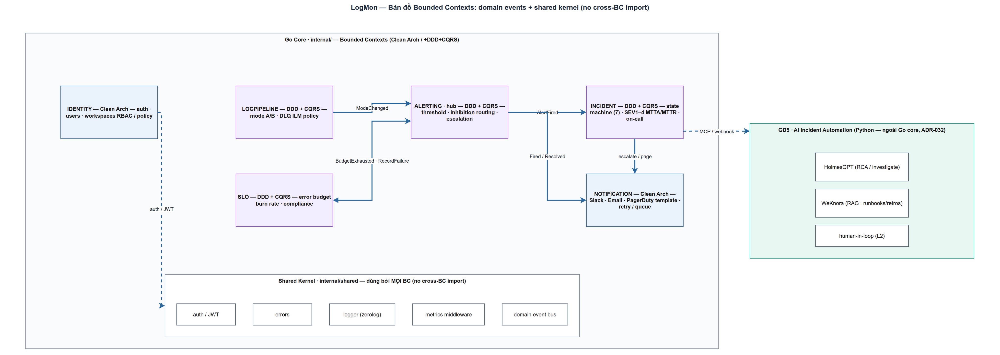

# CQRS & Event-driven (Outbox) trong LogMon
> Module ARCH-3 · command/query tách, domain events qua outbox · Độ khó: 🥉→🥇 · Prereqs: ARCH-2

## 1. Vì sao kỹ năng này quan trọng trong LogMon

LogMon là nền tảng observability đa Bounded Context (BC): `alerting`, `slo`, `logpipeline`, `incident`, `notification`… Hai vấn đề kiến trúc lặp đi lặp lại:

1. **Read và write có đặc tính trái ngược.** Monitoring có tỷ lệ read:write rất lệch (`doc_v2/02-backend-architecture.md:65` ước lượng ~100:1): UI liên tục đọc "active alerts", còn ghi rule thì hiếm. Nếu dùng chung một model CRUD, ta phải tối ưu cùng lúc cho hai mục tiêu xung khắc.
2. **Một thao tác đụng hai hệ thống.** Tạo một alert rule cần (a) ghi rule vào Postgres và (b) báo cho pipeline render lại file rule cho Prometheus. Nếu ghi DB xong rồi mới gọi pipeline mà process chết ở giữa → DB có rule nhưng Prometheus không bao giờ biết. Đây là **dual-write problem** ([microservices.io](https://microservices.io/patterns/data/transactional-outbox.html)).

CQRS giải bài (1) bằng cách tách hẳn code đường ghi (`app/command/`) và đường đọc (`app/query/`). Transactional Outbox giải bài (2) bằng cách biến "ghi state + phát event" thành **một transaction DB duy nhất**. LogMon đã hiện thực cả hai trong BC `alerting` — đây là khuôn mẫu để nhân ra các BC còn lại.

## 2. Mô hình tư duy (first principles) — giải thích từ con số 0

Hình dung một cửa hàng:

- **Command (lệnh ghi):** "Nhập 10 thùng hàng". Nó *thay đổi* kho, có thể bị từ chối (hết chỗ), không trả về dữ liệu để hiển thị — chỉ trả về thành công/thất bại.
- **Query (truy vấn đọc):** "Còn bao nhiêu thùng?". Nó *không* thay đổi gì, chỉ đọc và trả số liệu.

Trộn hai việc này vào một hàm `updateAndReturnStock()` là cái bẫy: hàm vừa kiểm invariant nghiệp vụ (đường ghi cần) vừa phải join nhiều bảng để hiển thị (đường đọc cần). **CQRS** chỉ là nguyên tắc: tách hai trách nhiệm đó thành hai model riêng ([Microsoft Learn](https://learn.microsoft.com/en-us/azure/architecture/patterns/cqrs)).

Giờ đến phần "báo cho hệ thống khác". Cách ngây thơ:

```text
BEGIN; INSERT rule; COMMIT;   // (1) ghi DB
callPrometheusReload();        // (2) gọi hệ thống ngoài  ← chết ở đây = mất event
```

Hai bước, hai hệ thống, không nguyên tử. **Outbox** lật ngược: thay vì gọi hệ thống ngoài, ta *ghi ý định* vào một bảng `outbox_events` **trong cùng transaction** với rule. Hoặc cả hai cùng commit, hoặc cả hai cùng rollback — không có trạng thái nửa vời:

```text
BEGIN; INSERT rule; INSERT outbox_event; COMMIT;   // nguyên tử
// một tiến trình nền (relay) đọc outbox và dispatch sau
```

Đánh đổi: ta mất tính tức thời (event được xử lý *sau*, "eventually consistent") để đổi lấy **độ tin cậy** — ý định đã nằm trong durable storage, process chết cũng không mất.

## 3. Khái niệm cốt lõi (tăng dần độ khó)

### 3.1 Command vs Query
| | Command | Query |
|---|---|---|
| Mục đích | thay đổi state | đọc state |
| Trả về | kết quả thao tác / lỗi | dữ liệu |
| Validate invariant | có | không |
| Tối ưu cho | tính đúng đắn | tốc độ/hình dạng đọc |

### 3.2 Domain event
Một sự kiện *đã xảy ra* trong miền nghiệp vụ, đặt tên ở thì quá khứ: `AlertRuleCreated`, `AlertRuleDeleted`. Nó là sự thật bất biến, không phải "lệnh hãy làm gì đó".

### 3.3 Transactional Outbox
Bảng phụ trong **chính DB nghiệp vụ**. Ghi event vào đó *cùng TX* với state change → khử dual-write ([AWS Prescriptive Guidance](https://docs.aws.amazon.com/prescriptive-guidance/latest/cloud-design-patterns/transactional-outbox.html)).

### 3.4 Relay (message relay / poller)
Tiến trình nền quét bảng outbox, dispatch event ra ngoài, rồi đánh dấu đã xử lý. Hai biến thể: **polling** (tự `SELECT` định kỳ — LogMon dùng) và **CDC** (đọc transaction log của DB, ví dụ [Debezium Outbox Event Router](https://debezium.io/documentation/reference/stable/transformations/outbox-event-router.html)).

### 3.5 At-least-once & Idempotent Consumer
Relay có thể dispatch *lại* một event (crash sau dispatch, trước khi mark published). Đây là **at-least-once**. Hệ quả bắt buộc: consumer phải **idempotent** — xử lý cùng event N lần cho kết quả như xử lý 1 lần ([microservices.io](https://microservices.io/patterns/communication-style/idempotent-consumer.html)).

## 4. LogMon dùng nó thế nào (bám code thật)



> **Tất cả mục này là ĐÃ IMPLEMENTED** trong BC `alerting` (đọc thấy code). Các BC khác mới phôi thai: `slo` chỉ có `domain/` skeleton, `logpipeline` có read side (query), còn `incident`/`notification` **chưa có thư mục code** — PLANNED. Bảng `doc_v2/02-backend-architecture.md:11-16` cùng catalog event cross-BC (`:130-148`) là *target*, chưa có handler chạy.

**Cấu trúc CQRS.** Đường ghi nằm ở `backend/internal/alerting/app/command/` (`create_rule.go`, `update_rule.go`, `delete_rule.go`, `ingest_webhook.go`…); đường đọc ở `backend/internal/alerting/app/query/queries.go`. Interface tách rõ trong ports: `RuleRepository` (ghi, `ports/ports.go:21`) vs `RuleReader` (đọc, `:66`).

> **Lưu ý độ chính xác:** đây là CQRS *logic* — read và write **chung một bảng Postgres**. Cùng struct `*RuleRepository` (`adapters/postgres/repository.go:36`) hiện thực cả `RuleRepository` (Save/Update/Delete) lẫn `RuleReader` (ByID/List/ListAll). Tách read store riêng / materialized view là biến thể nâng cao (`doc_v2/02:65`) — PLANNED, chưa làm.

**Outbox — ghi cùng TX.** `CreateRuleHandler.Handle` (`app/command/create_rule.go:79-95`) bọc tất cả trong `h.tx.WithinTx`: kiểm trùng tên → `repo.Save(rule)` → `publisher.Publish(...AlertRuleCreated...)`. Cơ chế "cùng TX" dựa trên **tx-in-context**: `TxManager.WithinTx` (`adapters/postgres/tx.go:37`) `Begin` tx rồi nhét vào `context` qua `txKey{}`; cả repo lẫn publisher gọi `dbFrom(ctx, pool)` (`tx.go:51`) để lấy đúng tx đó. `EventPublisher.Publish` (`adapters/postgres/publisher.go:34`) marshal payload JSON rồi `store.Save` (`shared/outbox/store.go:44`) `INSERT INTO outbox_events`. Vì cùng tx, `alert_rules` và `outbox_events` cùng commit hoặc cùng rollback.

**Bảng outbox.** `migrations/000002_outbox.up.sql`: cột `status` (`pending|published|failed`), `retry_count`, `payload JSONB`, và partial index `idx_outbox_pending ... WHERE status='pending'` để relay chỉ quét hàng pending.

**Relay — quét & dispatch.** `Store.ProcessBatch` (`shared/outbox/store.go:69`) mở một tx, `claimPending` (`:104`) chạy `SELECT ... WHERE status='pending' ORDER BY id LIMIT $1 FOR UPDATE SKIP LOCKED` — claim batch, giữ lock tới commit, an toàn nhiều relay instance song song. Dispatch từng event; ok → `published`, lỗi & `retry_count+1 >= maxRetries` → `failed`, ngược lại → tăng `retry_count` để thử lại (`:85-93`). `Relay.Run` (`relay.go:59`) là worker đúng chuẩn concurrency của repo: dừng bằng `ctx` hủy, chờ thoát bằng `Wait()`/`done` channel; `tick` (`:78`) drain hết batch pending mỗi vòng và set metric lag.

**Bus & consumer.** `Bus` (`shared/outbox/bus.go`) là event bus **in-process**, `Dispatch` (`:34`) gọi tuần tự handler theo `EventType`; handler lỗi → trả lỗi → relay **không** mark published → retry. Wiring ở composition root `backend/cmd/userservice/main.go:172-182`: ba event `AlertRuleCreated/Updated/Deleted` cùng subscribe một `resync` gọi `syncer.Sync(ctx)`; `relay := outbox.NewRelay(store, bus.Dispatch)` rồi `go alerting.relay.Run(ctx)` (`:281`).

**Consumer idempotent trong thực tế.** `Syncer.Sync` (`adapters/promfile/syncer.go:60`) **không** đọc payload event — nó `ListAll()` *toàn bộ* rule, render lại file `logmon-generated.yml`, validate (`rulefmt`, in-process), ghi atomic (write tmp + `os.Rename`), rồi POST `/-/reload` Prometheus. Vì nó render từ trạng thái hiện tại của DB, dispatch lại cùng event chỉ tạo ra cùng file → **idempotent một cách tự nhiên**, đúng kiểu "natural upsert" mà `doc_v2/02:175` mô tả. `IngestWebhookHandler.Handle` (`app/command/ingest_webhook.go:56`) cũng idempotent: `UpsertFiring` theo `fingerprint` nên webhook Alertmanager lặp lại không tạo bản trùng.

**Metrics.** `PrometheusObserver` (`shared/outbox/metrics.go:31`) export `logmon_outbox_lag_seconds` (tuổi event pending cũ nhất) + `logmon_outbox_failed_total`. Alert `OutboxLag > 30s` đã có trong `doc_v2/05-alerting-slo.md:129`.

## 5. Best practices (mỗi mục kèm 1 nguồn)

- **Khử dual-write bằng outbox, đừng "ghi DB rồi gọi broker".** Ghi event cùng TX với state là điểm cốt lõi giải quyết bất nhất giữa DB và message broker — [microservices.io · Transactional outbox](https://microservices.io/patterns/data/transactional-outbox.html).
- **Consumer phải idempotent vì giao là at-least-once.** Định danh ổn định cho mỗi event + dedup, hoặc thiết kế thao tác mang tính upsert/replace như `Syncer` của LogMon — [microservices.io · Idempotent Consumer](https://microservices.io/patterns/communication-style/idempotent-consumer.html).
- **Dùng `FOR UPDATE SKIP LOCKED` cho hàng đợi trong Postgres.** Cho phép nhiều worker song song không "convoy", crash tự rollback trả job về pending; cần index hợp `(status, id/created_at)` và `ORDER BY` — [Netdata · SKIP LOCKED](https://www.netdata.cloud/academy/update-skip-locked/).
- **Chỉ áp CQRS khi read/write thực sự lệch hoặc domain phức tạp.** Microsoft khuyến nghị dùng CQRS cho domain phức tạp và hệ read ≫ write — đúng hồ sơ monitoring của LogMon — [Microsoft Learn · CQRS](https://learn.microsoft.com/en-us/azure/architecture/patterns/cqrs).
- **Giữ payload event tối thiểu, đọc chi tiết từ DB khi xử lý.** LogMon dùng `RulePayload{RuleID, WorkspaceID}` (`domain/events.go:15`) rồi syncer `ListAll` từ DB — tránh nhồi state lớn và lệch version vào event; phù hợp khuyến nghị payload "arbitrary nhưng gọn" của [Debezium Outbox Event Router](https://debezium.io/documentation/reference/stable/transformations/outbox-event-router.html).
- **Giám sát độ trễ & failure của outbox.** Theo dõi queue depth/lag/failed để phát hiện relay tụt; LogMon đã có `logmon_outbox_lag_seconds` + alert 30s — đúng tinh thần monitoring của [AWS Prescriptive Guidance · Transactional outbox](https://docs.aws.amazon.com/prescriptive-guidance/latest/cloud-design-patterns/transactional-outbox.html).

## 6. Lỗi thường gặp & anti-patterns

- **Gọi `publisher.Publish` ngoài `WithinTx`.** Nếu publish không lấy được tx từ ctx, `dbFrom` rơi về `pool` (`tx.go:51`) → outbox INSERT chạy ngoài tx của rule → mất nguyên tử. Luôn publish *bên trong* callback `WithinTx`.
- **Consumer có side effect không idempotent.** Ví dụ "tăng counter" hoặc "gửi 1 email mỗi event": at-least-once sẽ gửi trùng. Phải dedup theo event id hoặc làm thao tác mang tính replace như `Syncer`.
- **Mark published trước khi dispatch thành công.** Đảo thứ tự trong `ProcessBatch` sẽ mất event khi handler lỗi. Quy tắc: chỉ mark `published` *sau* khi handler trả nil (`store.go:86-92`, `doc_v2/02:174`).
- **Coi đường đọc cũng phải tức thời.** Outbox là eventually consistent — UI có thể thấy rule mới *trước khi* Prometheus reload xong. Đừng giả định đồng bộ tức thì.
- **Thiếu `ORDER BY`/index khi quét.** Quét outbox không có partial index `WHERE status='pending'` sẽ scan toàn bảng khi `published` tích tụ. Cần cả cleanup (`doc_v2/02:177`) — **PLANNED**, repo chưa có cron xóa published cũ.
- **Lạm dụng CQRS cho CRUD đơn giản.** `identity`/`notification` cố tình KHÔNG dùng CQRS (`CLAUDE.md` bảng BC) — thêm command/query bus cho CRUD chỉ là phức tạp thừa (YAGNI).

## 7. Lộ trình luyện tập NGAY trong repo LogMon

### 🥉 Cơ bản — đọc & chạy
1. Đọc trọn chuỗi `create_rule.go` → `tx.go` → `publisher.go` → `store.go`, vẽ lại đường đi của một event `AlertRuleCreated` từ HTTP tới khi Prometheus reload.
2. Chạy `make up` rồi tạo một rule qua API; `psql` vào DB, `SELECT id, event_type, status, retry_count FROM outbox_events ORDER BY id` quan sát hàng chuyển `pending → published`.
3. Mở `metrics.go`, chạy `curl localhost:<port>/metrics | grep logmon_outbox` xác nhận `logmon_outbox_lag_seconds` và `logmon_outbox_failed_total` được expose.
4. Đọc `bus_test.go`, `relay_test.go` và `store_integration_test.go`, chạy `cd backend && go test -race ./internal/shared/outbox/...`. Lưu ý: `relay_test.go` chứng minh drain/stop + metric failed (dùng `fakeProcessor`); còn at-least-once/retry thật nằm ở `store.go`/`store_integration_test.go` (path claim → dispatch → mark) — xác định test nào chạm logic nào.

### 🥈 Trung cấp — sửa & mở rộng
1. Hiện `set_enabled.go` (`SetRuleEnabledHandler`, đã wire ở `main.go:156`) phát chung `EventAlertRuleUpdated` khi bật/tắt. Tách thành hai event riêng `AlertRuleEnabled`/`AlertRuleDisabled` trong `domain/events.go`, phát đúng loại trong `set_enabled.go`, subscribe cả hai ở `main.go` cho cùng `resync`; viết test command kiểu table-driven trước (TDD) — xem `mutate_rule_test.go` làm mẫu.
2. Thêm metric counter `logmon_outbox_published_total` vào `metrics.go` (cập nhật interface `Observer`, `NopObserver`, `PrometheusObserver`, và gọi trong `relay.tick`), expose ở `/metrics`.
3. Viết một consumer thứ hai cho `AlertRuleCreated` (ví dụ ghi audit log) qua `bus.Subscribe`, chứng minh nhiều handler chạy tuần tự và một handler lỗi khiến cả event retry.
4. Viết integration test (như `store_integration_test.go`) mô phỏng hai relay instance gọi `ProcessBatch` song song, khẳng định `FOR UPDATE SKIP LOCKED` không xử lý trùng event.

### 🥇 Nâng cao — thiết kế
1. Hiện thực cleanup job: cron goroutine xóa `outbox_events` `status='published'` cũ hơn 7 ngày (`doc_v2/02:177`), kèm metric & test, theo chuẩn concurrency stop/done.
2. Thêm inbox/dedup table cho một consumer *không* tự nhiên idempotent (ghi `processed_events(event_id)`), biến at-least-once thành exactly-once-effect.
3. Tách read model: thêm bảng/materialized view "active_alerts" và một `AlertInstanceReader` đọc từ đó, cập nhật qua event — hiện thực CQRS với read store riêng (`doc_v2/02:65`, đang PLANNED).
4. Phác thảo "evolution path": viết `KafkaRelay` thay `bus.Dispatch` để khi tách service chỉ đổi adapter (`doc_v2/02:180`), giữ nguyên domain/command.

## 8. Skill/agent ECC nên dùng khi luyện

- **`ecc:architect`** — khi quyết định BC nào *nên* dùng CQRS/outbox (bài 🥇 tách read store, evolution Kafka). Dùng để phản biện ranh giới BC và layer direction trước khi code.
- **`ecc:database-reviewer`** *(hoặc `ecc:postgres-patterns`)* — review SQL outbox: partial index, `FOR UPDATE SKIP LOCKED`, cleanup/partition, lock contention. Dùng khi làm bài 🥈-4 và 🥇-1.
- **`ecc:silent-failure-hunter`** — soát các chỗ nuốt lỗi âm thầm (ví dụ `_ = s.status.MarkSyncError` trong `syncer.go:63`, hay handler trả nil khi nên trả lỗi). Dùng sau khi thêm consumer mới để chắc lỗi không bị "handle once" sai chỗ.
- **`ecc:go-test`** — ép TDD table-driven (`tests`/`tt`/`give`/`want`) cho mọi command/consumer mới, chạy `-race`, kiểm coverage ≥ 80% theo rule repo.
- **`ecc:go-review`** — review tính idiomatic: accept interfaces/return structs, small interfaces, error wrapping không "failed to", goroutine có stop/done.

## 9. Tài nguyên học thêm

- [microservices.io · Transactional outbox](https://microservices.io/patterns/data/transactional-outbox.html) — định nghĩa kinh điển của pattern và dual-write problem; nền lý thuyết cho `shared/outbox`.
- [microservices.io · Idempotent Consumer](https://microservices.io/patterns/communication-style/idempotent-consumer.html) — vì sao at-least-once buộc consumer idempotent; soi đúng cách `Syncer` đạt idempotency.
- [Microsoft Learn · CQRS pattern](https://learn.microsoft.com/en-us/azure/architecture/patterns/cqrs) — khi nào nên/không nên CQRS, biến thể tách read/write store; căn cứ cho lựa chọn chỉ DDD-BC mới dùng CQRS.
- [AWS Prescriptive Guidance · Transactional outbox](https://docs.aws.amazon.com/prescriptive-guidance/latest/cloud-design-patterns/transactional-outbox.html) — góc nhìn vận hành: relay, idempotency, giám sát; bổ trợ phần metrics.
- [Netdata · FOR UPDATE SKIP LOCKED for queue workflows](https://www.netdata.cloud/academy/update-skip-locked/) — chi tiết SKIP LOCKED, index hợp, monitoring queue depth; nền cho `claimPending`.
- [Debezium · Outbox Event Router](https://debezium.io/documentation/reference/stable/transformations/outbox-event-router.html) — biến thể CDC của outbox (đối chiếu với polling LogMon dùng) và khuyến nghị payload.

## 10. Checklist "đã hiểu"

- [ ] Giải thích được dual-write problem và vì sao outbox khử nó bằng *một* transaction.
- [ ] Chỉ ra trong code chỗ state INSERT và outbox INSERT dùng chung tx (tx-in-context qua `dbFrom`).
- [ ] Phân biệt command vs query và biết LogMon đặt chúng ở `app/command` vs `app/query`.
- [ ] Hiểu vì sao relay giao at-least-once và `Syncer` vẫn an toàn (idempotent nhờ render-từ-DB).
- [ ] Giải thích `FOR UPDATE SKIP LOCKED` cho phép nhiều relay chạy song song không xử lý trùng.
- [ ] Đọc được `logmon_outbox_lag_seconds`/`failed_total` và biết alert 30s ý nghĩa gì.
- [ ] Phân biệt phần ĐÃ implemented (`alerting`) với phần PLANNED (read store riêng, Kafka relay, cleanup cron, slo/incident/notification consumers).
- [ ] Biết khi nào KHÔNG nên dùng CQRS (CRUD đơn giản như `identity`/`notification`).
