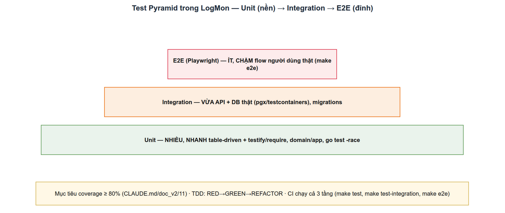

# Chiến lược Testing trong LogMon
> Module TEST-1 · test pyramid, table-driven, testcontainers, e2e, coverage, TDD · Độ khó: 🥇 (nâng cao) · Prereqs: BE-1

---

## 1. Vì sao kỹ năng này quan trọng trong LogMon

LogMon là **nền tảng observability** — sản phẩm mà người dùng tin vào để biết hệ thống của họ có khỏe không. Một alert rule sai logic, một outbox event mất giữa chừng, hay một burn-rate tính lệch công thức không chỉ là "bug" — nó là **mất niềm tin vào chính công cụ giám sát**. Vì vậy test không phải thủ tục hành chính, nó là điều kiện sống còn của domain này.

Hai lý do cụ thể, neo vào kiến trúc LogMon:

1. **Kiến trúc nhiều tầng cần test nhiều tầng.** `doc_v2/02` và `CLAUDE.md` quy định layer direction một chiều `adapters → ports ← app → domain`. Mỗi tầng có loại lỗi riêng: domain sai *invariant* (rule `for` dưới ngưỡng severity), app sai *orchestration* (không rollback khi trùng tên), adapter sai *I/O* (TX không atomic, SQL injection). Một loại test không bắt được hết — đó chính là lý do tồn tại của **test pyramid**.

2. **Đây là platform dogfood chính nó.** `doc_v2/11` §4 ghi: "Logging/metrics/tracing được thêm cho code path mới — đây là platform observability, dogfood chính mình". Test là cách ta chứng minh telemetry đúng *trước khi* khách hàng dựa vào nó.

`CLAUDE.md` và `~/.claude/rules/ecc/common/testing.md` đặt ngưỡng cứng: **coverage ≥ 80%**, đủ 3 tầng (unit/integration/e2e), và **TDD** (RED → GREEN → REFACTOR). Đây là tier nâng cao vì bạn phải phối hợp cả ba tầng cho một feature, không chỉ viết vài `assert`.

> **Thực trạng (quan trọng):** Repo LogMon **đã có nền móng test thật** — 45 file `*_test.go` trên 119 file Go, Playwright e2e, build-tag `integration`. Nhưng một phần chiến lược trong `doc_v2/11` vẫn là **đích (planned)**, đáng chú ý nhất là **testcontainers-go** (xem §4). Bài này phân biệt rõ từng phần.

---

## 2. Mô hình tư duy (first principles) — giải thích từ con số 0

**Test là gì, ở mức nguyên thủy nhất?** Một test là một mệnh đề có thể tự kiểm chứng: *"với input X, hệ thống phải cho ra Y"*. Bạn viết một chương trình nhỏ chạy code thật rồi so sánh kết quả với kỳ vọng. Nếu khác → fail.

Từ định nghĩa đó nảy ra **ba trục đánh đổi** mà mọi quyết định test đều xoay quanh:

- **Tốc độ ↔ Độ trung thực (fidelity).** Test càng giống production thật (database thật, mạng thật, browser thật) thì càng tin được, nhưng càng chậm và càng dễ vỡ vặt (flaky). Test chạy trong RAM (không I/O) thì nhanh như chớp nhưng chỉ chứng minh được logic, không chứng minh được "code này nói chuyện đúng với Postgres".
- **Phạm vi (scope).** Test một hàm thuần ≠ test cả luồng HTTP → DB → event. Phạm vi rộng bắt được lỗi tích hợp nhưng khi fail thì khó biết *chỗ nào* sai.
- **Chi phí bảo trì.** Test gắn vào *hành vi* (behavior) sống lâu; test gắn vào *cấu trúc nội bộ* (implementation detail) chết mỗi lần refactor.

**Test pyramid** là hệ quả trực tiếp của ba trục này: viết **nhiều** test nhanh & hẹp (unit) ở đáy, **vừa phải** test tích hợp (integration) ở giữa, **rất ít** test toàn-luồng (e2e) ở đỉnh. Lý do không phải tín ngưỡng — mà là kinh tế học: bạn muốn 90% lỗi bị bắt bởi test rẻ và nhanh, chỉ để dành số ít e2e đắt đỏ cho những luồng người dùng quan trọng nhất.

Google năm 2024 mở rộng tư duy này thành mô hình **SMURF** (Speed, Maintainability, Utilization, Reliability, Fidelity) — thay vì hỏi "test này thuộc tầng nào", hãy hỏi "test này đứng ở đâu trên 5 trục đánh đổi đó". Pyramid là điểm khởi đầu; SMURF là cách suy nghĩ trưởng thành hơn (nguồn ở §9).

**Đỉnh cao của tư duy: TDD.** Nếu test chỉ là kiểm chứng *sau khi* viết code, bạn dễ viết test "vừa khít" với bug mình vừa tạo. TDD đảo ngược: viết test (RED) → nó *phải fail* (chứng minh test có khả năng bắt lỗi) → viết code tối thiểu để PASS (GREEN) → dọn dẹp (REFACTOR). Test trở thành **đặc tả thực thi được** (executable spec), viết *trước* khi có thiên kiến về cách implement.

---

## 3. Khái niệm cốt lõi (tăng dần độ khó)

**(a) Table-driven test + subtest.** Mẫu chuẩn Go: gom các ca thành slice `tests`, lặp bằng `t.Run`. Mỗi case là một subtest độc lập — một case fail không chặn các case khác, và bạn chạy lẻ được bằng `go test -run TestX/ten_case`. Convention LogMon (CLAUDE.md): slice tên `tests`, biến case `tt`, field `give`/`want`.

```go
func TestNewSeverity(t *testing.T) {
    tests := []struct {
        name    string
        give    string
        wantErr bool
    }{
        {name: "critical", give: "critical"},
        {name: "invalid", give: "fatal", wantErr: true},
    }
    for _, tt := range tests {
        t.Run(tt.name, func(t *testing.T) {
            _, err := domain.NewSeverity(tt.give)
            if tt.wantErr {
                require.Error(t, err)
                return
            }
            require.NoError(t, err)
        })
    }
}
```
*(Đây là code thật, `backend/internal/alerting/domain/rule_test.go`.)*

**(b) `require` vs `assert` (testify).** LogMon dùng `testify/require` (CLAUDE.md: "`require` cho setup, KHÔNG `assert`"). Khác biệt: `require.X` gọi `t.FailNow()` — dừng test ngay khi sai; `assert.X` chỉ ghi nhận lỗi rồi chạy tiếp. Với setup (ví dụ `require.NoError(t, err)` sau khi tạo pool DB), bạn muốn dừng ngay vì các assert sau sẽ vô nghĩa.

**(c) Test helper + `t.Helper()`.** Hàm phụ trợ (tạo fixture, mở DB) gọi `t.Helper()` để khi fail, dòng lỗi trỏ về *caller* chứ không phải vào ruột helper. Thấy rõ ở `fixtureRule(t)` và `newPool(t)` trong repo.

**(d) Fake/mock qua interface (ports).** Vì domain định nghĩa interface trong `ports/`, app handler test được mà không cần DB: bạn viết struct fake implement interface. LogMon **tự viết fake struct, không dùng mockgen** (doc_v2/11 §2.1). Ví dụ `fakeCreator` trong `alerting/adapters/http/handler_test.go` ghi lại input nhận được (`got`) và trả lỗi cấu hình sẵn (`err`) để kiểm cả happy path lẫn error mapping.

**(e) `httptest` cho handler.** Test HTTP không cần mở socket: `httptest.NewRequest` + `httptest.NewRecorder` chạy handler in-process. Repo dùng `gin.SetMode(gin.TestMode)` + helper `doJSON()` để bắn request và đọc `w.Code`, `w.Body`.

**(f) Build tag tách integration khỏi unit.** Dòng `//go:build integration` ở đầu file khiến `go test ./...` (mặc định) **bỏ qua** file đó; chỉ `go test -tags integration` mới biên dịch nó. Nhờ vậy unit test luôn nhanh và không phụ thuộc Docker.

**(g) Integration test có I/O thật.** Test chạm Postgres/Redis/ES thật để chứng minh adapter đúng: TX atomic, SQL có workspace filter, migration chạy được từ 0. Hai chiến lược cấp container: **shared DB + dọn state** (repo hiện dùng) vs **testcontainers-go** (đích doc_v2 — §4).

**(h) E2E (Playwright).** Lái browser thật qua luồng người dùng: login → dashboard → tạo alert → logout. Đắt và chậm nhất → chỉ vài luồng quan trọng.

**(i) Coverage & race.** `go test -race -cover` luôn bật (`make test-be`). `-race` bắt data race trong goroutine; `-cover` đo % dòng được chạy. Ngưỡng domain+app ≥ 80% (doc_v2/11 §2.4). Coverage là *cận dưới* của chất lượng — 100% coverage vẫn có thể sai logic; nhưng <80% gần như chắc chắn có vùng mù.

---

## 4. LogMon dùng/sẽ dùng nó thế nào (bám doc_v2 + code; ghi rõ implemented/planned)



### Tầng Unit — IMPLEMENTED, mạnh

Domain test bao phủ invariant + bất biến (immutability). Ví dụ `rule_test.go::TestNewAlertRuleInvariants` duyệt 9 ca vi phạm (tên rỗng, `for` dưới ngưỡng critical/warning, thiếu annotation `summary`/`runbook_url`...) và khẳng định mỗi ca trả `*domain.ValidationError` qua `errors.As`. `TestAlertRuleLabelsCopied` chứng minh "copy tại boundary": sửa map gốc *không* ảnh hưởng aggregate — đúng quy tắc immutability trong `coding-style.md`. Tầng SLO có `slo/domain/rules_test.go` (burn-rate math). App handler test dùng fake ports (`alerting/app/command/*_test.go`).

### Tầng Integration — IMPLEMENTED, nhưng KHÁC doc_v2

Đây là điểm cần phân biệt rõ nhất:

- **doc_v2/11 §2.2 (PLANNED) nói:** dùng **`testcontainers-go`** — spin Postgres/Redis/ES *thật trong test*, mỗi test tự tạo schema/data riêng (isolation).
- **Code thực tế (IMPLEMENTED) lại là:** mỗi integration test mở `pgxpool` tới một **Postgres dùng chung** qua biến môi trường `DATABASE_URL`, **skip nếu chưa set**, và **cô lập bằng `TRUNCATE ... RESTART IDENTITY`** ở đầu mỗi test. `go.mod` **không có** dependency testcontainers (đã kiểm tra).

```go
func newPool(t *testing.T) *pgxpool.Pool {
    t.Helper()
    dburl := os.Getenv("DATABASE_URL")
    if dburl == "" {
        t.Skip("DATABASE_URL chưa set — bỏ qua integration test")
    }
    pool, err := pgxpool.New(ctx, dburl)
    require.NoError(t, err)
    t.Cleanup(pool.Close)
    _, err = pool.Exec(ctx, "TRUNCATE alert_rules, alert_instances, outbox_events RESTART IDENTITY")
    require.NoError(t, err)
    return pool
}
```
*(`backend/internal/alerting/adapters/postgres/integration_test.go`)*

Postgres do `make test-integration` cung cấp (target này chạy `make db` dựng container rồi `go test -tags integration -race -p 1 ./...`; `-p 1` ép chạy *tuần tự* vì các test chia sẻ một DB). Giá trị test thì đúng tinh thần doc_v2: `TestCreateRule_PersistsRuleAndOutboxInSameTx` kiểm rule + outbox event ghi trong **cùng một TX** (transactional outbox); `TestCreateRule_DuplicateNameRollsBack` kiểm `ErrRuleNameTaken` rollback sạch (không ghi thừa rule/event); `outbox/store_integration_test.go::TestStoreProcessBatch_PublishAndRetryToFailed` kiểm vòng đời pending → published / retry → failed.

> **Khoảng cách implemented vs planned:** Cách shared-DB hiện tại **nhanh và đơn giản** nhưng có hai điểm yếu so với testcontainers: (1) phải dựng DB ngoài + share state nên buộc `-p 1` (tuần tự, chậm khi nhiều package); (2) `TRUNCATE` cô lập theo *test* chứ không theo *process* — không chạy song song được, và lập trình viên dễ quên truncate bảng mới. Khi LogMon mở rộng sang Redis/ES adapter (logpipeline) hoặc cần test migration "từ 0", testcontainers (mỗi test một container ephemeral, isolation thật, pin version khớp prod) là hướng nâng cấp đã ghi trong doc_v2. **Đây là một POC tốt cho lộ trình §7 🥇.**

### Tầng E2E — IMPLEMENTED (FE), PLANNED (pipeline)

- **FE (IMPLEMENTED):** `frontend/e2e/auth.spec.ts` chạy Playwright qua channel `chrome` (config `fullyParallel: false`, `webServer` tự dựng `next start`), phủ login render / guard redirect / sai mật khẩu / login → profile / logout xoá phiên. `make e2e` dựng BE+pg, đợi `/healthz`, build FE rồi chạy Playwright, teardown bằng `trap`. Có thêm `alerts.spec.ts`.
- **Pipeline E2E (PLANNED — doc_v2/11 §2.3):** smoke chạy nightly trên compose: demo-order sinh log/metric/trace → assert log có trong ES ≤30s, metric scrape được, trace có trong Jaeger; bắn error burst → alert fire → Alertmanager → webhook → instance xuất hiện trong API; correlation `trace_id` từ log → `GET /logs/trace/:id`. Roadmap (`doc_v2/12`) đánh dấu "E2E pipeline smoke chạy nightly xanh" là DoD của GĐ tương ứng — **chưa làm**.

### Gates — một phần PLANNED

doc_v2/11 §2.4: unit+lint+`govulncheck`+`gitleaks` mọi PR; integration khi PR vào main; e2e smoke nightly. `make ci-local` đã mô phỏng lint+test+e2e cục bộ, nhưng **CI GitHub Actions enforce 80% + govulncheck/gitleaks là PLANNED** (roadmap GĐ1.1 "CI pipeline — làm ĐẦU TIÊN").

---

## 5. Best practices (mỗi mục kèm 1 nguồn đã research)

1. **Dùng table-driven + `t.Run`, đặt tên ca rõ nghĩa.** Subtest cho output sạch, chạy lẻ được, và một ca fail không che các ca khác. Go Wiki chính thức coi đây là idiom chuẩn. — *Go Wiki: TableDrivenTests.*

2. **Tư duy theo trade-off, không theo nhãn tầng (SMURF).** Trước khi viết, hỏi: test này đứng đâu trên Speed/Maintainability/Utilization/Reliability/Fidelity? Pyramid là điểm xuất phát, không phải luật bất biến. — *Google Testing Blog, "SMURF: Beyond the Test Pyramid" (10/2024).*

3. **Giữ đáy pyramid to: hạn chế e2e.** E2E chậm, flaky, khó debug; mỗi lỗi nên được bắt ở tầng thấp nhất có thể. — *Google Testing Blog, "Just Say No to More End-to-End Tests".*

4. **Pin version container khớp production, dùng wait-strategy thay `sleep`, KHÔNG bật reuse trong CI.** Khi chuyển sang testcontainers-go: `postgres:16-alpine` (khớp prod), chờ readiness bằng wait-strategy có sẵn của module, reuse chỉ cho dev-local. — *Testcontainers for Go — Postgres module docs.*

5. **Mỗi integration test tự cô lập dữ liệu, không share state ngầm.** Dù dùng shared-DB hay testcontainers, mỗi test phải tự dựng/dọn dữ liệu của mình (LogMon: `TRUNCATE` đầu test; đích: container riêng). — *doc_v2/11 §2.2 + Testcontainers best-practices.*

6. **Bug fix bắt đầu bằng regression test tái hiện bug (RED) trước khi sửa.** Đảm bảo bug thực sự bị bắt và không tái phát. — *doc_v2/11 §2.5 + ~/.claude/rules/.../testing.md (TDD bắt buộc).*

7. **Đo coverage cả integration với `go build -cover` + `go tool covdata merge`.** Từ Go 1.20, coverage không còn giới hạn ở unit test; gộp profile nhiều lần chạy để có bức tranh thật. — *Go Blog: "Code coverage for Go integration tests".*

8. **Luôn `-race`.** Race condition là lỗi production kinh điển của Go (LogMon có outbox relay + goroutine có stop/done); detector bắt sớm. — *ecc/golang/testing.md ("Always run with -race").*

---

## 6. Lỗi thường gặp & anti-patterns

- **Test gắn vào implementation detail.** Assert vào tên hàm private / thứ tự gọi nội bộ → vỡ mỗi lần refactor dù hành vi không đổi. Hãy assert *hành vi quan sát được*: status code, dữ liệu đọc lại từ repo, event đã ghi. (Handler test LogMon đọc envelope JSON, không soi nội bộ.)
- **Quên copy slice/map ở boundary rồi test cũng quên.** Nếu domain không copy map mà test không bắt, mutation rò rỉ ra ngoài. `TestAlertRuleLabelsCopied` chính là test phòng lỗi này — hãy bắt chước cho mọi aggregate có map/slice.
- **`assert` thay vì `require` ở bước setup.** `assert.NoError` rồi vẫn chạy tiếp khi pool DB nil → panic mơ hồ. Dùng `require` để dừng ngay (quy tắc CLAUDE.md).
- **Integration test không cô lập → "phụ thuộc thứ tự".** Quên `TRUNCATE` bảng mới, hoặc chạy song song trên shared DB → test xanh/đỏ ngẫu nhiên. Đây chính là lý do `make test-integration` ép `-p 1`. (Testcontainers giải quyết triệt để hơn — §4.)
- **Quá nhiều e2e.** Nhồi mọi validation vào Playwright → suite chậm, flaky, CI nightly đỏ liên miên. Validation thuộc về unit (handler test); e2e chỉ giữ luồng người dùng đầu-cuối.
- **`time.Now()` cứng trong code → test phụ thuộc đồng hồ.** doc_v2/11 §2.1: inject `now func() time.Time`. Repo dùng `sysClock{}` / hằng `_now` để test xác định.
- **`time.Sleep` chờ điều kiện (đặc biệt e2e/integration).** Flaky + chậm. Dùng wait-strategy (testcontainers) hoặc auto-wait/`expect` của Playwright, vòng `curl healthz` như `make e2e`.
- **Coi 80% coverage là đích.** Coverage là cận dưới, không phải mục tiêu. Test cái *quan trọng* (state machine, budget math, idempotency) chứ không cày getter/setter cho đẹp số.
- **Để integration/e2e chạy trong `go test ./...` mặc định.** Thiếu build tag → CI unit chậm và đòi Docker. Luôn gắn `//go:build integration`.

---

## 7. Lộ trình luyện tập (🥉 → 🥈 → 🥇)

Vì một phần chủ đề là *planned*, các task cấp cao là **thiết kế/POC ngay trong repo LogMon** — vẫn rất cụ thể.

**🥉 Cơ bản — bám mẫu có sẵn**
1. Chạy `make test-be`, đọc output coverage. Tìm 1 hàm domain trong `slo/domain` chưa được phủ hết nhánh, thêm một case vào table-driven test cho nhánh đó. Xác nhận coverage gói đó tăng.
2. Viết một domain test *từ đầu* theo TDD: chọn một invariant chưa có trong `alerting/domain` (vd: từ chối expression chứa ký tự cấm), viết test RED trước, chạy thấy fail, rồi mới thêm code domain cho PASS.
3. Thêm một subtest error-mapping vào một handler test hiện có (vd: map một domain error mới sang HTTP 422), dùng fake port có sẵn.

**🥈 Trung cấp — integration & FE**
4. Viết một integration test mới (build tag `integration`) cho một query đọc trong `alerting/app/query` chạm Postgres thật, theo đúng mẫu `newPool(t)` + `TRUNCATE`. Chạy `make test-integration` và xác nhận nó skip khi `DATABASE_URL` rỗng.
5. Viết một regression test cho một workspace-isolation: tạo data ở workspace A, đọc bằng workspace B → phải rỗng (đối chiếu DoD `doc_v2/12`: "workspace A không thấy data workspace B").
6. Thêm một Playwright spec (`frontend/e2e/`) cho luồng "tạo alert rule trên UI → thấy trong danh sách", theo mẫu `auth.spec.ts` (dùng `request` API để seed, `getByRole`/`getByLabel` cho selector).

**🥇 Nâng cao — đóng khoảng cách implemented↔planned**
7. **POC testcontainers-go.** Thêm `testcontainers-go` + module postgres vào `backend/go.mod`; viết một helper `newContainerPool(t)` thay `newPool(t)` cho *một* package integration, pin `postgres:16-alpine`, chạy migration từ 0 trong container, bật chạy **song song** (bỏ phụ thuộc `-p 1`). So đo thời gian chạy & độ ổn định với mẫu shared-DB. Viết note nêu trade-off (Speed vs Utilization theo SMURF) — đây là input cho quyết định nâng cấp doc_v2/11.
8. **POC coverage tích hợp.** Dựng pipeline cục bộ: `go build -cover` binary userservice, chạy e2e/integration với `GOCOVERDIR`, gộp bằng `go tool covdata merge` rồi `go tool cover -html`. Báo cáo coverage *thực tế* gồm cả integration.
9. **Thiết kế pipeline E2E smoke (doc_v2/11 §2.3, PLANNED).** Viết một spec/POC: demo-order bắn error burst → assert alert instance xuất hiện qua `GET /api/v1/.../instances` trong ≤N giây (polling, không sleep cứng). Phác CI nightly job gọi nó.

---

## 8. Skill/agent ECC nên dùng

- **`ecc:tdd-guide`** (qua `/ecc:go-test`): ép vòng RED→GREEN→REFACTOR cho Go, viết table-driven test *trước*, verify 80% với `go test -cover`. Dùng PROACTIVELY khi thêm feature/bug fix (đúng `~/.claude/rules/ecc/common/testing.md`).
- **`ecc:golang-testing`** (skill): mẫu chi tiết table-driven, fake/mock qua interface, helper, `httptest` — tham chiếu khi bí cú pháp.
- **`ecc:e2e-runner`** (qua `/qa-fe`): lái Playwright, phân loại lỗi thật / flaky / môi trường, đề xuất fix tối thiểu. Dùng khi e2e đỏ và bạn cần biết "bug thật hay flaky".
- **`ecc:test-coverage`** (`/ecc:test-coverage`): phân tích vùng coverage thiếu, sinh test còn thiếu hướng tới ngưỡng — hữu ích khi kéo một package từ 60% lên 80%.
- **`ecc:pr-test-analyzer`**: phân tích PR xem test có đủ 3 tầng & coverage đạt ngưỡng trước khi xin review (gắn với DoD doc_v2/11 §4).
- **`ecc:go-review`**: review test theo idiom Go (helper, race, isolation) sau khi viết.

---

## 9. Tài nguyên học thêm (link đã research)

- Go Wiki — TableDrivenTests (idiom chính thức): <https://go.dev/wiki/TableDrivenTests>
- Google Testing Blog — "SMURF: Beyond the Test Pyramid" (10/2024): <https://testing.googleblog.com/2024/10/smurf-beyond-test-pyramid.html>
- Google Testing Blog — "Just Say No to More End-to-End Tests": <https://testing.googleblog.com/2015/04/just-say-no-to-more-end-to-end-tests.html>
- Martin Fowler — "The Practical Test Pyramid": <https://martinfowler.com/articles/practical-test-pyramid.html>
- Testcontainers for Go — Postgres module: <https://golang.testcontainers.org/modules/postgres/>
- Testcontainers for Go — getting started: <https://testcontainers.com/guides/getting-started-with-testcontainers-for-go/>
- Go Blog — "Code coverage for Go integration tests" (build -cover, covdata merge): <https://go.dev/blog/integration-test-coverage>
- Dave Cheney — "Prefer table driven tests": <https://dave.cheney.net/2019/05/07/prefer-table-driven-tests>
- Playwright — Best Practices: <https://playwright.dev/docs/best-practices>
- doc_v2/11-coding-testing-standards.md (source of truth nội bộ) · CLAUDE.md (Go style + test convention)

---

## 10. Checklist "đã hiểu"

- [ ] Giải thích được 3 trục đánh đổi (tốc độ↔fidelity, scope, bảo trì) và vì sao chúng đẻ ra test pyramid.
- [ ] Phân biệt được test pyramid (nhãn tầng) và SMURF (5 trục đánh đổi).
- [ ] Viết được table-driven test đúng convention LogMon (`tests`/`tt`/`give`/`want`, `t.Run`, `require`).
- [ ] Biết khi nào dùng `require` vs `assert`, và vì sao `t.Helper()` quan trọng.
- [ ] Viết được handler test với fake port + `httptest` mà không cần DB.
- [ ] Hiểu build tag `//go:build integration` tách integration khỏi unit thế nào.
- [ ] **Phân biệt được implemented vs planned:** repo dùng **shared-DB + TRUNCATE + `-p 1`**; doc_v2 đích là **testcontainers-go**. Nêu được trade-off giữa hai cách.
- [ ] Biết FE e2e đã có (Playwright auth/alerts) còn **pipeline E2E smoke là planned**.
- [ ] Biết ngưỡng coverage ≥80% (domain+app), `-race` luôn bật, và TDD bug-fix = regression test trước.
- [ ] Chạy được `make test-be`, `make test-integration`, `make e2e` và hiểu mỗi cái dựng/teardown gì.
- [ ] Biết gọi `ecc:tdd-guide` / `ecc:e2e-runner` / `ecc:test-coverage` đúng lúc.
