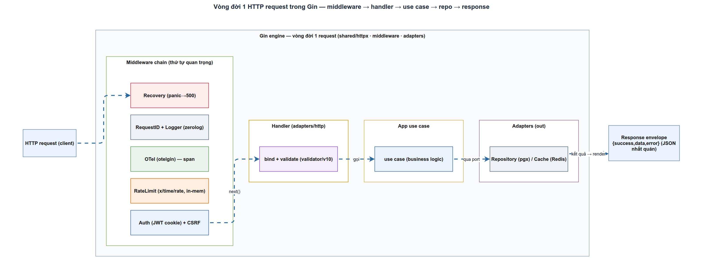

# API Design & OpenAPI trong LogMon
> Module BE-6 · REST chuẩn, response envelope, versioning, OpenAPI spec · Độ khó: 🥉→🥇 · Prereqs: BE-2

---

## 1. Vì sao kỹ năng này quan trọng trong LogMon

LogMon là một **nền tảng** — không phải một app đơn lẻ. Bề mặt API của nó được tiêu thụ bởi nhiều loại client cùng lúc: Next.js admin dashboard (BE-2 đã wire Gin), Alertmanager gọi `POST /api/v1/alerts/webhook` (machine-to-machine), Prometheus đọc rule state, và tương lai là service AI Python (GĐ5) tích hợp qua webhook/MCP. Mỗi client có vòng đời phát hành riêng. Nếu API không có **hợp đồng (contract) ổn định và nhất quán**, mỗi thay đổi nhỏ ở backend sẽ làm vỡ một client nào đó.

Ba thứ làm nên hay làm hỏng một nền tảng observability:

1. **Tính nhất quán** — 7 bounded context (identity, alerting, slo, logpipeline, incident, notification, shared) phải trả response cùng một hình dạng. Frontend viết **một** lớp `parseResponse` dùng cho mọi endpoint, không phải 7 lớp.
2. **Khả năng tiến hoá** — roadmap doc_v2 trải 4 giai đoạn. API phải thêm field, thêm endpoint mà không buộc client cũ sửa code. Đây là lý do tồn tại của versioning + envelope.
3. **Hợp đồng máy đọc được** — OpenAPI cho phép sinh TypeScript client cho FE, sinh mock cho test, và là tài liệu sống. Không có nó, mọi tích hợp là "đọc code Go rồi đoán".

LogMon hiện đã chứng minh nguyên tắc 1: cả `user` và `alerting` handler đều trả qua cùng một `httpx.Envelope`. Việc bạn học ở đây là cách giữ tính nhất quán đó khi hệ thống lớn lên gấp 5 lần.

---

## 2. Mô hình tư duy (first principles) — giải thích từ con số 0

**API là gì?** Là một **hợp đồng** giữa hai chương trình: "nếu bạn gửi cho tôi *cái này*, tôi hứa trả lại *cái kia*". REST chỉ là một quy ước phổ biến để viết hợp đồng đó dựa trên HTTP.

Bốn nguyên thủy của REST, suy ra từ HTTP:

- **Resource (danh từ)** — thứ bạn thao tác là *vật*, không phải *hành động*. Đúng: `/alert-rules`. Sai: `/createAlertRule`. Hành động đã nằm trong **HTTP method**.
- **Method (động từ)** — `GET` đọc (an toàn, idempotent), `POST` tạo, `PUT` thay thế toàn bộ (idempotent), `PATCH` sửa một phần, `DELETE` xoá (idempotent). Idempotent = gọi N lần cho cùng kết quả như gọi 1 lần.
- **Status code** — kết quả ở tầng giao thức: 2xx OK, 4xx lỗi do client, 5xx lỗi do server. Client *quyết định luồng xử lý* dựa trên đây trước khi đọc body.
- **Representation (body)** — biểu diễn của resource, thường là JSON.

Vì sao cần **envelope** (vỏ bọc) thay vì trả thẳng object? Vì một response cần mang **nhiều tầng thông tin**: dữ liệu, trạng thái thành/bại có cấu trúc, và metadata (phân trang). Trả thẳng `{ "id": "...", "email": "..." }` thì client không có chỗ chuẩn để đọc lỗi hay tổng số trang. Envelope tách ba mối quan tâm này ra ba field cố định.

Vì sao cần **versioning**? Vì hợp đồng và client tiến hoá *không đồng bộ*. Bạn không thể bắt mọi client deploy lại cùng lúc với backend. Version là cách để hợp đồng cũ và mới *cùng sống* trong giai đoạn chuyển tiếp.

Vì sao cần **OpenAPI**? Vì hợp đồng phải máy đọc được thì mới tự động hoá được (sinh client, validate, mock). Một file YAML mô tả mọi path/schema/response chính là hợp đồng ở dạng dữ liệu.

---

## 3. Khái niệm cốt lõi (tăng dần)

**a. Resource modeling.** Map domain sang URL phẳng, có thứ bậc: collection `/alert-rules`, item `/alert-rules/:id`, sub-resource `/incidents/:id/timeline`. Quan hệ thể hiện qua lồng path, không qua động từ.

**b. Sub-resource action.** Đôi khi một thao tác không map gọn vào CRUD (ví dụ "acknowledge" một alert). Quy ước thực dụng: `POST /alerts/:id/acknowledge` — một động từ ở cuối path như một "controller resource". LogMon dùng đúng pattern này (`enable`/`disable`/`acknowledge`/`silence`).

**c. Response envelope.** Vỏ JSON cố định cho *mọi* response. Tách `data` (payload), `error` (lỗi có cấu trúc), `meta` (phân trang).

**d. Error model.** Lỗi nên có **code ổn định** (máy match, ví dụ `VALIDATION_ERROR`) + **message người đọc**. Code không đổi giữa các version; message có thể đổi/dịch.

**e. Pagination.** `offset/limit` (đơn giản, lệch khi data thay đổi giữa các trang) vs `cursor` (ổn định, scale tốt cho stream lớn). LogMon dùng `offset/limit` cho log search.

**f. Versioning.** Path-based (`/v1`, `/v2`) là rõ ràng nhất. Field mới = non-breaking; đổi/xoá field hay đổi nghĩa = breaking → bump version.

**g. OpenAPI / Swagger.** Đặc tả YAML/JSON mô tả paths, schemas, responses. Hai cách tạo: **design-first** (viết spec trước, sinh code/test từ nó) và **code-first** (annotate code, sinh spec ra).

---

## 4. LogMon dùng/sẽ dùng nó thế nào (bám doc_v2 + code)



### Đã triển khai (đọc thấy trong code)

**Envelope thực tế** — `backend/internal/shared/httpx/response.go`:

```go
type Envelope struct {
	Success bool   `json:"success"`
	Data    any    `json:"data"`
	Error   string `json:"error,omitempty"`
	Meta    *Meta  `json:"meta,omitempty"`
}
type Meta struct{ Total, Page, Limit int }
```

Ba helper: `OK(c, status, data)`, `Fail(c, status, message)`, và `FailFromError(c, err)` — map domain error sang HTTP status **một cách tập trung**. Đây là chìa khoá nhất quán: handler không tự chế status code, mà chuyển error xuống một bộ map dùng `errors.Is`/`errors.As`:

```go
case errors.Is(err, apperrors.ErrNotFound):
	Fail(c, http.StatusNotFound, "resource not found")
```

**Resource modeling đúng chuẩn** — `alerting/adapters/http/handler.go` đăng ký:
`POST/GET /alert-rules`, `GET/PUT/DELETE /alert-rules/:id`, và controller-action `POST /alert-rules/:id/enable|disable`. `instance_handler.go` thêm `POST /alerts/:id/acknowledge`, `POST /alerts/webhook` (machine-to-machine, bảo vệ bằng bearer token nội bộ chứ không phải session auth).

**Versioning** — mọi route gắn dưới `r.Group("/api/v1")` trong `backend/cmd/userservice/main.go`. Path-based v1 đã sống.

**Validation tại biên** — request struct dùng `validator/v10` (BE-2): `validate:"required,email"`, `oneof=critical warning info`. Sai → `400` generic, không leak chi tiết.

**PUT = full replace** — `alerting` handler `update()` tái dùng `createRuleRequest`, đúng ngữ nghĩa PUT (thay thế toàn bộ, không phải PATCH một phần).

**Pagination** — `logpipeline` log search nhận `limit`/`offset` qua query param, parse an toàn bằng `strconv`.

**Rate limit** — `backend/internal/shared/middleware/ratelimit.go` dùng `golang.org/x/time/rate` token bucket **in-memory, per-IP** (không phải Redis). Áp cho route nhạy cảm (register/login/refresh). Trả `429` JSON.

> SLO BC đã có `internal/slo/{domain,app,ports,adapters}` và handler được register trong main. Incident & notification BC: **chưa** có handler (chỉ tồn tại thư mục `notification/domain` rỗng).

### Đích thiết kế chính thức (doc_v2 — target trang trọng)

doc_v2/07-api-specification.md là source of truth và đặt ra mục tiêu rõ hơn implementation hiện tại ở vài điểm. Đây là **đích**, không phải "lỗi" của code hiện tại — code đang tiến tới đó theo roadmap doc_v2/12:

- **Error có cấu trúc** (§1.1): envelope mục tiêu là `{"data": ..., "error": {"code": "VALIDATION_ERROR", "message": "..."}, "meta": ...}` — `error` là **object** `{code, message}`, kèm bảng map 7 code chuẩn (400→`VALIDATION_ERROR`, 401→`AUTH_REQUIRED`, 409→`CONFLICT`, 429→`RATE_LIMITED`...). Implementation hiện trả `error` dạng **string**. Việc nâng `error` từ string → object là một bước tiến hoá đã được spec hoá.
- **`meta.per_page`** (§1.2) thay vì `limit`; `per_page` max 100; list luôn kèm `meta.total`; filter time range `from`/`to` ISO8601 UTC.
- **`X-Trace-Id` trên error** (§1.1) để client báo lỗi kèm trace.
- **Versioning & deprecation** (§1.4): breaking change → `/v2` chạy **song song ≥ 6 tháng**; thêm field là non-breaking và client phải bỏ qua field lạ.
- **Idempotency-Key** (§1.3) tuỳ chọn cho POST quan trọng.
- **Rate limit** (§3): mục tiêu `redis_rate/v10` (thuật toán GCRA), **per-workspace** (GĐ1 tạm per-IP), `429` + `Retry-After`, **fail-open** khi Redis down.
- **OpenAPI per-story** (header §0): mỗi feature sinh `stories/{bc}/{feature}/tech/openapi.yaml`; file 07 là catalog + conventions tổng. Hiện backend **chưa** có toolchain sinh/serve OpenAPI (chỉ có `kube-openapi` transitive trong go.mod).

---

## 5. Best practices (mỗi mục kèm 1 nguồn đã research)

1. **Danh từ số nhiều + thứ bậc cho URL.** `/customers` và `/customers/5`; hành động nằm ở HTTP method, không ở path. Nhất quán giúp client đoán được endpoint chưa từng gặp. — [Microsoft Azure API design](https://learn.microsoft.com/en-us/azure/architecture/best-practices/api-design)

2. **Versioning từ ngày đầu, số nguyên cho major.** Dùng `/v1`, `/v2` (không `v1.2`); deprecation 6–12 tháng trước khi gỡ. LogMon đã có `/api/v1` ngay từ skeleton. — [Best Practices in API Design (Swagger)](https://swagger.io/resources/articles/best-practices-in-api-design/)

3. **Error chuẩn RFC 9457 (Problem Details).** Định dạng máy đọc được với `type/title/status/detail/instance` + extension; media type `application/problem+json`; kế thừa RFC 7807. doc_v2 dùng biến thể `{code, message}` — cùng tinh thần "code ổn định + message người đọc". — [Problem Details RFC 9457 (Swagger)](https://swagger.io/blog/problem-details-rfc9457-api-error-handling/)

4. **Pagination bắt buộc trên collection.** Chọn offset/cursor/keyset theo failure mode; LogMon dùng offset/limit (đủ cho log search có from/to). Tránh trả unbounded list. — [16 REST API design best practices (TechTarget)](https://www.techtarget.com/searchapparchitecture/tip/16-REST-API-design-best-practices-and-guidelines)

5. **Design-first với OpenAPI làm contract.** Viết spec trước rồi sinh code/mock/client; OpenAPI là hợp đồng chứ không phải tài liệu hậu kỳ. OAS 3.1 tương thích JSON Schema 2020-12. — [Best Practices (learn.openapis.org)](https://learn.openapis.org/best-practices.html)

6. **Go: chọn chiến lược sinh OpenAPI có chủ đích.** `oapi-codegen` cho design-first (spec → Go server/client), `swaggo` cho code-first (annotation → spec). Phù hợp với hướng "openapi.yaml per-story" của doc_v2. — [oapi-codegen](https://github.com/oapi-codegen/oapi-codegen)

---

## 6. Lỗi thường gặp & anti-patterns

- **Động từ trong URL.** `POST /api/v1/createAlertRule`. Sửa: `POST /api/v1/alert-rules`. (LogMon đã làm đúng — đừng phá.)
- **Trả 200 cho lỗi.** `{"success": false}` với HTTP 200. Client không thể dựa vào status code → mọi nơi phải parse body để biết thành/bại. Luôn để status code khớp ngữ nghĩa.
- **Leak chi tiết lỗi nội bộ.** Trả raw `err.Error()` (chứa SQL, stack, tên bảng) ra client → rò rỉ thông tin (vi phạm security.md). LogMon đúng: `FailFromError` trả message generic, log chi tiết riêng.
- **Lẫn lộn PUT và PATCH.** Dùng PUT nhưng chỉ gửi một field rồi mong server merge → mất dữ liệu các field không gửi. PUT = thay toàn bộ.
- **Breaking change im lặng.** Đổi nghĩa field hoặc đổi type trong `/v1` → vỡ client cũ. Field mới thì OK; đổi/xoá thì phải `/v2`.
- **Envelope không đồng nhất giữa BC.** Mỗi handler tự chế format. Phòng tránh: bắt buộc đi qua `httpx` (đã là chuẩn repo).
- **Unbounded query.** List không `limit` → một workspace nhiều alert làm sập response. Luôn có `per_page` max (doc_v2: 100).
- **Rate-limit map rò bộ nhớ.** `ratelimit.go` tự ghi chú: map `clients` tăng theo IP, chưa evict — chấp nhận cho skeleton, cần TTL/LRU (hoặc Redis per doc_v2) khi prod.

---

## 7. Lộ trình luyện tập NGAY trong repo LogMon (🥉→🥈→🥇)

**🥉 Cấp đồng — đọc & mô phỏng.**
- Đọc `httpx/response.go` + `response_test.go`. Viết một bảng (table-driven) test mới khẳđịnh `OK` set `success=true` và `Fail` set `error` đúng message.
- Vẽ ra giấy mọi route trong `alerting/adapters/http/handler.go`, đánh dấu method + status code mỗi route trả về. Đối chiếu với bảng §2.3 của doc_v2/07.

**🥈 Cấp bạc — thêm một endpoint đúng chuẩn.**
- Thêm `GET /api/v1/alert-rules` hỗ trợ phân trang: nhận `page`/`per_page` (max 100), trả `httpx.Meta{Total, Page, Limit}`. Viết test trước (RED) theo testing.md.
- Map một domain error mới qua `failDomain` trong handler, trả đúng status + message generic. Thêm case test cho nó.

**🥇 Cấp vàng — tiến hoá hợp đồng theo doc_v2.**
- Đề xuất nâng `Envelope.Error` từ `string` → struct `{Code, Message string}` khớp §1.1 doc_v2, **không breaking** (giữ `/v1`): viết một `ErrorBody` mới, cập nhật `Fail`/`FailFromError` để điền `code` ổn định (`VALIDATION_ERROR`, `NOT_FOUND`...), và cập nhật toàn bộ test envelope. Đây là refactor xuyên repo — dùng `ecc:go-review` sau khi xong.
- Viết tay `openapi.yaml` (OAS 3.1) cho nhóm `/alert-rules`, đặt ở `stories/alerting/alert-rules/tech/openapi.yaml` theo doc_v2. Thử sinh client bằng `oapi-codegen` và đối chiếu schema với `ruleResponse` struct thật.

---

## 8. Skill/agent ECC nên dùng

- **`ecc:api-design`** — pattern resource naming, status code, pagination, error response, versioning, rate limit cho production API. Gọi trước khi thiết kế endpoint mới hoặc khi nâng envelope `error` lên dạng object.
- **`ecc:go-review`** (`go-reviewer` agent) — review handler Go: idiomatic, error wrapping (`%w`/`%v` theo CLAUDE.md), small interfaces (ISP đã có: `ruleCreator`, `ruleReader`...), concurrency. Bắt buộc sau khi viết/sửa handler.
- **`ecc:fastapi-review`** — dành cho service AI Python GĐ5 (HolmesGPT/WeKnora) khi nó expose API; review async correctness, Pydantic schema, DI. Không áp cho core Go.
- Bổ trợ: **`ecc:golang-patterns`** (functional options, DI), **`ecc:security-review`**/`/cso` (kiểm error không leak, rate limit, CSRF — đã wire ở `auth/csrf`), **`ecc:openapi`-liên quan** qua `ecc:documentation-lookup` khi tra cứu OAS.

---

## 9. Tài nguyên học thêm (link đã research)

- [Microsoft Azure — Web API Design Best Practices](https://learn.microsoft.com/en-us/azure/architecture/best-practices/api-design) — chuẩn tham chiếu sâu về resource modeling, status code, pagination.
- [RFC 9457 — Problem Details for HTTP APIs](https://datatracker.ietf.org/doc/html/rfc9457) — chuẩn IETF cho error response máy đọc được.
- [Swagger — Problem Details (RFC 9457) hands-on](https://swagger.io/blog/problem-details-rfc9457-api-error-handling/) — ví dụ thực hành error envelope.
- [learn.openapis.org — OpenAPI Best Practices](https://learn.openapis.org/best-practices.html) — design-first, cấu trúc spec, reuse component.
- [Swagger — Best Practices in API Design](https://swagger.io/resources/articles/best-practices-in-api-design/) — versioning, naming, evolution.
- [oapi-codegen (GitHub)](https://github.com/oapi-codegen/oapi-codegen) — sinh Go server/client từ OpenAPI 3 (design-first).
- [TechTarget — 16 REST API design best practices](https://www.techtarget.com/searchapparchitecture/tip/16-REST-API-design-best-practices-and-guidelines) — checklist tổng hợp.
- Nội bộ: `doc_v2/07-api-specification.md` (source of truth), `doc_v2/09-security.md` (error/CSRF), `doc_v2/12-roadmap.md` (chặng triển khai từng BC).

---

## 10. Checklist "đã hiểu"

- [ ] Phân biệt được resource (danh từ) vs action, và vì sao hành động nằm ở HTTP method.
- [ ] Giải thích được vì sao envelope tách `data`/`error`/`meta` thành ba mối quan tâm.
- [ ] Biết khác biệt PUT (full replace, idempotent) vs PATCH (partial) vs POST (tạo).
- [ ] Đọc được `httpx.FailFromError` và giải thích vì sao map error tập trung giữ tính nhất quán + không leak nội bộ.
- [ ] Chỉ ra được envelope **đã triển khai** (`error` là string) khác **đích doc_v2** (`error` là `{code, message}` + `X-Trace-Id`) ở chỗ nào, và vì sao đó là tiến hoá đã spec hoá chứ không phải lỗi.
- [ ] Biết LogMon versioning là path `/api/v1`, và quy tắc doc_v2: field mới = non-breaking, breaking → `/v2` song song ≥ 6 tháng.
- [ ] Biết rate limit hiện là `x/time/rate` in-memory per-IP, đích doc_v2 là `redis_rate` GCRA per-workspace + `Retry-After` + fail-open.
- [ ] Phân biệt design-first (oapi-codegen) vs code-first (swaggo) và hướng "openapi.yaml per-story" của doc_v2.
- [ ] Biết SLO BC đã có handler; incident & notification BC **chưa** triển khai.
- [ ] Gọi đúng `ecc:api-design` trước khi thiết kế endpoint, `ecc:go-review` sau khi viết handler.
