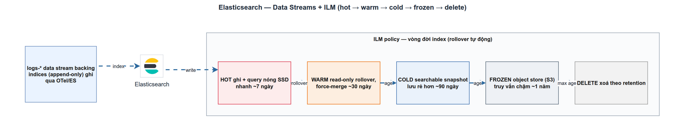

# Elasticsearch — Data Streams & ILM chuyên sâu
> Module ADV-3 · data stream, ILM lifecycle, mapping, shard sizing, rollover · Độ khó: 🥇 (nâng cao) · Prereqs: OBS-2

> **Lưu ý về phạm vi (đọc trước).** Trong LogMon, phần *bootstrap* ILM + index template + data stream đã **được hiện thực** (`infra/elasticsearch/`), còn phần *vòng đời nâng cao* (warm/cold/frozen, searchable snapshot, per-workspace retention qua API, DLQ) phần lớn là **planned** — nằm trong `doc_v2/03` và roadmap GĐ2-3. Bài này dạy từ con số 0 đến tư duy vận hành, rồi neo chính xác vào cái đang có vs cái sẽ làm. OBS-2 dạy *pipeline* (zerolog → OTel → ES); ADV-3 này đào sâu *tầng lưu trữ ES*: vì sao data stream, rollover hoạt động ra sao, sizing shard, chiến lược mapping, và các data tier.

---

## 1. Vì sao kỹ năng này quan trọng trong LogMon

LogMon là nền tảng observability cho Go microservices: log là tín hiệu khối lượng lớn nhất, ghi liên tục, đọc theo thời gian gần. Elasticsearch (ES 9.4.2 trong `infra/docker/docker-compose.yml:274`) là nơi log đáp đất. Ba quyết định ở tầng này định đoạt cả chi phí lẫn độ tin cậy của hệ thống:

- **Index/shard strategy sai** → hoặc oversharding (hàng nghìn shard nhỏ, master node hết heap, cluster đỏ), hoặc shard khổng lồ (recovery chậm, query lag). Đây là nguyên nhân số 1 khiến cluster ES "tự sập" trong production.
- **Không có ILM** → index sống mãi, đĩa đầy, đến một ngày ES bật read-only ở mốc disk watermark và **toàn bộ ingestion dừng** — đúng lúc cần log để điều tra sự cố nhất.
- **Mapping bừa bãi** → mapping explosion (mỗi field log tự do thành một field mapping mới), hoặc dùng `text` cho mọi thứ → tốn disk gấp đôi và aggregation không chạy.

`doc_v2/03 §4` (ADR-019) chốt: bỏ daily index, dùng **data stream + ILM rollover theo size**. Bài này giải thích *tại sao* và *làm thế nào cho đúng*, để bạn vận hành được tầng lưu trữ log của LogMon thay vì chỉ chạy theo config có sẵn.

---

## 2. Mô hình tư duy (first principles) — giải thích từ con số 0

**Index là gì.** Một ES index = một tập tài liệu JSON cùng schema (mapping). Về vật lý, index được chia thành **shard** — mỗi shard là một **Lucene index độc lập** (có file segment riêng, search riêng). Đây là đơn vị phân tán và đơn vị recovery.

**Vì sao không nhét tất cả log vào một index khổng lồ.** Một shard không thu nhỏ được — đã ghi 500GB thì phải đọc cả 500GB khi recovery sau khi node chết. Và bạn không xoá được "log cũ hơn 30 ngày" trong một index — phải xoá nguyên index. Vậy log (time-series, append-only) cần được **cắt lát theo thời gian thành nhiều index nhỏ**: ghi vào index mới, đọc trên nhiều index, xoá nguyên lát cũ. Đây là first principle của mọi log store.

**Daily index — cách cũ và vì sao bỏ.** Cách cổ điển: `logs-2026.06.27`, mỗi ngày một index. Vấn đề: volume không đều. Ngày ít log → index 200MB (shard quá nhỏ, lãng phí metadata). Ngày deploy storm → index 200GB (shard quá to). Bạn không kiểm soát được *kích thước* shard, chỉ kiểm soát *thời gian*.

**Data stream — cách mới.** Data stream là một *bí danh* trỏ tới một dãy **backing index** ẩn (`.ds-logs-...-000001`, `-000002`...). Ứng dụng chỉ biết một tên (`logs-demo_order.otel-default`); ES tự ghi vào backing index *mới nhất* và đọc trên *tất cả*. Khi backing index hiện tại đạt ngưỡng kích thước → **rollover**: tạo backing index kế tiếp, đóng băng cái cũ. Giờ bạn kiểm soát được đúng cái cần: **kích thước shard**.

**ILM — robot vận hành vòng đời.** Index Lifecycle Management là máy trạng thái: index đi qua **hot → warm → cold → frozen → delete**, mỗi phase có hành động (rollover, shrink, forcemerge, snapshot, delete) và điều kiện chuyển (`min_age`). ILM thay con người bấm nút mỗi đêm. Triết lý: dữ liệu mới = nóng = ghi nhanh + đọc nhiều = phần cứng đắt; dữ liệu cũ dần nguội = đọc hiếm = phần cứng rẻ; quá cũ = xoá. Trả tiền theo mức dùng thực.

---

## 3. Khái niệm cốt lõi (tăng dần độ khó)

**3.1 Data stream & ràng buộc append-only.** Mọi tài liệu vào data stream **bắt buộc có `@timestamp`** (kiểu `date`/`date_nanos`); data stream chỉ cho *index* (thêm mới) và *rollover*, **không cho update/delete theo id** trên backing index trực tiếp — đúng bản chất log bất biến. Một data stream được kích hoạt bằng `"data_stream": {}` trong index template (xem `infra/elasticsearch/index-template.json:3`).

**3.2 Rollover — cơ chế cắt lát.** Rollover tạo backing index mới khi index "đang ghi" (write index) chạm ngưỡng. Ngưỡng nên dùng (Elastic khuyến nghị): `max_primary_shard_size: 50gb`, kèm `min_primary_shard_size: 10gb` để tránh shard tí hon. **Tránh dùng `max_age` làm ngưỡng chính** — nó đẻ ra index rỗng/nhiều shard nhỏ khi volume thấp; chỉ dùng `max_age` như *chặn trên* (LogMon đặt `7d`). Quan trọng: ILM kiểm tra điều kiện theo chu kỳ `indices.lifecycle.poll_interval` (mặc định 10 phút) — rollover *không* xảy ra tức thì lúc chạm 50GB.

**3.3 Shard sizing (con số phải thuộc lòng).**

| Quy tắc | Giá trị | Hệ quả nếu vi phạm |
|---|---|---|
| Kích thước shard | 10–50 GB | Quá nhỏ → oversharding; quá lớn → recovery/query chậm |
| Docs/shard | < 200 triệu (cứng ~2.15 tỷ do Lucene) | Vượt → từ chối ghi |
| Shard/node (non-frozen) | ≤ 1.000 | Vượt → cluster bất ổn |
| Shard/node (frozen) | ≤ 3.000 | — |
| Heap master node | ≥ 1GB / 3.000 index | Thiếu → master OOM, cluster đỏ |

**3.4 Mapping strategy.** Ba loại field-type quyết định chi phí:
- `keyword` cho field lọc/aggregate chính xác (service.name, severity_text, trace_id) — sortable, aggregatable, rẻ.
- `match_only_text` cho `body.text` (message): full-text search được nhưng **bỏ positions/freqs** → tiết kiệm ~10–20% disk so với `text` đầy đủ. LogMon dùng đúng cái này (`index-template.json:33`).
- `constant_keyword` cho field có **một giá trị cho cả index** (data_stream.type/dataset/namespace) → ES bỏ qua shard không khớp khi query → ít shard phải quét hơn.
- **`dynamic_templates`** chặn mapping explosion: ép mọi `attributes.*` thành `keyword` với `ignore_above: 1024` thay vì để ES đoán bừa (LogMon đã làm, `index-template.json:12-27`).
- **`runtime` field** cho field hiếm dùng: không lưu mapping/disk, tính lúc query (chậm hơn nhưng linh hoạt, sửa được mà không reindex).

**3.5 Component template vs index template.** Index template gắn pattern (`logs-*`) → data stream + settings + mappings. Production nên tách thành **component template** tái dùng (một block mappings, một block settings) rồi compose — dễ bảo trì, ít lặp. LogMon hiện gộp một file (đủ cho GĐ1-2); tách component là bước nâng cấp planned.

**3.6 Data tiers (hot/warm/cold/frozen).**

| Tier | Mục đích | Phần cứng | Snapshot | Tiết kiệm |
|---|---|---|---|---|
| Hot | Ghi + đọc nhiều, dữ liệu mới nhất | SSD nhanh, 1+ replica | không | — |
| Warm | Đọc thưa, vài tuần gần | đĩa thường, 1+ replica; `shrink`+`forcemerge` 1 segment | không | — |
| Cold | Hiếm đọc | searchable snapshot **fully-mounted**, 0 replica | có | ~50% so warm |
| Frozen | Gần như không đọc | searchable snapshot **partially-mounted** | có | tới **20×** so warm |

Cold/frozen đọc dữ liệu từ **searchable snapshot** trên object store (S3): cold tải toàn bộ về node (nhanh), frozen chỉ tải phần cần lúc query (chậm, rẻ kinh khủng). Benchmark Elastic: 90TB all-hot ≈ \$28.222/tháng → hot+frozen ≈ \$3.290/tháng.

---

## 4. LogMon dùng/sẽ dùng nó thế nào (bám doc_v2 + code; ghi rõ implemented/planned)

**Đã hiện thực (có code, chạy được `make up-full`):**

- **Bootstrap one-shot** `infra/elasticsearch/init.sh` — `PUT _ilm/policy/logmon-logs` + `PUT _index_template/logmon-logs`, idempotent (PUT ghi đè, chạy lại an toàn).
- **ILM policy** `infra/elasticsearch/ilm-policy.json` — hiện chỉ **hot → delete (30d)**: hot có `rollover {max_primary_shard_size: 50gb, max_age: 7d}` + `set_priority: 100`; delete `min_age: 30d`. Đây là cấu hình dev/Mode A.
- **Index template** `infra/elasticsearch/index-template.json` — `index_patterns: ["logs-*"]`, `"data_stream": {}`, `priority: 200`, `number_of_shards: 1`, `number_of_replicas: 0` (dev), `index.lifecycle.name: logmon-logs`; mappings dùng `match_only_text` + `constant_keyword` + `dynamic_templates` đúng như mục 3.4.
- **Routing data stream** ở gateway: `infra/otel/gateway.yaml:23-31` set `data_stream.type/dataset/namespace` → data stream `logs-{dataset}.otel-default` (OTel-native mapping, `mapping::mode: ecs` đã deprecated từ exporter v0.154).
- **Read side (CQRS query)** `backend/internal/logpipeline/` — `LogSearcher` interface (`ports/ports.go`), client `adapters/elasticsearch/client.go` query `logs-*/_search`, dựng DSL **bằng struct→JSON, không concat chuỗi** (chống injection); `domain/search.go` validate `SearchCriteria` (limit ≤ `MaxLimit=1000`, trace_id 32 hex, severity whitelist).

**Planned (chỉ trong doc_v2/roadmap, chưa có code):**

- **Warm/cold/frozen + searchable snapshot S3** — `doc_v2/03 §4.2` mô tả policy đầy đủ (warm 7d shrink+forcemerge, cold 30d searchable_snapshot, delete 90d). File ILM thật mới có hot+delete → đây là khoảng cách implemented↔target rõ rệt. Cold/frozen chỉ bật ở **Mode B**.
- **Per-workspace retention qua API** — `doc_v2/08-database-schema.md:185-194` định nghĩa bảng `pipeline_configs(ilm_hot_days/warm_days/delete_days)`; backend (LogPipeline write side, planned) sẽ `PUT /pipeline/ilm` → gọi ES ILM API. `domain/log.go:1-4` ghi rõ "write side (Mode switch, DLQ, ILM) ở các giai đoạn sau".
- **data-stream-per-workspace** qua `namespace = workspace slug` (`doc_v2/03 §4.1`; `08:48`) — GĐ1-2 dùng `default`, GĐ3 tách theo workspace để ILM/retention riêng từng tenant (đúng khuyến nghị 5–50 tenant).
- **DLQ tracking** — bảng `dlq_entries` (`08:196-208`), alert theo **rate** không theo size.

---

## 5. Best practices (mỗi mục kèm 1 nguồn đã research)

1. **Rollover theo `max_primary_shard_size` 50gb, đừng dùng `max_age` làm ngưỡng chính.** Để ES tự giữ shard trong 10–50GB thay vì cắt theo lịch — tránh index rỗng/shard nhỏ. ([Size your shards — Elastic](https://www.elastic.co/docs/deploy-manage/production-guidance/optimize-performance/size-shards))
2. **Giữ shard 10–50GB và < 200 triệu docs.** Mốc vàng cho log/time-series; shard 100GB recovery chậm gấp đôi shard 50GB. ([Elasticsearch shard & node size best practices — Elastic Labs](https://www.elastic.co/search-labs/blog/elasticsearch-node-shard-size-best-practices))
3. **Dùng data tiers cho dữ liệu nguội — frozen có thể giảm chi phí ~8–9×.** Hot+frozen thay all-hot là đòn bẩy chi phí lớn nhất ở quy mô. ([Data tiers — Elastic Docs](https://www.elastic.co/docs/manage-data/lifecycle/data-tiers))
4. **Vận hành ILM qua data stream như một resource đơn**, để rollover + các action chạy tự động trên backing index — không bấm tay. ([ILM — Elastic Docs](https://www.elastic.co/docs/manage-data/lifecycle/index-lifecycle-management))
5. **Chặn mapping explosion bằng `dynamic_templates` + `constant_keyword`**; field hiếm dùng để `runtime`. ([Data streams / templates — Elastic Docs](https://www.elastic.co/docs/manage-data/data-store/data-streams))

---

## 6. Lỗi thường gặp & anti-patterns

- **Daily index + 5 shard/index mặc định** → oversharding kinh điển: 365 ngày × 5 = 1.825 shard cho thứ chứa vài GB. Sửa: data stream + 1 primary shard + rollover theo size.
- **Quên ILM / không gắn `index.lifecycle.name`** → index sống mãi, đĩa đầy, ES bật `read_only_allow_delete` ở disk watermark → ingestion chết. Luôn gắn policy trong template (`index-template.json:9`).
- **Đặt `max_age` quá ngắn (vd `1d`) làm ngưỡng rollover** → khi volume thấp, đẻ hàng loạt index bé tí.
- **Dùng `text` cho mọi field log** → mapping explosion + disk gấp đôi + không aggregate được. Phân loại: `keyword` để lọc, `match_only_text` cho message.
- **Mong rollover xảy ra ngay khi chạm 50GB** → thực tế ILM poll mỗi ~10 phút; shard có thể vọt quá 50GB chốc lát.
- **Concat chuỗi vào query DSL** → injection/lỗi. LogMon dựng DSL bằng struct→JSON (`client.go:48-49`) — giữ pattern này.
- **Sửa mapping field đã tồn tại** (đổi `keyword`→`text`) → ES từ chối, gây mapping conflict; phải rollover sang backing index mới hoặc reindex.
- **Replica = 0 ở production** → mất node = mất log. Dev (LogMon hiện tại) `0` là chấp nhận được; production phải `1`.

---

## 7. Lộ trình luyện tập (🥉→🥈→🥇)

Vì chủ đề phần lớn planned, task thiên về *thiết kế/POC ngay trong repo LogMon* — nhưng phải cụ thể, kiểm chứng được bằng `_cat`/`_ilm` API.

**🥉 Cơ bản — quan sát cái đang chạy.**
1. `make up-full`, rồi `curl -u elastic:$ELASTIC_PASSWORD localhost:9200/_cat/indices/.ds-logs-*?v&h=index,docs.count,pri.store.size` — xác định backing index, kích thước, số docs.
2. `GET _ilm/policy/logmon-logs` và `GET <backing-index>/_ilm/explain` — đọc phase hiện tại, điều kiện rollover còn thiếu gì.
3. Đối chiếu mapping thực tế (`GET logs-*/_mapping`) với `infra/elasticsearch/index-template.json` — chỉ ra field nào `keyword`, field nào `match_only_text`.

**🥈 Trung cấp — bổ sung warm phase (POC).**
1. Sửa `infra/elasticsearch/ilm-policy.json`: thêm phase `warm` (`min_age: 7d`, `shrink {number_of_shards: 1}`, `forcemerge {max_num_segments: 1}`, `set_priority: 50`) đúng `doc_v2/03 §4.2`.
2. Chạy lại `init.sh` (idempotent), `POST <data-stream>/_rollover` thủ công để ép tạo backing index, rồi `GET _ilm/explain` xác nhận index cũ vào warm.
3. Viết một dynamic_template mới cho `attributes.http.*` thành `short`/`keyword` và verify không bị mapping explosion.

**🥇 Nâng cao — thiết kế per-workspace retention + tiering.**
1. Thiết kế (doc + JSON, không cần code BC) cho `PUT /pipeline/ilm` map `pipeline_configs(ilm_hot_days/warm_days/delete_days)` (`doc_v2/08:185`) → một ILM policy *riêng từng workspace* (`logmon-logs-<ws-slug>`), và data-stream-per-namespace.
2. POC cold tier: tạo một fs/S3 snapshot repository local (MinIO), thêm phase `cold {searchable_snapshot}`, đo `pri.store.size` trước/sau.
3. Viết runbook ngắn: tính sizing cho mục tiêu 20K logs/s — bao nhiêu shard/ngày ở 50GB rollover, cần bao nhiêu data node để giữ < 1.000 shard/node, retention 90 ngày tốn bao nhiêu disk hot vs frozen.

---

## 8. Skill/agent ECC nên dùng

- **`ecc:database-reviewer`** — review thiết kế index template/mapping + bảng `pipeline_configs`/`dlq_entries`: bắt mapping explosion, field type sai, thiếu index trên `(workspace_id, status)`.
- **`ecc:performance-optimizer`** — soi sizing shard/heap, ngưỡng rollover, query DSL (`_search` có `track_total_hits`, range trên `@timestamp`), và alert ES disk watermark.
- **`ecc:clickhouse-io`** — đối chiếu mô hình columnar/TTL của ClickHouse với ES data stream + ILM khi cân nhắc lựa chọn log store thay thế (tham khảo, không phải đường đi mặc định của LogMon).
- Bổ trợ: **`ecc:go-review`** cho `adapters/elasticsearch/client.go` (an toàn DSL, context timeout), **`ecc:security-review`** cho việc inject filter workspace bắt buộc ở Log Search API.

---

## 9. Tài nguyên học thêm (link đã research)

- [Size your shards — Elastic Docs](https://www.elastic.co/docs/deploy-manage/production-guidance/optimize-performance/size-shards) — sizing, ngưỡng rollover, oversharding.
- [Data tiers: hot/warm/cold/frozen — Elastic Docs](https://www.elastic.co/docs/manage-data/lifecycle/data-tiers) — searchable snapshot, chi phí.
- [Index Lifecycle Management — Elastic Docs](https://www.elastic.co/docs/manage-data/lifecycle/index-lifecycle-management) — phase, action, vận hành qua data stream.
- [Elasticsearch shard & node size: best practices — Elastic Labs](https://www.elastic.co/search-labs/blog/elasticsearch-node-shard-size-best-practices) — benchmark sizing, heap/shard.
- [Data streams — Elastic Docs](https://www.elastic.co/docs/manage-data/data-store/data-streams) — append-only, `@timestamp`, constant_keyword, runtime field.
- [Elastic data stream naming scheme — Elastic Blog](https://www.elastic.co/blog/an-introduction-to-the-elastic-data-stream-naming-scheme) — `{type}-{dataset}-{namespace}`.

---

## 10. Checklist "đã hiểu"

- [ ] Giải thích được vì sao data stream + rollover theo size **thay** daily index (kiểm soát kích thước shard, không phải thời gian).
- [ ] Nêu đúng 5 con số sizing: shard 10–50GB, < 200M docs/shard, ≤ 1.000 shard/node, 50gb rollover, 1GB heap/3.000 index.
- [ ] Phân biệt được khi nào dùng `keyword`, `match_only_text`, `constant_keyword`, `runtime`, và `dynamic_templates` chống mapping explosion.
- [ ] Mô tả được 4 data tier và vai trò searchable snapshot (cold fully-mounted vs frozen partially-mounted) cùng tác động chi phí.
- [ ] Chỉ ra trong LogMon đâu là **implemented** (`infra/elasticsearch/*`, hot→delete, read side) và đâu là **planned** (warm/cold/frozen, per-workspace ILM qua `pipeline_configs`, DLQ).
- [ ] Đọc được `_ilm/explain` để biết một backing index đang ở phase nào và còn thiếu điều kiện gì để rollover.
- [ ] Biết vì sao `max_age` không nên là ngưỡng rollover chính, và vì sao ILM rollover không tức thì.
- [ ] Nhận diện được anti-pattern oversharding, quên ILM (disk watermark → ingestion chết), và `text`-cho-mọi-field.
