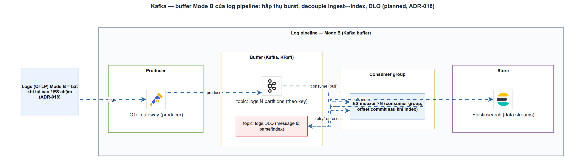

# Kafka — Buffer Mode B của Log Pipeline

> Module DATA-2 · KRaft, topic/partition, consumer group, DLQ, backpressure · Độ khó: 🥉→🥇 · Prereqs: OBS-2

---

## 1. Vì sao kỹ năng này quan trọng trong LogMon

LogMon thu log của nhiều Go microservices và đẩy vào Elasticsearch (ES) qua OTel Collector. Đường ống mặc định hiện tại là **Mode A**: agent → gateway → ES, có `sending_queue` file-backed làm đệm khi ES chập chờn ngắn hạn (đã wire trong `infra/otel/gateway.yaml`). Mode A đơn giản, đủ cho dev và tải vừa.

Nhưng khi hệ thống lớn lên xuất hiện 3 bài toán mà một hàng đợi cục bộ trong collector **không** giải được:

1. **Burst lớn** — "deploy storm", một service spam log lúc sự cố. Tốc độ sinh log vượt tốc độ ES nuốt → đệm cục bộ tràn → **mất log đúng lúc cần nhất**.
2. **Replay sau sự cố** — gateway hoặc ES chết 5–10 phút. Mode A chỉ giữ được những gì lọt vào queue cục bộ; phần còn lại bay.
3. **Tách tiêu thụ (fan-out)** — muốn nhiều consumer độc lập đọc cùng dòng log (ES + cold storage + audit) mà không ghép cứng.

doc_v2/03-logs-pipeline.md §5 và **ADR-002/ADR-027** trả lời bằng **Mode B**: chèn **Kafka** làm buffer bền vững giữa agent và gateway. Ngưỡng chuyển mode được ghi rõ trong ADR-007: **log volume > 5–10K msg/s duy trì, hoặc cần replay, hoặc burst lớn**. Dưới ngưỡng đó → Mode A là đủ; đừng "gold-plate" Kafka sớm. Đây chính là kỹ năng vận hành lõi của Giai Đoạn 4 (Scale) trong roadmap.

---

## 2. Mô hình tư duy (first principles) — giải thích từ con số 0

Hãy quên Kafka đi. Bắt đầu từ một sự thật vật lý: **producer (sinh log) và consumer (ghi vào ES) chạy ở tốc độ khác nhau và biến thiên theo thời gian.** Khi producer nhanh hơn consumer, dữ liệu thừa phải đi đâu đó. Có 3 lựa chọn:

- **Drop** — vứt bớt (mất dữ liệu).
- **Block** — bắt producer chờ (backpressure ngược về service đang phục vụ user — tệ).
- **Buffer** — chứa tạm vào một nơi bền, xử lý sau.

Kafka là lựa chọn **buffer bền (durable)**: một **commit log chỉ-ghi-thêm (append-only)** lưu trên đĩa, nhân bản qua nhiều node. Khác hàng đợi truyền thống (RabbitMQ): message **không bị xoá khi đọc**. Consumer chỉ nhớ vị trí mình đọc tới — gọi là **offset**. Vì dữ liệu nằm lại, ta có thể **tua lại (replay)**: đặt offset về quá khứ và đọc lại — đây chính là cơ chế "kill gateway 5 phút rồi replay đủ" trong DoD GĐ4.

Hệ quả tư duy then chốt: trong Mode B, **Kafka mới là buffer chính**, còn queue trong collector chỉ cần nhỏ (đúng như chú thích trong `gateway.yaml`: "Mode B thì Kafka là buffer chính"). Bạn dời rủi ro mất dữ liệu từ một tiến trình ephemeral sang một storage layer được thiết kế để bền.

---

## 3. Khái niệm cốt lõi (tăng dần)

**Topic** — một dòng log có tên, ví dụ `otlp_logs`. Là kênh logic để phân loại message.

**Partition** — topic được chia thành N partition. Partition là **đơn vị song song và đơn vị thứ tự**: thứ tự chỉ được đảm bảo *trong* một partition, không phải toàn topic. Nhiều partition = nhiều consumer chạy song song. doc_v2 chọn `otlp_logs` có **6 partitions**.

**Offset** — số thứ tự tăng dần của message trong một partition. Consumer **commit offset** để đánh dấu "đã xử lý tới đây".

**Producer / Consumer** — bên ghi vào / đọc ra. Trong Mode B: OTel agent là producer (kafka exporter), OTel gateway là consumer (kafka receiver).

**Consumer group** — tập consumer cùng `group.id` chia nhau các partition: mỗi partition được gán cho **đúng một** consumer trong group. doc_v2 dùng group `otel-gateway`. Đây là cơ chế scale-out: thêm gateway → tự chia tải.

**Rebalance** — khi consumer vào/ra group, Kafka chia lại partition. Rebalance "stop-the-world" gây gián đoạn; best practice 2025 là dùng **Cooperative Sticky / next-gen rebalance protocol** (Kafka 4.0) để consumer không bị dừng toàn bộ.

**Replication Factor (RF) & ISR** — mỗi partition có RF bản sao trên các broker; `min.insync.replicas` là số bản sao tối thiểu phải xác nhận. doc_v2 production: **RF=3, min.insync.replicas=2** → chịu mất 1 broker không mất dữ liệu.

**KRaft** — từ Kafka 4.0 (03/2025), **ZooKeeper bị xoá hoàn toàn**; Kafka tự quản metadata qua giao thức Raft (KRaft). doc_v2/ADR-027: **Kafka 4.3 KRaft-only**, production tách 3 controller + 3 broker; combined mode chỉ cho staging.

**Idempotent producer & exactly-once-ish** — `enable.idempotence=true` + `acks=all` chống ghi trùng khi retry (mỗi message gắn sequence number). "Exactly-once thật" cần transaction phức tạp; thực dụng hơn (và là điều LogMon chọn): **at-least-once + handler idempotent / dedup ở downstream** — đúng tinh thần comment trong `outbox/bus.go`.

**Consumer lag** — khoảng cách giữa offset mới nhất và offset consumer đã đọc. Lag tăng đều = consumer không theo kịp.

**Dead Letter Queue (DLQ)** — topic riêng (`logs-dlq`) chứa message *không xử lý được* (parse fail, ES bulk reject) kèm metadata lỗi, để review/retry thay vì chặn dòng chính.

---

## 4. LogMon dùng/sẽ dùng nó thế nào (bám doc_v2 + code)

**Trạng thái hiện tại (implemented — đọc thấy code):**

- Đường ống chạy là **Mode A**: `infra/otel/gateway.yaml` định nghĩa pipeline `logs: [otlp] → ... → [elasticsearch]`, dùng `file_storage` + `sending_queue.storage: file_storage` làm đệm bền cục bộ. Không có Kafka đang chạy.
- `infra/docker/docker-compose.yml` (dòng 1–3) ghi rõ stack hiện tại là Mode A; "Mode B (Kafka, ES cluster, Thanos) bổ sung sau qua profile `scale`".
- LogPipeline BC trong `backend/internal/logpipeline/` hiện **chỉ có read side** (CQRS): `ports.LogSearcher` + adapter `elasticsearch/client.go` để search log. Comment trong `ports/ports.go` xác nhận: *"GĐ2.8 chỉ có read side — không có ghi."* Chưa có code consumer/DLQ Kafka.
- Cross-BC event hiện đi qua **in-process bus** (`backend/internal/shared/outbox/bus.go`), dispatch đồng bộ. Comment ngay trong file: *"Một process — đủ cho GĐ1-3; khi tách service đổi sang Kafka."* và handler *"PHẢI idempotent (at-least-once)"*.

**Đích thiết kế chính thức (planned — doc_v2 là source of truth):**

Theo doc_v2/03 §5–§7 và roadmap GĐ4 (mục 4.1: *"Mode B: Kafka 4.3 (3 brokers KRaft) buffer + DLQ topic"*):

- **Kafka 4.3 KRaft-only** (ADR-027). Production: 3 controller + 3 broker, RF=3, `min.insync.replicas=2`. Staging: 1 node combined.
- **Topics**: `otlp_logs` (input, **6 partitions**, retention 24h) và `logs-dlq` (retention **7–14 ngày**). Consumer group `otel-gateway`.
- Bật qua compose profile `scale`; trong `gateway.yaml`, Mode B sẽ chuyển sang `kafka` exporter/receiver (đã có comment placeholder ở doc_v2/03 §dòng 80–81).
- **DLQ**: parse-fail / ES bulk-reject → route vào `logs-dlq` kèm header (source topic/partition/offset, timestamp, error reason). LogPipeline BC đọc DLQ → bảng `dlq_entries` (samples + count) → UI; retry **thủ công** qua `POST /pipeline/dlq/retry` (**không auto-replay**).
- **Bảo vệ pipeline 5 lớp** (doc_v2/03 §7): agent `memory_limiter` → Kafka producer/consumer quota (50/100 MB/s) → gateway batch+queue+backoff → backend rate-limit per-workspace → ES ILM + disk watermark.
- **DoD GĐ4**: 10K logs/s duy trì 1h không mất log; kill gateway 5 phút → Kafka replay đủ.

> Redpanda (Kafka API drop-in, single binary) được **ghi nhận là alternative** giảm ops — không phải mặc định (ADR-027).

---

## 5. Best practices (mỗi mục kèm 1 nguồn đã research)

1. **Producer phải tự có resilience khi Kafka down.** Nếu Kafka chết, collector-producer cần sending_queue (lý tưởng file-backed/WAL) để không mất dữ liệu chờ ghi vào Kafka. ([OpenTelemetry — Resiliency](https://opentelemetry.io/docs/collector/resiliency/))

2. **Cấu hình bền vững chuẩn production**: `acks=all`, `enable.idempotence=true`, `min.insync.replicas=2`, RF=3, 3 controller tách riêng (KRaft isolated). ([Kafka Production Patterns — ryankirsch.dev](https://www.ryankirsch.dev/blog/kafka-production-patterns))

3. **Chọn số partition có nhiều ước số (12, 24, 48…), tránh số nguyên tố** để leadership chia đều qua broker. (LogMon chọn 6 — hợp lý cho cụm nhỏ, scale lên nên cân nhắc 12/24.) ([Factor House — Partition best practices](https://factorhouse.io/articles/kafka-topic-partition-best-practices))

4. **Dùng Cooperative Sticky / next-gen rebalance + static membership** để giảm gián đoạn khi consumer (gateway) scale. ([Lydtech — Kafka 4.0 next-gen rebalance](https://www.lydtechconsulting.com/blog/blog-kafka-rebalance-next-gen))

5. **Alert theo RATE và xu hướng lag, không chỉ theo size tuyệt đối**: lag tăng đều mới là dấu hiệu consumer không theo kịp — khớp với quyết định doc_v2 (`rate(logmon_dlq_messages_total[5m])`). ([Confluent — Monitor consumer lag](https://docs.confluent.io/cloud/current/monitoring/monitor-lag.html))

6. **Tối ưu throughput receiver**: client franz-go (feature gate) nâng từ 12K → 30K EPS/partition. Theo dõi `otelcol_exporter_queue_size`, `otelcol_exporter_send_failed_*`. ([Bindplane — Scaling OTel log ingestion 150%](https://bindplane.com/blog/kafka-performance-crisis-how-we-scaled-opentelemetry-log-ingestion-by-150))

---

## 6. Lỗi thường gặp & anti-patterns

- **Bật Kafka quá sớm.** Dưới 5–10K logs/s, Mode A + persistent queue là đủ; Kafka là gánh nặng vận hành (ADR-007). YAGNI.
- **Combined mode (broker+controller chung node) cho production.** Confluent không hỗ trợ; chỉ dùng staging (ADR-027).
- **Số partition cố định quá thấp.** Không thể *giảm* partition; tăng partition phá vỡ thứ tự theo key. Tính dư ngay từ đầu.
- **Consumer không idempotent với at-least-once.** Replay/retry sẽ ghi trùng. Phải dedup ở downstream (ES doc id ổn định) — đúng nguyên tắc `Handler` trong `outbox/bus.go`.
- **Auto-replay DLQ.** doc_v2 cấm: retry thủ công sau review, nếu không sẽ replay vô hạn cùng message độc (poison message).
- **Alert theo size DLQ.** Một spike cũ vẫn nằm đó → báo động giả mãi. Alert theo rate/trend.
- **Bỏ qua resilience phía producer.** Coi Kafka "luôn sống" → mất log khi broker rolling-restart.
- **Cross-BC import để né event.** Vi phạm layer direction; cross-BC phải qua domain event (in-process bus nay, Kafka sau — ADR khi tách service).

---

## 7. Lộ trình luyện tập NGAY trong repo LogMon (🥉→🥈→🥇)

**🥉 Đọc & dựng (đọc-hiểu Mode A trước):**
1. Đọc `infra/otel/gateway.yaml` — chỉ ra chính xác dòng nào là buffer Mode A (`file_storage`, `sending_queue`). Viết 3 câu giải thích vì sao nó *không* thay được Kafka.
2. Đọc doc_v2/03 §5–§7 và bảng ADR-027; lập bảng so sánh Mode A vs Mode B (buffer ở đâu, replay được không, ngưỡng chuyển).
3. Trong `backend/internal/logpipeline/`, xác nhận BC hiện chỉ có read side; liệt kê file nào sẽ phải thêm cho consumer/DLQ.

**🥈 Prototype cục bộ:**
4. Thêm một profile `scale` thử nghiệm trong `infra/docker/` chạy **1 node Kafka 4.3 KRaft combined** (hoặc Redpanda cho nhẹ). Tạo topic `otlp_logs` 6 partitions + `logs-dlq`.
5. Sửa `gateway.yaml` (bản nhánh thử) thành 2 pipeline: agent dùng `kafka` exporter → gateway dùng `kafka` receiver → ES. Bắn log demo, dùng `kafka-consumer-groups.sh --describe` xem **lag** của group `otel-gateway`.
6. Kill gateway 60s khi loadgen đang chạy, bật lại → xác nhận log không mất (replay từ offset đã commit). Đây là phiên bản thu nhỏ của DoD GĐ4.

**🥇 Đạt chuẩn doc_v2:**
7. Implement write-side LogPipeline BC: `ports.DLQReader` + adapter đọc `logs-dlq` → ghi `dlq_entries`. Thêm endpoint `POST /pipeline/dlq/retry` (retry thủ công, không auto).
8. Thêm metric `logmon_dlq_messages_total` + Prometheus alert theo **rate** (`rate(...[5m]) > threshold`) và alert **consumer lag tăng đều**. Viết test bảng (table-driven, `testify/require`) cho logic retry idempotent.

---

## 8. Skill/agent ECC nên dùng

- **`ecc:architect`** — quyết định kiến trúc khi chuyển Mode A→B và khi tách service (outbox in-process → Kafka publish). Soát layer direction, topic/partition design, ranh giới BC.
- **`ecc:performance-optimizer`** — tinh chỉnh throughput: partition count, batch size, producer/consumer quota, franz-go feature gate; phân tích chỉ tiêu DoD 10K logs/s.
- **`ecc:silent-failure-hunter`** — săn các điểm "nuốt lỗi im lặng": message rơi vào DLQ mà không ai biết, offset commit trước khi ghi ES xong (mất dữ liệu), handler không idempotent khi replay.
- Bổ trợ: **`ecc:golang-patterns`** + **`ecc:golang-testing`** cho code consumer/DLQ; **`ecc:redpanda`**/`ecc:kubernetes-patterns` nếu triển khai cụm prod; **`/cso`** rà secret broker (SASL/TLS) trước commit.

---

## 9. Tài nguyên học thêm

- [OpenTelemetry — Resiliency (queue, WAL, backpressure)](https://opentelemetry.io/docs/collector/resiliency/)
- [Kafka exporter — opentelemetry-collector-contrib (README)](https://github.com/open-telemetry/opentelemetry-collector-contrib/blob/main/exporter/kafkaexporter/README.md)
- [Elastic — Kafka-based ingest pipelines with EDOT (OTel)](https://www.elastic.co/docs/reference/opentelemetry/architecture/kafka)
- [Bindplane — Scaling OTel log ingestion 150% qua Kafka tuning](https://bindplane.com/blog/kafka-performance-crisis-how-we-scaled-opentelemetry-log-ingestion-by-150)
- [Kafka Production Patterns That Actually Matter — ryankirsch.dev](https://www.ryankirsch.dev/blog/kafka-production-patterns)
- [Factor House — Kafka topic/partition best practices](https://factorhouse.io/articles/kafka-topic-partition-best-practices)
- [Lydtech — Consumer rebalance next-gen protocol (Kafka 4.0)](https://www.lydtechconsulting.com/blog/blog-kafka-rebalance-next-gen)
- [Confluent — Monitor consumer lag](https://docs.confluent.io/cloud/current/monitoring/monitor-lag.html)
- [Confluent — Kafka Dead Letter Queue guide](https://www.confluent.io/learn/kafka-dead-letter-queue/)
- Nội bộ: `doc_v2/03-logs-pipeline.md` §5–§7 · `doc_v2/13-adr.md` (ADR-002/007/018/027) · `doc_v2/12-roadmap.md` GĐ4.

---

## 10. Checklist "đã hiểu"

- [ ] Giải thích được 3 lựa chọn khi producer nhanh hơn consumer và vì sao LogMon chọn **buffer bền**.
- [ ] Phân biệt được commit log (Kafka, không xoá khi đọc, replay được) vs hàng đợi truyền thống.
- [ ] Nói được vai trò: topic, partition (đơn vị song song + thứ tự), offset, consumer group, rebalance.
- [ ] Hiểu **KRaft** là gì và vì sao ADR-027 chọn KRaft-only, tách 3 controller cho production.
- [ ] Biết ngưỡng chuyển Mode A → Mode B (>5–10K logs/s, cần replay, burst) — và vì sao đừng bật Kafka sớm.
- [ ] Chỉ đúng dòng buffer Mode A trong `gateway.yaml` và nói được vì sao Mode B cần Kafka thay nó.
- [ ] Phân biệt **implemented** (Mode A, read-side LogPipeline, in-process bus) vs **planned** (Kafka GĐ4, DLQ topic, write-side).
- [ ] Giải thích DLQ: nguồn, header metadata, alert theo **rate**, retry **thủ công** (không auto-replay).
- [ ] Hiểu at-least-once + idempotent/dedup vì sao thực dụng hơn exactly-once thật.
- [ ] Đọc được consumer lag và thiết kế alert theo xu hướng tăng, không theo size tuyệt đối.
