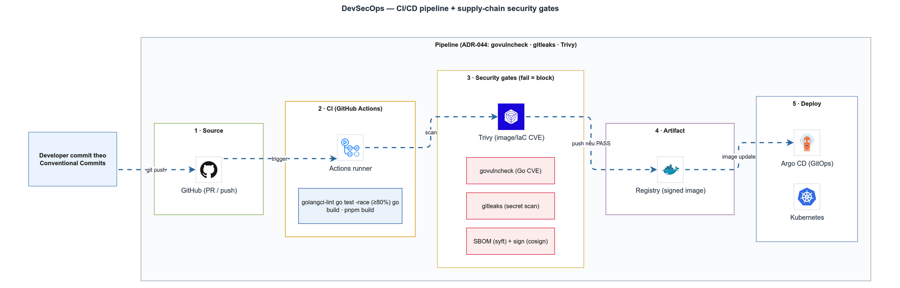

# CI/CD & Supply-chain Security
> Module DSO-1 · pipeline gates, SAST/secret/vuln/IaC scan, SBOM, signing · Độ khó: 🥉→🥇 · Prereqs: BE-1, DEPLOY-2

## 1. Vì sao kỹ năng này quan trọng trong LogMon

LogMon là nền tảng observability — nơi tập trung **log, metric, trace** của nhiều microservice. Một LogMon bị compromise đồng nghĩa kẻ tấn công đọc được toàn bộ telemetry nội bộ (và có thể cả secret lọt trong log). Vì thế bản thân pipeline build LogMon phải an toàn không kém runtime.

Ba sự thật khiến CI/CD security trở thành kỹ năng nền:

- **Pipeline là một bề mặt tấn công thật.** OWASP đã ra hẳn bộ *Top 10 CI/CD Security Risks* (CICD-SEC-1…10) vì kẻ tấn công chuyển hướng nhắm vào CI/CD như con đường ngắn nhất tới "crown jewels". Một action GitHub bị backdoor, một token quá quyền, một secret commit nhầm — đều dẫn thẳng tới supply-chain compromise.
- **Dependency là rủi ro lớn nhất của Go service.** Backend LogMon dùng `gin`, `pgx/v5`, `zerolog`, `prometheus/client_golang`… (xem `backend/go.mod`). Mỗi lần `go mod download` là kéo code của người khác vào binary. `govulncheck` phải chạy mọi PR để bắt CVE *thực sự reachable*.
- **CLAUDE.md đặt security là bắt buộc trước commit.** Mục Security (OWASP) yêu cầu KHÔNG hardcode secret, dùng parameterized query, TLS ≥1.2. Pipeline là nơi *ép* các quy tắc đó thay vì trông chờ con người nhớ.

doc_v2/15 (`doc_v2/15-devsecops-cicd.md`) là source-of-truth cho phần này, và đáng quý ở chỗ nó phân biệt rõ **✅ đã có / 📐 đã chốt chưa làm / ⬜ chưa quyết**. Bài học này bám đúng tinh thần đó.

## 2. Mô hình tư duy (first principles) — giải thích từ con số 0

**CI/CD là gì?** CI (Continuous Integration) = mỗi lần đẩy code, một máy sạch tự build + test lại từ đầu để bắt lỗi sớm. CD (Continuous Delivery/Deployment) = nếu CI xanh thì tự đóng gói (image) và đưa lên môi trường.

**Supply chain (chuỗi cung ứng phần mềm)** = tất cả những thứ *đi vào* artifact cuối cùng mà bạn không tự viết: thư viện (`go.mod`), base image Docker, GitHub Action bên thứ ba, công cụ build. Bạn tin tưởng (trust) tất cả chúng — nên mỗi mắt xích là một điểm có thể bị đầu độc.

Tư duy gốc gồm 4 nguyên tắc (đúng với §1 doc_v2/15):

1. **Shift-left** — kiểm tra càng sớm càng rẻ. Lỗi bắt ở pre-commit < ở PR < ở production. Mô hình LogMon nhắm tới 3 lớp: git hook (local) → CI (PR) → branch protection (merge). Hiện tại lớp CI (PR) đã đầy đủ; lớp git hook đã có commit nháp ở nhánh `chore/git-hooks` (chưa merge) và branch protection chưa cấu hình (📐/⬜ doc_v2/15 §10).
2. **Fail the build** — gate đã chốt là điều kiện *chặn* khi đã bật required status check, không phải cảnh báo bỏ qua. `go test -race` đỏ thì job CI đỏ.
3. **Mọi cấu hình trong git** — `ci.yml`, compose, rule Prometheus đều versioned + review qua PR.
4. **Defense-in-depth** — không tin một lớp duy nhất. Trên CI secret được quét toàn lịch sử (gitleaks `fetch-depth: 0`); lớp pre-commit (gitleaks `protect --staged`) là phần bổ trợ đang chờ merge nhánh hook.

Một mô hình hữu ích để xếp các loại scan:

| Câu hỏi | Loại kiểm tra | Công cụ LogMon |
|---------|---------------|----------------|
| Code của tôi có mẫu nguy hiểm không? | SAST | `gosec` (trong golangci-lint) |
| Tôi có lỡ commit secret không? | Secret scan | `gitleaks` |
| Thư viện tôi dùng có CVE không? | SCA / vuln scan | `govulncheck` |
| Base image / OS package có CVE không? | Image scan | Trivy (📐 ADR-044) |
| Image gồm những gì? | SBOM | Syft (📐 ADR-045) |
| Image này đúng là do tôi build? | Signing/provenance | cosign (📐 ADR-045) |

## 3. Khái niệm cốt lõi (tăng dần độ khó)

### 3.1. Pipeline gate & status check
Một "gate" là một job CI phải xanh. Khi cấu hình *branch protection* để các gate thành *required status checks*, GitHub không cho merge PR nếu một gate đỏ. Đây là cơ chế "fail the build" thực thi ở tầng repo.

### 3.2. Shift-left với git hooks
Hook là script chạy trước commit/push. Mô hình LogMon dùng `.githooks/` versioned (cài qua `git config core.hooksPath .githooks`, target `make hooks`): hook chỉ *mirror* gate rẻ để feedback nhanh; CI là backstop nếu hook bị `--no-verify`. *Lưu ý trạng thái:* phần này còn nằm ở nhánh `chore/git-hooks` chưa merge — trên working tree hiện tại chưa có `.githooks/` lẫn target `make hooks`, nên hook chưa thực sự chạy.

### 3.3. SAST (Static Application Security Testing)
Phân tích mã nguồn tĩnh để tìm mẫu lỗi: hardcoded credential, command injection, dùng `math/rand` cho token. `gosec` là SAST chuẩn cho Go, được nhúng *trong* golangci-lint.

### 3.4. SCA & reachability — vì sao `govulncheck` khác `go list -m`
SCA (Software Composition Analysis) đối chiếu dependency với DB lỗ hổng. Điểm đặc biệt của `govulncheck`: nó **không** chỉ so version — nó dựng *call graph* từ `main.main` và **chỉ báo CVE khi symbol bị ảnh hưởng thực sự reachable**. Dữ liệu lấy từ Go vuln DB (`vuln.go.dev`, định dạng OSV). Hệ quả: ít false-positive hơn `npm audit`, nhưng phải build được code.

### 3.5. Secret scanning — staged vs full history
`gitleaks protect --staged` quét thay đổi *sắp commit* (nhanh, cho pre-commit). `gitleaks detect` (action) quét *toàn lịch sử* (cần `fetch-depth: 0`) — bắt secret đã lỡ commit từ trước. Hai chế độ bù cho nhau.

### 3.6. Image scan, SBOM, signing
- **Image scan** (Trivy): quét base image + OS package + lib trong image, không chỉ source.
- **SBOM** (Software Bill of Materials): "hóa đơn vật tư" liệt kê mọi thành phần. Hai chuẩn: **SPDX** (thiên license) và **CycloneDX** (thiên security). Trivy/Syft sinh được cả hai.
- **Signing + provenance**: ký image bằng cosign (keyless = dùng OIDC, không quản key dài hạn) + attestation chứng minh "ai build, build từ commit nào". Khung tham chiếu là **SLSA** (Supply-chain Levels for Software Artifacts), level 0→3.

### 3.7. Hardening chính bản thân workflow
GitHub Actions là code chạy với quyền truy cập secret. Ba kỹ thuật cốt lõi: pin action theo **commit SHA** (immutable, chống backdoor), đặt `permissions` **least-privilege** (mặc định read-only), và dùng **OIDC** thay secret dài hạn khi deploy lên cloud.

## 4. LogMon dùng nó thế nào (bám code thật — path:line, ghi rõ implemented/planned)

**✅ Đã implement (đọc thấy trong repo):**

- **Workflow CI** — `.github/workflows/ci.yml`. Trigger `push: [main]` + mọi `pull_request` (`ci.yml:6-9`); `permissions: contents: read` ở top-level — least-privilege đúng khuyến nghị GitHub (`ci.yml:11-12`); `concurrency` hủy run cũ cùng ref (`ci.yml:14-16`).
- **Job `backend`** (`ci.yml:19-63`): `go build` → `go test -race -covermode=atomic -coverprofile` (`ci.yml:31-33`) → in coverage tổng (`ci.yml:36-38`) → `golangci-lint-action@v8` v2.12.2 (`ci.yml:39-42`) → bước `govulncheck` (`ci.yml:43-63`).
- **SAST gosec** — `backend/.golangci.yml:17` bật `gosec` (loại trừ `_test.go` tại `:24-26`). Tức ADR-046 (SAST = gosec + govulncheck) **đã có một phần ngay GĐ1** dù bảng §4 doc_v2/15 còn ghi SAST là ⬜; gate gosec chạy chung golangci-lint mọi PR.
- **govulncheck allowlist** — logic được **viết thẳng (inline) trong `ci.yml:43-63`** (chưa tách ra script): allowlist một CVE có chủ đích `GO-2026-5662` (Prometheus web UI, LogMon không serve UI nên không reachable) tại `ci.yml:47-52`; parse ID rồi fail nếu CVE chưa allowlist (`ci.yml:55-63`).
- **Job `secrets-scan`** — `gitleaks/gitleaks-action@v2` với `fetch-depth: 0` (toàn lịch sử), `ci.yml:134-143`. Config + allowlist FP tại `.gitleaks.toml` (csrf-test-secret, hằng Go, placeholder env — `.gitleaks.toml:13-21`).
- **Job `validate-configs`** — `promtool check config` + `check rules` từng file + `docker compose config -q` (`ci.yml:145-163`).
- **Job `build-images`** — `needs: [backend, frontend, demo-order, e2e]` (`ci.yml:168`); `packages: write` chỉ ở job này (`ci.yml:169-171`); login ghcr + push **chỉ khi `main`** (`ci.yml:178`, `:187`); tag `${sha}` + `latest`; cache `type=gha`.
- **Image tối giản** — `backend/Dockerfile`: multi-stage `golang:1.26-alpine` → `distroless/static-debian12:nonroot`, `CGO_ENABLED=0 -trimpath -ldflags="-s -w"`, `USER nonroot` (`backend/Dockerfile:3-18`).
- **Đối xứng CI ↔ local** — `make e2e` (`Makefile:92-98`) được gọi y hệt trong job `e2e` (`ci.yml:125`) để CI và vòng local không lệch.

**📐 Đã chốt nhưng CHƯA có trong repo (planned):**

- **Trivy image scan** + fail CRITICAL/HIGH, xuất SARIF lên GitHub Security — ADR-044, GĐ1 CI (`doc_v2/13-adr.md:338-344`). Hiện `ci.yml` chưa có step Trivy.
- **SBOM (Syft) + cosign keyless signing + SLSA provenance** — ADR-045, GĐ4/prod (`doc_v2/13-adr.md:346-350`). Chưa có trong repo.
- **Coverage gate cứng ≥80% domain/app** — comment trong `ci.yml:34-35` nói rõ "sẽ thêm bằng script"; hiện chỉ *in* coverage.
- **`pnpm audit`, integration test trên CI, e2e nightly, frontend image, pin base image theo digest, hadolint, Renovate** — liệt kê ở §2/§4/§6/§9 doc_v2/15, tất cả 📐/⬜.
- **Git hooks 2 tầng + tách `scripts/govulncheck.sh`** — đã có commit nháp trên nhánh `chore/git-hooks` (`.githooks/pre-commit`, `.githooks/pre-push`, `make hooks`, `make vuln`, refactor CI gọi script) nhưng **chưa merge** vào nhánh làm việc hiện tại. Trên working tree hiện tại: KHÔNG có `.githooks/`, KHÔNG có `scripts/`, govulncheck vẫn inline trong `ci.yml`. (Lưu ý: `git config core.hooksPath` đang trỏ `.githooks` nhưng thư mục đó chưa tồn tại — hook không thực sự chạy cho tới khi nhánh được merge + `make hooks`.)
- **Required status checks (branch protection)** — cài ở GitHub settings, KHÔNG nằm trong repo; doc_v2/15 §10 đánh dấu ⬜ chưa quyết/cấu hình. Nói "gate X chặn merge" chỉ đúng *sau khi* bật required checks.

**Lệch cần lưu ý:** demo-order dùng `alpine:3.22` + addgroup user thường (`examples/demo-order/Dockerfile`), KHÔNG distroless như backend — Trivy (khi bật) sẽ quét nhiều OS package hơn ở image này.

## 5. Best practices (mỗi mục kèm 1 nguồn đã research)

1. **Pin action theo full-length commit SHA**, không phải tag. Tag có thể bị di chuyển → backdoor; SHA là immutable, kẻ tấn công phải tạo SHA-1 collision. LogMon hiện pin theo tag (`actions/checkout@v4`…) — nâng lên SHA là việc đáng làm. *(GitHub Docs — Secure use reference)*
2. **GITHUB_TOKEN least-privilege, default read-only.** LogMon đã làm đúng: top-level `contents: read`, chỉ job `build-images` mới `packages: write`. *(GitHub Docs — Secure use reference)*
3. **Dùng OIDC thay secret dài hạn khi deploy lên cloud.** Khi LogMon thêm deploy staging/prod (📐), ưu tiên OIDC + cosign keyless thay vì nhét SSH key/registry password vào GitHub Secrets. *(GitHub Docs — Secure use; Aqua — Trivy + Cosign)*
4. **Chạy SCA reachability-aware mọi PR.** `govulncheck` chỉ báo CVE *thực sự reachable* qua call graph từ `main.main`, giảm nhiễu so với so-version đơn thuần. *(go.dev — Go Vulnerability Management)*
5. **Quét image trong CI và fail ở CRITICAL/HIGH (có bản vá).** Trivy một step ra được vuln + misconfig + secret + SBOM, xuất SARIF lên GitHub Code Scanning. *(Aqua Security — Securing GitHub Actions with Trivy and Cosign)*
6. **Sinh SBOM (CycloneDX cho security) + ký image keyless.** SBOM giúp trả lời "image có chứa lib X dính CVE mới không" sau khi đã ship; cosign keyless bỏ gánh nặng quản key. *(youngju.dev — Container Image Security: Trivy, Cosign, SBOM)*
7. **Đối chiếu pipeline với OWASP Top 10 CI/CD Risks**, đặc biệt CICD-SEC-1 (flow control: branch protection) và CICD-SEC-2 (IAM: token quyền). *(OWASP — Top 10 CI/CD Security Risks)*

## 6. Lỗi thường gặp & anti-patterns

- **Để scan là warning thay vì gate.** Nếu Trivy/govulncheck không `fail`, nó thành noise và ai cũng bỏ qua. doc_v2/15 §1 nhấn mạnh "fail the build".
- **Allowlist CVE bừa.** Bước govulncheck trong `ci.yml` allowlist *một* CVE kèm lý do reachability rõ ràng (`ci.yml:47-52`). Anti-pattern là allowlist cả loạt cho "qua CI" — biến gate thành vô dụng.
- **Pin action theo tag rồi quên.** `@v4` có thể trỏ commit mới bị đầu độc. Pin SHA + Renovate/`minimumReleaseAge` 7-14 ngày để né cửa sổ tấn công.
- **`permissions: write-all` hoặc bỏ trống.** Token mặc định quá quyền là CICD-SEC-2 kinh điển. LogMon tránh được nhờ khai báo least-privilege.
- **Commit secret rồi xóa ở commit sau.** Secret vẫn nằm trong history → vì sao job gitleaks dùng `fetch-depth: 0`. Xóa file không đủ; phải rotate secret.
- **Coverage "in cho có".** `ci.yml` hiện chỉ in coverage; rủi ro là tưởng đã có gate 80%. Phải đọc kỹ trạng thái 📐.
- **Image không pin digest.** Tag `golang:1.26-alpine` có thể đổi nội dung; build "reproducible" thật cần pin `@sha256:…`.
- **`go test` không `-race`.** Bỏ `-race` giấu data race tới production. LogMon luôn bật (`ci.yml:33`, `Makefile:83`).

## 7. Lộ trình luyện tập NGAY trong repo LogMon (🥉 cơ bản → 🥈 trung cấp → 🥇 nâng cao)

### 🥉 Cơ bản — làm quen pipeline đang có
1. Cố tình để một file Go chưa `gofmt` → chạy `make lint` (hoặc `golangci-lint run`) thấy nó báo; sửa bằng `make fmt`. *(Khi nhánh `chore/git-hooks` được merge: thêm `make hooks` rồi commit thử để thấy `pre-commit` chặn ngay.)*
2. Đọc bước `govulncheck` trong `ci.yml:43-63` và giải thích vì sao `GO-2026-5662` được allowlist (reachability — Prometheus web UI, LogMon không serve UI). Chạy thử `cd backend && go run golang.org/x/vuln/cmd/govulncheck@latest ./...` để xem output thật.
3. Thêm một dòng giả secret (ví dụ `AWS_SECRET_ACCESS_KEY=AKIA...`) vào file test rồi `git add` → chạy `gitleaks protect --staged` thấy nó chặn; xóa đi.
4. Chạy `docker compose -f infra/docker/docker-compose.yml config -q` và sửa một lỗi cú pháp cố ý để thấy job `validate-configs` bắt được.
5. Đọc `ci.yml`, liệt kê các job và đối chiếu với bảng §2 doc_v2/15 xem job nào *dự kiến* là required để merge (lưu ý: required status checks chưa cấu hình — ⬜ doc_v2/15 §10).

### 🥈 Trung cấp — đóng các 📐 gần tầm tay
1. Viết `scripts/coverage-gate.sh`: chạy `go tool cover -func=coverage.out`, lọc package `internal/.../domain` + `.../app`, fail nếu < 80%; nối vào job `backend` (đóng G9 doc_v2/15).
2. Thêm bước `pnpm audit --audit-level=high` vào job `frontend` của `ci.yml` (📐 §4 doc_v2/15) và xử lý finding.
3. Pin tất cả action trong `ci.yml` từ tag sang full commit SHA (kèm comment `# v4` để đọc được).
4. Thêm job `integration` chạy `make test-integration` với service Postgres trong CI (`make test-integration` đã có ở `Makefile:88-90`).
5. Thêm `hadolint` quét `backend/Dockerfile` + `examples/demo-order/Dockerfile` như một job mới.

### 🥇 Nâng cao — supply-chain đầy đủ (theo ADR-044/045)
1. Thêm job `image-scan`: build image rồi `aquasecurity/trivy-action` quét, `exit-code: 1` ở CRITICAL/HIGH, upload SARIF lên GitHub Security (đóng ADR-044/G1).
2. Pin base image trong cả hai Dockerfile theo `@sha256:` digest; ghi ADR nhỏ ghi nhận quyết định (G10).
3. Sinh SBOM CycloneDX bằng Syft (hoặc `trivy image --format cyclonedx`) cho image backend, upload làm artifact của job `build-images` (ADR-045/G2).
4. Ký image bằng `cosign sign` **keyless** (OIDC GitHub) ở bước push ghcr; thêm bước `cosign verify` mẫu (ADR-045/G3).
5. Thêm `renovate.json` (📐 §9 doc_v2/15) với `minimumReleaseAge: "7 days"` để vừa cập nhật dependency vừa né cửa sổ tấn công supply-chain.

## 8. Skill/agent ECC nên dùng khi luyện

- **`ecc:security-reviewer`** — chạy khi bạn vừa sửa `ci.yml`, Dockerfile, hook, hoặc code đụng auth/secret. Nó soi OWASP-style (token quyền, secret, injection) trước khi commit; đúng tinh thần "STOP and use security-reviewer" trong CLAUDE.md.
- **`ecc:security-scan`** — quét bề mặt agent/hook/MCP/permission/secret của chính repo + cấu hình ECC; dùng định kỳ hoặc sau khi thêm hook/MCP mới.
- **`ecc:github-ops`** — khi thao tác trên GitHub Actions/PR/branch protection: cấu hình required status checks, debug workflow, hoặc tạo job mới (image-scan, integration).
- **`/cso`** (skill dự án) — checklist bảo mật định kỳ hàng quý: lái `ecc:security-reviewer` + tổng hợp gates (govulncheck/gitleaks/Trivy theo ADR-044) đối chiếu OWASP `doc_v2/09`. Dùng khi review toàn cảnh security GĐ.
- **`ecc:go-review`** — review riêng code Go (concurrency, error handling) trước khi tin vào gate `golangci-lint`/`gosec`.

## 9. Tài nguyên học thêm (link đã research, có chú thích 1 dòng)

- [GitHub Docs — Secure use reference](https://docs.github.com/en/actions/reference/security/secure-use) — chuẩn chính thức: pin SHA, least-privilege GITHUB_TOKEN, OIDC.
- [Go — Vulnerability Management](https://go.dev/doc/security/vuln/) + [tutorial govulncheck](https://go.dev/doc/tutorial/govulncheck) — cách reachability analysis và OSV DB hoạt động.
- [Aqua Security — Securing GitHub Actions with Trivy and Cosign](https://www.aquasec.com/blog/trivy-github-actions-security-cicd-pipeline/) — pipeline mẫu: scan SARIF + ký image.
- [youngju.dev — Container Image Security: Trivy, Cosign, SBOM, Sigstore (2025)](https://www.youngju.dev/blog/devops/2026-03-13-container-image-security-trivy-cosign-sbom-supply-chain.en) — hướng dẫn thực hành SBOM CycloneDX vs SPDX, keyless signing.
- [OWASP — Top 10 CI/CD Security Risks](https://owasp.org/www-project-top-10-ci-cd-security-risks/) — khung phân loại rủi ro pipeline (CICD-SEC-1…10).
- [SLSA Framework (slsa.dev)](https://slsa.dev/) — khung level 0→3 cho provenance/attestation, đích đến của ADR-045.

## 10. Checklist "đã hiểu" (self-assessment)

- [ ] Phân biệt được SAST / SCA / image-scan / SBOM / signing và chỉ ra công cụ tương ứng trong LogMon.
- [ ] Giải thích được vì sao `govulncheck` ít false-positive hơn so-version nhờ reachability analysis.
- [ ] Chỉ đúng trong `ci.yml` đâu là least-privilege permission và đâu là nơi nâng quyền (`packages: write`).
- [ ] Nói được vì sao secret scan cần `fetch-depth: 0` và khác gì với `gitleaks protect --staged` ở pre-commit.
- [ ] Đọc một dòng trong doc_v2/15 và biết nó là ✅ / 📐 / ⬜ (ví dụ: Trivy là 📐 dù ADR-044 đã Accepted).
- [ ] Biết gosec đã chạy ngay GĐ1 (trong golangci-lint) còn Trivy/SBOM/cosign thì chưa.
- [ ] Mô tả được vì sao pin action theo SHA an toàn hơn theo tag.
- [ ] Liệt kê được 3 gate CI đang chạy mọi PR (backend test/lint/vuln, gitleaks, validate-configs) và 3 gate còn 📐 cần thêm — đồng thời biết required status checks chưa được cấu hình ở GitHub (⬜).
