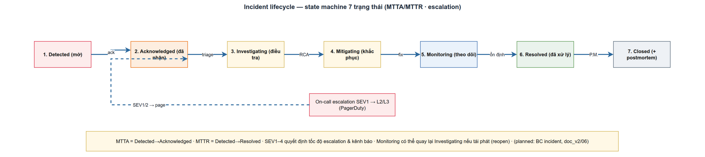

# Incident Management trong LogMon
> Module INC-1 · vòng đời incident, severity, MTTA/MTTR, on-call & escalation · Độ khó: 🥇 (nâng cao) · Prereqs: ARCH-2, OBS-1

> **Trạng thái triển khai (đọc trước):** Toàn bộ Incident BC (`internal/incident/`) **CHƯA có code** — đây là **GĐ3** trong roadmap (`doc_v2/12-roadmap.md:79-81`). Hôm nay repo mới có `internal/alerting/` (phát hiện) với `AlertInstance` biết `Acknowledge()`/`Resolve()`. Bài này dạy *đích cần đạt* và *LogMon sẽ hiện thực ra sao*, bám `doc_v2/06-incident-notification.md`. Mọi đoạn "đã có code" sẽ chỉ rõ file; còn lại là **PLANNED**.

## 1. Vì sao kỹ năng này quan trọng trong LogMon

LogMon là nền tảng observability — nhưng *quan sát* chỉ có giá trị nếu nó dẫn tới *hành động có kỷ luật khi hệ thống hỏng*. Alerting BC đã biết phát hiện và gửi alert; SLO BC biết khi error budget cạn. Nhưng một alert firing chỉ là tín hiệu — nó không trả lời: *Ai chịu trách nhiệm? Nghiêm trọng tới đâu? Bao lâu chưa ai đụng? Lần trước sự cố y hệt ta học được gì?* Incident BC biến tín hiệu thành **một vòng đời có người chịu trách nhiệm, có đồng hồ đo, và có vòng học hỏi**.

Incident BC là *bản lề* (`doc_v2/06`:3): nối alerting (phát hiện) với vận hành (xử lý) và postmortem (học hỏi). Đây cũng là **điều kiện tiên quyết của GĐ5** — AI incident automation (`doc_v2/17:5`) không có nơi ghi RCA, không có "đồng hồ" MTTR để chứng minh cải thiện, không có postmortem để học, nếu Incident BC chưa tồn tại. Nắm chắc module này = đọc được tại sao state machine có đúng 7 trạng thái, viết được BC mới đúng khuôn DDD+CQRS, và đo "ta có giỏi lên không" bằng số liệu thật.

## 2. Mô hình tư duy (first principles) — giải thích từ con số 0

Quên công cụ đi. Một *incident* trả lời một câu hỏi gốc: **"Hệ thống đang không đạt kỳ vọng, vậy ai làm gì, theo trình tự nào, và ta đo nó thế nào?"**

Từ số 0, một sự cố luôn đi qua các *pha* theo trục thời gian:

```
lỗi bắt đầu ─► DETECT ─► ACKNOWLEDGE ─► TRIAGE ─► DIAGNOSE ─► MITIGATE ─► RESOLVE ─► postmortem
              └MTTD─┘   └───MTTA────┘   └──────── (nằm trong MTTR) ────────┘
```

Ba ý nền tảng:

1. **Incident là một *quá trình có trạng thái*, không phải một bản ghi tĩnh.** Nó *bắt đầu* (open), *được phân loại* (triage), *có người* (assigned), *đang xử lý* (mitigating), *xong* (resolved), *được học* (postmortem → closed). Mỗi lần đổi trạng thái là một sự kiện nghiệp vụ đáng ghi lại — đây chính là lý do dùng *state machine* + *event sourcing nhẹ* (`incident_timeline`).

2. **Đo thời gian giữa các pha mới có giá trị, không phải một con số gộp.** Google SRE nói thẳng: các thống kê kiểu MTTR/MTTM "poorly suited for decision making or trend analysis" khi dùng như một con số gộp. Bạn phải đo *đúng granularity*: MTTA (detect→ack) đo sức khỏe paging/on-call; MTTR (detect→resolve) đo cả vòng. Bằng chứng 2025-2026 (`doc_v2/17:44`): **>50% thời gian sự cố nằm ở TRIAGE + DIAGNOSE** — nếu chỉ nhìn MTTR gộp, bạn không biết phải sửa pha nào.

3. **Severity = mức khẩn cấp = ai bị đánh thức.** Severity không phải nhãn trang trí; nó *ánh xạ trực tiếp* sang escalation và kênh thông báo (PagerDuty: "your severity levels should be directly mapped to your escalation and communication policies"). SEV1 → page người + đánh thức; SEV4 → best-effort.

Nguyên lý chốt: *một incident là một aggregate* (theo nghĩa DDD — xem ARCH-2). Mọi chuyển trạng thái đi qua *aggregate root*, mọi invariant ("không thể resolve khi chưa assigned") được bảo vệ ở đó, và mỗi chuyển trạng thái emit một domain event để các BC khác (notification, SLO, AI) phản ứng — **không cross-BC import** (`CLAUDE.md`).

## 3. Khái niệm cốt lõi (tăng dần độ khó)

### 3.1 State machine 7 trạng thái

LogMon định nghĩa đúng 7 trạng thái (`doc_v2/06:11-23`): `Open → Triaged → Assigned → Mitigating → Resolved → PostmortemPending → Closed`. Một state machine tốt có hai luật: (a) chỉ chuyển theo cạnh hợp lệ; (b) mỗi chuyển ghi timeline + emit event. Tự-loop `Mitigating → Assigned` chính là **re-assign khi escalation** — không phải lỗi mô hình mà là tình huống thật.

### 3.2 Severity SEV1-SEV4 — mức khẩn cấp, không phải mức "to nhỏ"

| Severity | Định nghĩa (LogMon) | Response target | Status update |
|----------|---------------------|-----------------|----------------|
| SEV1 | Mất dịch vụ user-facing | < 15 phút | mỗi 15 phút |
| SEV2 | Suy giảm nghiêm trọng / budget exhausted | < 1 giờ | mỗi 1 giờ |
| SEV3 | Suy giảm nhỏ, có workaround | < 4 giờ | khi có tiến triển |
| SEV4 | Không ảnh hưởng user | best effort | — |

(`doc_v2/06:29-34`). Quy tắc vàng từ PagerDuty: **khi phân vân giữa hai mức, chọn mức cao hơn** — "during an incident is not the time to litigate severities", hạ cấp lúc postmortem.

> Lưu ý phân biệt với alerting đã-có-code: `internal/alerting/domain/severity.go` dùng thang `critical|warning|info` (= *hành động* của một **alert**, ADR-024). SEV1-4 là *severity của một **incident*** — khái niệm khác, sống ở Incident BC. Một incident SEV1 có thể gom nhiều alert `critical`.

### 3.3 MTTA / MTTR — đo từ chính dữ liệu LogMon

MTTA = `created → assigned` (đúng hơn: tới khi *bắt đầu xử lý*); MTTR = `created → resolved` (`doc_v2/06:38-43`). Cả hai phát ra Prometheus **histogram** (để có p50/p90/p99, không chỉ mean):

| Metric | Loại | Tên |
|--------|------|-----|
| MTTA | histogram | `logmon_incident_mtta_seconds` |
| MTTR | histogram | `logmon_incident_mttr_seconds` |
| Incident count | counter | `logmon_incidents_total{severity,service}` |
| Open incidents | gauge | `logmon_incidents_open{severity}` |

Quy ước LogMon (`doc_v2/17:35`): chữ "R" trong MTTR = **Resolve** (detect→service restored), tách riêng MTTM (mitigate). *Mọi so sánh phải cùng định nghĩa "R" và cùng mốc* — nếu không bạn đang so táo với lê.

### 3.4 On-call rotation & escalation — "ai đang trực" là pure function

Rotation: weekly/daily, timezone-aware, primary + secondary (`doc_v2/06:47`). Insight thiết kế quan trọng (`doc_v2/06:50`): **"ai đang on-call" = pure function từ schedule config + thời điểm** — *test được, không cần DB state*. Escalation policy theo bậc thời gian: `primary (15m) → secondary (30m) → team_lead (1h)`; mỗi bậc không ack trong timeout thì notify bậc kế. (Nếu dùng PagerDuty làm kênh chính, PagerDuty tự quản escalation; LogMon chỉ cần `dedup_key` = incident id.)

### 3.5 Postmortem (blameless) + action items

Bắt buộc cho SEV1/SEV2 (`doc_v2/06:54`). Blameless = tập trung *mistake was made how*, không phải *who* (PagerDuty culture doc). Giá trị dữ liệu thật của LogMon: impact đo bằng số liệu *từ chính nền tảng* (thời lượng, error count, budget tiêu thụ). **Action items** (assignee + due date + trạng thái) là nguồn dữ liệu để chứng minh "fewer repeat incidents" — và là corpus seed cho RAG GĐ5.

## 4. LogMon dùng/sẽ dùng nó thế nào (implemented vs planned)



**Đã có code (alerting BC — nền móng):** `internal/alerting/domain/instance.go` có một state machine *mini* cho alert instance: `firing → acknowledged → resolved`, bất biến (mọi chuyển trả bản sao mới), invariant được bảo vệ (`Acknowledge()` chỉ chạy khi đang `firing`). Đây là *khuôn mẫu* Incident aggregate sẽ phóng to:

```go
// internal/alerting/domain/instance.go — pattern Incident BC sẽ tái dùng
func (i AlertInstance) Acknowledge(by string, at time.Time) (AlertInstance, error) {
    if i.status != InstanceFiring {
        return AlertInstance{}, ErrInstanceNotAcknowledgeable // guard invariant
    }
    c := i                       // copy → bất biến
    c.status = InstanceAcknowledged
    c.acknowledgedAt, c.acknowledgedBy = at, by
    return c, nil
}
```

Command `acknowledge.go` + handler `instance_handler.go` (đã có, GĐ2.4) là mẫu cho `AcknowledgeIncident` sau này.

**PLANNED (Incident BC — GĐ3, `internal/incident/`, Clean Arch + DDD + CQRS theo `CLAUDE.md`):**

- `domain/incident.go` — aggregate `Incident` với 7-state machine; method `Triage(sev)`, `Assign(engineerID)`, `StartMitigating()`, `Resolve()`, `RequestPostmortem()`, `Close()`. Mỗi method: guard cạnh hợp lệ → trả bản sao mới + domain event.
- `domain/timeline.go` — append-only `incident_timeline` (event sourcing nhẹ cho audit, `doc_v2/06:25`).
- Auto-create (`doc_v2/12:79`, DoD `doc_v2/12:88`): `AlertFired (critical >5m)` **hoặc** `BudgetExhausted` → tạo Incident `Open`. Đây là **cross-BC event**, không import — alerting/slo emit, incident subscribe qua outbox (`internal/shared/outbox/` đã có).
- `app/command/` (write side): các use case chuyển trạng thái; `app/query/` (read side): incident board, timeline, MTTA/MTTR đã tính.
- Khi `Assign`/`Resolve` → ghi histogram `logmon_incident_mtta_seconds` / `_mttr_seconds` (dùng `internal/shared/metrics/`).
- On-call/escalation: `domain/oncall/schedule.go` với `WhoIsOnCall(at time.Time) Engineer` là *pure function*.

**Definition of Done của GĐ3** (`doc_v2/12:88`): "Critical alert > 5m → incident tự tạo + on-call nhận PagerDuty; resolve → incident đóng + MTTR ghi nhận". Đó là bài kiểm tra end-to-end để biết module này *xong*.

## 5. Best practices (mỗi mục kèm nguồn đã research)

- **Đo theo pha, đừng tôn thờ một con số MTTR gộp.** Break down MTTA vs MTTR (và xa hơn MTTD/MTTM) để biết bottleneck ở đâu — Google SRE coi MTTR gộp là "poorly suited for decision making". → [Google SRE — Incident metrics](https://sre.google/resources/practices-and-processes/incident-metrics-in-sre/)
- **Ánh xạ severity → escalation + kênh thông báo, và khi phân vân chọn mức cao hơn.** → [PagerDuty — Severity Levels](https://response.pagerduty.com/before/severity_levels/)
- **Dùng vai trò chuẩn (IC/CL/OL) cho SEV1/SEV2** theo IMAG (3Cs: coordinate, communicate, control) thay vì để một người ôm hết. → [Google SRE — Incident management guide](https://sre.google/resources/practices-and-processes/incident-management-guide/)
- **Postmortem blameless cho mọi SEV1/SEV2, kể cả false alarm hay tự hồi phục** — tập trung *how*, không phải *who*. → [PagerDuty — Blameless postmortem](https://postmortems.pagerduty.com/culture/blameless/)
- **Escalation tự động theo timeout-không-ack**, mỗi bậc một timeout rõ ràng. → [PagerDuty — Escalation policy basics](https://support.pagerduty.com/main/docs/escalation-policies)
- **Đo "error budget saved" chứ không chỉ MTTR thô** — một SEV1 mitigate nhanh đáng giá hơn một blip lưu lượng thấp (`doc_v2/17:66`). → [incident.io — Best practices 2026](https://incident.io/blog/incident-management-best-practices-2026)

## 6. Lỗi thường gặp & anti-patterns

- **Coi MTTR là một con số thần thánh.** Không nói rõ chữ "R" (Recover? Repair? Resolve?) và mốc bắt đầu/kết thúc → so sánh vô nghĩa (`doc_v2/17:32`). LogMon chốt "R" = Resolve.
- **Severity của incident lẫn với severity của alert.** SEV1-4 (incident) ≠ `critical/warning/info` (alert, `severity.go`). Đừng nhồi chung enum.
- **State machine "tự do".** Cho phép `Open → Resolved → Mitigating` lung tung mà không guard → mất audit, MTTR sai. Mọi cạnh phải được aggregate root kiểm.
- **Tính "ai on-call" bằng truy vấn DB stateful** thay vì pure function từ schedule → khó test, dễ lệch timezone (`doc_v2/06:50`).
- **Auto-create incident bằng cross-BC import.** `incident` import `alerting` → vi phạm layer direction (`CLAUDE.md`). Phải qua domain event + outbox.
- **Postmortem đổ lỗi cá nhân** → kỹ sư giấu thông tin, mất giá trị học hỏi (PagerDuty blameless).
- **Alert storm = N incident.** Thiếu correlation/dedup → một sự cố sinh 50 incident, MTTx phình giả (`doc_v2/17:93`). Gom theo fingerprint/service trước khi tạo incident.
- **Mọi thứ là SEV1.** Lạm phát severity → escalation kiệt sức, page bị bỏ qua. Cần định nghĩa rạch ròi.

## 7. Lộ trình luyện tập (🥉→🥈→🥇)

Vì module phần lớn là PLANNED, các task là **thiết kế/POC trong repo LogMon** — vẫn phải cụ thể, có file, có test.

**🥉 Cơ bản — đọc & mô hình hóa**
1. Đọc `doc_v2/06-incident-notification.md` §1 + sơ đồ `../diagrams/incident-state-machine.png`. Vẽ lại bảng *transition* 7 trạng thái: liệt kê mọi cạnh hợp lệ + event phát ra + điều kiện kích hoạt.
2. Viết bảng ánh xạ `SEV1-4 → escalation bậc → kênh notification`, bám §1.2 + §1.4.
3. Trong repo, đọc `internal/alerting/domain/instance.go` + `app/command/acknowledge.go`; viết 1 trang note "Incident aggregate sẽ khác gì AlertInstance".

**🥈 Trung cấp — POC domain layer (TDD, theo `golang/testing.md`)**
1. Tạo nhánh `feat/incident-poc`. Viết `internal/incident/domain/incident_test.go` *trước* (RED): table-driven test cho mọi chuyển trạng thái hợp lệ + mọi chuyển *bất hợp lệ* phải trả lỗi (`ErrInvalidTransition`).
2. Implement `incident.go` cho test xanh (GREEN): aggregate bất biến, guard từng cạnh, mỗi method trả `(Incident, []DomainEvent, error)`.
3. Viết `oncall/schedule_test.go`: `WhoIsOnCall(at)` là pure function — test nhiều mốc thời gian + timezone, không DB.
4. Chạy `go test -race -cover ./internal/incident/...`, đạt ≥80%.

**🥇 Nâng cao — vòng end-to-end (thiết kế + POC tích hợp)**
1. Thiết kế subscriber: `AlertFired(critical, >5m) → CreateIncident` qua outbox (`internal/shared/outbox/`), *không* cross-BC import. Viết ADR ngắn trong `doc_v2/13-adr.md` cho lựa chọn này.
2. POC metrics: khi `Assign`/`Resolve`, observe `logmon_incident_mtta_seconds`/`_mttr_seconds`; viết test xác nhận histogram được ghi.
3. Thiết kế escalation worker: goroutine có stop/done channel (theo `CLAUDE.md` concurrency rules), bậc timeout đẩy notification.
4. Viết acceptance test cho DoD GĐ3 (`doc_v2/12:88`): alert critical >5m → incident auto-create → resolve → MTTR ghi nhận. Dùng `ecc:production-audit` rà lỗ hổng vận hành trước khi coi là xong.

## 8. Skill/agent ECC nên dùng

- **`ecc:architect`** — thiết kế ranh giới Incident BC, mô hình state machine, ánh xạ event cross-BC (alerting/slo → incident → notification) mà không phá layer direction. Dùng khi bắt đầu §7 🥇.
- **`ecc:code-architect`** (qua `ecc:feature-dev` / `ecc:plan`) — chẻ Incident BC thành command/query/domain/ports/adapters, lên task list TDD cho POC 🥈.
- **`ecc:production-audit`** — rà sẵn sàng vận hành: escalation có stop signal chưa, MTTR đo đúng mốc chưa, postmortem có action-item tracking chưa, alert-storm có dedup chưa. Chạy ở cuối 🥇.
- Bổ trợ: **`ecc:go-review`** + **`ecc:go-test`** cho code Go theo chuẩn dự án; **`ecc:database-migrations`** cho schema `incidents`/`incident_timeline`/`oncall_schedules`.

## 9. Tài nguyên học thêm

- [Google SRE — Incident metrics in SRE](https://sre.google/resources/practices-and-processes/incident-metrics-in-sre/) — vì sao MTTR gộp gây hiểu lầm, đo theo pha.
- [Google SRE — Incident management guide (IMAG)](https://sre.google/resources/practices-and-processes/incident-management-guide/) — vai trò IC/CL/OL, 3Cs.
- [PagerDuty — Severity Levels](https://response.pagerduty.com/before/severity_levels/) — định nghĩa SEV1-5 + quy tắc "phân vân chọn mức cao".
- [PagerDuty — Escalation Policy Basics](https://support.pagerduty.com/main/docs/escalation-policies) — escalation theo timeout-không-ack.
- [PagerDuty — The Blameless Postmortem](https://postmortems.pagerduty.com/culture/blameless/) — văn hóa hậu sự cố.
- [incident.io — Incident management best practices 2026](https://incident.io/blog/incident-management-best-practices-2026) — checklist hiện đại, đo cái đúng.
- Tài liệu nội bộ: `doc_v2/06-incident-notification.md` (đặc tả Incident BC), `doc_v2/17-ai-incident-automation.md` §1 (MTTR/MTTA chính xác), `doc_v2/12-roadmap.md` GĐ3.

## 10. Checklist "đã hiểu"

- [ ] Vẽ lại được state machine 7 trạng thái + mọi cạnh hợp lệ + event phát ra ở mỗi cạnh.
- [ ] Phân biệt được SEV1-4 (severity của *incident*) với `critical/warning/info` (severity của *alert*, `severity.go`).
- [ ] Nói rõ được định nghĩa "R" trong MTTR của LogMon (= Resolve) và vì sao MTTR gộp dễ gây hiểu lầm.
- [ ] Giải thích được vì sao "ai đang on-call" nên là *pure function*, không stateful DB.
- [ ] Mô tả được luồng auto-create incident từ `AlertFired`/`BudgetExhausted` qua outbox *mà không* cross-BC import.
- [ ] Biết escalation bậc-thời-gian (`primary 15m → secondary 30m → team_lead 1h`) và quy tắc "phân vân chọn severity cao hơn".
- [ ] Hiểu postmortem blameless + vì sao action items là dữ liệu thật chống lặp sự cố (và seed RAG GĐ5).
- [ ] Phân biệt được phần *đã có code* (`AlertInstance` state machine, ack/resolve) với phần *PLANNED* (toàn bộ `internal/incident/`).
