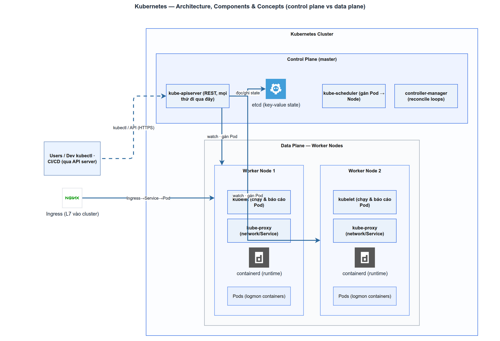

# Kubernetes: Architecture, Components & Concepts
> Module K8S-1 · control plane vs nodes, Pod/Deployment/Service/Ingress, các concept lõi · Độ khó: 🥉→🥇 · Prereqs: DEPLOY-2

## 1. Vì sao kỹ năng này quan trọng trong LogMon

Hôm nay LogMon chạy bằng Docker Compose (`infra/docker/docker-compose.yml`) — một file mô tả 17 service trên **một máy**. Đó là lựa chọn cố ý: `doc_v2/10-deployment-operations.md:3` nói rõ "một VPS đơn thì ở lại Compose". Nhưng cùng tài liệu (mục 7) và `doc_v2/16-iac-runbooks.md:80` đã **chốt sẵn đường lên Kubernetes** cho GĐ4, khi cần HA thật: nhiều node, rolling deploy tự động, autoscaling.

Hiểu kiến trúc K8S là điều kiện để đọc được cái mapping đó: vì sao Prometheus+Alertmanager+Grafana → `kube-prometheus-stack`, Elasticsearch → ECK operator, OTel Agent → **DaemonSet**, OTel Gateway → **Deployment + HPA**, LogMon API/Frontend → **Deployment + Ingress** (`doc_v2/16-iac-runbooks.md:84-90`). Quan trọng hơn: nhiều thứ trong code hiện tại **đã được chuẩn bị** cho K8S — endpoint `/healthz` (`backend/cmd/userservice/main.go:360`) sẽ thành probe, image distroless nonroot (`backend/Dockerfile:13,17`) hợp securityContext, `ports.RuleSyncer` swap được sang `PrometheusRule` CR (`doc_v2/13-adr.md:172`). Học K8S = học cách những mảnh ghép sẵn có lắp vào một cluster thật.

## 2. Mô hình tư duy (first principles) — giải thích từ con số 0

Hãy quên cú pháp YAML đi. Kubernetes chỉ là **một vòng lặp điều chỉnh trạng thái** (reconciliation loop) chạy quanh một cơ sở dữ liệu.

Bạn không ra lệnh "hãy chạy container này". Bạn **khai báo trạng thái mong muốn** ("tôi muốn 3 bản sao của userservice luôn chạy") và lưu nó vào DB của cluster. Sau đó một đám tiến trình gọi là **controller** liên tục so sánh *thực tế* với *mong muốn*, rồi hành động để kéo thực tế về đúng mong muốn. Có pod chết? Controller thấy "thực tế 2, mong muốn 3" và tạo pod mới. Đây là khác biệt nền tảng so với Compose: `docker compose up` là **mệnh lệnh một lần**; K8S là **vòng lặp tự chữa lành vô hạn**.

Đối chiếu trực tiếp với LogMon: trong compose, `restart: unless-stopped` (`docker-compose.yml:55`) cho userservice chỉ khởi động lại container khi nó *chết trên cùng một máy*. Nếu cả máy sập, hết. K8S thì lập lịch lại pod sang node khác — vì "mong muốn 3 replica" là một sự thật được lưu lại, không phụ thuộc máy nào còn sống.

Hệ quả của mô hình này:
- **Mọi thứ là một object trong DB** (`etcd`). Pod, Service, Deployment... đều là bản ghi.
- **API server là cửa duy nhất** để đọc/ghi DB đó. Bạn, controller, kubelet — tất cả nói chuyện qua nó.
- **Controller làm việc bất đồng bộ.** `kubectl apply` trả về ngay ("đã ghi mong muốn"); việc hội tụ diễn ra sau. Đây là lý do debug K8S = đọc trạng thái *hiện tại* (`kubectl get`, `describe`) so với *mong muốn*.

## 3. Khái niệm cốt lõi (tăng dần độ khó)

### 3.1 Cluster = control plane + nodes

Một cluster gồm **control plane** (bộ não — ra quyết định toàn cục) và một tập **node** (máy worker — chạy workload). Production chạy control plane trên nhiều máy để chịu lỗi (`kubernetes.io/docs/concepts/architecture`).

**Control plane components:**

| Component | Vai trò (một câu) |
|-----------|-------------------|
| **kube-apiserver** | Cửa trước của cluster: expose Kubernetes HTTP API, mọi đọc/ghi đi qua đây. |
| **etcd** | Key-value store nhất quán, HA — lưu *toàn bộ* state của cluster. |
| **kube-scheduler** | Thấy Pod chưa có node → chọn node phù hợp (theo request tài nguyên, ràng buộc). |
| **kube-controller-manager** | Chạy các control loop (Node, Job, EndpointSlice... controller) kéo thực tế về mong muốn. |
| **cloud-controller-manager** | Gắn cluster với API của cloud provider (LB, volume, route) — bỏ qua nếu chạy bare-metal. |

**Node components** (chạy trên *mọi* node):

| Component | Vai trò (một câu) |
|-----------|-------------------|
| **kubelet** | Agent trên node: đảm bảo container chạy đúng PodSpec; thực thi probe. |
| **kube-proxy** | Duy trì network rule để traffic tới được Pod (hiện thực ảo của Service). |
| **container runtime** | Chạy container thật (containerd / CRI-O qua CRI). |

> Mẹo neo trí nhớ: control plane "nghĩ", node "làm". `etcd` là sự thật, `apiserver` là cổng, scheduler đặt chỗ, controller sửa sai, kubelet thi hành.

### 3.2 Pod — đơn vị nhỏ nhất

Pod là đơn vị deploy nhỏ nhất, bọc **một hoặc nhiều container** dùng chung network (cùng IP) + storage. 90% trường hợp: 1 pod = 1 container ứng dụng. Pod là **phù du** (ephemeral) — chết là mất, IP mới mỗi lần tái tạo. Bạn gần như **không bao giờ** tạo Pod trần; bạn để controller quản nó.

### 3.3 Controller bậc cao: Deployment / StatefulSet / DaemonSet

| Controller | Dùng khi | LogMon mapping |
|-----------|----------|----------------|
| **Deployment** | App **stateless**, các replica thay thế được nhau, cần rolling update | userservice, frontend (`doc_v2/16-iac-runbooks.md:90`), OTel Gateway (`:89`, kèm HPA) |
| **StatefulSet** | App **stateful**: định danh ổn định, storage gắn liền theo thứ tự | Postgres, Elasticsearch (ECK operator dựng StatefulSet) |
| **DaemonSet** | Cần **một pod trên mỗi node** (thường là agent thu thập) | OTel Agent (`doc_v2/16-iac-runbooks.md:89`) — tương đương `node-exporter`/`otel-agent` đọc log host trong compose (`docker-compose.yml:243,347`) |

Deployment quản một **ReplicaSet**, ReplicaSet quản các Pod. Đổi image → Deployment tạo ReplicaSet mới, dịch dần traffic (rolling update). Đây là thứ thay thế cho quy trình rollback thủ công `BACKEND_TAG=<sha> docker compose up -d` hiện tại (`doc_v2/10-deployment-operations.md:103`).

### 3.4 Service — địa chỉ ổn định cho thứ phù du

Pod đổi IP liên tục, nên không ai gọi pod trực tiếp. **Service** cho một tập pod (chọn qua label selector) một địa chỉ + DNS name ổn định, và load-balance qua các pod khỏe mạnh. Đây chính là thứ thay thế DNS nội bộ của compose: hôm nay code gọi `http://prometheus:9090` (`docker-compose.yml:76`) hay `http://alertmanager:9093` (`:79`) nhờ DNS của compose network — trong K8S những tên đó trở thành Service.

| Loại Service | Ý nghĩa |
|--------------|---------|
| **ClusterIP** (mặc định) | Chỉ truy cập *trong* cluster — dùng cho giao tiếp service-to-service (đa số LogMon) |
| **NodePort** | Mở một port trên mọi node — thường chỉ để debug |
| **LoadBalancer** | Xin LB từ cloud provider — đắt, mỗi service một LB |

### 3.5 Ingress — một cửa vào HTTP cho cả cluster

`LoadBalancer` mỗi service một IP thì lãng phí. **Ingress** là quy tắc routing HTTP(S) ở **lớp 7**: host/path-based routing + TLS termination, do một **Ingress Controller** (nginx, Traefik...) thực thi. Trong LogMon nó thay đúng vai trò của reverse proxy Nginx + certbot đã chốt ở ADR-041 (`doc_v2/16-iac-runbooks.md:148`): cùng một origin cho `/` (frontend) và `/api` (backend) để cookie `SameSite=Strict` hoạt động (`doc_v2/16-iac-runbooks.md:78`).

### 3.6 ConfigMap / Secret — tách cấu hình khỏi image

`ConfigMap` giữ config không nhạy cảm, `Secret` giữ credential — cả hai inject vào pod qua env var hoặc file mount. Đây là tương đương trực tiếp của: env trong compose (`docker-compose.yml:62-92`) → ConfigMap/Secret; và secrets file-based `slack_webhook_url` (`docker-compose.yml:402`) → Kubernetes `Secret` mount vào `/run/secrets/...`.

### 3.7 Namespace — phân vùng logic

Namespace chia cluster thành các không gian tên độc lập (quota, RBAC, NetworkPolicy theo namespace). LogMon hợp lý tách `logmon-app`, `monitoring`, `logging`.

## 4. LogMon dùng nó thế nào (bám code thật — implemented/planned)

**Trạng thái: K8S manifests/Helm là PLANNED (GĐ4).** `doc_v2/16-iac-runbooks.md:149` xếp "Helm values / K8s manifest" vào GĐ4, và `:92` ghi rõ "Helm values / manifest cụ thể chưa viết (GĐ4)"; repo hiện **chưa có** thư mục manifest nào (`find` chỉ ra `doc_tech/kubernetes`, không có YAML k8s). Cái **đã implemented** là những điểm code/infra khiến việc lên K8S sau này trơn tru:

- **Liveness/Readiness probe — sẵn endpoint (implemented).** `backend/cmd/userservice/main.go:360-368` expose `/healthz` có **ping DB thật** (trả `503` khi `pool.Ping` lỗi). Đây đúng là endpoint một Deployment dùng làm `readinessProbe` (gating traffic) và `livenessProbe`. Compose đã dùng nó làm healthcheck (`docker-compose.yml:57`).
- **Scrape `/metrics` — sẵn cho ServiceMonitor (implemented).** `main.go:369` expose `/metrics` (registry ở `backend/internal/shared/metrics/metrics.go:50`). Trên K8S, `kube-prometheus-stack` sẽ thay scrape `static_configs` (`infra/prometheus/prometheus.yml`) bằng một `ServiceMonitor` CR trỏ vào port này.
- **Image distroless nonroot — sẵn cho securityContext (implemented).** `backend/Dockerfile:13` (`gcr.io/distroless/static-debian12:nonroot`) + `:17` (`USER nonroot:nonroot`, uid 65532 — xem `docker-compose.yml:42-47`) khớp thẳng `securityContext: runAsNonRoot: true`.
- **State nằm ngoài app (implemented/đã chốt).** `doc_v2/16-iac-runbooks.md:92`: "state ở PG/ES/S3" → LogMon API là **stateless** ⇒ map sang **Deployment** đúng nghĩa; PG/ES là **StatefulSet** qua operator.
- **Rule sync swap được sang CR (interface implemented, CR-adapter planned).** Interface `ports.RuleSyncer` đã có thật trong code (`backend/internal/alerting/ports/ports.go:75`, hiện implement bằng file-render ở `backend/internal/alerting/adapters/promfile/syncer.go`); ADR (`doc_v2/13-adr.md:172`) chốt rằng sau này thay "render file vào volume `genrules`" (`docker-compose.yml:388`) bằng một adapter sinh `PrometheusRule` CR — không phải sửa domain.
- **OTel Agent = DaemonSet (planned).** Compose chạy `otel-agent` mount `/var/lib/docker/containers` (`docker-compose.yml:347`) để gom log mọi container trên host — đúng pattern "một agent / một node" = DaemonSet trên K8S (`doc_v2/16-iac-runbooks.md:89`).

Tóm lại: cấu trúc compose hiện tại là một bản đồ 1-1 khá sạch sang K8S — đó là chủ ý thiết kế, không phải tình cờ.

## 5. Best practices (mỗi mục kèm 1 nguồn đã research)

1. **Không bao giờ chạy Pod trần — luôn để controller quản** (Deployment/StatefulSet/DaemonSet) để có self-healing + rolling update ([Kubernetes — Production environment](https://kubernetes.io/docs/setup/production-environment/)).
2. **Đặt cả `requests` và `limits` cho CPU/memory.** Scheduler dùng `requests` để chọn node; kubelet dùng `limits` để chặn pod ngốn cạn node ([Resource Management for Pods and Containers](https://kubernetes.io/docs/concepts/configuration/manage-resources-containers/)). LogMon đã có bảng capacity (`doc_v2/10-deployment-operations.md:130`) làm điểm xuất phát cho con số này.
3. **Cấu hình readiness + liveness riêng biệt, đúng mục đích.** Readiness *giữ traffic* tới khi sẵn sàng; liveness *restart* khi kẹt cứng — và liveness phải bảo thủ (failureThreshold cao) để tránh restart dây chuyền ([Configure Liveness, Readiness and Startup Probes](https://kubernetes.io/docs/tasks/configure-pod-container/configure-liveness-readiness-startup-probes/)).
4. **Dùng startup probe cho app khởi động chậm** để liveness không giết container trước khi nó kịp lên ([Liveness, Readiness, and Startup Probes](https://kubernetes.io/docs/concepts/configuration/liveness-readiness-startup-probes/)).
5. **NetworkPolicy mặc định deny-all, rồi mở từng đường ingress/egress cần thiết.** Đây đúng nguyên tắc network segmentation `backend internal:true` mà doc_v2 đã *thiết kế* — lưu ý: compose hiện **chưa khai báo `networks:`** (`doc_v2/16-iac-runbooks.md:38` đánh dấu ⬜), nên đây là việc cần làm chứ không phải đã có ([17 Kubernetes Best Practices for Production](https://talent500.com/blog/kubernetes-best-practices-for-production/)).
6. **Pin image theo tag/digest cụ thể, không `:latest`** — đồng nhất với quy tắc pin minor version trong compose (`doc_v2/10-deployment-operations.md:50`) ([Kubernetes production readiness checklist](https://learnkube.com/production-best-practices)).

## 6. Lỗi thường gặp & anti-patterns

- **Coi pod như VM trường tồn.** Pod phù du theo thiết kế; đừng SSH vào sửa rồi mong nó còn đó. Sửa = đổi manifest (đổi *mong muốn*).
- **Quên readinessProbe → traffic vào pod chưa sẵn sàng** → 5xx trong lúc rollout. LogMon đã có `/healthz` ping DB — *phải* gắn làm readiness, đừng để trống.
- **Liveness probe quá nhạy** (timeout ngắn / threshold thấp) → pod đang tải nặng bị restart, gây vòng lặp sập dây chuyền ([Kubernetes blog — Seven pitfalls](https://kubernetes.io/blog/2025/10/20/seven-kubernetes-pitfalls-and-how-to-avoid/)).
- **Không đặt resource requests** → scheduler đặt bừa, vài pod bóp chết node, OOMKill ngẫu nhiên.
- **Nhét secret vào image hoặc ConfigMap** thay vì Secret — vi phạm `doc_v2/09-security.md` và CLAUDE.md (KHÔNG hardcode secret).
- **Dùng `LoadBalancer` cho từng service** thay vì một Ingress chung → tốn IP/tiền, khó quản TLS.
- **Bê thẳng compose YAML sang K8S bằng công cụ tự động** rồi tin nó đúng — hai mô hình khác nhau (mệnh lệnh vs khai báo); phải thiết kế lại probe/Service/Ingress.

## 7. Lộ trình luyện tập NGAY trong repo LogMon (🥉 → 🥈 → 🥇)

> Bài tập "khái niệm hoá": chưa có manifest trong repo (GĐ4 planned), nên cấp 🥉/🥈 luyện trên Compose hiện có + viết manifest *nháp* để soi sánh; 🥇 dựng cluster local thật.

**🥉 Cơ bản — đọc & ánh xạ**
1. Mở `infra/docker/docker-compose.yml`, liệt kê 17 service rồi gán mỗi service một loại K8S object (Deployment / StatefulSet / DaemonSet / Job-one-shot như `migrate` ở `:27`).
2. Tìm mọi DNS-name nội bộ trong compose (`prometheus:9090` `:76`, `alertmanager:9093` `:79`, `postgres:5432` `:65`) — viết ra Service name + port tương ứng nếu lên K8S.
3. Chỉ ra trong `backend/cmd/userservice/main.go` đúng dòng nào (`:360`, `:369`) sẽ thành `readinessProbe` và scrape target `ServiceMonitor`.

**🥈 Trung cấp — viết manifest nháp**
1. Viết `deployment-userservice.yaml` cho userservice: 2 replica, image distroless hiện có, env từ `docker-compose.yml:62-92`, `readinessProbe` HTTP `/healthz`, `livenessProbe` `/healthz` (failureThreshold cao hơn), `resources.requests/limits` lấy từ bảng `doc_v2/10-deployment-operations.md:134` (256MB Small).
2. Viết `service-userservice.yaml` (ClusterIP, port 8080) + `ingress.yaml` route `/api` → userservice, `/` → frontend, đúng tinh thần same-origin (`doc_v2/16-iac-runbooks.md:78`).
3. Chuyển `secrets/slack_webhook_url.txt` (`docker-compose.yml:403`) thành một `Secret` manifest + chỉ chỗ Alertmanager mount nó.
4. Validate bằng `kubectl apply --dry-run=client -f` (không cần cluster).

**🥇 Nâng cao — dựng cluster local & vận hành**
1. `kind create cluster` (hoặc minikube), `kubectl apply` toàn bộ manifest 🥈, chứng minh pod userservice `Running` + `/healthz` xanh.
2. Cài `kube-prometheus-stack` qua Helm, tạo `ServiceMonitor` cho userservice, xác nhận `logmon_http_requests_total` xuất hiện trong Prometheus (đối chiếu rule `ServiceDown` `infra/prometheus/rules/base-alerts.yml:5`).
3. Mô phỏng self-healing: `kubectl delete pod <userservice-pod>` → quan sát ReplicaSet tạo lại; rồi `kubectl scale deployment/userservice --replicas=3` và xem rolling update khi đổi image tag.
4. Viết `PrometheusRule` CR port 8 alert nền từ `base-alerts.yml` và thử swap khái niệm `ports.RuleSyncer` (`doc_v2/13-adr.md:172`).

## 8. Skill/agent ECC nên dùng khi luyện

- **`ecc:kubernetes-patterns`** — khi viết/review manifest (probe, resource, securityContext, NetworkPolicy); là tham chiếu chính cho cấp 🥈/🥇.
- **`ecc:architect`** — khi quyết định *kiến trúc* mapping compose→K8S (Deployment vs StatefulSet, có cần operator không, namespace layout) — dùng trước khi viết manifest, ở GĐ4.
- **`ecc:deployment-patterns`** — khi thiết kế rolling update / rollback / blue-green, nối với quy trình deploy trong `doc_v2/10-deployment-operations.md:91` và `doc_v2/16-iac-runbooks.md:127`.
- **`ecc:docker-patterns`** — phụ trợ: tối ưu image distroless multi-stage trước khi đưa lên cluster.

## 9. Tài nguyên học thêm (link đã research)

- [Kubernetes — Cluster Architecture](https://kubernetes.io/docs/concepts/architecture/) — định nghĩa control plane vs node, chuẩn để neo từ vựng.
- [Kubernetes — Components](https://kubernetes.io/docs/concepts/overview/components/) — vai trò từng component (apiserver, etcd, scheduler, kubelet...).
- [Kubernetes — Controllers (control loop)](https://kubernetes.io/docs/concepts/architecture/controller/) — mô hình reconciliation desired-state, nền tảng tư duy mục 2.
- [Configure Liveness, Readiness and Startup Probes](https://kubernetes.io/docs/tasks/configure-pod-container/configure-liveness-readiness-startup-probes/) — cách cấu hình probe, áp thẳng cho `/healthz` của LogMon.
- [Resource Management for Pods and Containers](https://kubernetes.io/docs/concepts/configuration/manage-resources-containers/) — requests/limits, ghép với bảng capacity `doc_v2/10`.
- [Kubernetes — Production environment](https://kubernetes.io/docs/setup/production-environment/) — checklist trước khi đưa cluster lên prod (HA control plane, nhiều node).
- [17 Kubernetes Best Practices for Production](https://talent500.com/blog/kubernetes-best-practices-for-production/) — NetworkPolicy deny-all, controller-managed pods, tổng hợp thực chiến.

## 10. Checklist "đã hiểu"

- [ ] Phân biệt được **control plane** (apiserver/etcd/scheduler/controller-manager) và **node** (kubelet/kube-proxy/runtime), nói được vai trò từng cái trong một câu.
- [ ] Giải thích được **mô hình reconciliation**: khai báo mong muốn → controller kéo thực tế về mong muốn, và vì sao nó khác `docker compose up`.
- [ ] Biết khi nào dùng **Deployment / StatefulSet / DaemonSet** và map đúng từng service LogMon.
- [ ] Hiểu chuỗi **Pod → Service (ClusterIP) → Ingress**, và nó thay reverse proxy Nginx + DNS compose của LogMon thế nào.
- [ ] Chỉ được đúng dòng code LogMon (`main.go:360`, `:369`; `Dockerfile:13,17`) sẽ thành probe / scrape target / securityContext khi lên K8S.
- [ ] Phân biệt **readiness vs liveness**, biết vì sao liveness phải bảo thủ và readiness phải gate traffic.
- [ ] Nói được phần nào **đã implemented** (endpoint, image, state-external) vs **planned** (manifest/Helm GĐ4) trong LogMon.
