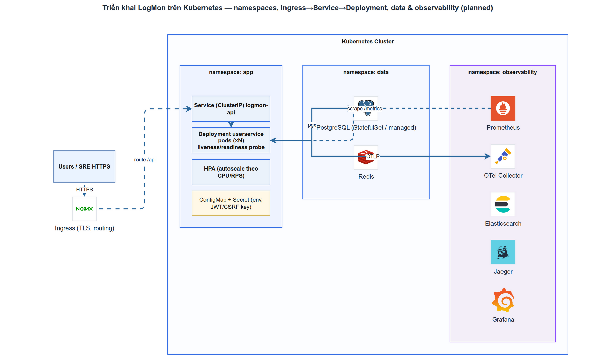

# Triển khai LogMon trên Kubernetes
> Module K8S-2 · Deployment/Service/Ingress, ConfigMap/Secret, probes, HPA, rollout · Độ khó: 🥉→🥇 · Prereqs: K8S-1

> **Trạng thái thực tế (quan trọng — đọc trước):** LogMon **chưa** có một manifest K8s nào trong repo. Hiện trạng deploy là **Docker Compose** (`infra/docker/docker-compose.yml`). Kubernetes là **đường đi đã chốt cho GĐ4** — `doc_v2/10-deployment-operations.md §7` và `doc_v2/16-iac-runbooks.md §9` mô tả stack mapping, nhưng "Helm values / K8s manifest cụ thể chưa viết" (doc_v2/16 §9, dòng 92). Bài này dạy bạn *vì sao* và *làm thế nào* để khi tới GĐ4 bạn viết manifest đúng — và mọi ví dụ neo vào code/Compose **đã tồn tại** trong repo. Phần nào là `(planned)` sẽ ghi rõ.

---

## 1. Vì sao kỹ năng này quan trọng trong LogMon

LogMon là nền tảng observability (logs + metrics + traces) cho Go microservices. Compose chạy tốt trên một VPS — doc_v2/10 nói thẳng: "một VPS đơn thì ở lại Compose" (dòng 3). Nhưng khi cần **>1 node, rolling deploy tự động, autoscaling, hoặc HA thật** thì Compose hết đường (doc_v2/10 §7, dòng 176).

Lúc đó K8s giải quyết đúng các vấn đề LogMon sẽ gặp:
- **`userservice`** (Go API, `backend/cmd/userservice`) cần co giãn theo tải scrape/query và rolling update không downtime.
- **`otel-gateway`** cần nhiều replica + HPA khi tail-sampling vượt 1 node (doc_v2/10 §7, dòng 184).
- **`otel-agent`** phải chạy trên *mọi* node để thu log container → đúng pattern DaemonSet.
- Stateful (`postgres`, `elasticsearch`, `prometheus`) cần định danh ổn định + storage bền → StatefulSet / Operator (ECK 3.4, kube-prometheus-stack).

Thiết kế hiện tại **đã chuẩn bị sẵn** cho việc này: state nằm ở PG/ES/S3, collector tách agent/gateway, và `ports.RuleSyncer` swap được sang sinh `PrometheusRule` CR (doc_v2/16 §9, dòng 92). Bạn không refactor lớn — bạn *gói lại* cho K8s.

## 2. Mô hình tư duy (first principles) — giải thích từ con số 0

Quên buzzword. K8s chỉ là một **vòng lặp điều khiển (control loop)**: bạn khai báo *trạng thái mong muốn* (desired state) bằng file YAML, K8s liên tục so sánh với *trạng thái thực tế* (actual state) và hành động để khớp lại. Giống bộ điều nhiệt: bạn đặt 25°C, nó tự bật/tắt máy lạnh.

Bốn nguyên thủy bạn cần hiểu để deploy LogMon:

1. **Pod** = đơn vị chạy nhỏ nhất = 1+ container chia chung network/storage. `userservice` của LogMon sẽ là 1 container trong 1 Pod. Pod là **ephemeral** (dùng xong vứt), IP đổi liên tục.
2. **Deployment** = "tôi muốn N bản sao của Pod này, luôn luôn". Nó tạo ReplicaSet, ReplicaSet tạo Pod. Pod chết → tự tạo lại. Đổi image → rolling update.
3. **Service** = một địa chỉ ảo *ổn định* (ClusterIP + DNS name) đứng trước tập Pod hay đổi IP. `userservice` Pod scale lên xuống nhưng `userservice.default.svc` không đổi. Đây là lý do Compose dùng `http://prometheus:9090` được — K8s Service cho bạn đúng cơ chế DNS đó.
4. **Cấu hình tách khỏi image** (12-factor): cùng một image `userservice`, chạy dev/staging/prod chỉ khác **env vars**. Compose đã làm đúng (xem `environment:` ở dòng 62-92 của compose). K8s tách thành **ConfigMap** (config thường) + **Secret** (nhạy cảm).

Tại sao tách config khỏi image quan trọng với LogMon? Vì `JWT_SECRET`, `DATABASE_URL`, `ELASTIC_PASSWORD` **không được** nằm trong image (CLAUDE.md §Security: "Secrets: env vars / secrets manager, KHÔNG hardcode"). Image build một lần, config bơm lúc chạy.

## 3. Khái niệm cốt lõi (tăng dần độ khó)

### 3.1 Deployment + ReplicaSet (🥉)
Deployment khai báo `replicas`, `selector` (label nào là Pod của tôi), và `template` (khuôn Pod). Mọi rollout/rollback đều qua đây.

### 3.2 Service & Ingress (🥉→🥈)
| Loại | Phạm vi | Dùng cho LogMon |
|------|---------|------------------|
| ClusterIP | Nội bộ cluster | `userservice`, `prometheus`, `elasticsearch` gọi nhau |
| NodePort | Mở cổng trên mỗi node | hiếm dùng, debug |
| LoadBalancer | IP ngoài (cloud) | rìa cluster nếu không có Ingress |
| **Ingress** | HTTP(S) routing L7 + TLS | `/` → frontend, `/api` → userservice (giống reverse proxy Nginx ở doc_v2/16 §8) |

Ingress thay thế đúng vai trò Nginx/Caddy trong kế hoạch Compose của LogMon (ADR-041). Cùng origin cho `/` và `/api` để cookie `SameSite=Strict` hoạt động (doc_v2/16 §8, dòng 78) — đây là yêu cầu auth có thật, vừa commit ở nhánh `feat/auth-hardening`.

### 3.3 ConfigMap vs Secret (🥈)
- **ConfigMap**: config không nhạy cảm → bơm thành env var hoặc mount file. Tương đương khối `environment:` thường của compose (`LOG_LEVEL`, `OTEL_SERVICE_NAME`, `PROMETHEUS_URL`).
- **Secret**: dữ liệu nhạy cảm. Lưu ý đắng lòng: Secret K8s **chỉ là base64, KHÔNG mã hoá** trong etcd (Kubernetes docs — xem §9). Tương đương khối `secrets:` file-based của compose (dòng 402-408: `slack_webhook_url`, `logmon_webhook_token`).

### 3.4 Probes — liveness / readiness / startup (🥈, trọng tâm bài)
Ba câu hỏi khác nhau, đừng gộp:

| Probe | Câu hỏi | Thất bại → | LogMon endpoint |
|-------|---------|-----------|------------------|
| **liveness** | Process còn sống / không deadlock? | **restart** Pod | endpoint *nhẹ*, KHÔNG ping DB |
| **readiness** | Sẵn sàng nhận traffic chưa? | **cắt khỏi Service** (không restart) | nên ping DB (`/healthz` hiện tại) |
| **startup** | Boot xong chưa? | hoãn 2 probe kia | dùng khi khởi động chậm (ES) |

Bẫy kinh điển: dùng *cùng một* endpoint ping-DB cho cả liveness. Khi DB chập chờn, liveness fail → K8s restart Pod → Pod mới lại không kết nối được DB → restart loop, làm sự cố nặng hơn (Kubernetes docs §9). Liveness phải hỏi "tôi còn sống không", readiness mới hỏi "dependency của tôi ổn không".

### 3.5 HPA — Horizontal Pod Autoscaler (🥇)
`autoscaling/v2` API: scale số replica theo metric. Yêu cầu **bắt buộc**: Pod phải khai `resources.requests` (CPU/mem) thì HPA mới tính được % utilization (Kubernetes docs §9). LogMon có sẵn `resources.limits` trong compose (vd `userservice` không set, `prometheus` 1 CPU / 2g) — sang K8s phải thêm `requests`.

### 3.6 Rolling update & graceful shutdown (🥇)
Rolling update = thay Pod cũ bằng Pod mới *từ từ* (maxSurge/maxUnavailable). Zero-downtime cần 3 thứ khớp nhau: readiness probe thật, app drain connection khi nhận **SIGTERM**, và `preStop` hook bù trễ propagate endpoint (Google Cloud / oneuptime §9). LogMon **đã** xử lý SIGTERM/SIGINT đúng (xem §4) — đây là lợi thế lớn.

## 4. LogMon dùng nó thế nào (bám code thật — path:line, ghi rõ implemented/planned)

**Đã implemented (sự kiện repo) — những thứ làm LogMon "K8s-ready":**

- **Image distroless nonroot** — `backend/Dockerfile:13` dùng `gcr.io/distroless/static-debian12:nonroot`, `Dockerfile:17` `USER nonroot:nonroot` (uid **65532**, theo `genrules-init` compose dòng 47). Đây chính là `securityContext.runAsNonRoot: true` mà K8s khuyến nghị — image đã sẵn sàng.
- **Health endpoint** — `backend/cmd/userservice/main.go:360` đăng ký `GET /healthz`, và `main.go:363` **ping Postgres** (`pool.Ping`) với timeout 2s, fail → 503. Endpoint này hợp làm **readiness** (nó kiểm tra dependency). *Chưa có* endpoint liveness nhẹ riêng (`/readyz` cũng không có — đã grep xác nhận) → khi viết manifest cần phân biệt (xem §6).
- **Metrics endpoint** — `main.go:369` `GET /metrics` expose Prometheus registry (`metrics.go:49`). Đây là nguồn cho HPA custom metrics (vd `logmon_http_requests_total` ở `metrics.go:26`).
- **Graceful shutdown** — `main.go:218` `signal.NotifyContext(..., SIGINT, SIGTERM)`, `main.go:317` chờ `ctx.Done()`, `main.go:323` `srv.Shutdown()` với `_shutdownTimeout = 10s` (`main.go:52`). K8s gửi SIGTERM khi terminate Pod → LogMon drain đúng. `terminationGracePeriodSeconds` của Pod phải **> 10s** để khớp.
- **Config qua env var** — `main.go:98` `PORT` (default `8080`, `main.go:51`), `main.go:99` `DATABASE_URL`, `main.go:101` `JWT_SECRET`, `main.go:109` `ALERTMANAGER_WEBHOOK_TOKEN`. Toàn bộ là 12-factor → map thẳng sang ConfigMap/Secret.
- **Tách config/secret đã có ở Compose** — `docker-compose.yml:62-92` (env thường) vs `docker-compose.yml:402-408` (`secrets:` file-based). Đây là "bản nháp" trực tiếp cho ConfigMap vs Secret.
- **OTel tách agent/gateway** — compose `otel-agent` (dòng 338, đọc `/var/lib/docker/containers`) vs `otel-gateway` (dòng 316). Agent → **DaemonSet**, gateway → **Deployment + HPA** (doc_v2/10 §7).

**Planned (chỉ trong doc_v2 / roadmap, CHƯA có code):**
- Mọi manifest/Helm chart K8s — `(planned, GĐ4)` (doc_v2/16 §9 dòng 92, doc_v2/16 §15 mục I5).
- `ports.RuleSyncer` → sinh `PrometheusRule` CR thay vì render file vào volume `genrules` (compose dòng 388). Hiện tại là rule-file pipeline ADR-024; CR là `(planned)` (doc_v2/10 §7 dòng 187).
- `incident`, `notification` BC, và `go-redis` — CLAUDE.md liệt kê nhưng `(planned)`: `backend/internal/incident/` và `internal/notification/` CHƯA tồn tại, `go.mod` KHÔNG có go-redis. `slo` BC *đã* có code (`backend/internal/slo/` — domain/app/ports) nhưng CHƯA wire vào `userservice` (main.go không import `internal/slo`) → không deploy. Bài này chỉ deploy `userservice` (BC đang chạy thật là `user` + `alerting` + `logpipeline` query).
- `compose.prod.yaml` + network segmentation `backend internal` — `(planned)` (doc_v2/16 §3, §15 mục I3).

## 5. Best practices (mỗi mục kèm 1 nguồn đã research)

1. **Liveness ≠ readiness — tách endpoint.** Liveness chỉ kiểm tra process còn xử lý được; readiness mới kiểm tra dependency (DB/ES). Với LogMon: dùng `/healthz` (ping DB, `main.go:363`) cho **readiness**, thêm một endpoint nhẹ cho **liveness**. — [Kubernetes: Configure Probes](https://kubernetes.io/docs/tasks/configure-pod-container/configure-liveness-readiness-startup-probes/)
2. **Dùng startupProbe thay cho initialDelaySeconds dài** cho service khởi động chậm (ES `start_period: 60s` ở compose dòng 294). `periodSeconds:10 × failureThreshold:30 = 300s` cho boot xong rồi mới chạy liveness. — [Kubernetes: Liveness, Readiness, Startup](https://kubernetes.io/docs/concepts/configuration/liveness-readiness-startup-probes/)
3. **Khai `resources.requests` cho mọi container** — HPA và scheduler cần nó; thiếu requests thì HPA không tính được utilization. — [Kubernetes: HPA](https://kubernetes.io/docs/concepts/workloads/autoscaling/horizontal-pod-autoscale/)
4. **HPA: thêm `behavior.stabilizationWindow`** để chống flapping; cẩn trọng scale theo memory (tín hiệu "đến trễ", Pod có thể đã OOMKilled). Với LogMon ưu tiên CPU + custom metric (vd request rate từ `/metrics`). — [Datadog: Autoscaling on custom metrics](https://www.datadoghq.com/blog/autoscaling-custom-metrics/)
5. **Zero-downtime cần bộ ba: readiness thật + drain SIGTERM + preStop hook.** LogMon đã drain SIGTERM (`main.go:218`); thêm `preStop: sleep 5-10s` bù trễ rút endpoint, và `terminationGracePeriodSeconds > 10s`. — [Google Cloud: terminating with grace](https://cloud.google.com/blog/products/containers-kubernetes/kubernetes-best-practices-terminating-with-grace)
6. **Bật etcd encryption-at-rest cho Secret; cân nhắc External Secrets Operator.** Secret K8s mặc định chỉ base64 trong etcd. Map `JWT_SECRET`/`ELASTIC_PASSWORD` của LogMon từ Vault/cloud secret manager qua ESO thay vì commit YAML. — [Kubernetes: Good practices for Secrets](https://kubernetes.io/docs/concepts/security/secrets-good-practices/)
7. **Pin image theo digest, không `:latest`** — đúng quy tắc compose của LogMon ("Pin image theo minor version, lý tưởng digest", doc_v2/10 §1 dòng 50). — [Kubernetes: Configure Probes](https://kubernetes.io/docs/tasks/configure-pod-container/configure-liveness-readiness-startup-probes/)

## 6. Lỗi thường gặp & anti-patterns

- **Dùng `/healthz` (ping-DB) làm liveness.** DB nấc một nhịp → K8s restart hàng loạt Pod khoẻ mạnh → restart loop khuếch đại sự cố. Sửa: liveness nhẹ, readiness mới chạm DB.
- **Quên `preStop` hook.** Có khoảng trống giữa lúc Pod nhận SIGTERM và lúc Service ngừng route tới nó → request rớt giữa rolling update. LogMon drain đúng nhưng vẫn cần `preStop` bù trễ propagate.
- **`terminationGracePeriodSeconds < shutdown timeout`.** LogMon shutdown timeout 10s (`main.go:52`); nếu để grace period mặc định *thấp hơn* logic drain, K8s SIGKILL giữa chừng → cắt request đang xử lý. Đặt grace ≥ 15s.
- **Quên `resources.requests`** → HPA không hoạt động, scheduler đặt Pod bừa, bin-packing kém.
- **HPA scale theo memory cho Go service.** Go giữ heap, memory không tụt nhanh → flapping/OOM. Ưu tiên CPU hoặc request-rate.
- **Commit Secret YAML vào git (chỉ base64).** Vi phạm CLAUDE.md §Security. LogMon đã `.gitignore` secrets file-based (doc_v2/16 §5) — giữ nguyên kỷ luật đó trên K8s bằng ESO/SealedSecrets.
- **Stateful (Postgres/ES) dựng bằng Deployment.** Mất định danh + storage. Dùng StatefulSet/Operator (ECK 3.4 cho ES — doc_v2/10 §7).
- **Một probe cho service boot chậm bằng `initialDelaySeconds` rất dài** → nếu boot nhanh thì lãng phí, boot chậm thì vẫn fail. Dùng startupProbe.

## 7. Lộ trình luyện tập NGAY trong repo LogMon

> Vì repo chưa có manifest, mọi task tạo file mới đặt trong `infra/k8s/` (thư mục mới) và đối chiếu trực tiếp với `infra/docker/docker-compose.yml`.

### 🥉 Cơ bản
1. Đọc `backend/Dockerfile` rồi viết `infra/k8s/userservice-deployment.yaml`: 2 replicas, image `userservice`, container port `8080` (khớp `main.go:51`), `securityContext.runAsNonRoot: true` + `runAsUser: 65532` (khớp `Dockerfile:16`).
2. Viết `infra/k8s/userservice-service.yaml` (ClusterIP, port 8080) và đối chiếu nó thay cho dòng `ports: - "8080:8080"` (compose dòng 95-96).
3. Trích toàn bộ khối `environment:` của `userservice` (compose dòng 62-92) thành một `ConfigMap` (`LOG_LEVEL`, `PORT`, `OTEL_SERVICE_NAME`, `PROMETHEUS_URL`) — phân loại cái nào *không* nhạy cảm.
4. Tách `JWT_SECRET`, `ALERTMANAGER_WEBHOOK_TOKEN`, `ELASTICSEARCH_PASSWORD` (compose dòng 68/82/92 — lưu ý compose lấy giá trị từ host var `${ELASTIC_PASSWORD}`) thành một `Secret`; `envFrom` cả ConfigMap + Secret vào Deployment.

### 🥈 Trung cấp
1. Thêm **readinessProbe** trỏ `GET /healthz:8080` (vì `main.go:363` ping DB) và một **livenessProbe** nhẹ — đồng thời thêm vào `backend/cmd/userservice/main.go` một route `GET /livez` trả `200` không chạm DB (TDD: viết test handler trước).
2. Đặt `terminationGracePeriodSeconds: 20` + `preStop: exec sleep 5` cho Deployment; giải thích bằng comment vì sao 20 > `_shutdownTimeout` 10s (`main.go:52`).
3. Thêm `resources.requests/limits` cho `userservice` theo bảng capacity doc_v2/10 §5 (Small: 256 MB) — repo hiện *không* set cho userservice trong compose.
4. Viết `infra/k8s/otel-agent-daemonset.yaml` mô phỏng `otel-agent` (compose dòng 338): mount `/var/lib/docker/containers` read-only, chạy trên mọi node.
5. Viết `infra/k8s/ingress.yaml`: `/` → frontend service, `/api` → userservice service (đối chiếu yêu cầu cùng-origin doc_v2/16 §8).

### 🥇 Nâng cao
1. Viết `infra/k8s/userservice-hpa.yaml` (`autoscaling/v2`): minReplicas 2, maxReplicas 6, target CPU 70%, thêm `behavior.scaleDown.stabilizationWindowSeconds: 120`.
2. Mở rộng HPA dùng **custom metric** `logmon_http_requests_total` (`metrics.go:26`) — phác cách expose qua prometheus-adapter, ghi rõ phần nào `(planned)` vì repo chưa có adapter.
3. Soạn `infra/k8s/kustomization.yaml` với overlay `base` + `prod` (khác nhau replicas/limits) — phản chiếu ý tưởng `compose.prod.yaml` còn thiếu (doc_v2/16 §15 mục I3).
4. Viết bản nháp `PrometheusRule` CR từ `infra/prometheus/rules/base-alerts.yml` (8 alert) — chính là việc `ports.RuleSyncer` sẽ sinh ở GĐ4 (doc_v2/10 §7 dòng 187).
5. Thiết kế `StatefulSet` cho Postgres (volumeClaimTemplates) thay cho service `postgres` (compose dòng 7) + giải thích vì sao KHÔNG dùng Deployment.

## 8. Skill/agent ECC nên dùng khi luyện

- **`ecc:kubernetes-patterns`** — khi viết/review manifest (Deployment, Service, probes, HPA, securityContext). Dùng ở mọi task §7 tạo YAML, đặc biệt 🥈 (probes) và 🥇 (HPA, StatefulSet).
- **`ecc:deployment-patterns`** — khi thiết kế chiến lược rollout (rolling/blue-green/canary), preStop/graceful shutdown, zero-downtime. Dùng cho task 🥈.2 và 🥇.3 (overlay prod).
- **`ecc:docker-patterns`** — khi đối chiếu/làm chặt `backend/Dockerfile` trước khi đưa lên K8s (multi-stage, distroless, nonroot, pin digest). Dùng trước task 🥉.1.
- Bổ trợ: **`ecc:go-review`** cho task 🥈.1 (thêm route `/livez` vào `main.go`), **`ecc:security-scan`** / skill `/cso` khi xử lý Secret (§5 mục 6).

## 9. Tài nguyên học thêm (link đã research, có chú thích 1 dòng)

- [Kubernetes — Configure Liveness, Readiness and Startup Probes](https://kubernetes.io/docs/tasks/configure-pod-container/configure-liveness-readiness-startup-probes/) — tài liệu gốc, cú pháp + tham số probe chuẩn.
- [Kubernetes — Liveness, Readiness, and Startup Probes (concept)](https://kubernetes.io/docs/concepts/configuration/liveness-readiness-startup-probes/) — phân biệt 3 loại probe ở mức khái niệm, tránh bẫy thiết kế.
- [Kubernetes — Horizontal Pod Autoscaling](https://kubernetes.io/docs/concepts/workloads/autoscaling/horizontal-pod-autoscale/) — API `autoscaling/v2`, cách tính utilization, multi-metric.
- [Kubernetes — Good practices for Secrets](https://kubernetes.io/docs/concepts/security/secrets-good-practices/) — etcd encryption-at-rest, RBAC, vì sao base64 không phải mã hoá.
- [Google Cloud — Kubernetes best practices: terminating with grace](https://cloud.google.com/blog/products/containers-kubernetes/kubernetes-best-practices-terminating-with-grace) — SIGTERM, preStop, terminationGracePeriodSeconds cho zero-downtime.
- [Datadog — Scaling Kubernetes workloads on custom metrics](https://www.datadoghq.com/blog/autoscaling-custom-metrics/) — khi nào CPU không đủ, scale theo request/queue, stabilization window.

## 10. Checklist "đã hiểu"

- [ ] Phân biệt được Pod / Deployment / Service / Ingress và nói được cái nào thay vai trò nào trong `docker-compose.yml` của LogMon.
- [ ] Giải thích vì sao `/healthz` (`main.go:363`, ping DB) nên là **readiness** chứ không phải **liveness**, và hệ quả nếu dùng sai.
- [ ] Biết vì sao `terminationGracePeriodSeconds` phải > `_shutdownTimeout` 10s (`main.go:52`) và `preStop` hook để làm gì.
- [ ] Phân loại đúng env của `userservice` (compose dòng 62-92) nào vào ConfigMap, nào vào Secret, và biết Secret K8s chỉ là base64.
- [ ] Nêu được điều kiện bắt buộc để HPA hoạt động (`resources.requests`) và vì sao tránh scale Go service theo memory.
- [ ] Map được `otel-agent` → DaemonSet, `otel-gateway` → Deployment+HPA, Postgres/ES → StatefulSet/Operator.
- [ ] Phân biệt rõ phần LogMon **đã implemented** (Dockerfile nonroot, /healthz, /metrics, graceful shutdown) vs **planned** (mọi manifest, PrometheusRule CR — GĐ4).
