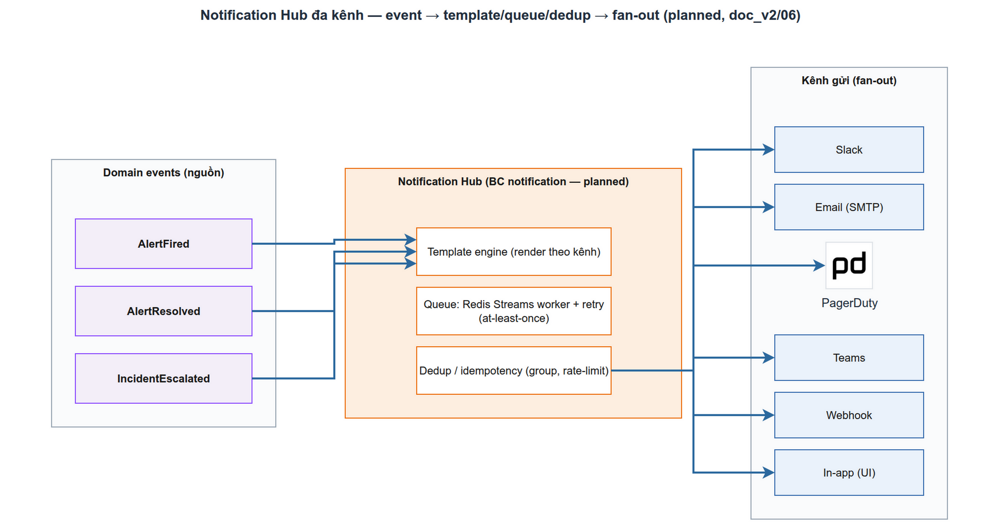

# Notification Hub đa kênh trong LogMon

> Module NOT-1 · fan-out đa kênh, template, retry/queue, idempotent delivery · Độ khó: 🥇 (nâng cao) · Prereqs: ARCH-3, INC-1

> **Trạng thái:** BC `notification` thuộc **Giai đoạn 3 (planned)** — thư mục `backend/internal/notification/` **chưa tồn tại**. Bài này dạy theo **thiết kế chuẩn trong [`doc_v2/06-incident-notification.md`](../../doc_v2/06-incident-notification.md) §2 (ADR-015)** — đó là source of truth; phần "đã có" chỉ là hạ tầng dùng lại (outbox/event bus). Quyết định GĐ3 mới chốt: **queue = Redis Streams**, **mã hoá secret kênh = AES-GCM single-key** (xem council GĐ3).

## 1. Vì sao kỹ năng này quan trọng trong LogMon

Mọi tín hiệu hữu ích (alert fired/resolved, incident escalated, SLO budget warning, weekly report) đều **vô dụng nếu không tới đúng người, đúng kênh, đúng lúc**. Notification Hub là **tầng giao tiếp đa kênh DÙNG CHUNG** cho mọi BC (alerting, incident, slo): thay vì mỗi BC tự gọi Slack/Email/PagerDuty (lặp code, khó test, dễ rò secret), chúng chỉ **phát domain event**; Hub lo phần còn lại. Đây là pattern "anti-corruption + fan-out" giúp thêm kênh mới = thêm 1 adapter, không đụng business logic.

## 2. Mô hình tư duy (first principles) — giải thích từ con số 0

Một "notification" đi qua 4 câu hỏi:
1. **Ai cần biết?** → *routing*: với một event type + workspace, kênh nào đã đăng ký nhận?
2. **Nói gì?** → *templating*: render nội dung theo từng kênh (Slack markdown ≠ email HTML ≠ webhook JSON).
3. **Gửi thế nào, lỡ lỗi thì sao?** → *delivery + retry*: gửi bất đồng bộ qua queue, thử lại có backoff, không mất tin.
4. **Đã gửi chưa, vì sao trượt?** → *observability*: ghi lịch sử mọi lần gửi để debug "vì sao tôi không nhận alert".

Nguyên tắc cốt lõi: **tách "quyết định gửi" (đồng bộ, nhanh) khỏi "gửi thật" (bất đồng bộ, có thể chậm/lỗi)** qua một hàng đợi — để một kênh chết (Slack 500) không kéo sập luồng nghiệp vụ.

## 3. Khái niệm cốt lõi (tăng dần độ khó)

### 3.1 Event-driven, không gọi trực tiếp
BC khác **không** import notification. Chúng phát domain event (`AlertFired`, `IncidentEscalated`...) qua [event bus + outbox](../architecture/03-cqrs-event-driven.md). Hub **subscribe** các event đó → dịch sang notification. Đây là lý do prereq ARCH-3.

### 3.2 Port `Sender` (ISP) — mỗi kênh 1 adapter
Theo [doc_v2/06 §2.1](../../doc_v2/06-incident-notification.md): interface tối giản
```go
type Sender interface { Send(ctx context.Context, msg Message) error }
```
Thêm kênh = viết 1 adapter implement `Sender` (Clean Arch: domain định nghĩa port, adapter hiện thực). Xem [Clean Architecture](../architecture/01-clean-architecture.md) để hiểu vì sao.

### 3.3 Queue + worker (at-least-once)
`send_notification.go` (đồng bộ) chỉ **enqueue delivery job** → **Redis Streams** (quyết định GĐ3); một pool worker tiêu thụ và gọi `Sender.Send`. Job chỉ bị xoá khỏi stream **sau khi gửi thành công** → đảm bảo *at-least-once*.

### 3.4 Retry, idempotency, circuit breaker
- **Retry**: ngay → 30s → 2m (3 lần, exponential); quá hạn → `status=failed` + log (KHÔNG nuốt lỗi).
- **Idempotency**: vì at-least-once, kênh nhận phải chịu được trùng. PagerDuty dùng `dedup_key` = alert fingerprint/incident id để trigger/ack/resolve cùng một key.
- **Circuit breaker per endpoint**: một kênh chết không làm nghẽn worker pool cho kênh khác.

### 3.5 Bảo mật secret kênh
Config kênh (webhook URL, integration key) lưu `notification_channels.config` (JSONB) — **mã hoá at-rest bằng AES-GCM**, key từ env (GĐ3 single-key; xem [doc_v2/09](../../doc_v2/09-security.md) và [AppSec](../security/01-appsec-owasp-auth.md)).

## 4. LogMon dùng/sẽ dùng nó thế nào (bám doc_v2 + code)



**Đã có (dùng lại):** event bus + transactional outbox tại [`backend/internal/shared/outbox/`](../../backend/internal/shared/outbox) *(implemented)* — chính là cơ chế Hub sẽ subscribe để nhận event. BC `alerting` đã phát event qua outbox (xem [CQRS](../architecture/03-cqrs-event-driven.md)).

**Planned — theo [doc_v2/06 §2](../../doc_v2/06-incident-notification.md):** luồng `notification/app/send_notification.go`:
```
Lookup channels đăng ký event type (per workspace)
 → Render template (text/template + sprig-style funcs)
 → Enqueue delivery job → Redis Streams
 → Worker: Send qua adapter; Retry ngay→30s→2m; quá → failed + log
 → Ghi notification_history (status, response_code, error)
```
- **Channels (doc_v2/06 §2.2):** Slack (webhook), Email (SMTP), PagerDuty (Events API v2, `dedup_key`), Microsoft Teams (webhook), Generic webhook, In-app (SSE — GĐ4).
- **Templates (§2.3):** per-workspace theo event type (`alert_fired`, `alert_resolved`, `incident_created`, `slo_budget_warning`...). Dùng `text/template` (KHÔNG `html/template` cho Slack markdown; webhook JSON phải escape đúng). Template lỗi → fallback mặc định + log.
- **Cross-BC:** `AlertFired/Resolved` (alerting), `IncidentEscalated` (incident), `BudgetExhausted/budget_warning` (slo — `slo/domain` đã có event `BudgetExhausted` *(domain layer đã scaffold)*) đều fan-in vào Hub.

## 5. Best practices (có nguồn)

- **Outbox để phát event đáng tin, tránh dual-write** giữa DB và queue — [microservices.io · Transactional Outbox](https://microservices.io/patterns/data/transactional-outbox.html).
- **At-least-once + consumer idempotent** thay vì cố exactly-once — [AWS · Idempotent consumers](https://aws.amazon.com/builders-library/making-retries-safe-with-idempotent-APIs/).
- **Redis Streams làm queue có consumer group + ack** (XADD/XREADGROUP/XACK, pending entries list để retry) — [Redis docs · Streams](https://redis.io/docs/latest/develop/data-types/streams/).
- **Circuit breaker cho external calls** để cô lập kênh chết — [Microsoft · Circuit Breaker pattern](https://learn.microsoft.com/en-us/azure/architecture/patterns/circuit-breaker).
- **PagerDuty Events API v2 + dedup_key** cho dedup/ack tự nhiên — [PagerDuty Events API v2](https://developer.pagerduty.com/docs/events-api-v2/overview/).

## 6. Lỗi thường gặp & anti-patterns

- **Gọi kênh đồng bộ trong request nghiệp vụ** → request treo khi Slack chậm. Phải qua queue.
- **Nuốt lỗi template/gửi** → "im lặng không nhận alert", loại bug tệ nhất của observability. Luôn ghi `notification_history` + fallback.
- **Dùng `html/template` cho Slack/markdown** → escape sai, vỡ định dạng. Đúng kênh, đúng escaping.
- **Hardcode/để plaintext webhook URL & integration key** → rò secret. Bắt buộc AES-GCM at-rest.
- **Không idempotent** → bão notification trùng khi retry. Dùng dedup_key/grouping.
- **Một kênh lỗi kéo sập cả pool** → thiếu circuit breaker per endpoint.

## 7. Lộ trình luyện tập (chủ đề planned → thiết kế/POC ngay trong repo LogMon)

### 🥉 Cơ bản
1. Đọc [`doc_v2/06-incident-notification.md`](../../doc_v2/06-incident-notification.md) §2, vẽ lại luồng `send_notification` và bảng 6 kênh.
2. Đọc [`backend/internal/shared/outbox/`](../../backend/internal/shared/outbox) — xác định Hub sẽ `Bus.Subscribe` event type nào.
3. Liệt kê 3 event hiện có thể fan-in (alerting/slo) và nội dung mỗi kênh cần khác nhau ra sao.

### 🥈 Trung cấp
1. Phác `backend/internal/notification/domain/` (planned): `Message`, `ChannelConfig` (VO), event types; viết test thuần domain (không hạ tầng).
2. Định nghĩa port `ports.Sender` + viết **1 adapter `SlackSender`** (POST webhook) + fake `Sender` cho test use case `SendNotification` (TDD).
3. Thiết kế bảng `notification_channels` / `notification_history` (migration mới theo [doc_v2/08](../../doc_v2/08-database-schema.md)); secret cột `config` mã hoá AES-GCM.

### 🥇 Nâng cao
1. POC worker tiêu thụ **Redis Streams** (consumer group + XACK + pending → retry backoff ngay/30s/2m) với một `Sender` fake; chứng minh at-least-once + dừng goroutine an toàn (stop/done channel theo CLAUDE.md).
2. Thêm **circuit breaker per channel** (vd `sony/gobreaker`) bọc adapter; test kênh "chết" không chặn kênh khác.
3. Implement `PagerDutySender` (Events API v2) với `dedup_key` = fingerprint; chứng minh trigger→resolve cùng key idempotent.
4. Subscribe `BudgetExhausted` (đã có ở `slo/domain/events.go`) → render template `slo_budget_warning` → gửi; nối end-to-end alerting→slo→notification.

## 8. Skill/agent ECC nên dùng

- `ecc:architect` — chốt ranh giới BC notification & port `Sender` trước khi code.
- `ecc:unified-notifications-ops` — tham chiếu pattern hub đa kênh (Slack/Email/...).
- `ecc:silent-failure-hunter` — rà soát chỗ có thể **nuốt lỗi** delivery/template (rủi ro số 1 ở đây).
- `ecc:go-reviewer` / `ecc:redis-patterns` — review adapter + worker Redis Streams.
- `ecc:database-reviewer` — review migration `notification_channels`/`notification_history` + mã hoá cột.

## 9. Tài nguyên học thêm

- [doc_v2/06 — Incident & Notification Hub](../../doc_v2/06-incident-notification.md) — thiết kế chuẩn (ADR-015), bảng kênh, retry, template.
- [microservices.io — Transactional Outbox](https://microservices.io/patterns/data/transactional-outbox.html) — phát event đáng tin.
- [Redis Streams](https://redis.io/docs/latest/develop/data-types/streams/) — queue + consumer group + ack/retry.
- [PagerDuty Events API v2](https://developer.pagerduty.com/docs/events-api-v2/overview/) — dedup_key/trigger/resolve.
- [Microsoft — Circuit Breaker](https://learn.microsoft.com/en-us/azure/architecture/patterns/circuit-breaker) · [Retry](https://learn.microsoft.com/en-us/azure/architecture/patterns/retry).
- [Go text/template](https://pkg.go.dev/text/template) — render an toàn theo kênh.

## 10. Checklist "đã hiểu"

- [ ] Giải thích vì sao notification phải **bất đồng bộ qua queue**, không gọi trực tiếp trong request.
- [ ] Vẽ được luồng event → routing → template → Redis Streams → worker → history.
- [ ] Nêu được port `Sender` và cách thêm 1 kênh = 1 adapter (ISP/Clean Arch).
- [ ] Phân biệt at-least-once + idempotency (dedup_key) vs exactly-once.
- [ ] Biết secret kênh phải **AES-GCM at-rest** (GĐ3 single-key).
- [ ] Hiểu circuit breaker per channel + retry backoff ngăn lỗi lan.
- [ ] Phân biệt rõ: outbox/bus **đã có (implemented)** vs BC notification **planned (doc_v2/06)**.
