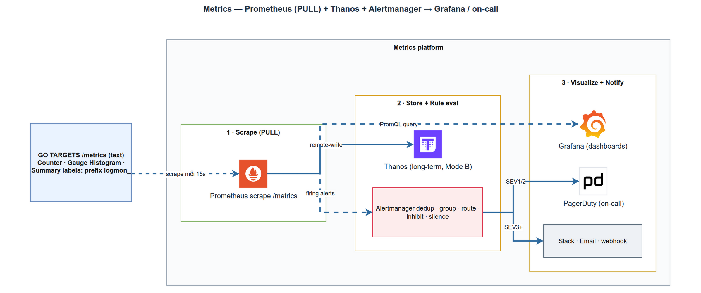

# Metrics với Prometheus + Alertmanager
> Module OBS-1 · 4 loại metric, scrape, RED/USE, alert routing · Độ khó: 🥉→🥇 · Prereqs: SD-1

## 1. Vì sao kỹ năng này quan trọng trong LogMon

LogMon là nền tảng observability cho Go microservices — nghĩa là chính LogMon phải đo được hệ thống của khách hàng *và* đo được bản thân nó. Trụ cột metrics trả lời câu hỏi "hệ thống có khoẻ không, ngay bây giờ?" với chi phí cực thấp: mỗi service chỉ tốn vài chục series số học, scrape 15s/lần, đủ để vẽ tỉ lệ lỗi, độ trễ p95, và bắn alert khi vượt ngưỡng.

Trong repo, metrics không phải thứ trang trí — nó là **đầu vào của cả pipeline alerting**. Rule `HighErrorRate` trong `infra/prometheus/rules/base-alerts.yml:13` tính trực tiếp trên metric `logmon_http_requests_total` do code Go expose ra. Nếu bạn đặt sai loại metric hoặc nhét label sai, alert sẽ câm hoặc gào loạn. Đây là kỹ năng nền cho mọi module observability còn lại (logs, traces, SLO).

## 2. Mô hình tư duy (first principles) — giải thích từ con số 0

Một **metric** chỉ là một con số có tên, đo lại theo thời gian. Ví dụ "tổng số request đã xử lý" = 142039.

Điểm cốt lõi của Prometheus là mô hình **PULL**: service KHÔNG gửi số đi đâu cả. Nó chỉ mở một endpoint HTTP `/metrics` trả về text thuần. Prometheus server chủ động *đi cào* (scrape) endpoint đó theo chu kỳ (LogMon: 15s — `infra/prometheus/prometheus.yml:21`), gắn timestamp, rồi lưu vào time-series database (TSDB) của nó.

Một dòng `/metrics` của LogMon trông như sau:

```
logmon_http_requests_total{method="GET",path="/api/v1/users/:id",status="200"} 142039
```

Mỗi tổ hợp **tên + bộ label** là một **time series** riêng. `{status="200"}` và `{status="500"}` là hai series khác nhau. Đây là chìa khoá để hiểu vì sao label sai làm nổ bộ nhớ (mục 6).

Vì sao PULL thắng PUSH? Prometheus biết được service *có sống không* (scrape fail = `up == 0`, chính là rule `ServiceDown` ở `base-alerts.yml:4`); không cần service tự biết địa chỉ monitoring; và service tái khởi động không làm mất tính nhất quán. Đánh đổi: cần service discovery để biết scrape ai (LogMon dùng `static_configs` cho dev).

## 3. Khái niệm cốt lõi (tăng dần độ khó)

### 3.1 Bốn loại metric

| Loại | Ý nghĩa | Chỉ tăng? | Ví dụ trong LogMon |
|------|---------|-----------|--------------------|
| **Counter** | Đếm tích luỹ (chỉ tăng, reset về 0 khi restart) | Có | `logmon_http_requests_total` |
| **Gauge** | Giá trị tức thời, lên xuống tự do | Không | `logmon_outbox_lag_seconds`, `logmon_http_requests_in_flight` |
| **Histogram** | Phân phối quan sát vào các bucket → tính được quantile | Có (mỗi bucket là counter) | `logmon_http_request_duration_seconds` |
| **Summary** | Quantile tính sẵn phía client | — | LogMon **không dùng** (xem dưới) |

Quy tắc thực dụng: Counter cho "đếm sự kiện" (request, lỗi), Gauge cho "đo trạng thái" (độ trễ outbox, số connection), Histogram cho "đo độ phân tán" (latency). Counter luôn có hậu tố `_total`.

### 3.2 Vì sao Histogram, không phải Summary

Histogram băm quan sát vào các bucket cố định (`le` = "less than or equal"). LogMon dùng buckets mặc định (`prometheus.DefBuckets` ở `metrics.go:35`) cho userservice và bộ buckets tường minh ở demo-order (`examples/demo-order/metrics.go:13`). p95 được tính *phía server* bằng `histogram_quantile()` — xem rule `HighLatencyP95` (`base-alerts.yml:26`).

Khác biệt then chốt: bucket của nhiều instance **cộng được với nhau** (`sum by (le)`), còn quantile của Summary thì **không** — bạn không thể lấy trung bình p95 của 3 máy. Tài liệu Prometheus khuyến nghị Histogram khi cần tổng hợp xuyên nhiều chiều, đúng nhu cầu LogMon (tính p95 theo `job`).

### 3.3 PromQL tối thiểu cần biết

- `rate(logmon_http_requests_total[5m])` — tốc độ tăng/giây của counter trong 5 phút. **Luôn `rate()` trên counter**, không đọc giá trị thô.
- `sum by (job) (...)` — gộp series, giữ lại label `job`.
- `histogram_quantile(0.95, sum by (job, le) (rate(...[5m])))` — p95 từ histogram.

### 3.4 RED và USE — hai khung đo lường

- **RED** (cho service hướng request): **R**ate, **E**rrors, **D**uration. LogMon hiện thực đúng bộ ba này: rate + error-rate từ `logmon_http_requests_total`, duration từ histogram. Đây là lý do middleware metrics tồn tại.
- **USE** (cho tài nguyên): **U**tilization, **S**aturation, **E**rrors — áp cho host/DB/disk. Trong LogMon là các exporter: `node_exporter`, `postgres_exporter`, `elasticsearch_exporter` (`prometheus.yml:27-57`).

### 3.5 Recording rule & alert rule

Prometheus đánh giá lại biểu thức theo `evaluation_interval` (15s, `prometheus.yml:3`). **Alert rule** firing khi biểu thức đúng liên tục đủ `for:`. **Recording rule** lưu sẵn kết quả tốn kém thành series mới (LogMon chưa dùng — *planned* cho SLO ở GĐ3).

## 4. LogMon dùng nó thế nào (bám code thật)



**Tầng instrumentation (implemented).** Package `internal/shared/metrics/metrics.go` là shared kernel: `New()` (`metrics.go:21`) tạo một `prometheus.Registry` *riêng* (không dùng default registry global — tránh xung đột khi test), đăng ký `logmon_http_requests_total` (CounterVec, labels `method/path/status` — `metrics.go:24`) và `logmon_http_request_duration_seconds` (HistogramVec, labels `method/path` — `metrics.go:31`). Comment đầu file ghi rõ luật naming và cấm high-cardinality label.

**Tầng thu thập (implemented).** `ObserveRequest()` (`metrics.go:56`) được gọi từ middleware `middleware.Metrics()` (`internal/shared/middleware/middleware.go:66`). Điểm quan trọng: nó dùng `c.FullPath()` (route template như `/api/v1/users/:id`), không dùng URL thô — nếu dùng URL thô, mỗi `id` thành một series mới → nổ cardinality. Path rỗng được gộp thành `"unmatched"` (`middleware.go:72`).

**Tầng expose (implemented).** `cmd/userservice/main.go:369` gắn `/metrics` qua `promhttp.HandlerFor(mx.Registry(), ...)`. Endpoint `/metrics` và `/healthz` bị loại khỏi tracing (`main.go:401`) để khỏi nhiễu.

**Metric domain khác (implemented).** Outbox relay export `logmon_outbox_lag_seconds` (Gauge) + `logmon_outbox_failed_total` (Counter) qua `internal/shared/outbox/metrics.go:31`, dùng interface `Observer` + `NopObserver` để test không cần registry thật. Demo-order thêm Gauge `logmon_http_requests_in_flight` (`examples/demo-order/metrics.go:42`).

**Tầng scrape (implemented).** `infra/prometheus/prometheus.yml` cào `userservice:8080` và `demo-order:8081` (job `logmon-services`, 15s) cùng các exporter (60s). `--web.enable-lifecycle` được bật để rule sync gọi `POST /-/reload`.

**Tầng alert (implemented).** `infra/prometheus/rules/base-alerts.yml` định nghĩa `ServiceDown`, `HighErrorRate` (5xx > 5%), `HighLatencyP95` (p95 > 1s), `OutboxLag`, `PGConnHigh`, `ESDiskHigh`, `CollectorQueueFull`, và `Watchdog` (deadman switch — *cố ý* không có `for:`, `base-alerts.yml:79`).

**Tầng routing (implemented).** `infra/alertmanager/alertmanager.yml` route theo `severity`: critical → `page`, warning → `ticket`, kèm inhibit rule (critical đè warning cùng `service`) và mirror mọi alert sang webhook của alerting BC (`/api/v1/alerts/webhook`, xử lý ở `internal/alerting/app/command/ingest_webhook.go`).

**Alerting BC (implemented).** BC `internal/alerting/` (Clean Arch + DDD + CQRS) quản lý rule trong DB rồi render ra file Prometheus: `adapters/promfile/syncer.go` validate bằng `rulefmt.Parse` in-process (`syncer.go:139`), ghi atomic + reload (ADR-024); `adapters/alertmanager/client.go` proxy silence sang Alertmanager v2 API.

**Phần PLANNED (chỉ trong doc_v2, code chưa có):**
- **Thanos** (long-term metrics, Mode B) — `doc_v2/04-metrics-tracing.md:37`. Repo chỉ nhắc Thanos trong comment `docker-compose.yml`; không có manifest/dep nào. Local hiện retention 15 ngày.
- **Native histograms** + exemplar storage — `doc_v2/04:13-14`. Code đang dùng classic buckets; chưa bật feature flag.
- **Label `workspace`/`status_code`** chuẩn hoá — `doc_v2/04:33`. Code hiện dùng `status` (không `status_code`) và chưa có `workspace`.
- **redis_exporter, kafka_exporter** — liệt kê ở `doc_v2/04:25-26` nhưng `prometheus.yml` chưa scrape (go-redis cũng chưa vào code).
- **SLO recording rules + multiwindow burn-rate** — `doc_v2/05-alerting-slo.md:142` (GĐ3).

## 5. Best practices (mỗi mục kèm nguồn đã research)

1. **Ưu tiên Histogram hơn Summary khi cần tổng hợp.** Bucket cộng được xuyên instance, quantile của Summary thì không — LogMon tính p95 theo `job` nên bắt buộc Histogram ([Prometheus — Histograms and summaries](https://prometheus.io/docs/practices/histograms/)).
2. **Giữ cardinality thấp, không bao giờ nhét ID vào label.** Prometheus khuyến nghị giữ cardinality mỗi metric < 10 ("try to keep the cardinality of your metrics below 10" — [Prometheus — Instrumentation](https://prometheus.io/docs/practices/instrumentation/)); CNCF nhấn mạnh tránh giá trị động/không bị chặn như user ID — ID/email/URL thô là nguyên nhân số 1 gây nổ TSDB ([CNCF — Prometheus Labels Best Practices](https://www.cncf.io/blog/2025/07/22/prometheus-labels-understanding-and-best-practices/)). LogMon thực thi điều này bằng `c.FullPath()` thay vì URL thô.
3. **Tuân naming convention.** `snake_case`, đơn vị trong tên (`_seconds`, `_bytes`), counter hậu tố `_total` ([Prometheus — Metric and label naming](https://prometheus.io/docs/practices/naming/)). LogMon đã đúng: `logmon_http_request_duration_seconds`.
4. **Alert phải actionable, chống alert fatigue.** Dùng grouping + inhibition + severity routing để giảm nhiễu; chỉ page khi có hành động cần làm ngay ([Better Stack — Preventing Alert Fatigue](https://betterstack.com/community/guides/monitoring/best-practices-alert-fatigue/)). LogMon: inhibit critical→warning cùng `service`, warning chỉ vào `ticket`.
5. **Cân nhắc native histograms cho metric mới.** Tự động aggregate ở mọi resolution và phát hiện counter-reset đúng ([Prometheus — Histograms and summaries](https://prometheus.io/docs/practices/histograms/)). LogMon ghi nhận là *planned* (giữ classic buckets giai đoạn chuyển tiếp).
6. **Long-term storage tách khỏi Prometheus.** Thanos Sidecar upload block lên object storage, Compactor downsample (raw 30d → 5m 180d → 1h 1y) để query dài rẻ và nhanh ([Thanos design](https://thanos.io/tip/thanos/design.md/)). Đúng kế hoạch Mode B của LogMon.

## 6. Lỗi thường gặp & anti-patterns

- **Label cardinality cao.** Nhét `user_id`, `request_id`, `trace_id`, hoặc URL thô vào label → mỗi giá trị tạo một series, TSDB phình tới OOM. CLAUDE.md cấm rõ; code dùng route template để chặn.
- **Đọc giá trị counter thô.** Counter reset về 0 khi restart; luôn bọc `rate()`/`increase()`. So sánh trực tiếp counter là sai.
- **Quên `sum by (le)` khi tính quantile.** `histogram_quantile()` cần label `le`; thiếu `sum by (..., le)` ra số vô nghĩa (xem cách đúng ở `base-alerts.yml:28`).
- **Dùng default registry global.** `prometheus.MustRegister` lên default registry gây panic "duplicate" khi chạy lại trong test. LogMon tạo registry riêng (`metrics.go:22`) — hãy giữ pattern này.
- **Thêm `for:` vào Watchdog.** Phá deadman switch — comment `base-alerts.yml:80` cảnh báo cụ thể.
- **Alert không có `for:` / không actionable.** Spike 1 giây cũng page → fatigue. Mọi rule thật của LogMon đều có `for:` (trừ Watchdog cố ý).
- **Summary khi cần aggregate.** Lấy trung bình quantile xuyên instance là sai về thống kê.

## 7. Lộ trình luyện tập NGAY trong repo LogMon

### 🥉 Cơ bản
1. Chạy `make up` rồi `curl localhost:8080/metrics`, tìm 3 dòng `logmon_http_requests_total` và đọc đúng nghĩa label `method/path/status`.
2. Bắn vài request tới userservice, scrape lại `/metrics`, xác nhận counter tăng và `_bucket` của histogram đổi.
3. Mở Prometheus UI (`make up-full`), chạy `rate(logmon_http_requests_total[5m])` và `histogram_quantile(0.95, sum by (le) (rate(logmon_http_request_duration_seconds_bucket[5m])))`.
4. Đọc `infra/prometheus/rules/base-alerts.yml`, giải thích bằng lời từng rule firing khi nào.

### 🥈 Trung cấp
1. Thêm Counter `logmon_auth_login_failures_total` (label `reason`, cardinality bị chặn) vào `internal/shared/metrics/metrics.go`, đăng ký vào registry, expose ở `/metrics`; viết bảng-test trong `metrics_test.go`.
2. Thêm Gauge `logmon_db_pool_in_use_connections` đọc từ `pgxpool.Stat()`, cập nhật định kỳ bằng goroutine có stop-channel (theo luật concurrency của CLAUDE.md).
3. Viết alert rule mới (vd `LoginFailureSpike`) cho metric ở task 1, thêm vào `base-alerts.yml`, reload Prometheus, kích cho nó firing.
4. Thêm route Alertmanager mới (`alertmanager.yml`) cho severity `info` đẩy vào channel riêng, kèm một inhibit rule, kiểm thử bằng amtool/UI.

### 🥇 Nâng cao
1. Chuyển `logmon_http_request_duration_seconds` sang **native histogram** (bật `NativeHistogramBucketFactor` trong `HistogramOpts`) và cập nhật rule p95 cho phù hợp — đối chiếu `doc_v2/04:14`.
2. Thêm một **recording rule** pre-aggregate error-rate theo `job` rồi viết lại `HighErrorRate` dựa trên rule đó; đo phần giảm tải đánh giá.
3. Bật `--enable-feature=exemplar-storage` + exemplar trên histogram (`metrics.go`), nối từ panel latency sang trace (đối chiếu `doc_v2/04:133` correlation).
4. Phác thảo service `thanos-sidecar` trong `infra/docker/docker-compose.yml` (profile riêng) + cấu hình external label, đối chiếu `doc_v2/04:37` — dừng ở mức chạy được local, không cần object storage thật.

## 8. Skill/agent ECC nên dùng khi luyện

- **`ecc:architect`** — khi thiết kế đặt metric mới ở đâu cho đúng layer (shared kernel vs trong BC) và khi phác thảo tích hợp Thanos để không vi phạm layer direction.
- **`ecc:performance-optimizer`** (hoặc skill `ecc:latency-critical-systems`) — khi rà cardinality, tối ưu PromQL/recording rule, đo chi phí scrape trước/sau khi thêm metric.
- **`ecc:production-audit`** — checklist trước khi đưa rule alert vào "production": mọi alert có `for:`, có `runbook_url`, severity routing đúng, không có alert câm; chạy như một cổng review.
- **`ecc:go-review`** — review code Go khi thêm collector mới (registry riêng, không mutable global, interface nhỏ như `Observer`).

## 9. Tài nguyên học thêm

- [Prometheus — Histograms and summaries](https://prometheus.io/docs/practices/histograms/) — vì sao chọn histogram, native vs classic, cách tính quantile.
- [Prometheus — Metric and label naming](https://prometheus.io/docs/practices/naming/) — quy ước đặt tên, đơn vị, hậu tố `_total`.
- [Prometheus — Instrumentation practices](https://prometheus.io/docs/practices/instrumentation/) — guideline cardinality < 10, khi nào dùng loại metric nào.
- [CNCF — Prometheus Labels: Understanding and Best Practices (2025)](https://www.cncf.io/blog/2025/07/22/prometheus-labels-understanding-and-best-practices/) — label nào nên/không nên, mitigation high-cardinality.
- [Better Stack — Preventing Alert Fatigue](https://betterstack.com/community/guides/monitoring/best-practices-alert-fatigue/) — grouping/inhibition/severity routing để alert có tín hiệu.
- [Thanos — Design](https://thanos.io/tip/thanos/design.md/) — kiến trúc Sidecar/Store/Query/Compactor và downsampling cho long-term storage.
- [client_golang — package docs](https://pkg.go.dev/github.com/prometheus/client_golang/prometheus) — API chính thức (CounterVec, HistogramVec, Registry).

## 10. Checklist "đã hiểu"

- [ ] Giải thích được vì sao Prometheus dùng PULL và `up == 0` báo gì.
- [ ] Phân biệt được Counter / Gauge / Histogram và biết khi nào dùng cái nào trong LogMon.
- [ ] Biết vì sao LogMon chọn Histogram thay Summary và dùng `c.FullPath()` thay URL thô.
- [ ] Viết được PromQL tính error-rate và p95 đúng (`rate`, `sum by (le)`, `histogram_quantile`).
- [ ] Chỉ ra được đường đi từ `ObserveRequest()` → `/metrics` → scrape → alert rule → Alertmanager route.
- [ ] Nêu được 3 anti-pattern cardinality và cách LogMon phòng tránh.
- [ ] Phân biệt rạch ròi phần đã implemented (metrics shared, base-alerts, alerting BC) và phần planned (Thanos, native histogram, SLO rules).
- [ ] Giải thích được vai trò của Watchdog deadman switch và vì sao không được thêm `for:`.
