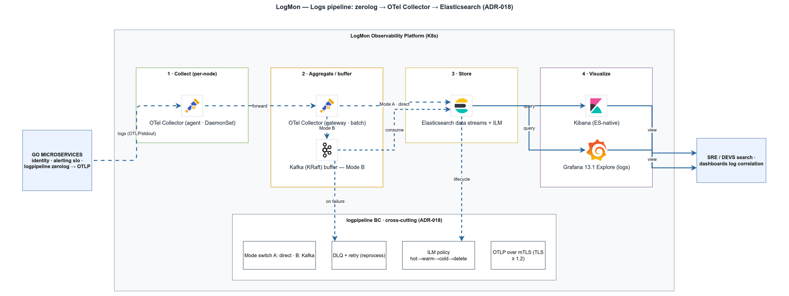

# Logs pipeline: zerolog → OTel → Elasticsearch
> Module OBS-2 · structured logging, OTLP, Mode A/B, ILM · Độ khó: 🥉→🥇 · Prereqs: SD-1

## 1. Vì sao kỹ năng này quan trọng trong LogMon

LogMon là nền tảng observability cho Go microservices — chính phần "logging" trong cặp logging+monitoring. Khi một service báo lỗi lúc 3 giờ sáng, thứ cứu bạn không phải là `fmt.Println` rải rác mà là một **dòng log có cấu trúc, gắn `trace_id`, tìm được trong vài giây** giữa hàng triệu dòng khác. Kỹ năng này quyết định LogMon có dùng được trong sự cố thật hay không.

Toàn bộ chuỗi gồm 4 mắt xích: (1) service Go dùng zerolog ghi JSON ra stdout; (2) OTel Collector *agent* tail log container, parse, đẩy OTLP lên *gateway*; (3) gateway gắn thuộc tính data stream rồi ghi vào Elasticsearch; (4) backend LogMon expose API `/api/v1/logs` truy vấn lại. Hiểu trọn chuỗi này nghĩa là hiểu vì sao một log lại tìm được — và vì sao đôi khi nó *biến mất*. Trong repo, cả 4 mắt xích đều đã có code/config thật để bạn mổ xẻ.

## 2. Mô hình tư duy (first principles) — giải thích từ con số 0

Bắt đầu từ điều đơn giản nhất: **log là một sự kiện**. Cách ngây thơ nhất là in chuỗi văn bản: `log.Println("user " + id + " login failed")`. Vấn đề: máy không đọc được chuỗi đó. Muốn lọc "tất cả login fail của service X trong 5 phút qua", bạn phải grep regex mong manh.

Bước nhảy đầu tiên — **structured logging**: thay chuỗi tự do bằng JSON có key/value cố định: `{"level":"error","service":"logmon-api","msg":"login failed","user":"..."}`. Giờ máy lọc được theo từng trường. Đây là lý do tồn tại của zerolog.

Bước nhảy thứ hai — **tách "ghi" khỏi "vận chuyển"**. Service không nên tự gửi log đến database; nó chỉ in ra stdout (mượn nguyên tắc 12-factor app). Một thành phần riêng (OTel Collector) chịu trách nhiệm thu, parse, buffer, gửi đi. Service không bao giờ bị chặn vì backend log chậm.

Bước nhảy thứ ba — **vận chuyển 2 tầng (agent → gateway)**. Agent chạy *trên mỗi host* (việc chỉ host đó làm được: đọc file log container). Gateway chạy *tập trung*, làm việc nặng và cần "nhìn toàn cục": tail sampling trace, routing data stream, retry khi ES sập. Tách vai trò để mỗi tầng nhẹ và đúng phận sự.

Bước nhảy thứ tư — **lưu trữ có vòng đời**. Log nóng (7 ngày gần đây) cần tìm nhanh; log cũ thì rẻ rồi xóa. Elasticsearch giải bài này bằng **data stream + ILM**: ghi vào một "stream" logic, ES tự cuộn (rollover) sang index mới khi đủ lớn, tự chuyển phase và tự xóa. Bạn không bao giờ phải đặt tên index theo ngày bằng tay.

## 3. Khái niệm cốt lõi (tăng dần độ khó)

### 3.1 Structured log & severity
Mỗi dòng log có: timestamp (ISO8601 UTC), `level`/severity, `service`, `message`, cộng các trường ngữ cảnh. zerolog dựng dòng bằng method-chaining và **chỉ serialize JSON khi level được bật** — gần như zero-allocation, hợp cho hot path.

### 3.2 OTLP & resource attributes
OTLP (OpenTelemetry Protocol) là format/giao thức chung cho cả logs, traces, metrics. Một LogRecord OTLP có: `body`, `severity_text`, `attributes` (đặc trưng từng log: method, path, status), và `resource.attributes` (đặc trưng *nguồn* phát: `service.name`, host). Phân biệt attribute vs resource attribute là chìa khóa: resource → định danh service, dùng để **route** log vào đúng data stream.

### 3.3 Log–trace correlation
Khi log được phát *trong* một span đang hoạt động, ta gắn `trace_id` + `span_id` (chuẩn W3C, 32/16 hex) vào log. Nhờ đó từ một dòng log nhảy thẳng sang trace sinh ra nó. Đây là "correlation is king" — giá trị lớn nhất của observability hợp nhất.

### 3.4 Data stream vs index thường

| | Index thường | Data stream |
|---|---|---|
| Tên | `logs-2026.06.27` (tự đặt theo ngày) | `logs-{dataset}-{namespace}` (cố định) |
| Ghi | ghi thẳng vào index | ghi vào stream → ES route tới backing index `.ds-...-000001` |
| Cuộn | tự cắt theo ngày, dễ sinh index rỗng | rollover theo size/age qua ILM |
| Hợp với | dữ liệu tùy ý | dữ liệu time-series append-only (log, metric) |

### 3.5 ILM (Index Lifecycle Management)
Chính sách vòng đời với các phase: **hot** (đang ghi, ưu tiên cao) → **warm** (shrink/forcemerge) → **cold** (searchable snapshot) → **delete**. Rollover nên trigger theo `max_primary_shard_size` (≈50 GB) thay vì `max_age`, để tránh nhiều shard nhỏ hoặc index rỗng khi volume thấp.

### 3.6 Mode A vs Mode B

| | Mode A (mặc định) | Mode B (scale) |
|---|---|---|
| Buffer | persistent sending_queue của collector | Kafka topic `otlp_logs` |
| Khi dùng | < 5–10K logs/s | > 10K logs/s, cần replay, burst lớn |
| Trade-off | đơn giản, ít component | chịu tải cao, vận hành phức tạp hơn |

LogMon hiện chạy **Mode A**; Mode B là cấu hình tương lai (planned).

## 4. LogMon dùng nó thế nào (bám code thật — path:line, implemented/planned)

**Mắt xích 1 — zerolog wrapper (IMPLEMENTED).** `backend/internal/shared/logger/logger.go` bọc zerolog, ép toàn hệ thống log qua đây (CLAUDE.md cấm `log.Println`/`fmt.Print`). `New` (logger.go:24) tạo logger ghi JSON + timestamp ra stdout. Điểm tinh tế: `withCtx` (logger.go:52) ưu tiên `trace.SpanContextFromContext` — nếu có span OTel thật thì lấy `trace_id`+`span_id` W3C khớp Jaeger (logger.go:53-55); không có span thì fallback `trace_id` gắn thủ công cho background job (logger.go:56-58). Hành vi này được test ở `logger_test.go:47` (`TestSpanContextDerivesTraceAndSpanID`) và `:64` (span context override manual id).

**Wiring trace_id ở HTTP (IMPLEMENTED).** `backend/internal/shared/middleware/middleware.go:30` — middleware `TraceID` lấy `trace_id` từ span (nếu tracing bật) để header `X-Trace-Id` khớp Jaeger; tracing tắt thì tin hex client gửi hoặc sinh mới qua `crypto/rand` (middleware.go:122) — chống log injection. TracerProvider OTLP gRPC ở `backend/internal/shared/tracing/tracing.go:46`; endpoint rỗng → no-op (tracing.go:52) để dev stack nhẹ.

**Mắt xích 2 — OTel agent (IMPLEMENTED, config thật).** `infra/otel/agent.yaml`: `filelog` receiver tail `/var/lib/docker/containers/*/*-json.log` (agent.yaml:16-19), operator `container` xử lý format docker json-file (agent.yaml:23), `json_parser` parse zerolog JSON (agent.yaml:26), `move` đẩy `service` → `resource["service.name"]` (agent.yaml:33-36) và `message` → `body` (agent.yaml:38-41), `trace_parser` (agent.yaml:45) đưa `trace_id`/`span_id` vào trace context của LogRecord để ES exporter ghi field top-level. Đẩy OTLP sang gateway (agent.yaml:61).

**Mắt xích 3 — OTel gateway (IMPLEMENTED).** `infra/otel/gateway.yaml`: `transform/datastream` (gateway.yaml:23) set `data_stream.type/dataset/namespace` (dataset = `service.name`, namespace = `default` ở GĐ1). Exporter `elasticsearch` dùng **OTel-native mapping mode** (`otel` — default từ collector-contrib v0.122.0, khuyến nghị; chế độ `ecs` đang biến động/không ổn định nên không nên dùng cho data mới) ghi vào data stream `logs-{dataset}.otel-{namespace}` (gateway.yaml:51-64), kèm `retry` + `sending_queue` file-backed chống mất log khi ES sập ngắn (Mode A).

**Mắt xích 4 — ES storage + query API (IMPLEMENTED).** ILM policy `infra/elasticsearch/ilm-policy.json` hiện chỉ có **hot → delete sau 30d** (rollover `max_primary_shard_size: 50gb`, `max_age: 7d`) — warm/cold/searchable-snapshot trong doc_v2/03 §4.2 là **PLANNED**. Index template `infra/elasticsearch/index-template.json` khớp doc shape OTel-native: `severity_text`, `body.text` (`match_only_text`), `trace_id`/`span_id` keyword, dynamic template map `attributes.*` thành keyword. `init.sh` PUT idempotent. Phía Go: `backend/internal/logpipeline/adapters/elasticsearch/client.go:48` query `logs-*`/`_search`, dựng DSL bằng struct→JSON (client.go:82, chống injection vào DSL). Use case ở `app/query/queries.go:25`, validate input qua value object `domain/search.go:56` (`NewSearchCriteria`: `MaxLimit=1000`, severity hợp lệ, trace_id 32 hex). Handler `adapters/http/handler.go` đăng ký `GET /logs` (yêu cầu auth), map ES lỗi → 502 generic không leak. Wiring optional ở `cmd/userservice/main.go:286` — `ELASTICSEARCH_URL` rỗng thì tắt `/logs`.

> Lưu ý: logpipeline hiện **chỉ có read side (CQRS query)**; write side (Mode switch, DLQ retry, ILM API per-workspace) là **PLANNED** (doc_v2/03 §6-8, ports.go ghi rõ "GĐ2.8 chỉ có read side"). Kafka Mode B, BC `incident`/`notification`, k8s manifests: **PLANNED** (chưa có thư mục code). BC `slo` mới có **domain layer (đang làm — GĐ3)** ở `internal/slo/domain/` (chưa có app/ports/adapters, chưa wiring); ngoài phạm vi bài này.

## 5. Best practices (mỗi mục kèm 1 nguồn)

1. **Service chỉ in stdout, để collector lo vận chuyển.** Không gửi log trực tiếp đến ES từ app — tách phát/vận chuyển, app không bị chặn. LogMon làm đúng: zerolog → stdout → filelog. ([OpenTelemetry — Agent deployment pattern](https://opentelemetry.io/docs/collector/deploy/agent/))
2. **JSON ra stdout cho production, dùng `With()` gắn field cố định.** zerolog chỉ serialize khi level bật → zero-alloc hot path. ([zerolog README](https://github.com/rs/zerolog))
3. **Nhúng `trace_id`/`span_id` làm field top-level; log trong span đang active.** Cho phép nhảy log↔trace tức thì. LogMon: `withCtx` ưu tiên SpanContext. ([OpenTelemetry Logs spec](https://opentelemetry.io/docs/specs/otel/logs/))
4. **Rollover theo `max_primary_shard_size` (~50 GB), tránh `max_age`; giữ shard 10–50 GB, <200M docs.** ([Elastic — Size your shards](https://www.elastic.co/docs/deploy-manage/production-guidance/optimize-performance/size-shards))
5. **Dùng OTel-native mapping mode (`otel`) mặc định của ES exporter, ghi vào data stream.** Là default từ v0.122.0; tránh `mapping::mode: ecs` (đang biến động, behaviour chưa ổn định). `otel` mode hoạt động tốt nhất với Elasticsearch ≥8.16. ([ES exporter README](https://github.com/open-telemetry/opentelemetry-collector-contrib/blob/main/exporter/elasticsearchexporter/README.md))
6. **Không bao giờ log secret/PII** (password, token, connection string, PII, card data) — mask/hash/loại bỏ. LogMon liệt kê danh sách CẤM trong doc_v2/03 §3. ([OWASP Logging Cheat Sheet](https://cheatsheetseries.owasp.org/cheatsheets/Logging_Cheat_Sheet.html))

## 6. Lỗi thường gặp & anti-patterns

- **Dùng `fmt.Println`/`log.Println` thay logger wrapper** → mất cấu trúc, mất `trace_id`. CLAUDE.md cấm; mọi log phải qua `shared/logger`.
- **Log secret/PII**: in nguyên request body, JWT, connection string. Vi phạm OWASP — nguy hiểm nhất khi log bị lộ.
- **Rollover theo `max_age` thuần** → index rỗng/nhiều shard nhỏ khi volume thấp; nên ưu tiên size.
- **Concat chuỗi vào query DSL của ES** → injection. LogMon dựng DSL bằng struct→JSON (client.go:82) nên giá trị người dùng luôn là term value.
- **Quên gắn `data_stream.*` ở gateway** → exporter không route đúng, log đổ vào index mặc định. Phải set trong `transform/datastream`.
- **Truy vấn không giới hạn** (`size` vô hạn, `from` quá lớn) → ES quá tải. LogMon chặn `MaxLimit=1000` (search.go:14).
- **Tin `trace_id` client gửi vô điều kiện** → log pollution/injection. Middleware chỉ chấp nhận đúng 32 hex (middleware.go:39).
- **Map `message` thành `text` đầy đủ thay `match_only_text`** → phí ~10–20% disk; template LogMon đã dùng `match_only_text`.

## 7. Lộ trình luyện tập NGAY trong repo LogMon

### 🥉 Cơ bản
1. Đọc `logger_test.go` rồi thêm test mới khẳng định `Error(ctx, err, msg)` ghi `severity_text=error` và có cả `trace_id`+`span_id` khi context có span; chạy `go test -race ./internal/shared/logger/...`.
2. Thêm method `Warn(ctx, msg)` vào `shared/logger/logger.go` (đối xứng `Info`), viết test trước (RED→GREEN), bảo đảm severity map đúng "warn".
3. Sửa `infra/otel/agent.yaml` thêm operator drop log của một service ồn (ví dụ bỏ dòng có `attributes.path == "/healthz"`), giải thích vì sao nên drop ở agent.
4. Chạy `make up-full`, gọi vài request tới `/api/v1/...`, rồi `curl` trực tiếp ES `logs-*/_search` xem doc shape OTel-native thật (`severity_text`, `body.text`, `resource.attributes.service.name`).

### 🥈 Trung cấp
1. Thêm filter `host` (resource attribute) vào `domain/search.go` + `elasticsearch/client.go` `buildQuery`, kèm validate trong `NewSearchCriteria` và test bảng `tests/tt/give/want`.
2. Viết test cho `client.go` `buildQuery` khẳng định khi có cả service+severity+time range thì sinh đúng `bool.filter` (so sánh JSON marshalled).
3. Bổ sung phase **warm** (shrink + forcemerge, `min_age: 7d`) vào `infra/elasticsearch/ilm-policy.json`, chạy `init.sh`, dùng ES `_ilm/explain` xác minh policy áp đúng.
4. Thêm endpoint `GET /api/v1/logs/trace/:trace_id` (handler + query) chỉ lọc theo `trace_id` keyword — bám doc_v2/03 §8.

### 🥇 Nâng cao
1. Thiết kế write-side **DLQ tracking** (PLANNED): bảng `dlq_entries`, port `DLQReader`, đọc count từ collector metric, expose `GET /api/v1/pipeline/dlq`. Viết domain + test trước, không cài đặt vội adapter Kafka.
2. Thêm `spanmetrics`/connector vào `gateway.yaml` để sinh RED metrics từ trace + exemplar liên kết `trace_id`, rồi expose ở Prometheus port 8888.
3. Bổ sung **persistent queue tuning** + alert theo *rate* DLQ (`rate(logmon_dlq_messages_total[5m])`) trong `infra/prometheus/rules` thay vì alert theo size (doc_v2/03 §6).
4. Triển khai endpoint `PUT /api/v1/pipeline/ilm` per-workspace gọi ES ILM API, với guard chỉ admin + validate retention hợp lệ.

## 8. Skill/agent ECC nên dùng khi luyện

- **ecc:golang-testing** + **ecc:go-test** — khi viết test bảng cho `search.go`/`client.go`/`logger.go` (TDD RED→GREEN, `-race`, coverage 80%).
- **ecc:go-review** (go-reviewer agent) — sau khi sửa logger/handler: soi idiom, error wrapping `%w`, interface nhỏ (ISP), concurrency.
- **ecc:silent-failure-hunter** — cực hợp với pipeline log: tìm chỗ *nuốt lỗi im lặng* (ví dụ `on_error: send_quiet` ở agent, `stringAttr` trả "" khi cast fail, ES exporter drop khi queue đầy) — nơi log "biến mất" mà không ai biết.
- **ecc:architect** — khi thiết kế write-side (DLQ, Mode switch, ILM API): kiểm tra không vi phạm layer direction `adapters → ports ← app → domain` và không cross-BC import.
- **ecc:security-review** / skill **cso** — trước commit: rà danh sách CẤM-log (OWASP), không leak secret/PII, query DSL không injection.

## 9. Tài nguyên học thêm

- [OpenTelemetry — Agent deployment pattern](https://opentelemetry.io/docs/collector/deploy/agent/) — vì sao filelog phải chạy per-host và tách agent/gateway.
- [Elasticsearch exporter (collector-contrib) README](https://github.com/open-telemetry/opentelemetry-collector-contrib/blob/main/exporter/elasticsearchexporter/README.md) — mapping mode, data stream routing, yêu cầu ES ≥8.12.
- [Elastic — Size your shards](https://www.elastic.co/docs/deploy-manage/production-guidance/optimize-performance/size-shards) — 50 GB rollover, 10–50 GB/shard, <200M docs.
- [OpenTelemetry Logs Data Model](https://opentelemetry.io/docs/specs/otel/logs/data-model/) — đặc tả LogRecord: Body, SeverityText, Attributes, và TraceId/SpanId/TraceFlags cho correlation.
- [zerolog README](https://github.com/rs/zerolog) — API chaining, zero-alloc, ConsoleWriter cho dev.
- [OWASP Logging Cheat Sheet](https://cheatsheetseries.owasp.org/cheatsheets/Logging_Cheat_Sheet.html) — danh sách dữ liệu KHÔNG được log + sự kiện bảo mật BẮT BUỘC log.

## 10. Checklist "đã hiểu"

- [ ] Giải thích được vì sao service chỉ in stdout thay vì tự gửi log đến ES, và vai trò khác nhau của agent vs gateway.
- [ ] Phân biệt được `attributes.*` và `resource.attributes.*`, và biết cái nào dùng để route data stream.
- [ ] Truy ngược được một `trace_id` từ dòng log (zerolog `withCtx`) → field ES → API search → trace trên Jaeger.
- [ ] Biết LogMon đang chạy Mode A và điều kiện nào sẽ cần chuyển sang Mode B (Kafka).
- [ ] Giải thích được vì sao rollover theo `max_primary_shard_size` tốt hơn `max_age` thuần, và ILM hiện tại của repo dừng ở phase nào.
- [ ] Chỉ ra được nơi DSL được dựng an toàn (struct→JSON) và nơi input được validate (`NewSearchCriteria`).
- [ ] Liệt kê được ≥4 loại dữ liệu CẤM log theo OWASP và biết LogMon ghi ở đâu (doc_v2/03 §3).
- [ ] Phân biệt rõ phần đã implemented (logger, agent/gateway config, ES template/ILM hot+delete, read-side search) với phần planned (write-side DLQ, Kafka Mode B, warm/cold ILM).
