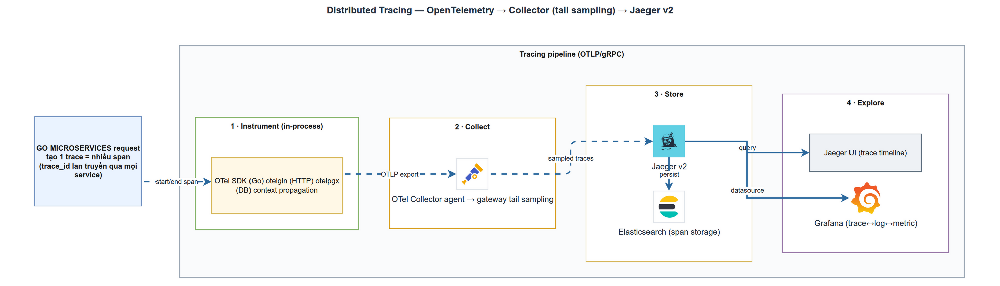

# Distributed Tracing với OpenTelemetry + Jaeger
> Module OBS-3 · span/context propagation, otelgin/otelpgx, sampling · Độ khó: 🥉→🥇 · Prereqs: SD-1

## 1. Vì sao kỹ năng này quan trọng trong LogMon

LogMon là nền tảng observability cho **Go microservices**. Metrics trả lời "cái gì hỏng" (error rate tăng), logs trả lời "lỗi gì" (stack trace), nhưng cả hai đều bất lực với câu hỏi **"chậm/lỗi ở chặng nào trong một request đi xuyên nhiều service và database?"**. Đó là việc của distributed tracing.

Một request `POST /api/v1/auth/login` trong LogMon đi qua: otelgin (HTTP server) → use case `userapp.NewService` → `userpg.NewRepository` (Postgres qua pgx). Khi p99 login tăng vọt, trace cho bạn thấy ngay 380ms nằm ở câu `SELECT` trên bảng users hay ở Argon2id hashing. Không có trace, bạn đoán mò qua log.

Quan trọng hơn, tracing là **xương sống của correlation 3 trụ cột** (doc_v2/04 §3): từ panel error-rate trên Grafana → click exemplar → mở trace waterfall trên Jaeger → click span → nhảy sang đúng log dòng đó (nhờ `trace_id`). Đây chính là acceptance test của GĐ2. Kỹ năng này quyết định MTTR của cả hệ thống — và là tiền đề cho GĐ5 (AI tự chẩn đoán incident dựa trên trace).

## 2. Mô hình tư duy (first principles) — giải thích từ con số 0

Hãy quên framework đi. Một "trace" chỉ là một **cây các đoạn thời gian có gắn nhãn**.

- **Span** = một đơn vị công việc có thời điểm bắt đầu + kết thúc, có tên (`GET /api/v1/users`), và một túi attributes (`http.status_code=200`). Đó là một nút trên cây.
- **Trace** = toàn bộ cây span của *một* request, gắn với nhau bởi một `trace_id` chung (32 ký tự hex).
- **Parent-child** = span con biết cha mình là ai qua `parent_id`. Server span của otelgin là gốc; query span của otelpgx là con.

Vấn đề cốt lõi: làm sao span sinh ra ở những nơi khác nhau (HTTP handler, DB layer, thậm chí service khác) **biết chúng thuộc cùng một trace**? Lời giải là **context propagation**:

1. Trong một process, `trace_id` + `span_id` hiện hành được mang theo trong `context.Context` của Go. Mọi hàm nhận `ctx` đầu tiên đều "biết" mình đang ở span nào — đây chính là lý do CLAUDE.md bắt buộc `context.Context` là tham số đầu cho mọi hàm có side effect.
2. Qua ranh giới network, context được serialize thành HTTP header `traceparent` (chuẩn W3C Trace Context): `00-{trace_id}-{parent_span_id}-{flags}`. Service nhận đọc header này, "nối tiếp" trace thay vì tạo trace mới.

Sản xuất span (SDK) tách rời khỏi quyết định **giữ span nào** (sampling) và **lưu/hiển thị ở đâu** (Collector → Jaeger). LogMon tận dụng điều này: SDK xuất *hết* span, Collector gateway mới quyết định giữ/bỏ. Đó là tail sampling.

## 3. Khái niệm cốt lõi (tăng dần độ khó)

### 3.1 Span, attribute, status
Span mang: tên, thời lượng, `SpanKind` (SERVER/CLIENT/INTERNAL), attributes, và **status** (OK/ERROR). Status ERROR cực kỳ quan trọng — tail sampling dùng nó để *luôn giữ* trace lỗi.

### 3.2 Propagator — W3C Trace Context
Propagator inject/extract context vào carrier (HTTP headers). OTel mặc định dùng `traceparent` theo [W3C](https://www.w3.org/TR/trace-context/). LogMon đăng ký composite propagator gồm `TraceContext` + `Baggage` (tracing.go:47-50), nên luôn đọc được trace của upstream kể cả khi tracing tắt.

### 3.3 Sampling — head vs tail

| Tiêu chí | Head sampling | Tail sampling |
|----------|---------------|---------------|
| Quyết định lúc | Khi span *bắt đầu* (tại SDK) | Sau khi trace *hoàn tất* (tại Collector) |
| Biết kết quả request? | Không | Có (giữ được mọi trace lỗi/chậm) |
| Chi phí | Rẻ, không cần buffer | Tốn RAM (buffer toàn bộ trace) |
| LogMon dùng | SDK `AlwaysSample` (xuất hết) | Gateway quyết định giữ 100% lỗi + chậm, 10% còn lại |

LogMon chọn **tail sampling ở gateway** — giữ trọn giá trị chẩn đoán mà vẫn cắt được khối lượng lưu trữ. `ParentBased` được dùng để tôn trọng quyết định sampling của upstream (tracing.go:99-104).

### 3.4 Batch export
SDK gom span thành lô (batch 5s / 512 span) rồi gửi OTLP gRPC — **non-blocking**, drop khi quá tải thay vì chặn request path (tracing.go:70-76). Đây là khác biệt sống còn với production: tracing không bao giờ được làm chậm chính ứng dụng.

### 3.5 Collector hai tầng: Agent → Gateway
- **Agent** (mỗi host): nhận OTLP từ SDK, forward thô lên gateway. Không sampling.
- **Gateway** (trung tâm): chạy `tail_sampling` + export sang Jaeger.

Ràng buộc vàng: **mọi span của một trace phải về cùng một gateway instance** mới ra quyết định tail sampling đúng. 1 gateway (dev) → ổn; nhiều gateway → cần `loadbalancing` exporter route theo `trace_id` ở tầng trước (planned, doc_v2/04 §2.2).

### 3.6 Jaeger v2
Jaeger v2 chính là **một distribution của OTel Collector**, nhận OTLP native — không còn translation layer như v1. Lưu trace vào Elasticsearch (index prefix `jaeger-`), UI ở `:16686`.

## 4. LogMon dùng nó thế nào (bám code thật)

**Bootstrap TracerProvider — IMPLEMENTED.** `backend/internal/shared/tracing/tracing.go` là toàn bộ lớp dựng tracing (~129 dòng, đủ test). `New()` (tracing.go:46):
- Luôn set W3C propagator trước (tracing.go:47-50) — kể cả khi tracing tắt.
- `Endpoint == ""` → trả Provider no-op, `Enabled()==false` (tracing.go:52-54). Nhờ vậy `make up` (stack nhẹ) và unit test chạy không cần collector.
- Khi có endpoint: dựng `otlptracegrpc` exporter (tracing.go:56-63), `WithBatcher` (tracing.go:73), `resource` gắn `service.name`/`service.version` (tracing.go:108-121).
- Sampler `ParentBased(AlwaysSample)` khi `SampleRatio<=0` (tracing.go:99-104) — SDK xuất hết, gateway tail-sample.

**Wiring trong service — IMPLEMENTED.** `backend/cmd/userservice/main.go`:
- `tracing.New(...)` đọc env `OTEL_EXPORTER_OTLP_ENDPOINT` / `OTEL_SERVICE_NAME` / `OTEL_EXPORTER_OTLP_INSECURE` (main.go:112-114, 223-227); `defer tp.Shutdown(...)` flush span lúc thoát (main.go:231-237).
- **otelgin** tạo server span mỗi request, lọc `/healthz` + `/metrics` qua `shouldTrace` (main.go:352, 397-406) để không nhiễu trace bởi probe/scrape.
- **otelpgx** gắn tracer vào pgx pool: `poolCfg.ConnConfig.Tracer = otelpgx.NewTracer()` (main.go:248-249) → mỗi query là một child span.

**Correlation logs↔traces — IMPLEMENTED.**
- Logger ưu tiên lấy `trace_id`+`span_id` thật từ `SpanContextFromContext(ctx)` (logger.go:52-54), fallback `trace_id` thủ công cho background job (logger.go:56-58).
- Middleware `TraceID` lấy `trace_id` W3C của span để header `X-Trace-Id` khớp Jaeger (middleware.go:30-54).

**Hạ tầng Collector + Jaeger — IMPLEMENTED (dev).**
- `infra/otel/agent.yaml`: receiver OTLP `:4317`, pipeline `traces` forward thô lên `otlp/gateway`.
- `infra/otel/gateway.yaml`: pipeline `traces` chạy `tail_sampling` (errors-always + slow-requests >1000ms + probabilistic 10%) → exporter `otlp/jaeger`.
- `infra/docker/docker-compose.yml:316-368`: services `otel-agent`, `otel-gateway` (collector-contrib 0.154.0), `jaeger` (jaegertracing/jaeger:2.10.0, UI `:16686`), profile `observability`.
- `infra/grafana/.../datasources.yml`: datasource Jaeger + derived field `trace_id` từ ES log → "View trace in Jaeger".

**PLANNED (chỉ trong doc_v2, code chưa có):**
- **redisotel** (doc_v2/04 §2.1, dòng 60): go.mod hiện **không có** dependency `go-redis` → chưa instrument Redis.
- **spanmetrics connector** (RED + exemplars, doc_v2/04 §2.3): comment trong gateway.yaml:86 ghi rõ "bổ sung ở bước correlation sau" — pipeline metrics/spans chưa tồn tại.
- **otelhttp** cho HTTP client service-to-service: chưa có (userservice chưa gọi service khác).
- **loadbalancing exporter** đa-gateway: chỉ là ghi chú scale.

## 5. Best practices (mỗi mục kèm nguồn)

1. **Dùng W3C Trace Context làm propagator mặc định, set một lần global.** LogMon set composite `TraceContext + Baggage` (tracing.go:47-50) — đúng khuyến nghị OTel. Mọi service phải dùng *cùng* định dạng propagation, nếu không trace sẽ đứt khúc. — [OpenTelemetry Context Propagation](https://opentelemetry.io/docs/concepts/context-propagation/)
2. **Tail sampling: tách 2 tầng collector khi scale.** Một tầng `loadbalancing` route theo trace_id, một tầng `tail_sampling`. LogMon đã đặt sẵn agent/gateway tách biệt cho việc này. — [tailsamplingprocessor README](https://github.com/open-telemetry/opentelemetry-collector-contrib/blob/main/processor/tailsamplingprocessor/README.md)
3. **Sizing `decision_wait` + `num_traces` cẩn thận.** Khi vượt `num_traces`, collector drop các trace *cũ nhất* — có thể chính là trace lỗi bạn muốn giữ. RAM ≈ tps × decision_wait × spans/trace × bytes/span. Luôn bật `memory_limiter` (đã có trong gateway.yaml). — [Tail-Based Sampling: Sizing, Memory Crashes and Cost Model](https://www.michal-drozd.com/en/blog/otel-tail-sampling/)
4. **Export non-blocking (batch), không chặn request path.** `WithBatcher` + drop khi quá tải. — [OpenTelemetry Sampling concepts](https://opentelemetry.io/docs/concepts/sampling/)
5. **Jaeger v2 nhận OTLP native — dùng đúng v2 (v1 EOL 31/12/2025).** Không cần translation layer; pdata model nội bộ. — [Jaeger v2 released: OpenTelemetry in the core (CNCF)](https://www.cncf.io/blog/2024/11/12/jaeger-v2-released-opentelemetry-in-the-core/)
6. **Tận dụng instrumentation library thay vì span thủ công.** otelgin/otelpgx tạo span tự động, gắn semantic conventions chuẩn — ít lỗi hơn tự viết. — [Jaeger v2 Architecture docs](https://www.jaegertracing.io/docs/2.19/architecture/)

## 6. Lỗi thường gặp & anti-patterns

- **Quên truyền `ctx` xuống dưới.** Tạo `context.Background()` mới ở giữa luồng → span con mất parent, trace đứt. LogMon chống điều này bằng quy ước `ctx` là tham số đầu (CLAUDE.md). Đây là lỗi số 1.
- **Head sampling tỷ lệ thấp ở SDK rồi mong giữ được lỗi.** Head sampling quyết định *trước khi* biết request lỗi → mất trace lỗi. LogMon đúng: SDK AlwaysSample, lỗi được giữ ở tail.
- **Sampling rate khác nhau giữa các service** → trace không nhất quán, thiếu span. Dùng `ParentBased` để con tôn trọng cha (tracing.go:101).
- **Trace probe/scrape** (`/healthz`, `/metrics`): tần suất cao, vô giá trị, làm phình storage. LogMon lọc bằng `shouldTrace` (main.go:399) + tail_sampling drop health-check.
- **Đặt high-cardinality vào attribute/label** (`user_id`, `request_id`) — vi phạm CLAUDE.md, làm nổ cardinality spanmetrics. Để định danh request dùng `trace_id`, không phải label.
- **Quên `Shutdown()`** → mất batch span cuối cùng khi service thoát. LogMon flush trong defer (main.go:231-237).
- **Bật TLS `insecure` ở production.** Dev nội bộ single-host thì OK; doc_v2/09 §6 yêu cầu mTLS khi multi-host.

## 7. Lộ trình luyện tập NGAY trong repo LogMon

### 🥉 Cơ bản
1. Chạy `make up-full`, mở Jaeger UI `localhost:16686`, gọi `POST /api/v1/auth/login`, tìm trace của service `userservice` và xem waterfall HTTP→Postgres.
2. Đọc `tracing.go` rồi trả lời: vì sao propagator được set *trước* khi check `Endpoint == ""`? (gợi ý: middleware.go:50).
3. Thêm một case vào `TestSampler` trong `tracing_test.go` cho `ratio = 1.0` (kỳ vọng `Description()` chứa `TraceIDRatioBased`), chạy `cd backend && go test -race ./internal/shared/tracing/`.
4. Tắt tracing (`unset OTEL_EXPORTER_OTLP_ENDPOINT`, `make up`) và xác nhận log vẫn có `trace_id` thủ công còn span thật thì không — đối chiếu logger.go:52-58.

### 🥈 Trung cấp
1. Thêm một **manual child span** trong một use case của `userapp` (dùng `otel.Tracer("logmon/identity").Start(ctx, "verify-password")`), gắn attribute `auth.method`, verify span xuất hiện dưới server span trên Jaeger.
2. Hạ `latency.threshold_ms` trong `gateway.yaml` xuống 50ms, inject delay vào một handler, xác nhận tail sampling giữ trace chậm.
3. Bật derived-field trên Grafana: từ một log dòng login có `trace_id`, click "View trace in Jaeger" và xác nhận nhảy đúng trace (đối chiếu `datasources.yml`).
4. Viết bảng so sánh số span của trace login khi bật vs tắt otelpgx (comment out main.go:249) để thấy giá trị của DB instrumentation.

### 🥇 Nâng cao
1. **Triển khai spanmetrics connector (planned → implemented):** thêm connector `spanmetrics` vào `gateway.yaml`, thêm pipeline `metrics/spans` export sang Prometheus, verify metric `calls`/`duration` per endpoint xuất hiện ở `:8888`.
2. **Thêm `loadbalancing` exporter** mô phỏng 2 gateway, chứng minh span cùng trace về cùng gateway (chạy 2 replica gateway trong compose, route theo trace_id).
3. **Instrument outbound HTTP** bằng `otelhttp` transport cho một client giả lập service-to-service, verify `traceparent` được inject và trace nối liền 2 service trên Jaeger.
4. **Wrap tracing thành provider tái dùng** cho BC `alerting`/`slo` (DDD), giữ đúng layer direction (adapter, không để domain phụ thuộc OTel) — đối chiếu CLAUDE.md Architecture Rules.

## 8. Skill/agent ECC nên dùng khi luyện

- **ecc:architect** — khi mở rộng tracing sang BC mới (`alerting`, `slo`): quyết định đặt provider ở `shared` hay `adapters`, giữ layer direction `adapters → ports ← app → domain`, không để `domain/` import OTel. Dùng *trước* khi viết code mở rộng.
- **ecc:performance-optimizer** — khi sizing tail sampling (`decision_wait`/`num_traces`), đo overhead của otelgin/otelpgx trên hot path, hoặc điều tra span export làm chậm request. Dùng *sau* khi có baseline metrics.
- **ecc:go-review** — review code instrumentation thủ công (span thủ công, defer `span.End()`, không nuốt error trong adapter boundary).
- **ecc:go-test** — viết table-driven test cho logic sampler/provider trước khi sửa (giữ chuẩn TDD + coverage 80%).

## 9. Tài nguyên học thêm

- [W3C Trace Context spec](https://www.w3.org/TR/trace-context/) — chuẩn `traceparent`/`tracestate`, nền tảng mọi propagation.
- [OpenTelemetry — Context Propagation](https://opentelemetry.io/docs/concepts/context-propagation/) — cách inject/extract context, set propagator global.
- [OpenTelemetry — Sampling concepts](https://opentelemetry.io/docs/concepts/sampling/) — head vs tail, ParentBased, đánh đổi.
- [tailsamplingprocessor README (contrib)](https://github.com/open-telemetry/opentelemetry-collector-contrib/blob/main/processor/tailsamplingprocessor/README.md) — đầy đủ policy types LogMon dùng.
- [Tail-Based Sampling: Sizing, Memory & Cost (Michal Drozd)](https://www.michal-drozd.com/en/blog/otel-tail-sampling/) — công thức RAM, bẫy drop trace cũ.
- [Jaeger v2 released — OpenTelemetry in the core (CNCF)](https://www.cncf.io/blog/2024/11/12/jaeger-v2-released-opentelemetry-in-the-core/) — vì sao v2 = distribution của Collector, OTLP native.
- [Jaeger v2 Architecture docs](https://www.jaegertracing.io/docs/2.19/architecture/) — receiver/processor/exporter, lưu ES.

## 10. Checklist "đã hiểu"

- [ ] Phân biệt được span / trace / parent-child và vai trò của `trace_id`.
- [ ] Giải thích được context propagation in-process (`context.Context`) vs cross-process (`traceparent` W3C).
- [ ] Nói rõ vì sao LogMon dùng tail sampling ở gateway thay vì head sampling ở SDK, và đánh đổi RAM.
- [ ] Chỉ ra 3 chỗ tạo span: otelgin (server) + otelpgx (DB) đã có trong code; manual span là phần tự thêm ở bài tập 🥈.
- [ ] Hiểu ràng buộc "mọi span 1 trace về cùng gateway" và khi nào cần loadbalancing exporter.
- [ ] Biết LogMon đã implement gì (provider, otelgin, otelpgx, agent/gateway, Jaeger, log correlation) vs planned (redisotel, spanmetrics, otelhttp client, multi-gateway).
- [ ] Truy được flow correlation logs→traces qua `trace_id` (logger.go → ES → Grafana derived field → Jaeger).
- [ ] Giải thích vì sao tracing tắt vẫn không làm hỏng service (no-op provider, propagator vẫn set).
