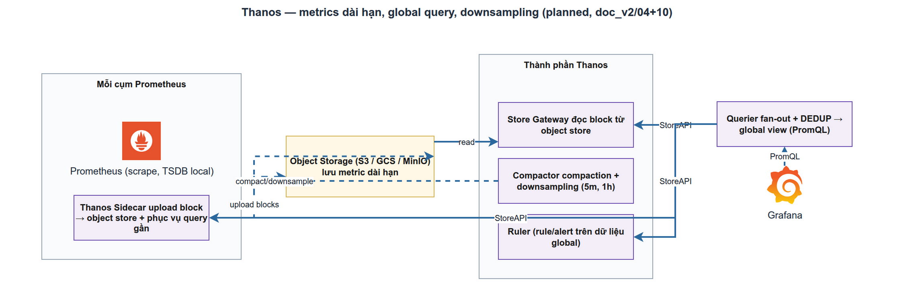

# Thanos — Metrics dài hạn & global view
> Module ADV-1 · sidecar, store gateway, querier, compactor, object storage · Độ khó: 🥇 (nâng cao) · Prereqs: OBS-1

> **Trạng thái trong LogMon (đọc trước):** Thanos là **PLANNED** — đích ngắm của **Giai đoạn 4 / Mode B** (`doc_v2/12-roadmap.md:101`, ADR-007/011). **Chưa có một dòng code hay service nào trong repo**: `infra/docker/docker-compose.yml` mới chỉ nhắc Thanos trong comment, **không có** profile `scale`, **không có** service sidecar/store/query/compact; `infra/prometheus/prometheus.yml` **chưa khai báo `external_labels`** (tiền đề bắt buộc cho Thanos). Bài này dạy từ 0 và chỉ rõ LogMon *sẽ* hiện thực ra sao, bám `doc_v2/04-metrics-tracing.md §1.4` + `doc_v2/01-kien-truc-tong-the.md` + ADR-011/021.

## 1. Vì sao kỹ năng này quan trọng trong LogMon

OBS-1 đã dạy: Prometheus là PULL, lưu TSDB **local**, LogMon đặt retention **15 ngày** (`doc_v2/04 §1.1`). 15 ngày là đủ cho "hệ thống có khoẻ ngay bây giờ không?", nhưng LogMon hứa hai thứ vượt quá nó:

1. **SLO window 28-30 ngày.** SLO BC (`backend/internal/slo/`) tính error budget trên cửa sổ rolling 28d (`doc_v2/05 §4.1`). Không có dữ liệu quá 15 ngày thì burn-rate dài hạn và "budget remaining 28d" **không tính được** — đó là lý do `doc_v2/05 §4.1` ghi thẳng: *"Mode A (không Thanos): chỉ cho phép window ≤ 14d, UI cảnh báo rõ"*. Thanos là thứ tháo bỏ giới hạn đó.
2. **Capacity & cost trend 1 năm.** Dashboard usage/cost per workspace (GĐ4.5) và RCA của AI assistant (GĐ5.1 — `metrics-investigator` query qua MCP, `doc_v2/17:147`) cần lịch sử dài để so sánh "tuần này vs quý trước".

Prometheus đơn lẻ **không** giải bài toán này: tăng retention 1 năm = ổ đĩa local phình to, query chậm, mất hết khi node chết (RPO = 15d data, `doc_v2/10:113`). Thanos biến TSDB block thành các đối tượng bất biến trên **object storage** (S3/B2/SeaweedFS — ADR-021), nén + downsample chúng, rồi cho query xuyên suốt 0→365 ngày qua **một** điểm vào duy nhất mà Grafana không cần biết dữ liệu nằm ở đâu. Đây là "global view + long-term" — đúng tên module.

## 2. Mô hình tư duy (first principles) — giải thích từ con số 0

Bắt đầu từ thứ Prometheus đã làm: cứ mỗi **2 giờ**, Prometheus đóng gói các sample trong RAM/WAL thành một **TSDB block** — một thư mục bất biến chứa `chunks/` (dữ liệu nén), `index` (tra series → chunk), và `meta.json` (mô tả block: khoảng thời gian, số series, **resolution**). Block là đơn vị nguyên tử của toàn bộ vũ trụ Thanos. Nắm được điều này là nắm được 80% Thanos.

Ý tưởng cốt lõi của Thanos chỉ gồm 3 mệnh đề:

1. **Đẩy block ra object storage.** Block là file bất biến → hợp hoàn hảo với object storage (rẻ, vô hạn, bền). Một tiến trình nhỏ (**Sidecar**) ngồi cạnh Prometheus, mỗi khi có block mới được persist thì upload nó lên bucket.
2. **Đọc block từ bất cứ đâu qua một giao thức chung.** Thanos định nghĩa **StoreAPI** (gRPC): "cho tôi series khớp matcher này trong khoảng thời gian này". Sidecar nói StoreAPI (phục vụ 0-2h gần nhất còn trong Prometheus); **Store Gateway** cũng nói StoreAPI (phục vụ block đã nằm trên bucket). Người hỏi không phân biệt hai nguồn.
3. **Một bộ não query gộp tất cả.** **Querier** kết nối tới mọi StoreAPI, fan-out câu hỏi, **gộp + khử trùng lặp** kết quả, và expose **đúng HTTP API của Prometheus** (`/api/v1/query`, `query_range`). Vì thế Grafana chỉ cần đổi datasource URL từ Prometheus sang Querier — PromQL y nguyên.

Hai vấn đề nảy sinh, Thanos giải bằng hai cơ chế quan trọng:

- **Trùng lặp giữa các Prometheus HA.** Nếu chạy 2 Prometheus song song scrape cùng target (để HA), cùng một series xuất hiện 2 lần với label phân biệt (vd `replica="a"` vs `replica="b"`). Querier khử trùng lặp lúc đọc bằng cách bỏ qua label đó (`--query.replica-label`); **Compactor** khử trùng lặp **lúc nén** trong bucket (`--deduplication.replica-label`).
- **Query 1 năm ở độ phân giải 15s là điên rồ.** 1 năm × (1 sample/15s) = ~2.1 triệu điểm/series — không vẽ nổi, tải bucket sấp mặt. Giải pháp là **downsampling**: tạo sẵn bản sao độ phân giải thấp (mỗi 5 phút, mỗi 1 giờ) để query khoảng rộng đọc bản thô hơn. **Compactor** làm việc này.

Đó là toàn bộ tư duy: *block bất biến + một giao thức đọc + một bộ não gộp + downsampling*. Mọi component còn lại chỉ là chi tiết vận hành.

## 3. Khái niệm cốt lõi (tăng dần độ khó)

### 3.1 Năm component (ai làm gì, ai được ghi bucket)

| Component | Vai trò | Quan hệ bucket |
|-----------|---------|----------------|
| **Sidecar** | Cạnh mỗi Prometheus; upload block mới (mỗi ~2h); expose StoreAPI cho dữ liệu nóng 0-2h | **Ghi** (chỉ upload) |
| **Store Gateway** | Đọc block lịch sử từ bucket, phục vụ qua StoreAPI; cache index/chunk để nhanh | **Chỉ đọc** |
| **Querier** | Fan-out StoreAPI, gộp + dedup, expose Prometheus HTTP API cho Grafana | Không chạm bucket |
| **Compactor** | Nén block nhỏ → lớn, downsample, **thực thi retention** (xoá block hết hạn) | **Ghi + là tiến trình DUY NHẤT được xoá** |
| **Query Frontend** (tuỳ chọn) | Đứng trước Querier: cache kết quả, chia query lớn theo ngày chạy song song | Không |

Quy tắc vàng về quyền ghi (official docs): *chỉ Compactor, Sidecar, Receiver, Ruler được ghi bucket; và **chỉ Compactor được xoá**.* Store Gateway và Querier luôn read-only.

### 3.2 `external_labels` — danh tính của một "stream block"

Sidecar gắn `external_labels` của Prometheus (vd `{region="vn", replica="a"}`) vào `meta.json` mỗi block upload. Đây là **danh tính** dùng để Compactor gom block nào với block nào. Hệ quả sống còn:

- Mỗi Prometheus phải có bộ `external_labels` **duy nhất** (trừ cặp HA chỉ khác nhau ở `replica`).
- **Đổi `external_labels` = tạo một stream block mới** → Compactor không nén chéo được, query thấy "overlap". Đây là gotcha kinh điển (mục 6).
- LogMon hiện **chưa có** `external_labels` trong `prometheus.yml` → việc đầu tiên của GĐ4 là thêm chúng *trước* khi bật Sidecar.

### 3.3 Compaction (nén)

Prometheus local tự nén block 2h → 2 ngày → ... để giảm số file. Khi dùng Thanos, ta **phải tắt** nén local (đặt `--storage.tsdb.min-block-duration` = `--storage.tsdb.max-block-duration` = `2h`) để Sidecar upload block thô 2h, rồi để **Compactor** nén ngoài bucket. Lý do: nếu Prometheus nén một block đã upload, lịch sử block thay đổi → trùng lặp/hỏng. Đây là cấu hình bắt buộc khi cặp Sidecar+Compactor cùng hoạt động.

### 3.4 Downsampling — quan trọng nhất và hay hiểu sai nhất

Compactor tạo 3 mức resolution: **raw** (đúng độ phân giải scrape, 15s), **5m**, **1h**. Mỗi điểm downsample lưu sẵn các aggregate (count/sum/min/max/counter) để hàm như `rate()` vẫn đúng trên dữ liệu thô hơn.

Thời điểm tạo (official Thanos docs):
- Block 5m được tạo khi raw block **quá 40 giờ tuổi**.
- Block 1h được tạo khi block 5m **quá 10 ngày tuổi**.

**Hiểu nhầm chết người:** downsampling **KHÔNG** để tiết kiệm dung lượng. Mỗi raw block sinh thêm 2 block (5m, 1h) kích thước *gần bằng* nó → tổng dung lượng *tăng*. Mục đích là **query khoảng rộng nhanh**. Dung lượng chỉ giảm khi **retention** xoá block raw cũ đi.

### 3.5 Retention & quan hệ với downsampling

Compactor thực thi retention bằng 3 cờ riêng cho từng resolution:

```
--retention.resolution-raw=30d
--retention.resolution-5m=180d
--retention.resolution-1h=365d
```

Đây chính là policy LogMon chốt: **raw 30d · 5m 180d · 1h 1 năm** (`doc_v2/04 §1.4`, ADR-011). Cảnh báo từ official docs: *nếu retention của một mức thấp hơn tuổi tối thiểu để downsample lên mức kế tiếp, dữ liệu bị xoá TRƯỚC khi kịp downsample* — vd để raw 5d thì block raw bị xoá ở ngày 5 nhưng 5m chỉ tạo ở giờ 40 (ổn), nhưng nếu để 5m chỉ 3d thì 1h (cần 5m > 10d) **không bao giờ** sinh được. Giữ retention mỗi mức ≥ ngưỡng downsample của mức sau.

### 3.6 Caching (khi đã chạy ổn, muốn nhanh)

- **Store Gateway** có *index cache* (postings/series) và *caching bucket* (chunks). Backend: in-memory (mặc định, `--index-cache-size`), Memcached, Redis, hoặc **groupcache** (v0.25+, không cần component ngoài, tải mỗi metric đúng 1 lần).
- **Query Frontend** cache kết quả PromQL theo bước thời gian + chia query dài thành nhiều query song song → dashboard lặp lại nhanh 10-100×.

## 4. LogMon dùng/sẽ dùng nó thế nào (bám doc_v2 + code; ghi rõ implemented/planned)



**Hiện trạng (IMPLEMENTED):** Mode A. Prometheus local 15d (`prometheus.yml`), không Thanos, không object storage cho metrics. SLO BC tồn tại ở mức **domain** (`backend/internal/slo/domain/{slo,snapshot,rules}.go`) nhưng bị chặn ở window ≤ 14d theo thiết kế.

**Kiến trúc đích (PLANNED — GĐ4 / Mode B):** từ `doc_v2/04 §1.4` và `doc_v2/01 §3.1`:

```
Grafana ─▶ Thanos Query ─┬─▶ Prometheus (qua Sidecar, 0-15d, full resolution)
                         └─▶ Store Gateway ─▶ S3/B2/SeaweedFS (15d-1y, downsampled)
Sidecar:   upload TSDB block mỗi 2h ─▶ object storage
Compactor (single replica): dedup + downsample raw→5m→1h + retention
```

Các quyết định đã chốt trong doc_v2 mà người hiện thực phải tôn trọng:

- **Object storage:** ADR-021 — cloud S3/B2/R2 (zero-ops) là mặc định; bắt buộc on-prem thì **SeaweedFS** (Apache 2.0). **KHÔNG MinIO** (community bị gỡ tính năng 2025). Cùng bucket dùng chung cho Thanos blocks + ES snapshots (`doc_v2/01:66`).
- **Triển khai qua compose profile `scale`** (`doc_v2/10:57`, `doc_v2/16:39`) — service **chưa tồn tại**, là việc của GĐ4.2.
- **Compactor single replica** (`doc_v2/01:54`) — đúng yêu cầu "một instance/một stream block" của Thanos.
- **Capacity:** Thanos cả bộ ~2-4 GB RAM (`doc_v2/10:138`); công thức đĩa: `Thanos_1y ≈ Prom_15d × 24.3 × 0.3 (downsampling)` (`doc_v2/10:154`).
- **Điểm chuyển Mode A→B** (ADR-007): log volume > 5-10K/s, **hoặc cần SLO window > 15d** — chính tiêu chí thứ hai kéo Thanos vào.
- **SLO budget snapshot job** (`doc_v2/05 §4.3`): goroutine 5 phút query "Prometheus/Thanos" ghi `slo_snapshots`. Khi Mode B bật, endpoint query chỉ cần trỏ từ Prometheus sang **Thanos Query** — code SLO BC không đổi vì Querier giả lập đúng Prometheus HTTP API. Đây là lý do kiến trúc chọn Querier thay vì API riêng.
- **Multi-tenancy:** label `workspace` **không** phải security boundary; tenancy *cứng* cho metrics cần **Thanos Receive / Mimir** — `doc_v2/09:77` + ADR-012 ghi rõ để "tương lai xa", **ngoài** phạm vi GĐ4 (GĐ4 dùng sidecar pull model, không Receive).
- **AI/GĐ5:** `metrics-investigator` truy vấn Prometheus/Thanos qua MCP (`doc_v2/17:129,147`) — Thanos là nguồn lịch sử cho RCA.

## 5. Best practices (mỗi mục kèm 1 nguồn đã research)

1. **Tắt nén local, để Compactor nén ngoài.** Đặt `min-block-duration = max-block-duration = 2h` trên Prometheus khi có Sidecar — nếu không, block bị nén lại sau khi upload gây overlap. ([thanos.io/components/compact](https://thanos.io/tip/components/compact.md/))
2. **Chỉ một Compactor cho mỗi stream block, và là tiến trình duy nhất được xoá.** Hai Compactor cùng bucket = hỏng dữ liệu cần can thiệp tay. ([thanos.io/components/compact](https://thanos.io/tip/components/compact.md/))
3. **Đặt retention ≥ ngưỡng downsample của mức kế tiếp.** Sai = dữ liệu bị xoá trước khi kịp downsample (raw cần > 40h, 5m→1h cần > 10d). ([thanos.io issue #813 / compact docs](https://thanos.io/tip/components/compact.md/))
4. **Thêm Compactor *sau* khi đã có vài ngày block trong bucket; bắt đầu chỉ với Sidecar + Store Gateway.** Triển khai tăng dần, đừng bật hết một lúc. ([OneUptime — Thanos config](https://oneuptime.com/blog/post/2026-01-25-prometheus-thanos-configuration/view))
5. **Cấp PVC/đĩa local rộng cho Compactor (vài chục–100 GB) và RAM dư dả** — nó tải block về `--data-dir` để nén; nén nhiều block song song ngốn RAM. ([thanos.io/components/compact](https://thanos.io/tip/components/compact.md/))
6. **Đặt Query Frontend + cache trước Querier khi dashboard chậm**, dùng groupcache cho Store nếu không muốn vận hành Memcached/Redis. ([thanos.io/components/store](https://thanos.io/tip/components/store.md/))
7. **Khử trùng lặp đúng tầng:** `--query.replica-label` ở Querier (lúc đọc) và `--deduplication.replica-label` ở Compactor (lúc nén HA pairs). ([thanos.io/components/compact](https://thanos.io/tip/components/compact.md/))

## 6. Lỗi thường gặp & anti-patterns

- **Đổi `external_labels` sau khi đã upload block.** Tạo stream mới → Compactor không nén chéo, Querier báo `overlapping blocks`. Chốt nhãn ngay từ đầu; nếu buộc đổi, dùng `bucket rewrite` có chủ đích.
- **Tưởng downsampling tiết kiệm đĩa.** Nó *tăng* dung lượng (thêm 2 block/raw). Tiết kiệm đến từ **retention** xoá raw cũ. Đừng kỳ vọng bucket nhỏ đi ngay khi bật downsample.
- **Quên tắt nén local Prometheus.** Block bị nén lại sau upload → overlap → Compactor halt.
- **Chạy 2 Compactor "cho nhanh".** Hỏng dữ liệu, phải dọn tay. Compactor là single-replica theo thiết kế.
- **Bỏ qua `thanos_compact_halted`.** Compactor mặc định *halt* khi gặp lỗi dữ liệu thay vì hỏng âm thầm — nếu không alert trên metric này, downsampling/retention lặng lẽ ngừng và bucket phình mãi.
- **Coi label `workspace` của Thanos là biên giới bảo mật.** Nó là nhãn tự khai (ADR-012) — backend vẫn phải inject matcher `{workspace="..."}` vào mọi PromQL (pattern prom-label-proxy). Tenancy cứng cần Receive/Mimir.
- **Cho Store Gateway/Querier quyền ghi bucket.** Vi phạm mô hình quyền; chỉ Sidecar/Compactor/Receiver/Ruler được ghi.
- **Bật Thanos quá sớm.** Mode A 15d đủ cho giai đoạn đầu; thêm Thanos = thêm 5 service + bucket + Compactor để vận hành. Chỉ bật khi chạm tiêu chí ADR-007 (SLO > 15d hoặc tải lớn).

## 7. Lộ trình luyện tập (🥉→🥈→🥇)

Chủ đề là PLANNED → task thiên về **POC/thiết kế trong repo**, nhưng phải cụ thể và để lại artifact.

### 🥉 Cơ bản — hiểu cơ chế
1. `make up-full`, mở Prometheus `:9090/tsdb-status`, quan sát số block và khoảng thời gian; đối chiếu với retention 15d trong `prometheus.yml`.
2. Thêm `external_labels: {region: dev, replica: a}` vào `global` của `infra/prometheus/prometheus.yml`, `make up-full` lại, kiểm tra label xuất hiện ở `/api/v1/status/config`. Viết 3 câu giải thích vì sao đây là tiền đề bắt buộc cho Thanos.
3. Vẽ (hoặc viết) lại luồng `Grafana → Querier → {Sidecar, Store Gateway → S3}` bằng lời, chỉ rõ ai read-only, ai được ghi/xoá bucket.

### 🥈 Trung cấp — POC một stack Thanos local
1. Tạo `infra/docker/docker-compose.thanos.yml` (hoặc service dưới profile `scale`): thêm **thanos-sidecar** cạnh Prometheus, một **object storage local tương thích S3** cho dev (SeaweedFS theo ADR-021 — *không* MinIO), file `objstore.yml` trỏ vào nó. Sửa Prometheus thêm `--storage.tsdb.min-block-duration=2h --storage.tsdb.max-block-duration=2h`. Xác nhận block xuất hiện trong bucket sau ~2h (hoặc ép block nhỏ để test nhanh).
2. Thêm **thanos-store** + **thanos-query**; trỏ Grafana datasource sang Querier `:9090`; chạy lại một dashboard OBS-1 và xác nhận PromQL không đổi vẫn ra số.
3. Thêm **thanos-compactor** (single replica) với 3 cờ retention raw/5m/1h theo `doc_v2/04 §1.4`; thêm alert `thanos_compact_halted > 0` vào `base-alerts.yml`. Ghi lại `docker stats` RAM thực tế, so với ước tính `doc_v2/10:138`.

### 🥇 Nâng cao — biến POC thành thiết kế GĐ4 sẵn-merge
1. Soạn **ADR-021-impl** (hoặc cập nhật `doc_v2/16` runbook): bảng cấu hình đầy đủ 5 service Thanos, `objstore.yml` cho cả 3 backend (S3/B2/SeaweedFS), policy retention, và checklist bật profile `scale`.
2. Thiết kế **đường nâng cấp SLO BC sang window 28d**: chỉ ra chính xác chỗ nào trong `backend/internal/slo/` (snapshot job ở `app/`, endpoint query) đổi từ Prometheus URL sang Thanos Query URL **mà không** đụng `domain/`; viết test khẳng định Querier-compatible (mock trả Prometheus API shape). Gỡ trần 14d trong logic, thêm flag mode.
3. Viết **runbook restore drill** cho Thanos (DoD GĐ4 yêu cầu "restore drill pass"): mất Store Gateway/cache → rebuild từ bucket; mất Compactor → ý nghĩa với downsampling tồn đọng; cách xử lý `overlapping blocks` bằng `thanos tools bucket`.
4. Thiết kế lớp **Query Frontend + cache** (groupcache cho Store) và đo p95 query 90d trước/sau cache trên POC.

## 8. Skill/agent ECC nên dùng

- **ecc:architect** — quyết định ranh giới Mode A/B, đảm bảo SLO BC nâng cấp window mà **không** vi phạm layer direction (chỉ đổi adapter/endpoint, giữ `domain` sạch), và đặt Thanos đúng chỗ trong `infra/` (profile `scale`).
- **ecc:performance-optimizer** — tinh chỉnh retention/downsampling, cấu hình index cache / caching bucket / Query Frontend, đo p95 query khoảng rộng và RAM Compactor.
- **ecc:production-audit** — trước khi coi GĐ4.2 "xong": rà alert `thanos_compact_halted`, kiểm tra mô hình quyền bucket (chỉ Compactor xoá), retention vs ngưỡng downsample, single-replica Compactor, restore drill, và xác nhận `external_labels` duy nhất.
- Phụ trợ: **ecc:docker-patterns** / **ecc:kubernetes-patterns** cho service Thanos; **ecc:go-review** nếu chạm SLO BC adapter.

## 9. Tài nguyên học thêm (link đã research)

- [Thanos — Compactor component (official)](https://thanos.io/tip/components/compact.md/) — single-replica, mô hình quyền ghi/xoá, dedup label, ngưỡng downsample 40h/10d, cờ retention, `thanos_compact_halted`.
- [Thanos — Store Gateway (official)](https://thanos.io/tip/components/store.md/) — index cache, caching bucket, groupcache, hedged requests.
- [Thanos — Query Frontend (official)](https://thanos.io/tip/components/query-frontend.md/) — cache kết quả + chia query song song.
- [OneUptime — Configure Thanos with Prometheus (2026)](https://oneuptime.com/blog/post/2026-01-25-prometheus-thanos-configuration/view) — thứ tự triển khai tăng dần, cấu hình `min/max-block-duration=2h`.
- [OneUptime — Thanos for long-term OpenTelemetry metrics (2026)](https://oneuptime.com/blog/post/2026-02-06-thanos-long-term-opentelemetry-metrics-storage/view) — retention thực dụng & downsampling cho lưu trữ dài hạn.
- [Last9 — What is Thanos and how does it scale Prometheus?](https://last9.io/blog/what-is-thanos-and-how-does-it-scale-prometheus/) — tổng quan kiến trúc + global view.
- [sanj.dev — Prometheus scaling: Thanos vs Mimir vs VictoriaMetrics](https://sanj.dev/post/prometheus-scaling-thanos-mimir-victoriametrics) — nguồn của ADR-011 (vì sao chọn Thanos).

## 10. Checklist "đã hiểu"

- [ ] Giải thích được TSDB block là gì và vì sao nó là đơn vị nguyên tử của Thanos.
- [ ] Kể tên 5 component, nói rõ ai phục vụ dữ liệu 0-2h, ai phục vụ lịch sử, ai được ghi/xoá bucket.
- [ ] Giải thích `external_labels` định danh stream block và vì sao đổi nó sau khi upload gây overlap.
- [ ] Nói được vì sao phải tắt nén local Prometheus (`min=max=2h`) khi có Sidecar.
- [ ] Phân biệt raw/5m/1h, nêu đúng ngưỡng tạo (40h, 10d) và khẳng định downsampling **không** giảm dung lượng — retention mới giảm.
- [ ] Đặt được bộ retention raw 30d/5m 180d/1h 1y của LogMon và giải thích quan hệ retention ≥ ngưỡng downsample.
- [ ] Chỉ ra Querier giả lập Prometheus HTTP API → vì sao SLO BC chỉ đổi endpoint, không đổi `domain`, khi sang Mode B.
- [ ] Phân biệt trạng thái LogMon: Thanos là PLANNED (GĐ4.2), `prometheus.yml` chưa có `external_labels`, không có service/profile `scale`.
- [ ] Biết Compactor single-replica, alert `thanos_compact_halted`, và mô hình quyền bucket (chỉ Compactor xoá).
- [ ] Giải thích vì sao label `workspace` không phải security boundary và tenancy cứng cần Receive/Mimir (ngoài GĐ4).
