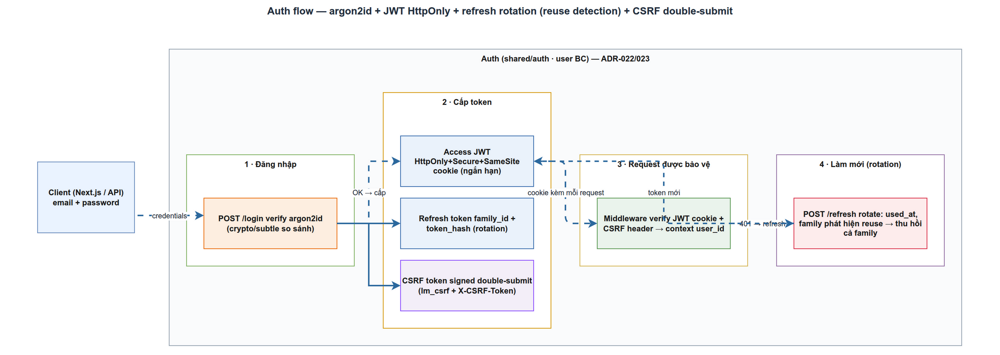

# AppSec & OWASP — Auth trong LogMon
> Module SEC-1 · argon2id, JWT HttpOnly + refresh rotation + reuse detection, CSRF double-submit · Độ khó: 🥉→🥇 · Prereqs: BE-2

## 1. Vì sao kỹ năng này quan trọng trong LogMon

LogMon là nền tảng observability đa-tenant: một lần login thành công cho phép xem **log, metrics, trace của toàn bộ workspace** — dữ liệu cực kỳ nhạy cảm (chứa endpoint nội bộ, payload lỗi, đôi khi cả PII rò ra trong log). Auth chính là **một cánh cửa duy nhất** đứng trước kho dữ liệu đó. Nếu cánh cửa hỏng:

- Mật khẩu lưu sai cách → leak DB là leak luôn account của mọi khách hàng.
- Token bị đánh cắp mà không phát hiện → attacker đọc log thầm lặng hàng tháng.
- Thiếu CSRF → một trang web độc hại khiến trình duyệt của admin tự bấm "xoá alert rule".

Đây cũng là lý do `internal/shared/auth/` được đặt trong **shared kernel** (CLAUDE.md, bảng Bounded Context): mọi BC (`identity`, `alerting`, `slo`, ...) đều đi qua cùng một lớp xác thực, nên một lỗi ở đây ảnh hưởng toàn hệ thống. Học chắc module này nghĩa là hiểu được phần code rủi ro nhất của LogMon.

## 2. Mô hình tư duy (first principles) — giải thích từ con số 0

Bốn câu hỏi nền tảng mà mọi hệ auth phải trả lời:

1. **Làm sao chứng minh "tôi biết mật khẩu" mà server không cần lưu mật khẩu?** → Lưu một **hàm một chiều** (hash) của mật khẩu. Có hash không suy ngược ra mật khẩu, nhưng nhập lại đúng mật khẩu thì hash trùng. Để chống brute-force khi DB bị lộ, hash phải **cố tình chậm và tốn RAM** → đó là *password hashing* (argon2id), khác hoàn toàn hash tốc độ cao như SHA-256.
2. **Sau khi login, làm sao server nhớ "anh này đã đăng nhập" qua nhiều request HTTP (vốn không trạng thái)?** → Phát một **token** ký bằng khoá bí mật server. Request sau gửi kèm token; server verify chữ ký là tin được, không cần tra DB → đó là *JWT*.
3. **Token sống bao lâu?** Sống lâu thì tiện nhưng nếu bị trộm thì attacker dùng được lâu. → Tách đôi: **access token ngắn hạn** (15 phút) dùng cho mọi API + **refresh token dài hạn** (14 ngày) chỉ để xin access mới. Mỗi lần refresh, đổi token mới (*rotation*) để giới hạn cửa sổ tấn công.
4. **Token nằm ở đâu trong trình duyệt cho an toàn?** → Cookie `HttpOnly` (JS không đọc được → chống XSS trộm token). Nhưng cookie tự gửi theo mọi request kể cả từ site khác → mở ra *CSRF*, nên cần thêm một lớp chống CSRF.

Nguyên tắc xuyên suốt: **defense in depth** — không bao giờ dựa vào một phòng tuyến duy nhất.

## 3. Khái niệm cốt lõi (tăng dần độ khó)

### 3.1. Password hashing vs hashing thường

| Tiêu chí | SHA-256 (hash thường) | argon2id (password hash) |
|---|---|---|
| Mục tiêu | Nhanh | Cố tình chậm + tốn RAM |
| Chống brute-force GPU | Kém | Tốt (memory-hard) |
| Có salt | Không mặc định | Có (chống rainbow table) |
| Tham số tuỳ chỉnh | Không | memory `m`, iterations `t`, parallelism `p` |

OWASP khuyến nghị argon2id với cấu hình tối thiểu `m=19456 KiB, t=2, p=1` (hoặc `m=47104, t=1, p=1`). *Salt* là chuỗi ngẫu nhiên nhúng kèm mỗi hash để hai user cùng mật khẩu vẫn có hash khác nhau.

### 3.2. JWT (JSON Web Token)

Cấu trúc 3 phần `header.payload.signature` (base64url, nối bằng dấu chấm). Payload chứa **claims**: `sub` (user id), `iss` (issuer), `exp` (hết hạn), `iat`. Chữ ký = `HMAC-SHA256(header.payload, secret)` với HS256. Server chỉ tin token nếu chữ ký verify đúng **và** thuật toán đúng kỳ vọng.

> Bẫy kinh điển: tấn công **`alg=none`** — attacker sửa header thành `{"alg":"none"}`, bỏ chữ ký. Thư viện ngây thơ sẽ chấp nhận. Phòng: *pin* danh sách thuật toán hợp lệ.

### 3.3. Access + Refresh rotation + reuse detection

```
Login OK ─┬─▶ access token (15') ── dùng cho mọi API
          └─▶ refresh token (14d) ── chỉ để gọi /auth/refresh
/auth/refresh: token cũ đánh dấu "đã dùng" → phát cặp (access mới + refresh mới) cùng family
```

**Family** = chuỗi các refresh token sinh ra từ một lần login. **Reuse detection**: nếu một refresh token *đã dùng* lại bị trình lên lần nữa → chắc chắn có 2 bên đang giữ token (kẻ trộm + người thật) → **thu hồi cả family**, buộc đăng nhập lại.

### 3.4. CSRF & double-submit cookie

CSRF: site độc hại khiến trình duyệt nạn nhân tự gửi request mang theo cookie phiên. `SameSite=Strict` chặn phần lớn nhưng OWASP nói **không đủ làm phòng tuyến duy nhất**. Giải pháp *double-submit*: phát một token CSRF vào cookie **không HttpOnly** để JS đọc và gắn vào header `X-CSRF-Token`; server so khớp cookie == header. Bản nâng cao (LogMon dùng) là *signed* double-submit: token được **ký HMAC** bằng khoá server nên attacker chèn cookie qua subdomain cũng không giả được chữ ký.

## 4. LogMon dùng nó thế nào (bám code thật — path:line, ghi rõ implemented/planned)



Tất cả các mục dưới đây là **implemented** (đọc thấy code), trừ chỗ ghi rõ *(planned)*.

**Password hashing — argon2id + lazy bcrypt migration** — `backend/internal/user/adapters/system/argon2.go`
- Tham số OWASP minimum hardcode đúng chuẩn: `_argon2Memory=19456, _argon2Time=2, _argon2Threads=1, _argon2KeyLen=32, _argon2SaltLen=16` (`argon2.go:19-27`).
- `Hash()` sinh salt bằng `crypto/rand` rồi `argon2.IDKey(...)`, lưu dạng PHC string `$argon2id$v=19$m=...$<salt>$<hash>` (`argon2.go:57-64`, `encodePHC` `argon2.go:101-106`).
- `Verify()` so khớp **constant-time** bằng `subtle.ConstantTimeCompare` (`argon2.go:153`); đồng thời nhận diện hash `$2...` để verify bcrypt cũ → **lazy migration** (`argon2.go:68-80`).
- `maybeRehash()` tại `backend/internal/user/app/service.go:139-151` nâng cấp hash lên argon2id sau login thành công — best-effort, lỗi chỉ log chứ không chặn login.

**Login an toàn** — `service.go:109-134`: mọi nhánh thất bại (email sai định dạng / không tồn tại / sai mật khẩu) đều trả cùng `domain.ErrInvalidCredentials` → không lộ user nào tồn tại (chống user enumeration).

**JWT HS256** — `backend/internal/shared/auth/jwt.go`
- `Issue()` ký HS256 với `sub/iss/iat/exp`, TTL = 15 phút (`jwt.go:37-51`; TTL ở `cmd/userservice/main.go:55`).
- `Parse()` chống `alg=none` và HMAC/RSA confusion bằng cách check `*jwt.SigningMethodHMAC` **và** `jwt.WithValidMethods([]string{"HS256"})`, đồng thời `jwt.WithIssuer(_issuer)` (`jwt.go:55-67`).
- ⚠️ *Gap*: chưa validate `aud`, chưa có `kid` để rotate khoá. doc_v2/09 §1.2 liệt kê hai mục này là **planned** (GĐ3+).

**Refresh rotation + reuse detection** — `backend/internal/user/app/refresh_service.go`
- `Rotate()` gọi `repo.ClaimByHash` (`refresh_service.go:66`); claim là **UPDATE ... RETURNING** nguyên tử `WHERE used_at IS NULL AND expires_at > now` (`backend/internal/user/adapters/postgres/refresh_repository.go:42-56`) → chỉ một request claim được, an toàn đồng thời.
- `handleClaimMiss()` phân biệt reuse với token hết hạn: nếu token tồn tại và `IsUsed()` → `RevokeFamily()` + trả `ErrRefreshTokenReused` (`refresh_service.go:103-115`).
- DB **chỉ lưu SHA-256** của token (`refresh_codec.go:35-38`), token thô 256-bit từ `crypto/rand` chỉ nằm trong cookie. Schema: `migrations/000005_refresh_tokens.up.sql` (`token_hash VARCHAR(64) UNIQUE`, `family_id`, `used_at`).

**Cookie + CSRF** — `backend/internal/user/adapters/http/handler.go` + `backend/internal/shared/auth/csrf.go`
- `setAuthCookies()` (`handler.go:83-93`): access cookie `SameSite=Strict + HttpOnly + Secure`; refresh cookie HttpOnly với **Path hẹp** `/api/v1/auth` (`handler.go:33,90`); CSRF cookie **không** HttpOnly (`handler.go:91`).
- ⚠️ Lưu ý tên cookie: code dùng access cookie `logmon_token` (`auth/middleware.go:10`), còn doc_v2/09 §1.2 viết `lm_access` — **doc và code lệch tên**, code là nguồn sự thật hiện hành.
- `CSRFProtector` dùng signed double-submit: token = `<random>.<HMAC-SHA256>`, verify bằng `hmac.Equal` (`csrf.go:45-68`); middleware miễn safe method + so cookie==header bằng `subtle.ConstantTimeCompare` (`csrf.go:78-98`). Wiring + danh sách exempt (login/register/refresh/webhook) tại `cmd/userservice/main.go:375-380`.

**HTTP hardening + rate limit + bearer** — `backend/internal/shared/middleware/middleware.go:109-120` set HSTS, `X-Content-Type-Options`, `X-Frame-Options: DENY`, CSP `default-src 'none'`. Rate limit token-bucket theo IP áp cho register/login/refresh (`middleware/ratelimit.go`, wiring `main.go:386-387`). Webhook nội bộ dùng `RequireBearerToken` fail-closed, so sánh constant-time (`auth/bearer.go`).

> *(planned)* RBAC role/workspace filter, AES-256-GCM cho channel secrets, SSRF guard cho generic webhook — doc_v2/09 §2-5; chưa có code (chưa có `slo`/`incident`/`notification` BC).

## 5. Best practices (mỗi mục kèm 1 nguồn đã research)

- **Dùng argon2id, tham số ≥ OWASP minimum** (`m=19456,t=2,p=1`); bcrypt chỉ cho legacy. LogMon khớp chuẩn này. — [OWASP Password Storage Cheat Sheet](https://cheatsheetseries.owasp.org/cheatsheets/Password_Storage_Cheat_Sheet.html)
- **Luôn pin thuật toán JWT** (`WithValidMethods`), từ chối `alg=none`, validate `iss`/`aud`/`exp`. — [golang-jwt/jwt/v5 docs](https://pkg.go.dev/github.com/golang-jwt/jwt/v5)
- **Rotation + automatic reuse detection + revoke cả family**, log mọi sự kiện reuse/revoke. — [Auth0 — Refresh Token Rotation](https://auth0.com/docs/secure/tokens/refresh-tokens/refresh-token-rotation)
- **SameSite không thay thế CSRF token** — dùng double-submit (ưu tiên signed/HMAC) song song. — [OWASP CSRF Prevention Cheat Sheet](https://cheatsheetseries.owasp.org/cheatsheets/Cross-Site_Request_Forgery_Prevention_Cheat_Sheet.html)
- **TLS: MinVersion ≥ 1.2 (ưu tiên 1.3), `InsecureSkipVerify=false` luôn luôn**; theo cấu hình Intermediate/Modern của Mozilla. — [Mozilla Server Side TLS](https://wiki.mozilla.org/Security/Server_Side_TLS) · [crypto/tls docs](https://pkg.go.dev/crypto/tls)
- **Access control kiểm tra trên từng object theo user, không tin ID từ client** (chống IDOR — rủi ro #1 OWASP). — [OWASP IDOR Prevention Cheat Sheet](https://cheatsheetseries.owasp.org/cheatsheets/Insecure_Direct_Object_Reference_Prevention_Cheat_Sheet.html)

## 6. Lỗi thường gặp & anti-patterns

- **Dùng SHA-256/MD5 để hash mật khẩu** — nhanh = dễ brute-force. Phải dùng KDF memory-hard (argon2id).
- **So sánh hash bằng `==`** — lộ timing. LogMon đã đúng: `subtle.ConstantTimeCompare` (`argon2.go:153`, `csrf.go:90`, `bearer.go:29`).
- **Nhét role vào JWT ở giai đoạn sớm** — đổi role không có hiệu lực ngay. doc_v2/09 §1.2 cố ý hoãn role-in-token tới khi đọc role từ DB/cache.
- **Lưu refresh token thô trong DB** — leak DB = leak phiên. LogMon chỉ lưu SHA-256 (`refresh_codec.go`).
- **CSRF chỉ dựa SameSite**, hoặc đặt CSRF cookie `HttpOnly` (thì JS không echo header được) — sai cả hai chiều.
- **Login trả message phân biệt "email không tồn tại" vs "sai mật khẩu"** — lộ user enumeration. LogMon trả generic `ErrInvalidCredentials`.
- **`InsecureSkipVerify: true`** trong client TLS (ví dụ gọi ES/Alertmanager) — tắt cả xác thực cert lẫn hostname. CLAUDE.md cấm tuyệt đối.
- **Log token/mật khẩu** — doc_v2/09 §8 cấm; chỉ log security event (success/failure/reuse) không kèm secret.
- **Rate limiter in-memory không evict** — `ratelimit.go` đã tự ghi chú là cần TTL/LRU + store Redis khi multi-instance *(planned)*.

## 7. Lộ trình luyện tập NGAY trong repo LogMon (🥉 cơ bản → 🥈 trung cấp → 🥇 nâng cao)

### 🥉 Cơ bản — đọc & verify
1. Viết một test trong `backend/internal/user/adapters/system/argon2_test.go` (nếu chưa có) khẳng định `Hash()` hai lần cùng mật khẩu cho ra **hai PHC string khác nhau** (chứng minh salt ngẫu nhiên) nhưng `Verify()` cả hai đều pass.
2. Chạy `cd backend && go test -race ./internal/shared/auth/... ./internal/user/...` rồi đọc các case `give/want` trong `csrf_test.go` và `auth_test.go` (JWT tests nằm ở đây, không có file `jwt_test.go` riêng): `TestParseRejectsInvalid` phủ garbage/wrong-secret/empty/expired. Việc từ chối `alg=none`/algorithm-confusion do **code** `jwt.go:58` (check `*jwt.SigningMethodHMAC`) + `WithValidMethods` đảm bảo — chưa có test case riêng cho nó (xem mục 🥈 để tự bổ sung).
3. Dùng `curl -i` qua local stack: gọi `POST /api/v1/auth/login` rồi soi `Set-Cookie` header, xác nhận access cookie có `HttpOnly; Secure; SameSite=Strict` còn `lm_csrf` thì không `HttpOnly`.

### 🥈 Trung cấp — mở rộng có kiểm soát
1. Thêm validate `aud` cho JWT: thêm `Audience` vào `RegisteredClaims` trong `jwt.go:Issue`, và `jwt.WithAudience("logmon-api")` trong `Parse` — viết test RED trước (token thiếu `aud` phải bị từ chối), rồi GREEN.
2. Thêm **metric** đếm reuse detection: trong `refresh_service.go:handleClaimMiss`, expose một counter `logmon_refresh_token_reuse_total` qua `backend/internal/shared/metrics`, đăng ký rồi xác nhận nó xuất hiện ở `/metrics`.
3. Viết integration test cho reuse detection: Issue → Rotate → Rotate lại bằng token **cũ** → assert trả `ErrRefreshTokenReused` và `ByHash` của mọi token trong family đều biến mất (`refresh_repository.go:RevokeFamily`).
4. Bổ sung security-event log (doc_v2/09 §8) cho login failure trong `service.go:Login` đúng quy tắc "không log password".

### 🥇 Nâng cao — đối kháng & hạ tầng
1. Thêm `kid` (key id) vào JWT header + map nhiều khoá trong `JWTService` để rotate khoá không downtime (doc_v2/09 §1.2 *planned*); viết test verify token ký bằng khoá cũ vẫn parse được trong cửa sổ chuyển tiếp.
2. Thay rate limiter in-memory bằng store có TTL/eviction (chuẩn bị cho multi-instance), giữ nguyên interface middleware; benchmark để chứng minh không rò bộ nhớ theo số IP.
3. Cấu hình `crypto/tls.Config{MinVersion: tls.VersionTLS12}` cho client gọi Elasticsearch (`cmd/userservice/main.go` chỗ tạo `elasticsearch.NewClient`) và viết test đảm bảo `InsecureSkipVerify` luôn `false`.
4. Chạy `/cso` (hoặc `ecc:security-reviewer`) trên toàn package `internal/shared/auth` + `internal/user`, phân loại finding theo severity, fix CRITICAL/HIGH trước.

## 8. Skill/agent ECC nên dùng khi luyện

- **`/cso`** (skill) — checklist bảo mật định kỳ theo OWASP & doc_v2/09; dùng khi muốn quét tổng thể trước release hoặc sau khi sửa lớp auth. Nó lái `ecc:security-reviewer` và tổng hợp gates (govulncheck/gitleaks).
- **`ecc:security-reviewer`** (agent) — review sâu một thay đổi cụ thể trong `auth/`/`user/`; dùng **ngay sau khi viết code** auth (theo code-review.md: auth là security-sensitive → bắt buộc review).
- **`ecc:security-review`** (skill) — review nhanh diff hiện tại theo OWASP Top 10; dùng trước khi commit branch `feat/auth-hardening`.
- **`ecc:security-bounty-hunter`** (skill) — tư duy tấn công, săn bypass (thử `alg=none`, CSRF qua subdomain, IDOR ở `GET /users/:id`); dùng ở cấp 🥇 khi muốn tự đối kháng với chính code mình.
- Phụ trợ: **`ecc:go-review`** cho idiom/concurrency của `ClaimByHash`, **`ecc:go-test`** để giữ kỷ luật TDD ở mục 7.

## 9. Tài nguyên học thêm (link đã research, có chú thích 1 dòng)

- [OWASP Password Storage Cheat Sheet](https://cheatsheetseries.owasp.org/cheatsheets/Password_Storage_Cheat_Sheet.html) — chuẩn tham số argon2id/bcrypt, nguồn của `m=19456,t=2`.
- [OWASP CSRF Prevention Cheat Sheet](https://cheatsheetseries.owasp.org/cheatsheets/Cross-Site_Request_Forgery_Prevention_Cheat_Sheet.html) — double-submit, HMAC token, giới hạn của SameSite.
- [Auth0 — Refresh Token Rotation](https://auth0.com/docs/secure/tokens/refresh-tokens/refresh-token-rotation) — chuẩn rotation + automatic reuse detection + family revocation.
- [golang-jwt/jwt/v5 — pkg.go.dev](https://pkg.go.dev/github.com/golang-jwt/jwt/v5) — API `WithValidMethods`/`WithIssuer`/`WithAudience`, chống algorithm confusion.
- [Mozilla Server Side TLS](https://wiki.mozilla.org/Security/Server_Side_TLS) — cấu hình Modern/Intermediate/Old; dùng [SSL Config Generator](https://ssl-config.mozilla.org/) để sinh config.
- [OWASP IDOR Prevention Cheat Sheet](https://cheatsheetseries.owasp.org/cheatsheets/Insecure_Direct_Object_Reference_Prevention_Cheat_Sheet.html) — Broken Access Control là rủi ro #1 OWASP Top 10 2021; liên quan `GET /users/:id` trong LogMon.

## 10. Checklist "đã hiểu" (tự đánh giá)

- [ ] Giải thích được vì sao argon2id (memory-hard) an toàn hơn SHA-256 cho mật khẩu, và `m/t/p` nghĩa là gì.
- [ ] Chỉ ra trong `jwt.go` chính xác hai dòng code nào chống `alg=none` và algorithm confusion.
- [ ] Mô tả luồng rotation và *chính xác* điều kiện nào kích hoạt reuse detection → revoke family (đọc `refresh_service.go` + `refresh_repository.go:ClaimByHash`).
- [ ] Nói được tại sao CSRF cookie *không* HttpOnly còn access/refresh cookie thì HttpOnly.
- [ ] Phân biệt được phần đã implemented (argon2id, rotation, CSRF, HTTP headers) vs planned (RBAC, `aud`, `kid`, AES channel secrets, SSRF guard).
- [ ] Liệt kê ≥ 3 anti-pattern ở mục 6 và đối chiếu cách LogMon đã tránh chúng.
- [ ] Biết khi nào gọi `/cso` vs `ecc:security-reviewer` vs `ecc:security-bounty-hunter`.
