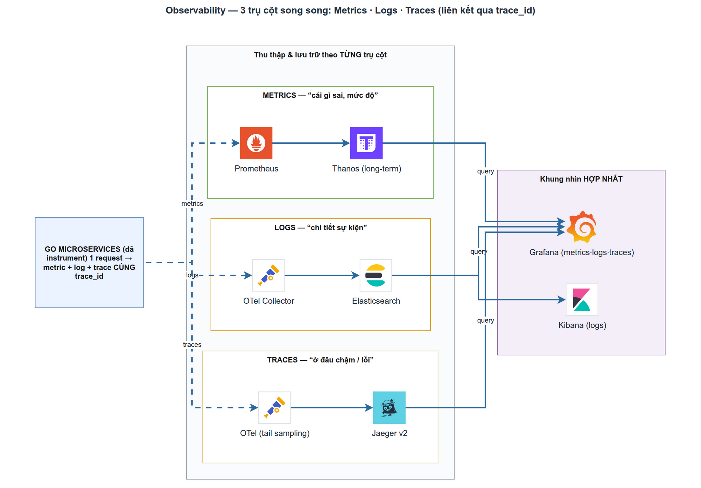

# 3 trụ cột Observability — tư duy hệ thống
> Module SD-1 · metrics vs logs vs traces, khi nào dùng gì · Độ khó: 🥉→🥇 · Prereqs: không

## 1. Vì sao kỹ năng này quan trọng trong LogMon

LogMon **chính là** một nền tảng observability cho Go microservices — đây không phải một kỹ năng phụ trợ mà là *core domain* của sản phẩm. Toàn bộ kiến trúc trong `doc_v2/` xoay quanh ba tín hiệu: metrics (Prometheus + Thanos), logs (zerolog → OTel Collector → Elasticsearch), traces (OTel SDK → Jaeger v2). Nếu bạn không phân biệt được khi nào dùng metric, khi nào dùng log, khi nào dùng trace, thì bạn không thể:

- Thiết kế đúng cái mà LogMon sẽ bán cho khách (dashboard, alerting, SLO).
- Tự "dogfood" — chính `userservice` của LogMon phát ra cả ba tín hiệu để giám sát chính nó.
- Hiểu các quyết định kiến trúc đã chốt: tại sao gắn `trace_id` vào log, tại sao cấm label high-cardinality, tại sao tail-sampling đặt ở gateway.

Học module này = học chính bộ não của repo bạn đang làm.

## 2. Mô hình tư duy (first principles) — giải thích từ con số 0

Hãy bắt đầu từ một câu hỏi trần trụi: **"Hệ thống của tôi có đang khoẻ không, và nếu không thì tại sao?"**

Một hệ thống đang chạy liên tục sinh ra sự kiện. Bạn không thể nhìn vào RAM của tiến trình để biết chuyện gì xảy ra — bạn chỉ có những gì hệ thống **chủ động phát ra ngoài** (telemetry). Có ba cách cơ bản để "phát ra ngoài", tương ứng ba câu hỏi khác nhau:

1. **Metric** trả lời *"bao nhiêu / nhanh hay chậm / có tăng không"* — một con số đo theo thời gian. Rẻ, gọn, hợp để **phát hiện** vấn đề và cảnh báo. Ví dụ: "p99 latency 800ms", "error rate 4%".
2. **Log** trả lời *"chuyện gì đã xảy ra ở thời điểm T, với chi tiết gì"* — một bản ghi sự kiện rời rạc, giàu ngữ cảnh. Hợp để **giải thích** vấn đề. Ví dụ: "user 42 bị từ chối vì token hết hạn lúc 10:03:21".
3. **Trace** trả lời *"một request đã đi qua những đâu và mất thời gian ở chỗ nào"* — một cây span nối các bước của cùng một request xuyên nhiều service. Hợp để **định vị** vấn đề. Ví dụ: "request này chậm vì query Postgres mất 700/800ms".

Mô hình tư duy chuẩn (Google SRE): **metric báo động → trace chỉ chỗ → log giải thích** — vòng lặp chẩn đoán. Một tín hiệu đơn lẻ hiếm khi đủ; sức mạnh đến từ việc **tương quan (correlate)** cả ba. Sợi dây tương quan trong LogMon là `trace_id`: cùng một `trace_id` xuất hiện trên trace (Jaeger), trên log (zerolog), và — qua exemplar — trên metric (planned).

## 3. Khái niệm cốt lõi (tăng dần độ khó)

### 3.1 Metric — số đo theo thời gian (time series)

Một metric là chuỗi `(timestamp, value)` kèm các **label**. Bốn kiểu Prometheus cơ bản:

| Kiểu | Ý nghĩa | Ví dụ trong LogMon |
|------|---------|--------------------|
| Counter | chỉ tăng, đo tổng tích luỹ | `logmon_http_requests_total` |
| Gauge | lên xuống tuỳ ý, đo trạng thái tức thời | `logmon_outbox_lag_seconds` |
| Histogram | phân phối giá trị theo bucket → tính p50/p95/p99 | `logmon_http_request_duration_seconds` |
| Summary | percentile tính sẵn client-side (ít dùng, khó aggregate) | — |

Hai "công thức" chọn metric: **RED** (Rate, Errors, Duration — cho service hướng request) và **USE** (Utilization, Saturation, Errors — cho tài nguyên như CPU/disk). LogMon dùng RED cho HTTP layer.

### 3.2 Log — sự kiện rời rạc có cấu trúc

Log "đời cũ" là chuỗi text tự do, không máy nào parse nổi ở quy mô lớn. Best practice hiện đại: **structured logging** — mỗi dòng là một JSON object với field key=value. LogMon dùng zerolog xuất JSON ra stdout. Điểm mấu chốt: log phải mang `trace_id` để nối được với trace.

### 3.3 Trace — cây span của một request

- **Trace**: toàn bộ hành trình một request, định danh bằng `trace_id` (W3C: 32 hex chars).
- **Span**: một đơn vị công việc trong trace (vd "HTTP GET /users", "SQL SELECT"), có `span_id`, thời gian bắt đầu/kết thúc, parent span.
- **Context propagation**: `trace_id`/`span_id` được truyền qua header `traceparent` (chuẩn W3C Trace Context) khi request đi từ service này sang service khác — nhờ vậy trace nối liền xuyên microservices.
- **Sampling**: không giữ 100% trace (quá tốn). *Head sampling* quyết định ngay đầu; *tail sampling* quyết định sau khi trace hoàn tất (giữ trace lỗi/chậm). LogMon: SDK `AlwaysSample`, tail-sampling dồn về gateway.

### 3.4 Cardinality — cái bẫy lớn nhất của metric

**Cardinality** = số chuỗi time-series riêng biệt = tích các tổ hợp giá trị label. Đặt `user_id` làm label → mỗi user là một series → triệu user = triệu series → Prometheus sập. Quy tắc sống còn: **label chỉ chứa tập giá trị hữu hạn, biên độ thấp** (method, status, route template). High-cardinality (`user_id`, `trace_id`, `request_id`) thuộc về **log/trace**, không phải metric.

## 4. LogMon dùng nó thế nào (bám code thật)

**Metrics (implemented).** `backend/internal/shared/metrics/metrics.go:21` định nghĩa `New()` tạo một Prometheus registry riêng với đúng hai collector RED:
- `logmon_http_requests_total` (CounterVec, labels `method/path/status`) — `metrics.go:24`
- `logmon_http_request_duration_seconds` (HistogramVec, `DefBuckets`, labels `method/path`) — `metrics.go:31`

Hàm `ObserveRequest(method, path, status, dur)` tại `metrics.go:56` ghi nhận mỗi request. Comment đầu file (`metrics.go:1-3`) ghi rõ luật chống cardinality: snake_case, prefix `logmon_`, suffix `_total`, **cấm** `user_id/request_id/trace_id`. Collector được nối vào HTTP qua middleware `Metrics()` tại `backend/internal/shared/middleware/middleware.go:66`, dùng `c.FullPath()` (route template, vd `/users/:id`) thay vì path raw để tránh nổ cardinality (`middleware.go:71`). Endpoint scrape `/metrics` đăng ký tại `backend/cmd/userservice/main.go:369` qua `promhttp.HandlerFor(mx.Registry(), ...)`. Một ví dụ metric domain thứ hai: `backend/internal/shared/outbox/metrics.go:31` export `logmon_outbox_lag_seconds` (Gauge) và `logmon_outbox_failed_total` (Counter).

**Logs (implemented).** `backend/internal/shared/logger/logger.go:24` là wrapper mỏng quanh zerolog xuất JSON. Điểm hay nhất là hàm `withCtx` (`logger.go:52`): nó ưu tiên lấy `trace_id`+`span_id` **thật** từ OTel `SpanContext` (`logger.go:53-54`), fallback về `trace_id` gắn thủ công qua context (`logger.go:56-58`). Đây chính là sợi dây nối log ↔ trace. `ContextWithTraceID`/`TraceIDFromContext` (`logger.go:37-47`) phục vụ luồng background ngoài HTTP.

**Traces (implemented).** `backend/internal/shared/tracing/tracing.go:46` dựng `TracerProvider` xuất span qua OTLP gRPC. Chi tiết đáng chú ý:
- W3C propagator luôn được set kể cả khi tracing tắt (`tracing.go:47-50`) → service luôn đọc được `traceparent` đến.
- `Endpoint == ""` → no-op (`tracing.go:52`), giúp dev stack nhẹ và test chạy không cần collector.
- Sampler mặc định `ParentBased(AlwaysSample)` (`tracing.go:99-104`) vì tail-sampling ở gateway.
- `WithBatcher` (`tracing.go:73`) → xuất span non-blocking, không chặn request path.

Nối trace vào HTTP: `otelgin.Middleware` đặt #2 trong chain tại `main.go:352`, có filter `shouldTrace` (`main.go:399`) bỏ qua `/healthz`+`/metrics`. Query Postgres được trace qua `otelpgx.NewTracer()` gắn vào pool config (`main.go:249`). Middleware `TraceID()` (`middleware.go:30`) dùng luôn `trace_id` W3C của span khi có, đảm bảo header `X-Trace-Id` khớp Jaeger.

**Đã dựng ở tầng infra (dev stack `make up-full`, profile `observability`).** Pipeline log OTel Collector → Elasticsearch data streams + ILM **đã chạy được**: `infra/otel/gateway.yaml` có exporter `elasticsearch` (gắn `data_stream.*` qua transform processor) và exporter `otlp/jaeger`; `infra/elasticsearch/init.sh` bootstrap ILM policy `logmon-logs` + index template (data stream `logs-*`); service `jaeger` cũng có trong `infra/docker/docker-compose.yml`. Phía Go đã có adapter **đọc/search** log từ ES: `backend/internal/logpipeline/adapters/elasticsearch/client.go` (implement `ports.LogSearcher`). BC `slo` mới có **tầng domain** (`backend/internal/slo/domain/` — aggregate `SLO`, `ErrorBudget`, domain events, có test), chưa wire app/adapters.

**Thực sự planned (chưa có code).** Thanos long-term metrics + exemplar storage (click metric → nhảy sang trace) ở `doc_v2/04 §1.1, §1.4`; tracing Redis qua `redisotel` (`doc_v2/04 §2.1`) — lưu ý **go-redis chưa nằm trong `go.mod`**, nên đây là planned; native histograms; spanmetrics connector (mới có comment trong `gateway.yaml`, chưa bật trong pipeline). Các BC `incident`/`notification` chưa có thư mục code; k8s manifests cũng là planned (mới có `doc_tech/kubernetes/` ở dạng tài liệu).

## 5. Best practices (mỗi mục kèm 1 nguồn đã research)

- **Bám Four Golden Signals / RED.** Với service hướng request, ưu tiên Latency–Traffic–Errors–Saturation. LogMon đã có Rate+Errors+Duration; còn thiếu in-flight gauge (saturation). [Google SRE — Monitoring Distributed Systems](https://sre.google/sre-book/monitoring-distributed-systems/)
- **Đặt tên metric đúng convention + có đơn vị.** `_seconds`, `_total`, prefix ứng dụng — đúng như `logmon_http_request_duration_seconds`. [Prometheus — Metric and label naming](https://prometheus.io/docs/practices/naming/)
- **Histogram > Summary cho latency** vì aggregate được across instance; cân nhắc native histogram để chống nổ series. [Prometheus — Histograms and summaries](https://prometheus.io/docs/practices/histograms/)
- **Tuyệt đối tránh label high-cardinality.** Không bao giờ đặt user_id/request_id làm label — đúng luật LogMon đã ghi trong `metrics.go`. [Prometheus — Naming (cardinality warning)](https://prometheus.io/docs/practices/naming/)
- **Dùng OpenTelemetry semantic conventions + exemplar để correlate.** Tên thuộc tính chuẩn giúp nối ba tín hiệu; exemplar gắn trace context vào metric. [OpenTelemetry — Semantic Conventions](https://opentelemetry.io/docs/concepts/semantic-conventions/)
- **Vendor-neutral, một collector cho cả ba tín hiệu.** Đúng quyết định LogMon bỏ Filebeat/Logstash, dùng OTel Collector chung (`doc_v2/03 §1`). [Elastic — The 3 pillars of observability](https://www.elastic.co/blog/3-pillars-of-observability)

## 6. Lỗi thường gặp & anti-patterns

- **Cardinality explosion**: nhét `user_id`/`trace_id` vào label metric → Prometheus OOM. LogMon chống bằng cách dùng route template `c.FullPath()`, không phải URL raw.
- **Log text tự do không cấu trúc**: không query/aggregate được. LogMon ép JSON qua zerolog; tuyệt đối không dùng `fmt.Print`/`log.Println` (luật CLAUDE.md).
- **Log không có trace_id**: ba tín hiệu rời rạc, không correlate được → mất nửa giá trị observability. LogMon nối qua `withCtx`.
- **Sampling chặn request path**: export span đồng bộ làm chậm request. LogMon dùng `WithBatcher` (non-blocking, drop khi quá tải).
- **Trace bừa probe/scrape**: tạo span cho `/healthz`, `/metrics` làm nhiễu Jaeger và tốn tiền. LogMon lọc bằng `shouldTrace`.
- **Đo cardinality bằng nhiều metric thay vì label, hoặc ngược lại**: lạm dụng label cũng tệ như lạm dụng metric name.
- **Coi alert = metric duy nhất**: cảnh báo trên metric nhưng không có trace/log để điều tra → on-call mù.

## 7. Lộ trình luyện tập NGAY trong repo LogMon

### 🥉 Cơ bản
1. Đọc `metrics.go` rồi thêm Gauge `logmon_http_requests_in_flight` (saturation còn thiếu so với golden signals); tăng/giảm trong middleware `Metrics()` và verify nó xuất hiện ở `curl localhost:<port>/metrics`.
2. Thêm một histogram bucket tuỳ chỉnh (vd cho latency endpoint auth) thay `prometheus.DefBuckets`, chạy `cd backend && go test -race ./internal/shared/metrics/...`.
3. Gọi `logger.Info(ctx, ...)` trong một handler và kiểm tra dòng JSON stdout có field `trace_id` khi tracing tắt (thủ công) và khi bật.
4. Bật tracing local: set `OTEL_EXPORTER_OTLP_ENDPOINT`, chạy `make up-full`, mở Jaeger và tìm span của một request `/api/v1/...`.

### 🥈 Trung cấp
1. Thêm một metric domain mới cho alerting (vd `logmon_alerts_fired_total` theo `severity`) theo đúng pattern `outbox/metrics.go` với `Observer` interface + `NopObserver` để test.
2. Viết span thủ công (custom span) quanh một bước nghiệp vụ trong `userapp.Service` bằng `otel.Tracer(...).Start(ctx, "name")`, set attribute, và verify trên Jaeger.
3. Thêm structured field vào log error (vd `Errorf` với `user_action`) và đối chiếu `trace_id` trên log với `trace_id` của span tương ứng — chứng minh correlation hoạt động.
4. Viết một PromQL query tính p99 từ `logmon_http_request_duration_seconds_bucket` bằng `histogram_quantile`, kiểm tra trên Prometheus UI (`make up-full`).

### 🥇 Nâng cao
1. Thêm in-flight requests gauge + alerting rule (Prometheus) báo khi p99 vượt ngưỡng, nối đến Alertmanager (BC alerting đã có code) — full vòng metric→alert.
2. Prototype **exemplar**: gắn `trace_id` vào histogram observation (`prometheus` exemplar API) để click từ metric sang trace — hiện thực hoá `doc_v2/04 §1.1` (đang planned).
3. Triển khai head-sampling theo ratio qua `SampleRatio` trong `tracing.Config`, đo tác động lên khối lượng span; viết test bảng cho hàm `sampler()`.
4. Chạy pipeline log có sẵn: `make up-full` (đã dựng OTel Collector agent→gateway→Elasticsearch + ILM trong `infra/`), gửi vài request tới `userservice`, rồi xác minh log JSON (kèm `trace_id`) hạ cánh vào data stream `logs-*` (query qua adapter `logpipeline/.../elasticsearch/client.go` hoặc `curl` ES `_search`). Mở rộng: thêm một filelog/transform stage trong `infra/otel/gateway.yaml`.

## 8. Skill/agent ECC nên dùng khi luyện

- **ecc:architect** — khi thiết kế metric/trace mới hoặc quyết định "đây nên là metric hay log hay trace", và khi mở rộng pipeline observability (vd thêm exemplar, thêm collector stage). Dùng *trước khi* code để chốt ranh giới layer (`adapters → ports ← app → domain`) và tránh cross-BC import.
- **ecc:production-audit** — sau khi thêm instrumentation, để soát các vấn đề vận hành: cardinality, label rò rỉ PII, span chặn request path, log nuốt error, thiếu golden signal. Chạy như một "vòng review observability" trước commit.
- Bổ trợ: **ecc:go-review** cho idiom Go của code instrumentation, **ecc:golang-patterns** cho pattern functional-options/interface nhỏ giống `Observer` trong `outbox/metrics.go`.

## 9. Tài nguyên học thêm

- [Google SRE — Monitoring Distributed Systems](https://sre.google/sre-book/monitoring-distributed-systems/) — nguồn gốc Four Golden Signals; nền tảng tư duy "đo gì".
- [Prometheus — Metric and label naming](https://prometheus.io/docs/practices/naming/) — convention đặt tên + cảnh báo cardinality, đúng luật LogMon đang theo.
- [Prometheus — Histograms and summaries](https://prometheus.io/docs/practices/histograms/) — khi nào histogram vs summary, cách tính percentile.
- [OpenTelemetry — Semantic Conventions](https://opentelemetry.io/docs/concepts/semantic-conventions/) — thuộc tính chuẩn để correlate ba tín hiệu, nền cho exemplar/baggage.
- [Elastic — The 3 pillars of observability](https://www.elastic.co/blog/3-pillars-of-observability) — góc nhìn unified logs/metrics/traces + lý do OTel Collector.
- [IBM — Three Pillars of Observability](https://www.ibm.com/think/insights/observability-pillars) — giải thích "khi nào dùng gì" cho người mới, kèm xu hướng profiling (trụ cột thứ tư).

## 10. Checklist "đã hiểu"

- [ ] Tôi nói được trong một câu mỗi tín hiệu (metric/log/trace) trả lời câu hỏi gì.
- [ ] Tôi giải thích được vòng lặp "metric báo động → trace chỉ chỗ → log giải thích".
- [ ] Tôi biết tại sao `user_id` KHÔNG bao giờ được làm label metric, nhưng PHẢI có trong log/trace.
- [ ] Tôi chỉ ra được trong LogMon dòng code nào nối `trace_id` từ trace sang log (`logger.go:52-58`).
- [ ] Tôi phân biệt được head-sampling vs tail-sampling và biết LogMon đặt tail-sampling ở đâu (gateway).
- [ ] Tôi biết phần nào của 3 trụ cột đã có trong code Go (metrics/logs wrapper/tracing SDK + HTTP & pgx, ES log-search adapter), phần nào đã dựng ở infra dev stack (OTel Collector→ES data streams + ILM, Jaeger), và phần nào còn thực sự planned (Thanos, exemplar, redisotel, BC incident/notification).
- [ ] Tôi tính được p99 latency từ histogram bucket bằng `histogram_quantile`.
- [ ] Tôi biết dùng `ecc:architect` lúc thiết kế và `ecc:production-audit` lúc soát instrumentation.
