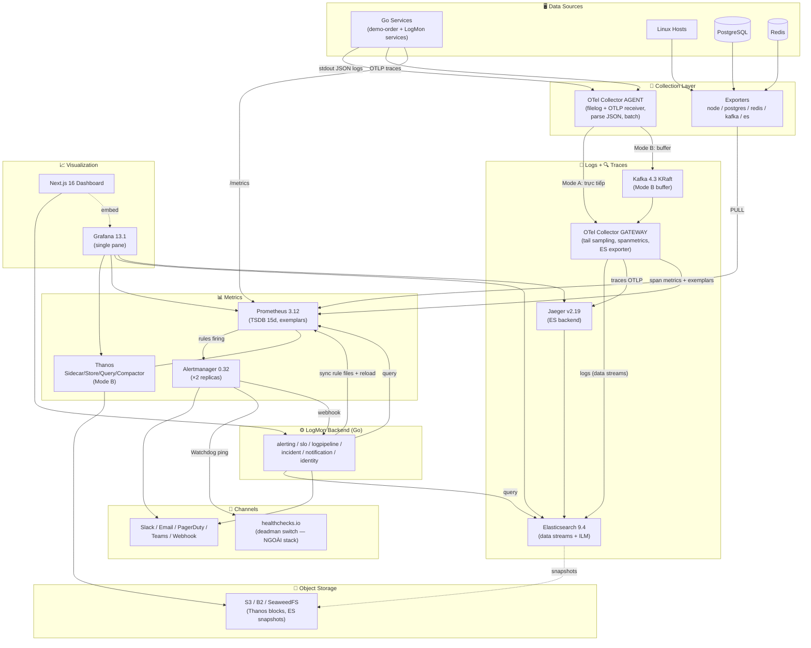

# 01 — Kiến Trúc Tổng Thể

---

## 1. Tech Stack (Pinned Versions — 06/2026)

> Quy tắc: pin theo minor version trong compose/manifest, **không dùng `latest`**. Cập nhật versions qua PR riêng, có changelog.

| Layer | Công nghệ | Version | Ghi chú |
|-------|-----------|---------|---------|
| Backend | Go | **1.26.x** | Green Tea GC mặc định, container-aware GOMAXPROCS |
| HTTP framework | Gin | 1.11+ | Giữ nguyên (đang dùng); service mới có thể cân nhắc chi/ServeMux |
| Logging | zerolog | latest | Giữ native API (nhanh nhất); inject trace_id/span_id qua hook |
| DB | PostgreSQL | **18.x** | pgx/v5 (v5.8+) |
| Cache/Queue | Redis | **8.8** (AGPLv3) | go-redis/v9; Valkey 9.1 là drop-in nếu muốn tránh AGPL |
| Metrics | Prometheus | **3.12** (hoặc LTS 3.5.x) | Bật `exemplar-storage`; native histograms stable từ 3.8 |
| Long-term metrics | Thanos | **0.41** | Sidecar + Store + Query + Compactor (Mode B) |
| Alerting routing | Alertmanager | **0.32** | ≥2 replicas gossip ở production |
| Logs storage | Elasticsearch | **9.4.x** | AGPLv3 option; security on by default; data streams |
| Log/trace collector | OpenTelemetry Collector (contrib) | **v0.154+** | Agent + Gateway pattern; thay thế Filebeat + Logstash |
| Message buffer | Apache Kafka | **4.3** (KRaft-only) | Mode B only; không còn ZooKeeper |
| Tracing backend | Jaeger | **v2.19** | Nền OTel Collector; v1 EOL 31/12/2025 |
| Visualization | Grafana | **13.1.x** | Git Sync GA (v13, 21/04/2026); 13.1.0 ra 23/06/2026 |
| Object storage | Cloud S3 / Backblaze B2 (ưu tiên) hoặc SeaweedFS (on-prem) | — | Thay MinIO (ADR-021) |
| Frontend | Next.js | **16.2** (React 19.2) | `output: 'standalone'`, App Router |
| Frontend runtime | Node.js | **24 LTS** | |
| Reverse proxy | Nginx (hiện tại) / Caddy (khuyến nghị mới) | — | Caddy tự động TLS, giảm ops |
| Container | Docker Compose (dev/prod nhỏ) → Kubernetes (scale) | — | kube-prometheus-stack 86.x, ECK 3.4, Strimzi 1.0 |
| Migrations | golang-migrate (`migrate/migrate`) | v4.18.1 | SQL migrations, định dạng `NNNNNN_name.up/down.sql` |
| Lint | golangci-lint | **v2.x** | Config v2 format |

Thư viện Go chính: `pgx/v5`, `go-redis/v9`, `sony/gobreaker/v2`, `go-playground/validator/v10`, `golang-jwt/jwt/v5`, `go-redis/redis_rate/v10` (GCRA), `golang.org/x/crypto/argon2`, OTel: `otelgin`, `exaring/otelpgx`, `redisotel/v9`.

---

## 2. Sơ Đồ Kiến Trúc Hệ Thống



---

## 3. Bốn Luồng Dữ Liệu

### 3.1 Metrics (PULL)

```
Go service expose /metrics ──(Prometheus scrape 15s; exporters 60s)──▶ TSDB local 15d
    ├─▶ Evaluate alert rules (15s) ──firing──▶ Alertmanager ──▶ Slack/PagerDuty/LogMon webhook
    ├─▶ Thanos Sidecar upload blocks (2h) ──▶ Object Storage (Mode B, retention 1 năm)
    └─▶ Grafana/LogMon query qua Thanos Query (Mode B) hoặc Prometheus trực tiếp (Mode A)
```

- PULL model: backpressure tự nhiên, service discovery qua `up`, service chỉ cần expose HTTP (ADR-004).
- Latency histogram: dùng **native histograms** cho metrics mới; giữ classic buckets `0.005..10` cho tương thích dashboard cũ.
- **Exemplars**: bật `--enable-feature=exemplar-storage` — click datapoint trên Grafana mở thẳng trace.

### 3.2 Logs (PUSH) — pipeline mới (ADR-018)

```
Go service ──zerolog JSON──▶ stdout (Docker)
   └─▶ OTel Collector AGENT (filelog receiver: tail container logs, parse JSON, resource attrs)
          ├─ Mode A: ──OTLP──▶ OTel Collector GATEWAY
          └─ Mode B: ──Kafka exporter──▶ topic otlp_logs ──▶ GATEWAY (Kafka receiver)
                GATEWAY ──elasticsearchexporter──▶ ES data stream logs-{service}-{workspace}
                                                      └─ ILM: hot → warm → cold(S3 snapshot) → delete
   Parse lỗi ──▶ Kafka topic logs-dlq (Mode B) / file export (Mode A) + alert theo DLQ RATE
```

Chi tiết: [03-logs-pipeline.md](03-logs-pipeline.md).

### 3.3 Traces (PUSH)

```
Go service (OTel SDK: otelgin + otelpgx + redisotel, W3C traceparent)
   ──OTLP gRPC──▶ AGENT (batch) ──▶ GATEWAY
        ├─ tail_sampling: 100% errors, 100% slow >1s, drop health checks, 10% baseline
        ├─ spanmetrics CONNECTOR ──RED metrics + exemplars──▶ Prometheus
        └─ ──OTLP──▶ Jaeger v2 (storage: Elasticsearch, retention 7d)
```

Chi tiết: [04-metrics-tracing.md](04-metrics-tracing.md).

### 3.4 Alerts → Incidents

```
Prometheus rule PENDING ──(đủ "for")──▶ FIRING ──▶ Alertmanager
   ├─ route severity=critical ──▶ PagerDuty/Slack (page, group_wait 10-30s)
   ├─ route severity=warning ──▶ Slack/Email digest (ticket, repeat 12-24h)
   ├─ inhibition: critical đè warning cùng {alertname, service}
   └─ webhook ──▶ LogMon alerting BC (payload v4, dedup theo fingerprint)
         ├─ track alert instance (ack/silence/history)
         ├─ critical firing >5m ──▶ incident BC: auto-create incident
         └─ AlertResolved ──▶ auto-resolve incident + cập nhật SLO
```

Chi tiết: [05-alerting-slo.md](05-alerting-slo.md) và [06-incident-notification.md](06-incident-notification.md).

---

## 4. Hai Deployment Modes

| | **Mode A — Small** | **Mode B — Scale** |
|---|---|---|
| Khi nào | Dev/staging, production nhỏ < 5K logs/s | Production > 5-10K logs/s, cần replay + long-term metrics |
| Logs | Agent → Gateway → ES (1 node) | Agent → **Kafka 4.3 (3 brokers KRaft)** → Gateway → ES (3 nodes) |
| Metrics | Prometheus local 15d | + **Thanos** → S3 (1 năm) |
| Traces | Jaeger v2 (ES backend, sampling cao hơn) | Jaeger v2 (ES backend) |
| Alertmanager | 1 instance | 2 replicas gossip |
| Lệnh | `docker compose up -d` | `docker compose --profile scale up -d` |
| RAM ước tính | ~6-8 GB (tiết kiệm ~1-3GB nhờ bỏ Logstash/Filebeat) | ~28-32 GB |

Điểm chuyển Mode A → B (bất kỳ điều nào): log volume duy trì > 5K msg/s; cần SLO window > 15 ngày (Thanos); mất log khi Gateway/ES restart trở thành rủi ro không chấp nhận được.

---

## 5. Cấu Trúc Repo

```
logmon/
├── backend/                       ← LogMon platform (Go)
│   ├── cmd/
│   │   ├── logmon-api/            ← API monolith chứa các BC (tách service khi cần)
│   │   └── rulesync/              ← (tùy chọn) sidecar sync rules → Prometheus
│   ├── internal/
│   │   ├── identity/              ← users, auth, workspaces, RBAC (Clean Arch)
│   │   ├── alerting/              ← (Clean Arch + DDD + CQRS) — GĐ 2
│   │   ├── slo/                   ← (DDD + CQRS) — GĐ 3
│   │   ├── logpipeline/           ← (DDD + CQRS) — GĐ 2-3
│   │   ├── incident/              ← (DDD + CQRS) — GĐ 3
│   │   ├── notification/          ← (Clean Arch) — GĐ 3
│   │   └── shared/                ← auth, errors, logger, metrics, middleware,
│   │                                 tracing, resilience, eventbus(outbox), httpx
│   ├── migrations/                ← golang-migrate SQL migrations
│   └── Makefile / Dockerfile / .golangci.yml
├── frontend/                      ← Next.js 16 dashboard
├── examples/
│   └── demo-order/                ← demo workload instrument đầy đủ (ADR-029)
├── infra/
│   ├── docker/                    ← docker-compose.yml + docker-compose.prod.yml + profiles
│   ├── otel/                      ← agent.yaml, gateway.yaml
│   ├── prometheus/                ← prometheus.yml, rules/ (generated + static)
│   ├── alertmanager/              ← alertmanager.yml
│   ├── elasticsearch/             ← index templates, ILM policies, ingest pipelines
│   ├── kafka/                     ← KRaft config, topic scripts (Mode B)
│   ├── thanos/                    ← sidecar/store/query/compactor (Mode B)
│   ├── grafana/                   ← provisioning + dashboards JSON
│   ├── jaeger/                    ← jaeger v2 config
│   └── scripts/                   ← backup.sh, restore.sh
├── doc/                           ← v1 (lịch sử)
└── doc_v2/                        ← tài liệu này
```

**Lưu ý quan trọng — monolith trước, microservices sau:** các BC của LogMon backend chạy trong **một binary `logmon-api`** ở GĐ 1-3 (modular monolith — BC boundaries enforced bằng package + import rules, không bằng network). Tách process chỉ khi có lý do scale thực tế. Điều này khác v1 (ngầm định nhiều service ngay từ đầu) và giảm mạnh ops effort ban đầu.
