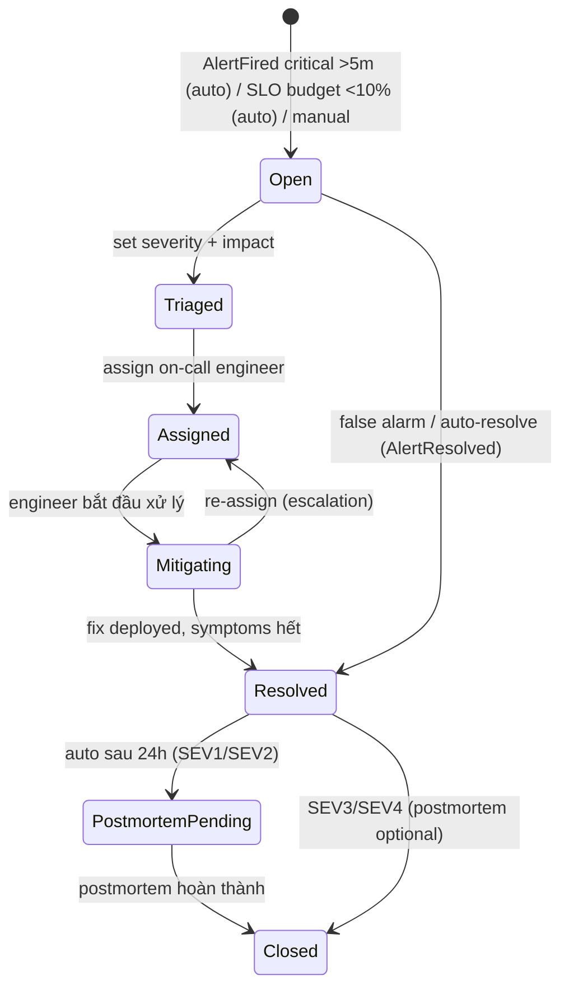

# 06 — Incident Management & Notification Hub

> Cả hai BC thuộc **Giai đoạn 3**. Incident = bridge giữa alerting (phát hiện) và vận hành (xử lý + học hỏi). Notification = tầng giao tiếp đa kênh dùng chung cho mọi BC.

---

## 1. Incident BC (ADR-014)

### 1.1 Lifecycle State Machine



Mọi chuyển trạng thái ghi vào `incident_timeline` (event sourcing nhẹ cho audit) + emit domain event.

### 1.2 Severity & Response

| Severity | Định nghĩa | Response target | Status update |
|----------|------------|-----------------|---------------|
| SEV1 | Mất dịch vụ user-facing | < 15 phút | mỗi 15 phút |
| SEV2 | Suy giảm nghiêm trọng / budget exhausted | < 1 giờ | mỗi 1 giờ |
| SEV3 | Suy giảm nhỏ, có workaround | < 4 giờ | khi có tiến triển |
| SEV4 | Không ảnh hưởng user | best effort | — |

### 1.3 Metrics tự động

| Metric | Tính từ | Prometheus metric |
|--------|---------|-------------------|
| MTTA | created → assigned | `logmon_incident_mtta_seconds` (histogram) |
| MTTR | created → resolved | `logmon_incident_mttr_seconds` (histogram) |
| Incident count | per severity/service | `logmon_incidents_total{severity,service}` |
| Open incidents | đang active | `logmon_incidents_open{severity}` (gauge) |

### 1.4 On-Call & Escalation

- Rotation: weekly/daily, timezone-aware, primary + secondary; handoff time cấu hình được.
- Override: swap/nghỉ phép qua `POST /oncall/override`.
- Escalation policy: `primary (15m) → secondary (30m) → team_lead (1h)` — mỗi level timeout không ack thì notify level kế (delivery qua Notification Hub; PagerDuty tự quản escalation nếu dùng PagerDuty làm kênh chính).
- Tính "ai đang on-call" = pure function từ schedule config + thời điểm (test được, không cần DB state).

### 1.5 Postmortem (blameless)

Bắt buộc cho SEV1/SEV2. Cấu trúc: root cause · impact (số liệu từ chính LogMon: thời lượng, error count, budget tiêu thụ) · timeline summary · lessons learned · **action items** (assignee + due date, track trạng thái — nguồn dữ liệu thật cho "fewer repeat incidents").

---

## 2. Notification Hub BC (ADR-015)

### 2.1 Kiến trúc

```
Domain Event (AlertFired, IncidentCreated, BudgetExhausted...)
   ▼ (qua outbox → in-process bus)
notification/app/send_notification.go
   ├─ Lookup channels đăng ký event type (per workspace)
   ├─ Render template (Go text/template + sprig-style funcs)
   ├─ Enqueue delivery job → Redis queue
   ▼
delivery_worker.go (background workers, có stop/done)
   ├─ Gửi qua Sender adapter tương ứng
   ├─ Retry: ngay → 30s → 2m (3 lần, exponential); quá → status=failed + log
   └─ Ghi notification_history (status, response_code, error)
```

Interface tối giản (ISP): `type Sender interface { Send(ctx context.Context, msg Message) error }` — thêm kênh mới = 1 adapter mới.

### 2.2 Channels

| Channel | Protocol | Ghi chú |
|---------|----------|---------|
| Slack | Incoming webhook | GĐ 3 đầu tiên |
| Email | SMTP | Digest, reports |
| PagerDuty | **Events API v2** (`POST /v2/enqueue`) | `dedup_key` = alert fingerprint / incident id → trigger/acknowledge/resolve cùng key |
| Microsoft Teams | Incoming webhook | Enterprise |
| Generic webhook | HTTP POST, body template tùy biến | Telegram/Discord/Jira... |
| In-app | SSE | Realtime trong Next.js dashboard (GĐ 4) |

Config kênh lưu `notification_channels.config` (JSONB) — **mã hóa at-rest** các secret (webhook URL, integration key) bằng AES-GCM với key từ env (xem 09-security).

### 2.3 Templates

Per-workspace, theo event type (`alert_fired`, `alert_resolved`, `incident_created`, `slo_budget_warning`, `weekly_report`...). Render bằng `text/template` (KHÔNG html/template cho Slack markdown; webhook JSON body phải escape đúng). Template lỗi runtime → fallback template mặc định + log error (không được nuốt notification).

### 2.4 Delivery guarantees

- **At-least-once**: job chỉ xóa khỏi queue sau khi gửi thành công; kênh nhận phải chịu được trùng (PagerDuty dedup_key xử lý sẵn).
- Mọi delivery ghi `notification_history` — UI hiển thị, debug "vì sao tôi không nhận alert".
- `POST /notifications/channels/:id/test` — gửi test message khi cấu hình.
- Circuit breaker per channel endpoint — kênh chết không kéo sập worker pool.
