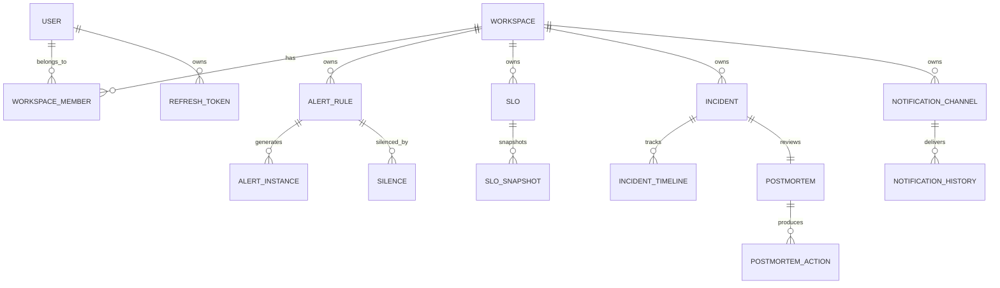

# 08 — Database Schema (PostgreSQL 18)

> Migrations bằng **golang-migrate** (`backend/migrations/`, container `migrate/migrate:v4.18.1`, định dạng `NNNNNN_name.up/down.sql` — repo đã có `000001_init`, `000002_outbox`, `000003_alert_rules`). Mọi bảng tenant-scoped có `workspace_id` + composite index. Schema giới thiệu theo giai đoạn — chỉ migrate khi BC tương ứng được build.

---

## 1. Quy Tắc Chung

- PK: `UUID DEFAULT gen_random_uuid()`; bảng append-heavy (timeline, history, outbox) dùng `BIGSERIAL`/`BIGINT GENERATED ALWAYS AS IDENTITY`.
- Timestamps: `TIMESTAMPTZ NOT NULL DEFAULT now()`; mọi bảng mutable có `updated_at` (trigger hoặc set ở repo).
- Soft delete: KHÔNG dùng mặc định — chỉ `enabled BOOLEAN` cho rules/channels. Xóa thật + audit log.
- Zero-downtime migration rules: thêm cột mới phải nullable hoặc có DEFAULT; không rename trực tiếp (add → backfill → switch → drop); index lớn tạo `CONCURRENTLY`.
- JSONB cho config/payload linh hoạt; field truy vấn nhiều → cột riêng + index.

---

## 2. Identity & Shared — GĐ 1 (users đã có) / GĐ 2 (refresh tokens) / GĐ 3 (workspaces)

```sql
-- GĐ 1 (đã có, điều chỉnh: hash đổi sang argon2id — ADR-022)
CREATE TABLE users (
    id              UUID PRIMARY KEY DEFAULT gen_random_uuid(),
    email           VARCHAR(255) NOT NULL UNIQUE,
    password_hash   TEXT NOT NULL,              -- PHC string: $argon2id$v=19$m=19456,t=2,p=1$...
    display_name    VARCHAR(100) NOT NULL,
    created_at      TIMESTAMPTZ NOT NULL DEFAULT now(),
    updated_at      TIMESTAMPTZ NOT NULL DEFAULT now()
);

-- GĐ 2: refresh token rotation + reuse detection (ADR-023)
CREATE TABLE refresh_tokens (
    id              UUID PRIMARY KEY DEFAULT gen_random_uuid(),
    user_id         UUID NOT NULL REFERENCES users(id) ON DELETE CASCADE,
    family_id       UUID NOT NULL,              -- cả family revoke khi phát hiện reuse
    token_hash      BYTEA NOT NULL,             -- SHA-256 của token (không lưu plaintext)
    expires_at      TIMESTAMPTZ NOT NULL,
    used_at         TIMESTAMPTZ,                -- != NULL nghĩa là đã rotate; dùng lại = reuse attack
    revoked_at      TIMESTAMPTZ,
    created_at      TIMESTAMPTZ NOT NULL DEFAULT now()
);
CREATE INDEX idx_refresh_user ON refresh_tokens(user_id);
CREATE UNIQUE INDEX idx_refresh_hash ON refresh_tokens(token_hash);

-- GĐ 3: multi-tenancy
CREATE TABLE workspaces (
    id          UUID PRIMARY KEY DEFAULT gen_random_uuid(),
    name        VARCHAR(100) NOT NULL,
    slug        VARCHAR(100) NOT NULL UNIQUE,   -- dùng làm ES data stream namespace
    created_at  TIMESTAMPTZ NOT NULL DEFAULT now(),
    updated_at  TIMESTAMPTZ NOT NULL DEFAULT now()
);

CREATE TABLE workspace_members (
    workspace_id  UUID NOT NULL REFERENCES workspaces(id) ON DELETE CASCADE,
    user_id       UUID NOT NULL REFERENCES users(id) ON DELETE CASCADE,
    role          VARCHAR(20) NOT NULL DEFAULT 'viewer',  -- viewer|editor|admin|platform_admin
    joined_at     TIMESTAMPTZ NOT NULL DEFAULT now(),
    PRIMARY KEY (workspace_id, user_id)
);
CREATE INDEX idx_wm_user ON workspace_members(user_id);

-- GĐ 2+: audit (immutable — không UPDATE/DELETE; partition theo tháng khi lớn)
CREATE TABLE audit_logs (
    id              BIGINT GENERATED ALWAYS AS IDENTITY PRIMARY KEY,
    workspace_id    UUID,
    user_id         UUID REFERENCES users(id),
    action          VARCHAR(50) NOT NULL,       -- 'alert_rule.create', 'slo.update'...
    resource_type   VARCHAR(50) NOT NULL,
    resource_id     VARCHAR(100) NOT NULL,
    details         JSONB,
    ip_address      INET,
    created_at      TIMESTAMPTZ NOT NULL DEFAULT now()
);
CREATE INDEX idx_audit_ws_time ON audit_logs(workspace_id, created_at DESC);

-- GĐ 2: transactional outbox (ADR-016)
CREATE TABLE outbox_events (
    id              BIGINT GENERATED ALWAYS AS IDENTITY PRIMARY KEY,
    aggregate_type  VARCHAR(50) NOT NULL,
    aggregate_id    UUID NOT NULL,
    event_type      VARCHAR(50) NOT NULL,
    payload         JSONB NOT NULL,
    status          VARCHAR(20) NOT NULL DEFAULT 'pending',  -- pending|published|failed
    retry_count     INT NOT NULL DEFAULT 0,
    created_at      TIMESTAMPTZ NOT NULL DEFAULT now(),
    published_at    TIMESTAMPTZ
);
-- Partial index: relay chỉ quét pending; kết hợp FOR UPDATE SKIP LOCKED
CREATE INDEX idx_outbox_pending ON outbox_events(id) WHERE status = 'pending';
```

---

## 3. Alerting BC — GĐ 2

```sql
CREATE TABLE alert_rules (
    id              UUID PRIMARY KEY DEFAULT gen_random_uuid(),
    workspace_id    UUID NOT NULL,              -- FK thêm ở GĐ3; GĐ2 dùng workspace mặc định
    name            VARCHAR(100) NOT NULL,
    expression      TEXT NOT NULL,              -- PromQL, đã validate bằng parser
    for_duration    INTERVAL NOT NULL,
    severity        VARCHAR(20) NOT NULL CHECK (severity IN ('critical','warning','info')),
    service         VARCHAR(100) NOT NULL,
    labels          JSONB NOT NULL DEFAULT '{}',
    annotations     JSONB NOT NULL DEFAULT '{}',  -- bắt buộc chứa summary + runbook_url (validate ở app)
    enabled         BOOLEAN NOT NULL DEFAULT true,
    sync_status     VARCHAR(20) NOT NULL DEFAULT 'pending', -- pending|synced|error
    sync_error      TEXT,
    created_at      TIMESTAMPTZ NOT NULL DEFAULT now(),
    updated_at      TIMESTAMPTZ NOT NULL DEFAULT now(),
    UNIQUE (workspace_id, name)
);
CREATE INDEX idx_rules_ws_svc ON alert_rules(workspace_id, service);

CREATE TABLE alert_instances (
    id              UUID PRIMARY KEY DEFAULT gen_random_uuid(),
    rule_id         UUID REFERENCES alert_rules(id) ON DELETE SET NULL,  -- giữ history khi rule xóa
    workspace_id    UUID NOT NULL,
    fingerprint     VARCHAR(64) NOT NULL,       -- từ Alertmanager webhook — khóa dedup
    status          VARCHAR(20) NOT NULL DEFAULT 'firing',  -- firing|acknowledged|resolved
    fired_at        TIMESTAMPTZ NOT NULL,
    acknowledged_at TIMESTAMPTZ,
    acknowledged_by UUID REFERENCES users(id),
    resolved_at     TIMESTAMPTZ,
    value           DOUBLE PRECISION,
    labels          JSONB NOT NULL DEFAULT '{}',
    UNIQUE (fingerprint, fired_at)              -- idempotency cho webhook lặp
);
CREATE INDEX idx_instances_ws_status ON alert_instances(workspace_id, status);
CREATE INDEX idx_instances_rule ON alert_instances(rule_id, fired_at DESC);

CREATE TABLE silences (
    id              UUID PRIMARY KEY DEFAULT gen_random_uuid(),
    workspace_id    UUID NOT NULL,
    rule_id         UUID REFERENCES alert_rules(id) ON DELETE CASCADE,
    am_silence_id   VARCHAR(64),                -- id bên Alertmanager (API v2) để sync/expire
    reason          TEXT NOT NULL,
    created_by      UUID NOT NULL REFERENCES users(id),
    starts_at       TIMESTAMPTZ NOT NULL DEFAULT now(),
    ends_at         TIMESTAMPTZ NOT NULL,
    created_at      TIMESTAMPTZ NOT NULL DEFAULT now()
);
```

---

## 4. SLO BC — GĐ 3

```sql
CREATE TABLE slos (
    id              UUID PRIMARY KEY DEFAULT gen_random_uuid(),
    workspace_id    UUID NOT NULL,
    name            VARCHAR(100) NOT NULL,
    service         VARCHAR(100) NOT NULL,
    sli_type        VARCHAR(20) NOT NULL CHECK (sli_type IN ('availability','latency')),
    latency_threshold_ms INT,                   -- chỉ cho sli_type=latency
    target          DOUBLE PRECISION NOT NULL CHECK (target > 0 AND target < 1),
    window_days     INT NOT NULL DEFAULT 28,
    sync_status     VARCHAR(20) NOT NULL DEFAULT 'pending',
    created_at      TIMESTAMPTZ NOT NULL DEFAULT now(),
    updated_at      TIMESTAMPTZ NOT NULL DEFAULT now(),
    UNIQUE (workspace_id, name)
);

CREATE TABLE slo_snapshots (
    id                       BIGINT GENERATED ALWAYS AS IDENTITY PRIMARY KEY,
    slo_id                   UUID NOT NULL REFERENCES slos(id) ON DELETE CASCADE,
    current_sli              DOUBLE PRECISION NOT NULL,
    budget_remaining_percent DOUBLE PRECISION NOT NULL,
    burn_rate_1h             DOUBLE PRECISION NOT NULL,
    burn_rate_6h             DOUBLE PRECISION NOT NULL,
    burn_rate_24h            DOUBLE PRECISION NOT NULL,
    recorded_at              TIMESTAMPTZ NOT NULL DEFAULT now()
);
CREATE INDEX idx_slo_snap ON slo_snapshots(slo_id, recorded_at DESC);
-- Cleanup: giữ 90 ngày snapshots (cron)
```

---

## 5. LogPipeline BC — GĐ 2-3

```sql
CREATE TABLE pipeline_configs (
    id              UUID PRIMARY KEY DEFAULT gen_random_uuid(),
    workspace_id    UUID NOT NULL UNIQUE,
    mode            VARCHAR(1) NOT NULL DEFAULT 'A' CHECK (mode IN ('A','B')),
    ilm_hot_days    INT NOT NULL DEFAULT 7,
    ilm_warm_days   INT NOT NULL DEFAULT 30,
    ilm_delete_days INT NOT NULL DEFAULT 90,
    updated_at      TIMESTAMPTZ NOT NULL DEFAULT now(),
    updated_by      UUID REFERENCES users(id)
);

CREATE TABLE dlq_entries (
    id              BIGINT GENERATED ALWAYS AS IDENTITY PRIMARY KEY,
    workspace_id    UUID NOT NULL,
    raw_message     TEXT NOT NULL,
    error_reason    TEXT NOT NULL,
    source_service  VARCHAR(100),
    kafka_meta      JSONB,                      -- topic/partition/offset (Mode B)
    retry_count     INT NOT NULL DEFAULT 0,
    status          VARCHAR(20) NOT NULL DEFAULT 'pending',  -- pending|retried|discarded
    created_at      TIMESTAMPTZ NOT NULL DEFAULT now(),
    retried_at      TIMESTAMPTZ
);
CREATE INDEX idx_dlq_ws_status ON dlq_entries(workspace_id, status);
```

---

## 6. Incident BC — GĐ 3

```sql
CREATE TABLE incidents (
    id              UUID PRIMARY KEY DEFAULT gen_random_uuid(),
    workspace_id    UUID NOT NULL,
    title           VARCHAR(200) NOT NULL,
    description     TEXT,
    severity        VARCHAR(10) NOT NULL CHECK (severity IN ('SEV1','SEV2','SEV3','SEV4')),
    status          VARCHAR(30) NOT NULL DEFAULT 'open',
    service         VARCHAR(100) NOT NULL,
    source          VARCHAR(20) NOT NULL DEFAULT 'manual',  -- manual|alert|slo
    source_ref      UUID,
    assigned_to     UUID REFERENCES users(id),
    created_by      UUID REFERENCES users(id),              -- NULL khi auto-create
    created_at      TIMESTAMPTZ NOT NULL DEFAULT now(),
    triaged_at      TIMESTAMPTZ, assigned_at TIMESTAMPTZ,
    mitigated_at    TIMESTAMPTZ, resolved_at  TIMESTAMPTZ, closed_at TIMESTAMPTZ
);
CREATE INDEX idx_incidents_ws_status ON incidents(workspace_id, status);
CREATE INDEX idx_incidents_ws_svc ON incidents(workspace_id, service, created_at DESC);

CREATE TABLE incident_timeline (
    id              BIGINT GENERATED ALWAYS AS IDENTITY PRIMARY KEY,
    incident_id     UUID NOT NULL REFERENCES incidents(id) ON DELETE CASCADE,
    user_id         UUID REFERENCES users(id),
    event_type      VARCHAR(30) NOT NULL,       -- status_change|note|action|escalation|notification
    message         TEXT NOT NULL,
    metadata        JSONB,
    created_at      TIMESTAMPTZ NOT NULL DEFAULT now()
);
CREATE INDEX idx_timeline_incident ON incident_timeline(incident_id, created_at);

CREATE TABLE postmortems (
    id              UUID PRIMARY KEY DEFAULT gen_random_uuid(),
    incident_id     UUID NOT NULL UNIQUE REFERENCES incidents(id) ON DELETE CASCADE,
    root_cause      TEXT NOT NULL,
    impact          TEXT NOT NULL,
    timeline_summary TEXT NOT NULL,
    lessons_learned TEXT,
    created_by      UUID NOT NULL REFERENCES users(id),
    created_at      TIMESTAMPTZ NOT NULL DEFAULT now(),
    updated_at      TIMESTAMPTZ NOT NULL DEFAULT now()
);

CREATE TABLE postmortem_actions (
    id              UUID PRIMARY KEY DEFAULT gen_random_uuid(),
    postmortem_id   UUID NOT NULL REFERENCES postmortems(id) ON DELETE CASCADE,
    title           VARCHAR(200) NOT NULL,
    assignee        UUID REFERENCES users(id),
    due_date        DATE,
    status          VARCHAR(20) NOT NULL DEFAULT 'pending',  -- pending|in_progress|done
    completed_at    TIMESTAMPTZ,
    created_at      TIMESTAMPTZ NOT NULL DEFAULT now()
);

CREATE TABLE oncall_schedules (
    id              UUID PRIMARY KEY DEFAULT gen_random_uuid(),
    workspace_id    UUID NOT NULL,
    team_name       VARCHAR(100) NOT NULL,
    rotation_type   VARCHAR(20) NOT NULL DEFAULT 'weekly',
    timezone        VARCHAR(50) NOT NULL DEFAULT 'UTC',
    config          JSONB NOT NULL,             -- members, handoff, escalation_policy
    created_at      TIMESTAMPTZ NOT NULL DEFAULT now(),
    updated_at      TIMESTAMPTZ NOT NULL DEFAULT now(),
    UNIQUE (workspace_id, team_name)
);

CREATE TABLE oncall_overrides (
    id              UUID PRIMARY KEY DEFAULT gen_random_uuid(),
    schedule_id     UUID NOT NULL REFERENCES oncall_schedules(id) ON DELETE CASCADE,
    user_id         UUID NOT NULL REFERENCES users(id),
    role            VARCHAR(20) NOT NULL,
    starts_at       TIMESTAMPTZ NOT NULL,
    ends_at         TIMESTAMPTZ NOT NULL,
    reason          VARCHAR(200),
    created_at      TIMESTAMPTZ NOT NULL DEFAULT now()
);
```

---

## 7. Notification BC — GĐ 3 · Reports/Export — GĐ 4

```sql
CREATE TABLE notification_channels (
    id              UUID PRIMARY KEY DEFAULT gen_random_uuid(),
    workspace_id    UUID NOT NULL,
    name            VARCHAR(100) NOT NULL,
    channel_type    VARCHAR(20) NOT NULL,       -- slack|email|pagerduty|teams|webhook
    config          JSONB NOT NULL,             -- secrets bên trong mã hóa AES-GCM (09-security)
    events          TEXT[] NOT NULL,
    enabled         BOOLEAN NOT NULL DEFAULT true,
    created_at      TIMESTAMPTZ NOT NULL DEFAULT now(),
    updated_at      TIMESTAMPTZ NOT NULL DEFAULT now(),
    UNIQUE (workspace_id, name)
);

CREATE TABLE notification_history (
    id              BIGINT GENERATED ALWAYS AS IDENTITY PRIMARY KEY,
    workspace_id    UUID NOT NULL,
    channel_id      UUID NOT NULL REFERENCES notification_channels(id) ON DELETE CASCADE,
    event_type      VARCHAR(50) NOT NULL,
    event_ref       UUID,
    status          VARCHAR(20) NOT NULL,       -- sent|failed|retrying
    response_code   INT,
    error_message   TEXT,
    sent_at         TIMESTAMPTZ NOT NULL DEFAULT now()
);
CREATE INDEX idx_notif_history_ws ON notification_history(workspace_id, sent_at DESC);

-- GĐ 4
CREATE TABLE report_schedules (
    id              UUID PRIMARY KEY DEFAULT gen_random_uuid(),
    workspace_id    UUID NOT NULL,
    report_type     VARCHAR(50) NOT NULL,
    cron_expression VARCHAR(50) NOT NULL,
    timezone        VARCHAR(50) NOT NULL DEFAULT 'UTC',
    format          VARCHAR(10) NOT NULL DEFAULT 'pdf',
    recipients      TEXT[] NOT NULL,
    channel_id      UUID REFERENCES notification_channels(id),
    enabled         BOOLEAN NOT NULL DEFAULT true,
    last_run_at     TIMESTAMPTZ,
    created_at      TIMESTAMPTZ NOT NULL DEFAULT now()
);

CREATE TABLE export_jobs (
    id              UUID PRIMARY KEY DEFAULT gen_random_uuid(),
    workspace_id    UUID NOT NULL,
    user_id         UUID NOT NULL REFERENCES users(id),
    export_type     VARCHAR(20) NOT NULL,       -- logs|metrics|report
    query_params    JSONB NOT NULL,
    format          VARCHAR(10) NOT NULL,
    status          VARCHAR(20) NOT NULL DEFAULT 'pending',
    row_count       BIGINT,
    file_path       TEXT,                       -- S3 key
    file_size_bytes BIGINT,
    created_at      TIMESTAMPTZ NOT NULL DEFAULT now(),
    completed_at    TIMESTAMPTZ,
    expires_at      TIMESTAMPTZ
);
CREATE INDEX idx_export_jobs_ws ON export_jobs(workspace_id, created_at DESC);
```

---

## 8. ERD Tổng Quan



Lưu ý FK `workspace_id`: GĐ 2 các bảng dùng cột `workspace_id` với giá trị workspace mặc định (seeded); GĐ 3 thêm `REFERENCES workspaces(id)` qua migration riêng sau khi backfill.
